ECB Review | Europe

# Eyes on the Tide, Swimming Ring in Hand

As expected, the ECB kept rates on hold today. Upside risks to inflation and downside risks to growth were flagged. Barring a large decline in commodity prices, resilient growth and inflation risks are likely to lead the ECB to hike in September

Monetary Policy | Eyeing a September hike: As expected, the ECB remained on hold today. The policy paragraph remained largely unchanged and data will determine the next steps. As we had expected, the ECB made explicit reference to the baseline scenario from June as the recent rally in commodity prices makes this the most fitting for now. Our call remains firmly for a hike in September. A hold would require significantly lower energy prices as well as signs that the June projections were too pessimistic on inflation and too optimistic on growth.

What after September? Our baseline is the ECB on hold after September as we expect core inflation to move broadly sideways in a context where GDP remains below potential. But rates could go higher under certain conditions. Elevated energy prices and upside surprises on core in the next months lead to inflation projections in September looking more persistent than in June. That could be the backdrop for the Council considering more hikes and that discussion could start after the September meeting. In such a situation, we would consider December as the most likely meeting for the next hike.

Rates Strategy: Today's meeting left little room for market surprises. Our attention remains on the relationship between energy prices and the front end, and pricing for upcoming ECB meetings.

FX Strategy: Our economists expect the ECB to raise rates in September. Contrary to some investors, we think tighter ECB policy would boost the EUR. Recent correlations and signals from the shape of the EGB curve suggest that market concerns about higher yields (as seen recently in Japan and the UK) are unlikely to materialize in the Euro Area.

European Banks: Activity is proving more resilient than expected, with loan growth accelerating, and market activity also strong. Together with higher curves vs. the 2% rate we factor-in by end of 2027E, we believe this leaves 2-5% earnings upside to the sector more than compensating for headwinds from the potential increase in MRR. On c. 10x 2027E P/E, we view the sector's risk-reward skew as attractive, and see 11-12x P/E on the cards once geopolitical risks clear. Our Top Picks remain BARC, Santander, Deutsche and UniCredit.

Jens Eisenschmidt  
Chief Europe Economist  
Jens.Eisenschmidt@morganstanley.com +49 69-21662817

Jean-Francois Ouvrard  
Deputy Chief European Economist  
Jean-Francois.Ouvrard@morganstanley.com +49 69-21662813

Chiara Zangarelli  
Economist  
Chiara.Zangarelli@morganstanley.com +44 20 7677-3644

MS & CO. INTERNATIONAL PLC+  
Skander Garchi Casal  
Economist  
Skander.Garchi.Casal@morganstanley.com +44 20 7425-0034

<table><tr><td colspan="2">Claire A Thuerwaechter</td></tr><tr><td colspan="2">Economist</td></tr><tr><td>Claire.Thuerwaechter@morganstanley.com</td><td>+49 69-21662842</td></tr></table>

<table><tr><td colspan="2">MS &amp; CO. INTERNATIONAL PLC+</td></tr><tr><td colspan="2">Luca Salford</td></tr><tr><td colspan="2">Strategist</td></tr><tr><td>Luca.Salford@morganstanley.com</td><td>+44 20 7677-1337</td></tr></table>

<table><tr><td colspan="2">Maria Chiara Russo</td></tr><tr><td colspan="2">Strategist</td></tr><tr><td>Maria.Chiara.Russo@morganstanley.com</td><td>+44 20 7677-3499</td></tr><tr><td colspan="2">Jasper Knyphausen</td></tr><tr><td colspan="2">Strategist</td></tr><tr><td>Jasper.Knyphausen@morganstanley.com</td><td>+44 20 7425-2185</td></tr></table>

<table><tr><td colspan="2">Andrew M Watrous</td></tr><tr><td>Strategist</td><td></td></tr><tr><td>Andrew.Watrous@morganstanley.com</td><td>+1 212 761-5287</td></tr></table>

<table><tr><td colspan="2">Alvaro Serrano</td></tr><tr><td colspan="2">Equity Analyst</td></tr><tr><td>Alvaro.Serrano@morganstanley.com</td><td>+44 20 7425-6942</td></tr></table>

Almario Sulaj
Research Associate
Almario.Sulaj@morganstanley.com +44 20 7425-2049

MS does and seeks to do business with companies covered in MS. As a result, investors should be aware that the firm may have a conflict of interest that could affect the objectivity of MS. Investors should consider MS as only a single factor in making their investment decision.

For analyst certification and other important disclosures, refer to the Disclosure Section, located at the end of this report.

+= Analysts employed by non-U.S. affiliates are not registered with FINRA, may not be associated persons of the member and may not be subject to FINRA restrictions on communications with a subject company, public appearances and trading securities held by a research analyst account.

2026 EXTEL GLOBAL

FIXED INCOME POLL

VOTE NOW

★★★★★

# Monetary Policy: Baywatch in Frankfurt

European Economics team

Exhibit 1: We expect the ECB to hike rates in September ECB Deposit Rate: Mkt Pricing vs. MS Fcast (bp)  
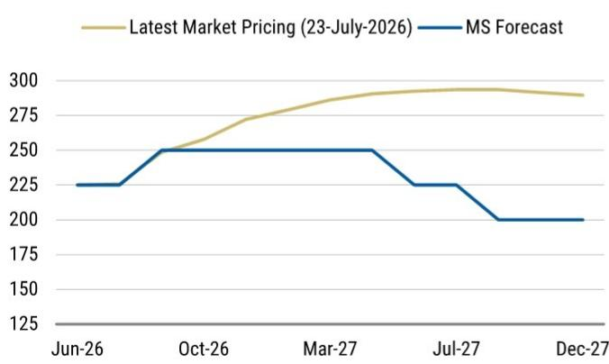  
Source: Bloomberg, MS forecast

Hold in July: As expected, the ECB remained on hold today. The policy paragraph remained largely unchanged (the reference to close monitoring was included at a different place but we don't see this change as carrying a particular signal). Data will determine the next steps. As we had expected, the ECB made explicit reference to the baseline scenario from June as the recent rally in commodity prices makes this scenario the most fitting for now.

A September hike is likely: While a July hold was consensus, the focus of the market is on the next meetings, starting with September. We don't expect a clear positioning of policy makers before end August/early September, as Governors likely want to see the evolution of commodity prices as well as the July and August HICP and PMIs prints (see calendar release below in Exhibit 4). A hike in September, our baseline, rests on two conditions: (1) Energy prices remaining elevated: as of today, the combination of oil and natural gas

prices is close to the June baseline (Exhibit 2 and Exhibit 3). It would likely take a significant drop from here, at least back to the June lows, for the ECB to contemplate a hold at its next meeting. (2) If energy prices were to recede strongly, the ECB would need to see convincing signs that the economy is accelerating (eg PMIs moving closer to 53) and that risks on core inflation are on the upside (eg core inflation edging up in July and August, not only on the back of tourism-related items). To argue the other direction, a hold in September would require significantly lower energy prices (next to an expectation that any agreement which has led to a fall in energy prices, is durable) as well as signs that the June projections were too pessimistic on inflation and too optimistic on growth. From today's perspective, we think this does not look very likely.

Exhibit 2: As of 22/07, oil prices remain a touch below the ECB June baseline...  
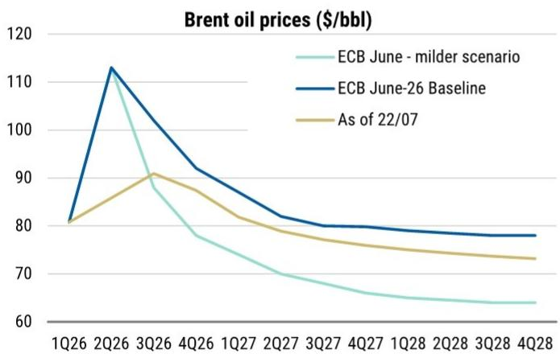  
Source: ECB, Bloomberg, MS

Exhibit 3: .... but natural gas prices have moved significantly higher  
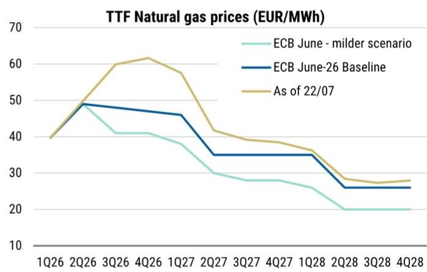  
Source: ECB, Bloomberg, MS

meaningfully. At of today, the ECB is expected to hike to almost 3%, with a distinct probability of another hike as early as October (Exhibit 1). Our baseline is that the ECB will be on hold after September because we expect core inflation to move broadly sideways in a context where GDP remains below potential. But the ECB could indeed go higher under certain conditions. With current oil and natural gas prices, base effects from energy will kick in only late next year. Our revised inflation path (here) sees HICP falling below 2% only in September, which might feel like a relatively distant prospect for some Governors. If, on top of this, core moves up this summer (we expect it will be stable) and knowing the ECB is very vigilant on the transmission of energy costs (see an overview here), this might feed into the ECB September inflation projections. As a result, the new set of inflation projections could look a touch more persistent than in June and pave the way for a discussion on future rates move(s). We see December as the most likely meeting here - the volatile environment asks for caution and the data moves slowly enough for the quarterly pace to look most appropriate. And actual data on second round effects will not be available before the end of the year, and possibly only later. In our view, it would take surprisingly strong prints between 10 September and 29 October (we will have two additional PMIs and one flash HICP) for the ECB's fundamental inflation risk assessment to change and the rate discussion to move to considering back-to-back interest rate increases, leading to a hike in October. We think this appears a low risk at this point and would likely require continued upward pressure on energy prices next to a resilient economy.

Exhibit 4: Key euro area data releases from now until the September meeting

<table><tr><td>Date</td><td>Business and consumer surveys</td><td>Growth</td><td>Inflation</td><td>Wages / Labour market</td><td>Monetary policy transmission</td></tr><tr><td>23-Jul-26</td><td colspan="5">ECB Governing Council</td></tr><tr><td>24-Jul-26</td><td>July Flash PMIs</td><td></td><td></td><td></td><td>ECB Consumer Expectations Survey (June)</td></tr><tr><td>29-Jul-26</td><td></td><td></td><td></td><td>ECB Wage tracker</td><td></td></tr><tr><td>30-Jul-26</td><td>July EC Business surveys</td><td></td><td></td><td></td><td></td></tr><tr><td>30-Jul-26</td><td></td><td>Preliminary Flash EA 2Q26 GDP</td><td></td><td>June EA Unemployment rate</td><td></td></tr><tr><td>31-Jul-26</td><td></td><td></td><td>EA July flash HICP inflation</td><td></td><td></td></tr><tr><td>14-Aug-26</td><td></td><td>Flash EA 2Q26 GDP</td><td></td><td></td><td></td></tr><tr><td>21-Aug-26</td><td>August Flash PMIs + August consumer confidence</td><td></td><td></td><td>2Q26 EA Negotiated wages</td><td></td></tr><tr><td>ca 27-Aug-26</td><td></td><td></td><td></td><td></td><td>ECB Consumer Expectations Survey (July)</td></tr><tr><td>28-Aug-26</td><td>August EC Business surveys</td><td></td><td></td><td></td><td></td></tr><tr><td>1-Sep-26</td><td></td><td></td><td>EA August flash HICP inflation</td><td>July EA Unemployment rate</td><td></td></tr><tr><td>7-Sep-26</td><td></td><td>EA 2Q26 GDP (third estimate)</td><td></td><td>2Q26 Compensations per employe</td><td></td></tr><tr><td>10-Sep-26</td><td colspan="5">ECB Governing Council with updated 2026-28 projections</td></tr></table>

Source: Eurostat, ECB, S&P Global, MS forecasts

## Rates Strategy: What's Next?

Luca Salford, Maria Chiara Russo

In line with the past few meetings ECB President Lagarde's remarks were carefully calibrated, leaving limited room for the market to be surprised (Exhibit 5).

We entered the meeting with a received position in July despite the seemingly poor risk-reward, similar to the April meeting. The ECB stuck to their modus operandi and, as mentioned, did not surprise the market (Exhibit 6).

Exhibit 5: Today's ECB press conference left limited room for market repricing  
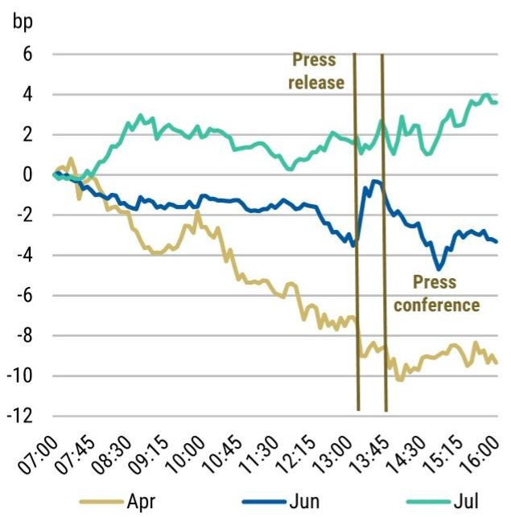  
Source: Bloomberg, MS. Exhibit shows intraday price changes for 2y EUR swap

Exhibit 6: In President Lagarde's era, the ECB has not moved in instances where there has been a close-to-zero move priced by the market the day before the meeting  
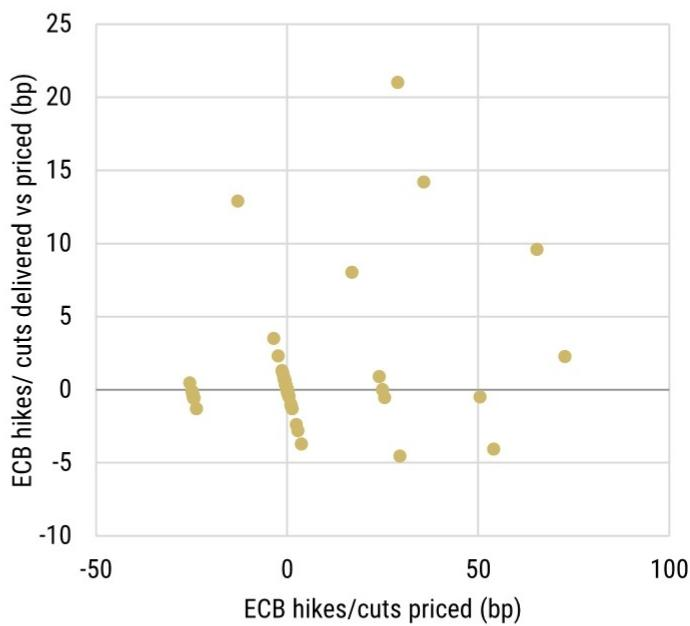  
Source: Bloomberg, MS. X-axis: Tightening/easing priced the day before the meeting; First meeting minus €str. Y-axis: Delivered change in depo rate minus tightening/easing priced the day before the meeting.

We have been flagging how the sell off the of the past few days is broadly in line with our previous modelling (see Exhibit 7).

There are two questions that are important for us.

1) Will the relationship between energy prices and the short end continue to hold? As discussed in pieces from a few months ago we believe a serious military escalation raising fears of a global recession and profound market dislocations would be consistent with a break: high energy prices in that environment would not trigger a further sell off at the short end. We however believe we are quite far from that situation.

2) Is the October meeting pricing too much tightening given the experience of April and July? Exhibit 8 shows that October pricing is close to where July pricing stood at a similar horizon. In both April and July, the correlation between the front end and commodity prices pushed ECB pricing sharply higher despite no hike ultimately being delivered. Ahead of April, markets priced nearly 20bp of tightening more than a month before the meeting before expectations gradually faded back to zero.

Exhibit 7: The relationship between energy prices and the short end has been pretty solid over the last few days  
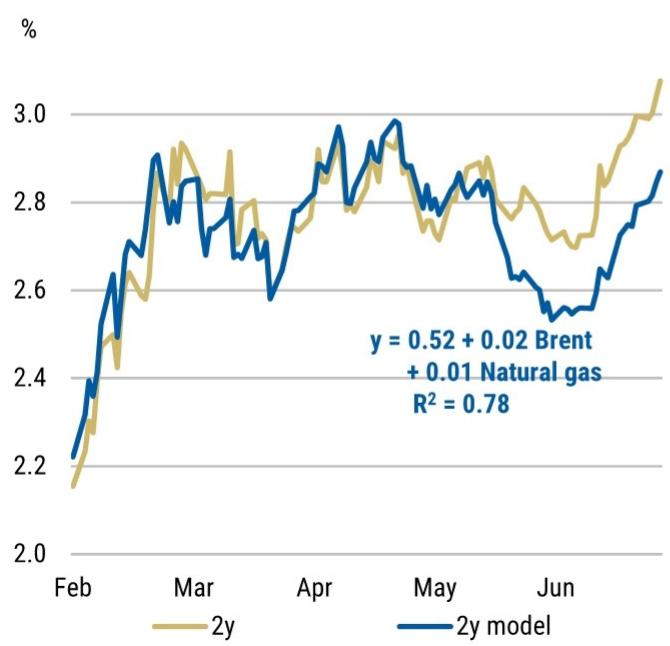  
Source: Bloomberg, MS

Exhibit 8: October is not pricing too much at the moment, even assuming the ECB does not hike at that meeting  
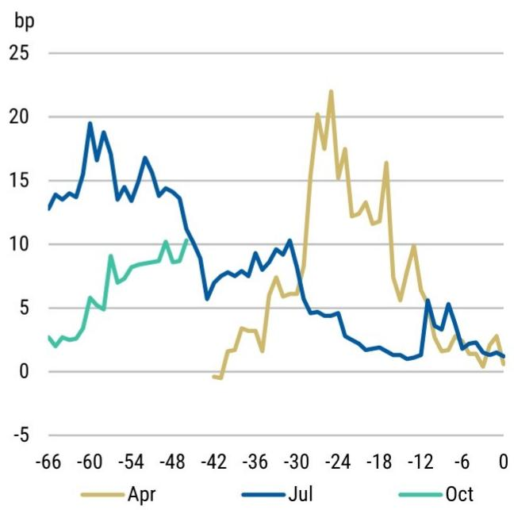  
Source: Bloomberg, MS. Exhibit shows market pricing for each meeting from 66 days prior to the meeting date

• Trade idea: Close receive July ECB currently opened at 220.2bp, with a target at 218.5bp and a stop at 243.5bp

# FX Strategy: A September Hike Likely Would Boost the EUR

## Andrew Watrous

In recent weeks, investors have debated whether a tighter ECB policy rate would benefit the EUR.

Some investors have reasoned that a higher ECB policy rate might weaken the EUR if a higher policy rate intensifies market concerns about the growth outlook for the Euro Area.

This concern is fundamentally about sentiment: the risk that a hawkish ECB pours the growth outlook before any growth damage materializes. In this article, we test a measurable version of that concern: whether market pricing of restrictive policy has historically coincided with or been followed by currency weakness.

## Transmission Channel 1: Growth Slowdown

A relatively restrictive stance of policy is associated with future currency underperformance. Exhibit 9 shows forward G10 currency returns over a 1m to 12m horizon after a month when a central bank was restrictive.

We measure market-implied policy restriction using the spread between the local 1-year yield and the local 5y5y forward yield.

\- The 1-year yield captures expectations for near-term policy rates,

\- The 5y5y forward yield provides a market-based proxy for the neutral rate (where markets expect policy to settle once the current cycle has passed).

A significantly positive spread (the 1-year yield exceeding the 5y5y forward yield) therefore suggests that current policy is restrictive relative to where markets expect it to settle over the long run. The measure is imperfect, since the 5y5y forward yield also embeds a term premium, but it provides a consistent, market-based comparison across countries and over time.

Currency performance tends to deteriorate after policy becomes deeply restrictive, although the effect emerges with a lag and varies considerably across episodes.

\- The average subsequent underperformance is larger at more restrictive thresholds

\- Results should be interpreted cautiously because prolonged periods of restriction create overlapping monthly observations.

For example, currencies underperformed average G10 returns versus the USD by $-0.3\%$ over the three months after a central bank was at least 0.5pp restrictive $(n = 230)$ .

\- Currencies underperformed more when the central bank was at least 1.0pp restrictive (from -0.3% to -0.4%, n = 96). The domestic currency underperformed by -0.9% over 3 months and -2.5% over twelve months when the central bank was at least 1.5pp restrictive (n = 36).

• We provide results from a recent period (past 15 years) for comparison.

There are multiple potential explanations for currency weakness following policy

## restriction, including:

\- An inverted yield curve (1y yield > 5y5y forward yield) is usually consistent with cuts priced within the next 12 months, and the domestic currency weakens as those cuts are delivered.

\- Policy restriction slowed down domestic growth, discouraging capital flows and weakening the currency

Exhibit 9: Currencies underperform after policy becomes restrictive

<table><tr><td rowspan="2"></td><td rowspan="2">Degree of Restriction</td><td colspan="5">Subsequent Relative CCY/USD Performance (Average)</td></tr><tr><td>1m</td><td>3m</td><td>6m</td><td>12m</td><td># obs.</td></tr><tr><td rowspan="4">1995 - 2026</td><td>&gt;0.0</td><td>0.0%</td><td>-0.1%</td><td>-0.4%</td><td>-0.6%</td><td>425</td></tr><tr><td>&gt;0.5</td><td>0.0%</td><td>-0.3%</td><td>-0.6%</td><td>-1.1%</td><td>230</td></tr><tr><td>&gt;1.0</td><td>-0.1%</td><td>-0.4%</td><td>-0.7%</td><td>-0.5%</td><td>96</td></tr><tr><td>&gt;1.5</td><td>-0.3%</td><td>-0.9%</td><td>-2.2%</td><td>-2.5%</td><td>36</td></tr><tr><td></td><td></td><td>1m</td><td>3m</td><td>6m</td><td>12m</td><td># obs.</td></tr><tr><td rowspan="4">2011 - 2026</td><td>&gt;0.0</td><td>0.1%</td><td>0.1%</td><td>0.1%</td><td>0.4%</td><td>187</td></tr><tr><td>&gt;0.5</td><td>0.0%</td><td>-0.2%</td><td>-0.1%</td><td>0.2%</td><td>99</td></tr><tr><td>&gt;1.0</td><td>0.0%</td><td>-0.2%</td><td>-0.4%</td><td>-0.4%</td><td>26</td></tr><tr><td>&gt;1.5</td><td>0.0%</td><td>-0.3%</td><td>-0.8%</td><td>-0.8%</td><td>7</td></tr></table>

Source: Bloomberg, Macrobond, MS

Exhibit 10: Currencies outperform into policy restriction

<table><tr><td rowspan="2"></td><td rowspan="2">Degree of Restriction</td><td colspan="5">Prior Relative CCY/USD Performance (Average)</td></tr><tr><td>1m</td><td>3m</td><td>6m</td><td>12m</td><td># obs.</td></tr><tr><td rowspan="4">1995 - 2026</td><td>&gt;0.0</td><td>0.0%</td><td>0.2%</td><td>0.4%</td><td>0.8%</td><td>425</td></tr><tr><td>&gt;0.5</td><td>0.0%</td><td>0.1%</td><td>0.4%</td><td>1.2%</td><td>230</td></tr><tr><td>&gt;1.0</td><td>0.1%</td><td>0.1%</td><td>0.3%</td><td>1.0%</td><td>96</td></tr><tr><td>&gt;1.5</td><td>0.1%</td><td>0.9%</td><td>0.4%</td><td>0.4%</td><td>36</td></tr><tr><td></td><td></td><td>1m</td><td>3m</td><td>6m</td><td>12m</td><td># obs.</td></tr><tr><td rowspan="4">2011 - 2026</td><td>&gt;0.0</td><td>0.1%</td><td>0.2%</td><td>0.5%</td><td>0.8%</td><td>187</td></tr><tr><td>&gt;0.5</td><td>0.0%</td><td>0.2%</td><td>0.5%</td><td>1.2%</td><td>99</td></tr><tr><td>&gt;1.0</td><td>0.1%</td><td>0.1%</td><td>0.4%</td><td>2.2%</td><td>26</td></tr><tr><td>&gt;1.5</td><td>-0.2%</td><td>-0.2%</td><td>0.7%</td><td>-0.3%</td><td>7</td></tr></table>

Source: Bloomberg, Macrobond, MS

On the other hand, we find that currencies outperformed average G10 returns in the months leading up to restriction. Exhibit 10 shows the inverse of Exhibit 9. Instead of illustrating returns after months when policy was restrictive, Exhibit 10 shows relative currency performance in the period prior to restriction.

One challenge with the simplified approach above is that long periods of restriction create multiple overlapping observations in Exhibit 9 and Exhibit 10. To de-duplicate episodes of restriction, Exhibit 11 shows relative FX performance before and after the first month the 1y - 5y5y spread became at least 100bp inverted in a 13 month period.

On average, currencies outperformed as central banks hiked into restriction (average relative performance = 3.7%), and then underperformed in the 12 months afterwards (average = -0.8%).

However, there was considerable heterogeneity across these episodes. Much of the post-restriction average underperformance is attributable to two episodes in New Zealand: the year following November 1997 and December 2005.

Exhibit 11: Relative currency performance before and after episodes of 100bp restriction

<table><tr><td>Restriction Month</td><td>Currency</td><td>Prior 12m</td><td>Following 12m</td></tr><tr><td>December 2023</td><td>CAD</td><td>2.2%</td><td>-0.6%</td></tr><tr><td>July 2023</td><td>CHF</td><td>8.0%</td><td>2.1%</td></tr><tr><td>July 2023</td><td>EUR</td><td>7.2%</td><td>-0.7%</td></tr><tr><td>July 2023</td><td>GBP</td><td>5.7%</td><td>1.1%</td></tr><tr><td>May 2023</td><td>NZD</td><td>-0.6%</td><td>-0.5%</td></tr><tr><td>November 2022</td><td>CAD</td><td>7.0%</td><td>-2.4%</td></tr><tr><td>December 2005</td><td>NZD</td><td>6.9%</td><td>-10.5%</td></tr><tr><td>December 2000</td><td>GBP</td><td>0.3%</td><td>0.5%</td></tr><tr><td>November 1999</td><td>GBP</td><td>-0.2%</td><td>2.5%</td></tr><tr><td>February 1998</td><td>GBP</td><td>7.7%</td><td>-0.6%</td></tr><tr><td>November 1997</td><td>NZD</td><td>-2.7%</td><td>-13.3%</td></tr><tr><td>July 1996</td><td>NZD</td><td>4.2%</td><td>6.2%</td></tr><tr><td>April 1995</td><td>NZD</td><td>2.2%</td><td>6.4%</td></tr><tr><td></td><td>Average:</td><td>3.7%</td><td>-0.8%</td></tr></table>

Source: Bloomberg, Macrobond, MS

Exhibit 12: The RBNZ hiked front-end rates even as longer-term rate expectations drifted lower  
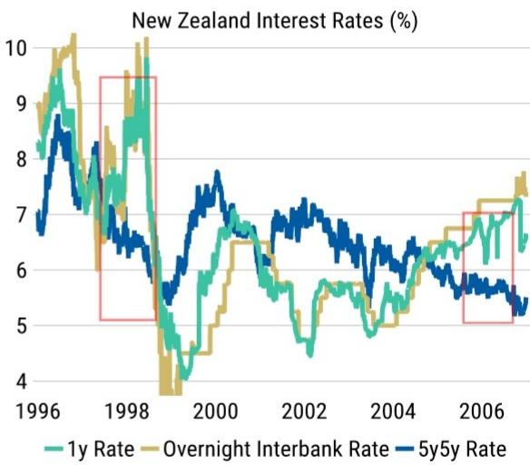  
Source: Macrobond, MS

During both periods, the RBNZ tightened rates even as growth risks loomed and longer term policy expectations drifted lower (Exhibit 12).

The RBNZ's tightening in 1997 was in part a result of NZD weakness. At the time, the RBNZ targeted a Monetary Conditions Index, which entailed a higher policy rate when the currency weakened (a policy framework that a leading scholar labeled "a significant deviation from best international practice"). This trigger aligns with notable NZD weakness during the 12 months into restriction (-2.7%), a deviation from the broader pattern of currency gains into restriction.

In both of these episodes, the degree of policy restriction delivered weighed on both NZD and New Zealand growth (Exhibit 13) Exhibit 14 illustrates that New Zealand growth contracted during at least one quarter during both periods.

Exhibit 13: NZD weakened as the 1y–5y5y spread moved into restrictive territory  
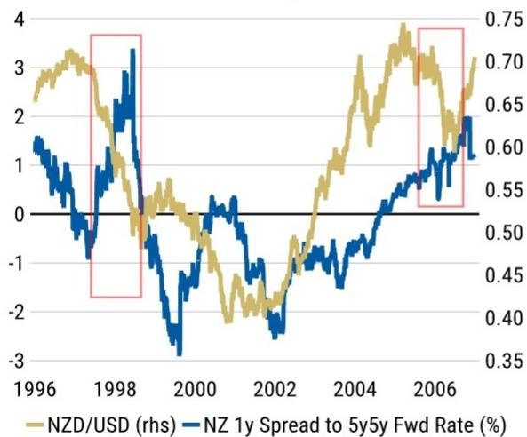  
Source: Macrobond, MS

Exhibit 14: New Zealand growth contracted following both restriction episodes  
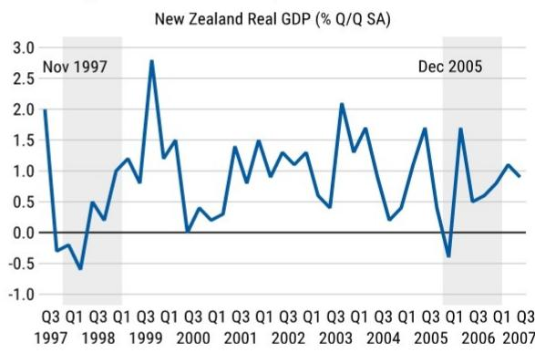

Source: Macrobond, MS

Overall, the takeaway from this survey of policy restriction on currency performance:

\- Currencies generally outperform as a central bank lifts policy rates into deeply restrictive territory - even if domestic growth ultimately suffers.

\- Currencies have on average underperformed later as growth slows. Currencies generally underperform over the 6-12 months after restriction reaches \~100bp. On a de-duplicated basis the average 12-month return after restriction is -0.8%, although the average was skewed by a large NZD movement under an unorthodox policy framework. We read the pattern as currencies becoming less well-supported after deep restriction, rather than reliably weakening.

## Transmission Channel 2: Debt Sustainability Concerns

Rising yields can also weaken a currency when they increase concerns about the sustainability of public debt.

This channel primarily operates through current and expected future real debt service costs. Market concerns rise when the public debt stock and the cost of servicing it are expected to grow faster than nominal GDP - see here for a deeper discussion of R minus G.

Higher yields have two competing effects. They improve the return available to investors, but they also increase the government's expected interest burden.

The second effect may dominate when public debt is already high, debt matures relatively quickly, or a large share of debt payments is linked to inflation. Investors may conclude that the government will eventually need to raise taxes, reduce spending, tolerate higher inflation, or rely on central bank support.

Each of these outcomes can weigh on the currency. Fiscal tightening can weaken growth, while inflation or central bank financing can reduce the expected real return on domestic assets.

Debt sustainability concerns have been most visible in the UK and Japan in recent years.

In the UK, government debt service costs are relatively high as a share of GDP (Exhibit 15). The UK's large stock of inflation-linked debt also means that higher inflation can raise government interest costs relatively quickly.

In Japan, debt service payments are relatively modest relative to the size of the domestic economy, but investors have focused more on the expected future path of debt service costs.

At around 94% of GDP, the stock of JGBs held by the public is not significantly out of line with other G10 economies. However, the potential for additional issuance combined with the BoJ's ongoing reduction in the size of its balance sheet (see these BoJ projections) have raised market concern. Some investors believe that Japan's rising stock of debt held by the public (Exhibit 16) means that a rise in inflation and JGB yields could materially increase interest expenses as government debt is refinanced.

Exhibit 15: Italy and the UK face the highest debt service payments relative to GDP  
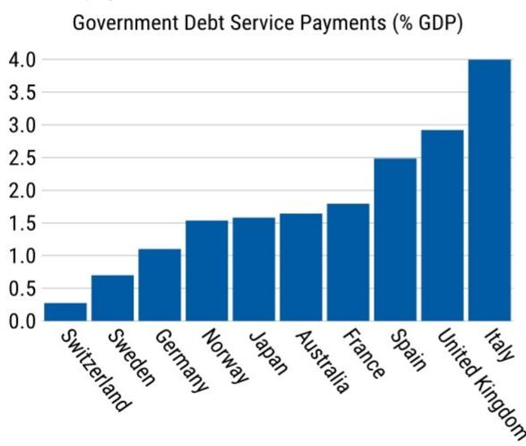  
Source: Macrobond, MS

Exhibit 16: JGBs held by the public have risen as a share of GDP as the BoJ shrinks its balance sheet  
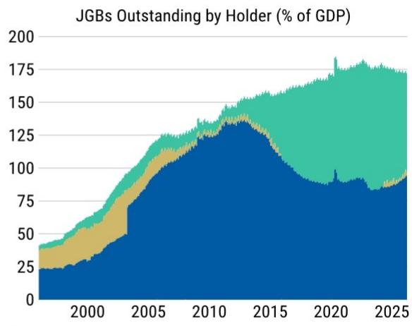  
■ BoJ Holdings ■ Government Holdings ■ Held by the Public
Source: Macrobond, MS

While we believe the primary driver of JPY weakness is the broad perception that the BoJ remains behind the curve (particularly relative to other major central banks that are viewed as being closer to a neutral policy stance), concerns about fiscal sustainability can create a negative relationship between long-end yields and the currency. Instead of attracting capital and strengthening the currency, higher yields become a signal of perceived fiscal risk.

There have been extended periods in recent years when GBP has traded inversely with UK-EU long-end OIS differentials, and JPY inversely with foreign-Japan long-end OIS differentials (Exhibit 17 and Exhibit 18). During these periods, an increase in yields was associated with a weaker domestic currency.

Both Exhibit 17 and Exhibit 18 use the same y-axis scale for comparability.

Exhibit 17: GBP has traded inversely with UK–EU long-end differentials in recent years  
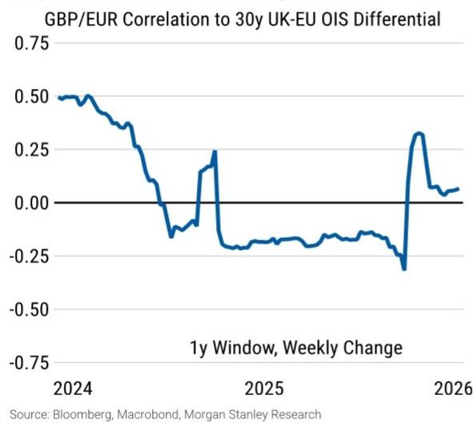

Exhibit 18: JPY has traded inversely with foreign-Japan long-end differentials  
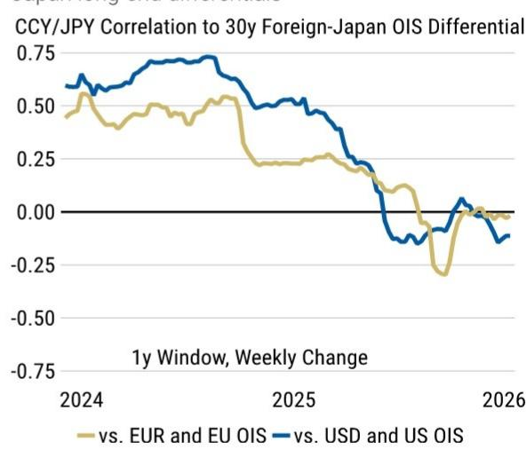  
Source: Bloomberg, Macrobond, MS

A negative correlation does not necessarily mean that fiscal concerns caused every move in rates or FX. However, a sustained negative relationship can indicate that investors view higher yields as compensation for risk rather than evidence of stronger growth or higher expected returns.

## Transmission Channels Applied to EUR

We think neither of these transmission channels apply to the EUR. As a result, we do not expect that a tighter stance of ECB policy would weaken the EUR.

On the first transmission channel: The Euro Area yield curve does not suggest that the ECB has tightened to a degree that would negatively affect the domestic currency. Norway is the only economy in G10 where the 1y yield is above the 5y5y forward yield; the German spread is -78bp (Exhibit 19).

While positive, the degree of market-implied restriction in Norway appears modest and probably does not represent a meaningful threat to NOK. Currencies have historically only moderately underperformed on average when the 1y rate rose above the 5y5y forward rate.

Note that upward sloping curves may be accentuated by term premium. If large term premiums distort the signal regarding where markets have priced the neutral rate, the 1y spread to the 5y5y forward yield may be negative even if the central bank is perceived to be restrictive.

One caveat: after adjusting the 5y5y rate by our roughly 128bp estimate of the German 10-year term premium (see MSDETP10 Index on Bloomberg), the spread between near-term and long-term pricing does suggest that the ECB may be closer to neutral, or slightly restrictive, than the raw -78bp spread implies.

Stripping a premium of that size from the 5y5y forward puts the German 1y around 50bp above the estimated neutral rate rather than below it (-78bp + \~128bp ≈ +50bp). We would not put much weight on a precise level: a 10-year term premium is not the right input for a 5y5y forward, and the appropriate figure is uncertain.

Moreover, the implied term-premium adjusted degree of ECB restriction is modest. \~50bp of restriction sits toward the lower end of the thresholds in Exhibit 9, well short of the \~100–150bp of restriction that our historical results associate with meaningful subsequent currency weakness. At these moderate levels of restriction, that same history shows little reliable underperformance (particularly in the post-2011 sample) and what weakness does emerge arrives only with a six- to twelve-month lag.

Exhibit 19: Norway is the only G10 economy with a positive 1y-5y5y spread  
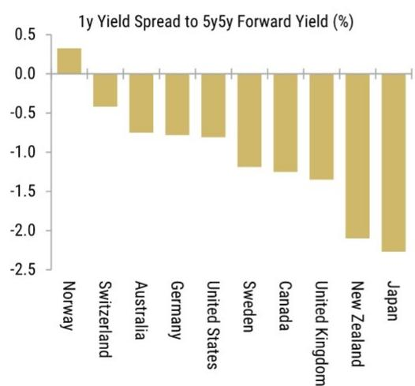  
Source: Bloomberg, Macrobond, MS

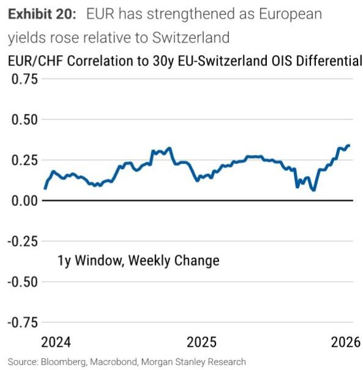

On the second transmission channel: We have not recently observed an adverse relationship between rates and FX in the Euro Area. The EUR has generally strengthened when European yields have risen (Exhibit 20).

Exhibit 20 compares EUR/CHF with European-Swiss yield differentials. Switzerland provides a useful comparison because investors generally have limited concerns about Swiss public debt sustainability, meaning that changes in the relationship should primarily reflect developments on the Euro Area side.

As shown in Exhibit 15, while German and French debt service payments look relatively manageable, Spain and Italy's debt services payments look somewhat elevated relative to GDP.

However, as discussed here we do not see pressure for higher European yields stemming from expansionary fiscal policy, increased supply, or deteriorating credit, and expect EU fiscal rules to incentivize governments against fiscal slippage over time.

Our economists note here that Italy has historically run primary surpluses (averaging around 1.5% of GDP over 2015-19) and has consistently returned to surplus following periods of expansion. And Spain's near-term position has improved, with the deficit falling to around 2.4% of GDP in 2025 from 3.2% a year earlier, allowing its debt ratio to dip below 100%.

Periphery fragmentation remains the clearest risk to this view that tighter ECB policy will be EUR positive. We watch OAT-Bund and BTP-Bund spreads as the signal that markets are beginning to price fiscal risk into yields, which is likely the point at which the adverse rates-FX channel would assert itself.

Overall, the takeaway from this survey of debt sustainability concerns:

\- Higher yields can weaken a currency when they raise expected debt service costs faster than they improve expected investment returns. Currencies may weaken when investor concerns rise that nominal growth will not keep pace with the government's interest burden.

\- The UK and Japan have shown periods of this adverse rates-FX relationship. We do not currently see similar evidence for the EUR, and we do not expect this relationship to change in the near term.

As a result, we think the tighter stance of ECB policy our economists expect to boost the EUR, for several reasons:

\- As discussed above, a restrictive stance of central bank policy can weaken the domestic currency. But the domestic currency outperforms on average as the central bank hikes into restriction, and currency weakness comes later.

\- That currency weakness arrives with a lag, typically over the 6–12 months after restriction is reached.

\- Even adjusting for term premium, the implied degree of ECB restriction is modest. We think it is well short of the \~100–150bp levels this measure associates with meaningful weakness.

\- And even if ECB restriction were to build further, the pattern implies EUR would rise as the ECB tightens (as we expect), with any weakness arriving 6–12 months later rather than priced in today.

## Valuation Methodology and Risks

## BARC Bank (BARC.L)

To reach our price target, we use a Gordon growth model, assuming a 12% cost of equity and 1.5% sustainable growth rate, to value 2028 numbers discounted back to 2026.

## Risks to Upside

■ Better macro backdrop, particularly in the US and UK, with stronger loan growth as demand picks up

■ Better IB revenues as investor confidence returns

■ Longer implementation timelines for regulatory capital ratios

## Risks to Downside

■ Execution risk on CIB turnaround

■ Market share loss to larger competitors

■ Ringfencing, capital levels and conduct investigations

## UniCredit S.p.A. (CRDI.MI)

To reach our price target, we use a sum-of-the-parts methodology based on a Gordon growth model on estimated 2028 earnings. We assume c2% perpetual growth rate and a c12% CoE, deducting the impact from an extreme negative scenario in Russia. We adjust for excess capital above our 13% target and value stakes at market price.

## Risks to Upside

■ Higher growth in Germany materialising sooner than expected

■ Share buyback above 80% payout

■ Significantly lower CoR than expected arising from a potential release of overlays

Accretive M&A

## Risks to Downside

■ Delays in investments in Germany

■ Higher than anticipated cost inflation across CEE

■ Delays in exploring optionality of excess capital

■ Subdued loan growth in Italy

■ Competition eroding margins more than expected

## DB (DBKGn.DE)

We base our valuation on reported 2028 earnings and a P/BV methodology. We assume an exit return on allocated equity of \~14%, 0% growth rate and \~11.5% cost of equity. We assume steady-state capital of c.14%. We see limited capital surplus and add back dividends. We then discount back to 1-year forward to reach our valuation. Our PT is 100% weighted to our base case.

## Risks to Upside

■ Better IB/NII revenue trajectory than envisaged

■ Better execution on announced cost savings

■ Higher RWA optimisation and capital returns

## Risks to Downside

■ Weaker revenue trajectory than envisaged

■ Slower delivery on announced cost savings

■ Greater than expected asset quality impact from CRE/leveraged lending portfolio

■ Inability to optimise RWAs

## Santander (SAN.MC)

To reach our price target, we use a SOTP/Gordon growth valuation, with a 100% base case weighting. We use an average 11.7% cost of equity and 1.5% long-term growth rate.

## Risks to Upside

■ Improvement in sovereign risk in Europe, more so in Spain

■ Recovery in LatAm currencies

■ Efficient cost cutting

■ Capital beat

■ Low CoR, especially in Brazil

## Risks to Downside

■ Significant deterioration in sovereign risk in Europe, especially Spain

■ Worsening asset quality across principal geographies: Brazil, Mexico, Europe (Spain and UK) and US

■ Sensitivity to further BRL and GBP moves

## Disclosure Section

The information and opinions in MS were prepared or are disseminated by MS Europe S.E., regulated by Bundesanstalt fuer Finanzdienstleistungsaufsicht (BaFin) and/or MS & Co. International plc, authorized by the Prudential Regulation Authority and regulated by the Financial Conduct Authority and the Prudential Regulation Authority. MS & Co. International plc disseminates in the UK research that it has prepared, and which has been prepared by any of its affiliates, only to persons who (i) are investment professionals falling within Article 19(5) of the Financial Services and Markets Act 2000 (Financial Promotion) Order 2005 (as amended, the "Order"); (ii) are persons who are high net worth entities falling within Article 4.9(2)(a) to (d) of the Order; or (iii) are persons to whom an invitation or inducement to engage in investment activity (within the meaning of section 21 of the Financial Services and Markets Act 2000, as amended) may otherwise lawfully be communicated or caused to be communicated. As used in this disclosure section, MS includes RMB MS Proprietary Limited, MS Europe S.E., MS & Co International plc and its affiliates.

For important disclosures, stock price charts and equity rating histories regarding companies that are the subject of this report, please see the MS Disclosure Website at www.morganstanley.com/eqr/disclosures/webapp/generalresearch, or contact your investment representative or MS at 1585 Broadway, (Attention: Research Management), New York, NY, 10036 USA.

For valuation methodology and risks associated with any recommendation, rating or price target referenced in this research report, please contact the Client Support Team as follows: US/Canada +1 800 303-2495; Hong Kong +852 2848-5999; Latin America +1 718 754-5444 (U.S.); London +44 (0)20-7425-8169; Singapore +65 6834-6860; Sydney +61 (0)2-9770-1505; Tokyo +81 (0)3-6836-9000. Alternatively you may contact your investment representative or MS at 1585 Broadway, (Attention: Research Management), New York, NY 10036 USA.

## Analyst Certification

The following analysts hereby certify that their views about the companies and their securities discussed in this report are accurately expressed and that they have not received and will not receive direct or indirect compensation in exchange for expressing specific recommendations or views in this report: Jasper Knyphausen; Maria Chiara Russo; Luca Salford; Alvaro Serrano; Andrew M Watrous.

## Global Research Conflict Management Policy

MS has been published in accordance with our conflict management policy, which is available at www.morganstanley.com/institutional/research/conflictpolicies. A Portuguese version of the policy can be found at www.morganstanley.com.br

## Important Regulatory Disclosures on Subject Companies

As of June 30, 2026, MS beneficially owned 1% or more of a class of common equity securities of the following companies covered in MS: BARC Bank, DB, Santander, UniCredit S.p.A..

Within the last 12 months, MS managed or co-managed a public offering (or 144A offering) of securities of BARC Bank, DB, Santander, UniCredit S.p.A..

Within the last 12 months, MS has received compensation for investment banking services from BARC Bank, Santander, UniCredit S.p.A..

In the next 3 months, MS expects to receive or intends to seek compensation for investment banking services from BARC Bank, DB, Santander, UniCredit S.p.A.. Within the last 12 months, MS has received compensation for products and services other than investment banking services from BARC Bank, DB, Santander, UniCredit S.p.A..

Within the last 12 months, MS has provided or is providing investment banking services to, or has an investment banking client relationship with, the following company: BARC Bank, DB, Santander, UniCredit S.p.A..

Within the last 12 months, MS has either provided or is providing non-investment banking, securities-related services to and/or in the past has entered into an agreement to provide services or has a client relationship with the following company: BARC Bank, DB, Santander, UniCredit S.p.A..

The equity research analysts or strategists principally responsible for the preparation of MS have received compensation based upon various factors, including quality of research, investor client feedback, stock picking, competitive factors, firm revenues and overall investment banking revenues. Equity Research analysts' or strategists' compensation is not linked to investment banking or capital markets transactions performed by MS or the profitability or revenues of particular trading desks.

MS and its affiliates do business that relates to companies/instruments covered in MS, including market making, providing liquidity, fund management, commercial banking, extension of credit, investment services and investment banking. MS sells to and buys from customers the securities/instruments of companies covered in MS on a principal basis. MS may have a position in the debt of the Company or instruments discussed in this report. MS trades or may trade as principal in the debt securities (or in related derivatives) that are the subject of the debt research report.

Certain disclosures listed above are also for compliance with applicable regulations in non-US jurisdictions.

## STOCK RATINGS

MS uses a relative rating system using terms such as Overweight, Equal-weight, Not-Rated or Underweight (see definitions below). MS does not assign ratings of Buy, Hold or Sell to the stocks we cover. Overweight, Equal-weight, Not-Rated and Underweight are not the equivalent of buy, hold and sell. Investors should carefully read the definitions of all ratings used in MS. In addition, since MS contains more complete information concerning the analyst's views, investors should carefully read MS, in its entirety, and not infer the contents from the rating alone. In any case, ratings (or research) should not be used or relied upon as investment advice. An investor's decision to buy or sell a stock should depend on individual circumstances (such as the investor's existing holdings) and other considerations.

## Global Stock Ratings Distribution

## (as of June 30, 2026)

The Stock Ratings described below apply to MS's Fundamental Equity Research and do not apply to Debt Research produced by the Firm.

For disclosure purposes only (in accordance with FINRA requirements), we include the category headings of Buy, Hold, and Sell alongside our ratings of Overweight, Equal-weight, Not-Rated and Underweight. MS does not assign ratings of Buy, Hold or Sell to the stocks we cover. Overweight, Equal-weight, Not-Rated and Underweight are not the equivalent of buy, hold, and sell but represent recommended relative weightings (see definitions below). To satisfy regulatory requirements, we correspond Overweight, our most positive stock rating, with a buy recommendation; we correspond Equal-weight and Not-Rated to hold and Underweight to sell recommendations, respectively.

<table><tr><td></td><td colspan="2">Coverage Universe</td><td colspan="3">Investment Banking Clients (IBC)</td><td colspan="2">Other Material Investment Services Clients (MISC)</td></tr><tr><td>Stock Rating Category</td><td>Count</td><td>% of Total</td><td>Count</td><td>% of Total IBC</td><td>% of Rating Category</td><td>Count</td><td>% of Total Other MISC</td></tr><tr><td>Overweight/Buy</td><td>1544</td><td>42%</td><td>453</td><td>49%</td><td>29%</td><td>757</td><td>44%</td></tr><tr><td>Equal-weight/Hold</td><td>1577</td><td>43%</td><td>390</td><td>42%</td><td>25%</td><td>769</td><td>44%</td></tr><tr><td>Not-Rated/Hold</td><td>3</td><td>0%</td><td>1</td><td>0%</td><td>33%</td><td>1</td><td>0%</td></tr><tr><td>Underweight/Sell</td><td>544</td><td>15%</td><td>89</td><td>10%</td><td>16%</td><td>204</td><td>12%</td></tr><tr><td>Total</td><td>3,668</td><td></td><td>933</td><td></td><td></td><td>1731</td><td></td></tr></table>

Data include common stock and ADRs currently assigned ratings. Investment Banking Clients are companies from whom MS received investment banking compensation in the last 12 months. Due to rounding off of decimals, the percentages provided in the "% of total" column may not add up to exactly 100 percent.

## Analyst Stock Ratings

Overweight (O). The stock's total return is expected to exceed the average total return of the analyst's industry (or industry team's) coverage universe, on a risk-adjusted basis, over the next 12-18 months.

Equal-weight (E). The stock's total return is expected to be in line with the average total return of the analyst's industry (or industry team's) coverage universe, on a risk-adjusted basis, over the next 12-18 months.

Not-Rated (NR). Currently the analyst does not have adequate conviction about the stock's total return relative to the average total return of the analyst's industry (or industry team's) coverage universe, on a risk-adjusted basis, over the next 12-18 months.

Underweight (U). The stock's total return is expected to be below the average total return of the analyst's industry (or industry team's) coverage universe, on a risk-adjusted basis, over the next 12-18 months.

Unless otherwise specified, the time frame for price targets included in MS is 12 to 18 months.

## Analyst Industry Views

Attractive (A): The analyst expects the performance of his or her industry coverage universe over the next 12-18 months to be attractive vs. the relevant broad market benchmark, as indicated below.

In-Line (I): The analyst expects the performance of his or her industry coverage universe over the next 12-18 months to be in line with the relevant broad market benchmark, as indicated below. Cautious (C): The analyst views the performance of his or her industry coverage universe over the next 12-18 months with caution vs. the relevant broad market benchmark, as indicated below. Benchmarks for each region are as follows: North America - S&P 500; Latin America - relevant MSCI country index or MSCI Latin America Index; Europe - MSCI Europe; Japan - TOPIX; Asia - relevant MSCI country index or MSCI sub-regional index or MSCI AC Asia Pacific ex Japan Index.

## Stock Price, Price Target and Rating History (See Rating Definitions)

8/5/22 : 210; 10/17/22 : 200; 2/10/23 : 215; 2/23/23 : 210; 7/6/23 : 190; 9/26/23 : 230; 11/28/23 : 235; 2/21/24 : 255; 4/6/24 : 260; 4/25/24 : 270; 5/28/24 : 285; 7/8/24 : 290; 9/9/24 : 300; 10/24/24 : 315; 11/25/24 : 375; 4/9/25 : 350; 5/1/25 : 360; 5/21/25 : 385; 7/29/25 : 400; 9/2/25 : 420; 10/6/25 : 425; 10/23/25 : 455; 11/24/25 : 510; 2/11/26 : 540; 7/1/26 : 610

BARC Bank (BARC.L) - As of 07/23/26 GMT in GBp Industry : Banks  
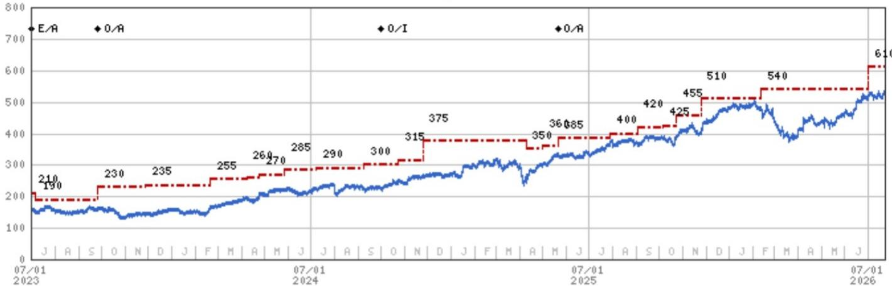  
Stock Rating History: 7/1/21 : E/A; 5/17/22 : E/I; 9/15/22 : E/A; 9/26/23 : 0/A; 10/1/24 : 0/I; 5/21/25 : 0/A  
Source: MS Date Format: MM/DD/YY Price Target No Price Target Assigned (NA)
Stock Price (Not Covered by Current Analyst) Stock Price (Covered by Current Analyst)
Stock and Industry Ratings (abbreviations below) appear as ♦ Stock Rating/Industry View
Stock Ratings: Overweight (O) Equal-weight (E) Underweight (U) Not-Rated (NR) No Rating Available (NA)  
Industry View: Attractive (A) In-line (I) Cautious (C) No Rating (NR)  
Effective January 13, 2014, the stocks covered by MS Asia Pacific will be rated relative to the analyst's industry (or industry team's) coverage.  
Effective January 13, 2014, the industry view benchmarks for MS Asia Pacific are as follows: relevant MSCI country index or MSCI sub-regional index or MSCI AC Asia Pacific ex Japan Index.

DB (DBKGn.DE) - As of 07/23/26 GMT in EUR
Industry : Banks  
  
Stock Rating History: 7/1/21 : E/A; 5/17/22 : E/I; 9/15/22 : E/A; 9/22/23 : E/A; 3/27/24 : O/A; 10/1/24 : O/I; 5/21/25 : O/A  
Price Target History: 5/7/21 : 12.2; 7/28/21 : 12.8; 10/28/21 : 13.5; 11/29/21 : 14.2; 2/11/22 : 15.4; 4/21/22 : 14.9; 7/13/22 : 12; 9/15/22 : 15; 10/13/22 : 14; 4/5/23 : 12; 9/22/23 : 13; 10/26/23 : 14; 11/28/23 : 15; 1/11/24 : 16; 2/16/24 : 17; 3/27/24 : 18; 4/26/24 : 20; 4/29/24 : 19; 7/26/24 : 19.6; 10/23/24 : 20; 2/3/25 : 22; 3/7/25 : 26; 4/9/25 : 24; 4/29/25 : 26; 5/21/25 : 29.2; 6/16/25 : 29.5; 7/3/25 : 29; 7/25/25 : 32; 9/2/25 : 35; 11/7/25 : 37.5; 11/24/25 : 39; 1/6/26 : 40; 4/1/26 : 35; 5/6/26 : 34; 7/1/26 : 36  
Effective January 13, 2014, the stocks covered by MS Asia Pacific will be rated relative to the analyst's industry (or industry team's) coverage.  
Effective January 13, 2014, the industry view benchmarks for MS Asia Pacific are as follows: relevant MSCI country index or MSCI sub-regional index or MSCI AC Asia Pacific ex Japan Index.

Stock and Industry Ratings (abbreviations below) appear as ♦ Stock Rating/Industry View

Stock Ratings: Overweight (O) Equal-weight (E) Underweight (U) Not-Rated (NR) No Rating Available (NA)
Industry View: Attractive (A) In-line (I) Cautious (C) No Rating (NR)

Santander (SAN.MC) - As of 07/23/26 GMT in EUR
Industry : Banks  
  
Stock Rating History: 7/1/21 : 0/A; 11/12/21 : E/A; 5/17/22 : E/I; 9/15/22 : E/A; 10/1/24 : E/I; 11/25/24 : 0/I; 5/21/25 : 0/A; 2/4/26 : E/A; 3/23/26 : 0/A  
Price Target History: 5/18/21 : 4; 11/12/21 : 3.8; 2/2/22 : 3.9; 2/15/22 : 4; 4/4/22 : 4.2; 6/28/22 : 4.3; 7/28/22 : 4;  
Effective January 13, 2014, the stocks covered by MS Asia Pacific will be rated relative to the analyst's industry (or industry team's) coverage.  
Effective January 13, 2014, the industry view benchmarks for MS Asia Pacific are as follows: relevant MSCI country index or MSCI sub-regional index or MSCI AC Asia Pacific ex Japan Index.

07/01 2026

Stock Ratings: Overweight (O) Equal-weight (E) Underweight (U) Not-Rated (NR) No Rating Available (NA)

UniCredit S.p.A. (CRDI.MI) - As of 07/23/26 GMT in EUR Industry : Banks  
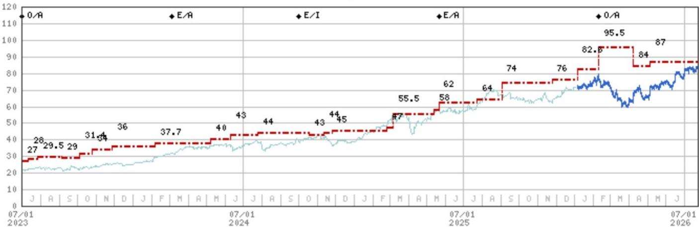  
Stock Rating History: 7/1/21 : 0/A; 5/17/22 : 0/I; 9/15/22 : 0/A; 3/5/24 : E/A; 10/1/24 : E/I; 5/21/25 : E/A; 2/10/26 : 0/A

Price Target History: 5/20/21 : 12.5; 8/13/21 : 13; 10/13/21 : 13.8; 12/22/21 : 17; 2/15/22 : 19.5; 4/22/22 : 16.5; 7/11/22 : 15.4; 8/18/22 : 15; 9/23/22 : 16; 1/16/23 : 17; 2/9/23 : 21; 4/14/23 : 23; 5/5/23 : 27; 7/11/23 : 28; 7/27/23 : 29.5; 9/5/23 : 29;

10/4/23 : 31.4; 10/26/23 : 34; 11/28/23 : 36; 2/6/24 : 37.7; 5/9/24 : 40; 6/11/24 : 43; 7/26/24 : 44; 10/18/24 : 43; 11/12/24 : 44;
11/25/24 : 45; 2/24/25 : 47; 3/7/25 : 55.5; 5/13/25 : 58; 5/21/25 : 62; 7/23/25 : 64; 9/2/25 : 74; 11/24/25 : 76; 1/5/26 : 82.6;
2/10/26 : 95.5; 4/7/26 : 84; 5/6/26 : 87

Source: MS Date Format : MM/DD/YY Price Target = No Price Target Assigned (NA)

Stock and Industry Ratings (abbreviations below) appear as ♦ Stock Rating/Industry View

Industry View: Attractive (A) In-line (I) Cautious (C) No Rating (NR)

Effective January 13, 2014, the stocks covered by MS Asia Pacific will be rated relative to the analyst's industry (or industry team's) coverage.

Effective January 13, 2014, the industry view benchmarks for MS Asia Pacific are as follows: relevant MSCI country index or MSCI sub-regional index or MSCI AC Asia Pacific ex Japan Index.

## Important Disclosures for MS Smith Barney LLC Customers

Important disclosures regarding any material conflict of interest that can reasonably be expected to have influenced MS Smith Barney LLC's choice of a third-party research provider or the subject company of a third-party research report, are available on the MS Wealth Management disclosure website at www.morganstanley.com/online/researchdisclosures. For MS specific disclosures, you may refer to https://www.morganstanley.com/eqr/disclosures/webapp/generalresearch.

Each MS report is reviewed and approved on behalf of MS Smith Barney LLC. This review and approval is conducted by the same person who reviews the research report on behalf of MS. This could create a conflict of interest.

## Other Important Disclosures

MS policy is to update research reports as and when the Research Analyst and Research Management deem appropriate, based on developments with the issuer, the sector, or the market that may have a material impact on the research views or opinions stated therein. In addition, certain Research publications are intended to be updated on a regular periodic basis (weekly/monthly/quarterly/annual) and will ordinarily be updated with that frequency, unless the Research Analyst and Research Management determine that a different publication schedule is appropriate based on current conditions.

MS is not acting as a municipal advisor and the opinions or views contained herein are not intended to be, and do not constitute, advice within the meaning of Section 975 of the Dodd-Frank Wall Street Reform and Consumer Protection Act.

MS produces an equity research product called a "Tactical Idea." Views contained in a "Tactical Idea" on a particular stock may be contrary to the recommendations or views expressed in research on the same stock. This may be the result of differing time horizons, methodologies, market events, or other factors. For all research available on a particular stock, please contact your sales representative or go to Matrix at http://www.morganstanley.com/matrix.

MS is provided to our clients through our proprietary research portal on Matrix and also distributed electronically by MS to clients. Certain, but not all, MS products are also made available to clients through third-party vendors or redistributed to clients through alternate electronic means as a convenience. For access to all available MS, please contact your sales representative or go to Matrix at http://www.morganstanley.com/matrix.

Any access and/or use of MS is subject to MS's Terms of Use (http://www.morganstanley.com/terms.html). By accessing and/or using MS, you are indicating that you have read and agree to be bound by our Terms of Use (http://www.morganstanley.com/terms.html). In addition you consent to MS processing your personal data and using cookies in accordance with our Privacy Policy and our Global Cookies Policy (http://www.morganstanley.com/privacy\_pledge.html), including for the purposes of setting your preferences and to collect readership data so that we can deliver better and more personalized service and products to you. To find out more information about how MS processes personal data, how we use cookies and how to reject cookies see our Privacy Policy and our Global Cookies Policy (http://www.morganstanley.com/privacy\_pledge.html). Please use the provided link to review the Terms and Conditions and Most Important Terms and Conditions for MS India Company Private Limited (https://www.morganstanley.com/assets/pdfs/about-us-global-offices/india/Terms\_and\_conditions.pdf) and the following link to review the audit report (https://ny.matrix.ms.com/eqr/research/webapp/researchdocs/MSICPL\_Morgan\_Stanley\_Research\_Audit\_Report.pdf).

If you do not agree to our Terms of Use and/or if you do not wish to provide your consent to MS processing your personal data or using cookies please do not access our research.

MS does not provide individually tailored investment advice. MS has been prepared without regard to the circumstances and objectives of those who receive it. MS recommends that investors independently evaluate particular investments and strategies, and encourages investors to seek the advice of a financial adviser. The appropriateness of an investment or strategy will depend on an investor's circumstances and objectives. The securities, instruments, or strategies discussed in MS may not be suitable for all investors, and certain investors may not be eligible to purchase or participate in some or all of them. MS is not an offer to buy or sell or the solicitation of an offer to buy or sell any security/instrument or to participate in any particular trading strategy. The value of and income from your investments may vary because of changes in interest rates, foreign exchange rates, default rates, prepayment rates, securities/instruments prices, market indexes, operational or financial conditions of companies or other factors. There may be time limitations on the exercise of options or other rights in securities/instruments transactions. Past performance is not necessarily a guide to future performance. Estimates of future performance are based on assumptions that may not be realized. If provided, and unless otherwise stated, the closing price on the cover page is that of the primary exchange for the subject company's securities/instruments.

The fixed income research analysts, strategists or economists principally responsible for the preparation of MS have received compensation based upon various factors, including quality, accuracy and value of research, firm profitability or revenues (which include fixed income trading and capital markets profitability or revenues), client feedback and competitive factors. Fixed Income Research analysts', strategists' or economists' compensation is not linked to investment banking or capital markets transactions performed by MS or the profitability or revenues of particular trading desks.

The "Important Regulatory Disclosures on Subject Companies" section in MS lists all companies mentioned where MS owns 1% or more of a class of common equity securities of the companies. For all other companies mentioned in MS, MS may have an investment of less than 1% in securities/instruments or derivatives of securities/instruments of companies and may trade them in ways different from those discussed in MS. Employees of MS not involved in the preparation of MS may have investments in securities/instruments or derivatives of securities/instruments of companies mentioned and may trade them in ways different from those discussed in MS. Derivatives may be issued by MS or associated persons.

With the exception of information regarding MS, MS is based on public information. MS makes every effort to use reliable, comprehensive information, but we make no representation that it is accurate or complete. We have no obligation to tell you when opinions or information in MS change apart from when we intend to discontinue equity research coverage of a subject company. Facts and views presented in MS have not been reviewed by, and may not reflect information known to, professionals in other MS business areas, including investment banking personnel.

MS personnel may participate in company events such as site visits and are generally prohibited from accepting payment by the company of associated expenses unless pre-approved by authorized members of Research management.

MS may make investment decisions that are inconsistent with the recommendations or views in this report.

To our readers based in Taiwan or trading in Taiwan securities/instruments: Information on securities/instruments that trade in Taiwan is distributed by MS Taiwan Limited ("MSTL"). Such information is for your reference only. The reader should independently evaluate the investment risks and is solely responsible for their investment decisions. MS may not be distributed to the public media or quoted or used by the public media without the express written consent of MS. Any non-customer reader within the scope of Article 7-1 of the Taiwan Stock Exchange Recommendation Regulations accessing and/or receiving MS is not permitted to provide MS to any third party (including but not limited to related parties, affiliated companies and any other third parties) or engage in any activities regarding MS which may create or give the appearance of creating a conflict of interest. Information on securities/instruments that do not trade in Taiwan is for informational purposes only and is not to be construed as a recommendation or a solicitation to trade in such securities/instruments. MSTL may not execute transactions for clients in these securities/instruments.

MS is not incorporated under PRC law and the research in relation to this report is conducted outside the PRC. MS does not constitute an offer to sell or the solicitation of an offer to buy any securities in the PRC. PRC investors shall have the relevant qualifications to invest in such securities and shall be responsible for obtaining all relevant approvals, licenses, verifications and/or registrations from the relevant governmental authorities themselves. Neither this report nor any part of it is intended as, or shall constitute, provision of any consultancy or advisory service of securities investment as defined under PRC law. Such information is provided for your reference only.

MS is disseminated in Brazil by MS C.T.V.M. S.A. located at Av. Brigadeiro Faria Lima, 3600, 6th floor, São Paulo - SP, Brazil; and is regulated by the Comissão de Valores Mobiliários; in Mexico by MS México, Casa de Bolsa, S.A. de C.V which is regulated by Comision Nacional Bancaria y de Valores. Paseo de los Tamarindos 90, Torre 1, Col. Bosques de las Lomas Floor 29, 05120 Mexico City; in Japan by MS MUFG Securities Co., Ltd. and, for Commodities related research reports only, MS Capital Group Japan Co., Ltd; in Hong Kong by MS Asia Limited (which accepts responsibility for its contents) and by MS Bank Asia Limited; in Singapore by MS Asia (Singapore) Pte. (Registration number 199206298Z) and/or MS Asia (Singapore) Securities Pte Ltd (Registration number 200008434H), regulated by the Monetary Authority of Singapore (which accepts legal responsibility for its contents and should be contacted with respect to any matters arising from, or in connection with, MS) and by MS Bank Asia Limited, Singapore Branch (Registration number T14FC0118); in Australia to "wholesale clients" within the meaning of the Australian Corporations Act by MS Australia Limited A.B.N. 67 003 734 576, holder of Australian financial services license No. 233742, which accepts responsibility for its contents; in Australia to "wholesale clients" and "retail clients" within the meaning of the Australian Corporations Act by MS Wealth Management Australia Pty Ltd (A.B.N. 19 009 145 555, holder of Australian financial services license No. 240813, which accepts responsibility for its contents; in Korea by MS & Co International plc, Seoul Branch; in India by MS India Company Private Limited having Corporate Identification No (CIN) U22990MH1998PTC115305, regulated by the Securities and Exchange Board of India ("SEBI") and holder of licenses as a Research Analyst (SEBI Registration No. INH000001105); Stock Broker (SEBI Stock Broker Registration No. INZ000244438), Merchant Banker (SEBI Registration No. INM000011203), and depository participant with National Securities Depository Limited (SEBI Registration No. IN-DP-NSDL-567-2021) having registered office at Altimus, Level 39 & 40, Pandurang Budhkar Marg, Worli, Mumbai 400018, India; Telephone no. +91-22-61181000; Compliance Officer Details: Mr. Tejarshi Hardas, Tel. No.: +91-22-61181000 or Email: tejarshi.hardas@morganstanley.com; Grievance officer details: Mr. Tejarshi Hardas, Tel. No.: +91-22-61181000 or Email: msic-compliance@morganstanley.com. MS India Company Private Limited (MSICPL) may use AI tools in providing research services. All recommendations contained herein are made by the duly qualified research analysts; in Canada by MS Canada Limited; in Germany and the European Economic Area where required by MS Europe S.E., authorised and regulated by Bundesanstalt fuer Finanzdienstleistungsaufsicht (BaFin) under the reference number 149169; in the US by MS & Co. LLC, which accepts responsibility for its contents. MS & Co. International plc, authorized by the Prudential Regulation Authority and regulated by the Financial Conduct Authority and the Prudential Regulation Authority, disseminates in the UK research that it has prepared, and research which has been prepared by any of its affiliates, only to persons who (i) are investment professionals falling within Article 19(5) of the Financial Services and Markets Act 2000 (Financial Promotion) Order 2005 (as amended, the "Order"); (ii) are persons who are high net worth entities falling within Article 49(2)(a) to (d) of the Order; or (iii) are persons to whom an invitation or inducement to engage in investment activity (within the meaning of section 21 of the Financial Services and Markets Act 2000, as amended) may otherwise lawfully be communicated or caused to be communicated. RMB MS Proprietary Limited is a member of the JSE Limited and A2X (Pty) Ltd. RMB MS Proprietary Limited is a joint venture owned equally by MS International Holdings Inc. and RMB Investment Advisory (Proprietary) Limited, which is wholly owned by FirstRand Limited. The information in MS is being disseminated by MS Saudi Arabia, regulated by the Capital Market Authority in the Kingdom of Saudi Arabia, and is directed at Sophisticated investors only.

The information in MS is being communicated by MS & Co. International plc (DIFC Branch), regulated by the Dubai Financial Services Authority (the DFSA) or by MS & Co. International plc (ADGM Branch), regulated by the Financial Services Regulatory Authority Abu Dhabi (the FSRA), and is directed at Professional Clients only, as defined by the DFSA or the FSRA, respectively. The financial products or financial services to which this research relates will only be made available to a customer who we are satisfied meets the regulatory criteria of a Professional Client. A distribution of the different MS Research ratings or recommendations, in percentage terms for Investments in each sector covered, is available upon request from your sales representative.

The information in MS is being communicated by MS & Co. International plc (QFC Branch), regulated by the Qatar Financial Centre Regulatory Authority (the QFCRA), and is directed at business customers and market counterparties only and is not intended for Retail Customers as defined by the QFCRA.

As required by the Capital Markets Board of Turkey, investment information, comments and recommendations stated here, are not within the scope of investment advisory activity. Investment advisory service is provided exclusively to persons based on their risk and income preferences by the authorized firms. Comments and recommendations stated here are general in nature. These opinions may not fit to your financial status, risk and return preferences. For this reason, to make an investment decision by relying solely to this information stated here may not bring about outcomes that fit your expectations.

The trademarks and service marks contained in MS are the property of their respective owners. Third-party data providers make no warranties or representations relating to the accuracy, completeness, or timeliness of the data they provide and shall not have liability for any damages relating to such data. The Global Industry Classification Standard (GICS) was developed by and is the exclusive property of MSCI and S&P.

MS, or any portion thereof may not be reprinted, sold or redistributed without the written consent of MS.

Indicators and trackers referenced in MS may not be used as, or treated as, a benchmark under Regulation EU 2016/1011, or any other similar framework.

The issuers and/or fixed income products recommended or discussed in certain fixed income research reports may not be continuously followed. Accordingly, investors should regard those fixed income research reports as providing stand-alone analysis and should not expect continuing analysis or additional reports relating to such issuers and/or individual fixed income products. MS may hold, from time to time, material financial and commercial interests regarding the company subject to the Research report.

Registration granted by SEBI and certification from the National Institute of Securities Markets (NISM) in no way guarantee performance of the intermediary or provide any assurance of returns to investors. Investment in securities market are subject to market risks. Read all the related documents carefully before investing.

The following authors are neither Equity Research Analysts/Strategists nor Fixed Income Research Analysts/Strategists and are not opining on or expressing recommendations on equity or fixed income securities: Jean-Francois Ouvrard; Skander Garchi Casal; Gabriela Silova; Claire A Thuerwaechter; Jens Eisenschmidt; Chiara Zangarelli.

The following authors are Fixed Income Research Analysts/Strategists and are not opining on or expressing recommendations on equity securities: Jasper Knyphausen; Andrew M Watrous; Luca Salford; Maria Chiara Russo.

## © 2026 MS