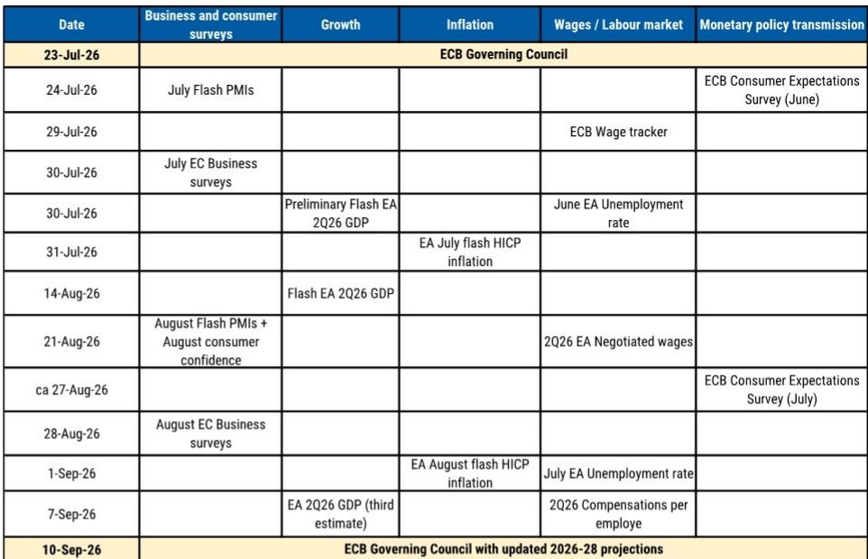
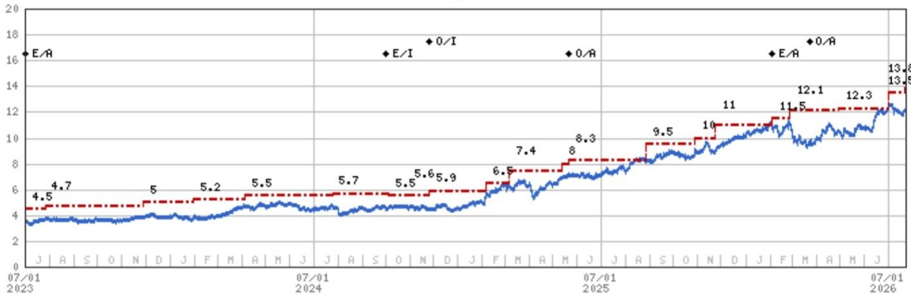
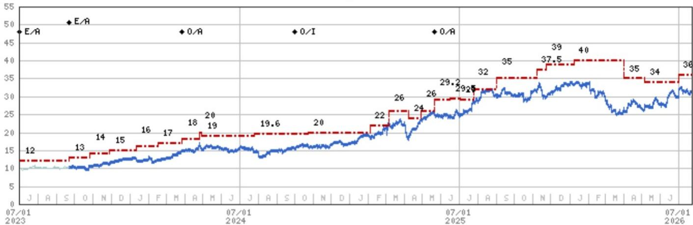

# 欧洲央行9月政策调整几成定局，但真正的战略问题是后续如何

欧洲中央银行在7月会议中维持利率不变，符合普遍预期，但管理委员会明确提及6月基线情景——而非更温和的替代情景——表明该机构已为市场预期9月政策调整做好准备。石油价格仍接近6月基线，而天然气价格已显著上涨，形成了除非出现剧烈逆转否则9月政策调整的可能性较低的商品价格环境。欧洲央行需要看到能源价格持久回落至6月低点，以及经济加速至PMI接近53水平的证据，才能有理由维持现状。目前这两个条件均未接近满足。

对市场参与者而言，战略意义比单纯准备一次调整更为微妙。欧洲央行自身的预测显示，整体HICP要到明年9月才会降至2%以下，这一时间表对一些管理委员会成员来说可能显得过于遥远。如果核心物价在夏季逐月上升而非如基线预期保持稳定，那么9月的预测可能显示出比6月更持续的价格走势特征。这将为讨论9月之后的进一步收紧打开大门，12月最可能成为额外行动的时机。未来几个月的决策框架并非取决于欧洲央行是否在9月调整（这一点实际上已被定价），而是取决于将收紧周期延长至那之后的条件。

## 9月调整依赖于两个条件，而两者同时反向满足的可能性很小

欧洲央行7月声明明确提及6月基线情景，该情景嵌入对商品价格的特定假设。当前石油价格略低于该基线，但天然气价格已大幅高于基线。两者组合使整体能源价格环境接近6月假设。若欧洲央行考虑在9月按兵不动，能源价格需回落至6月低点并维持，同时委员会需看到令人信服的经济加速迹象——PMI接近53——且核心物价风险偏向上行，而非仅由旅游相关项目驱动。该研究将这一标准判定为较高门槛。

更可能的路径是9月调整后暂停，但暂停本身有条件性。基线预期是核心物价大致横盘，GDP低于潜在水平，这支持9月后不采取进一步行动。然而，欧洲央行对能源成本传导至更广泛价格的高度关注意味着持续的商品压力可能改变计算。研究指出，能源的基数效应要到明年晚些时候才会显现，这给委员会提供了一个较长的窗口期，在此期间高企的能源价格可能渗入通胀预期和工资谈判。9月的通胀预测将至关重要：如果它们显示出比6月更持续的路径，委员会将开始讨论额外行动。

## 10月会议并未过度定价，但实现调整的路径需要狭窄条件

市场对10月会议的定价已经上升，但研究认为这从历史模式看并不过度。10月定价目前处于与7月在可比时间窗口前的类似水平。在4月和7月，尽管最终没有调整，前端与商品价格的关联性曾推动欧洲央行定价大幅走高。4月之前，市场在会议前一个多月定价了近20个基点的收紧，随后预期逐渐消退至零。这一模式表明，如果能源价格稳定或下跌，10月定价可能遵循类似轨迹。

要使10月成为活跃的会议，研究列出了严格的条件。需要9月会议至10月29日期间出现出人意料的强劲数据，包括两次额外PMI发布和一次闪存HICP读数。更根本的是，需要能源价格持续上行压力，同时经济保持韧性。研究将这一情景评估为低概率，并指出当前波动环境需要谨慎，数据变化速度缓慢使得季度节奏最为合适。关于第二轮效应的实际数据在今年年底之前无法获取，甚至可能更晚，这进一步不利于连续调整。

## 能源价格与短端的关联为利率定位提供了可靠框架

研究识别出能源价格与欧元曲线短端之间存在稳健的经验关联。过去几天，这一关联性保持牢固。对利率市场参与者而言，关键问题是这种关联会持续还是瓦解。如果出现严重的军事升级，引发全球衰退担忧和深刻的市场混乱，则可能伴随着关联的瓦解，因为在这种环境中，高能源价格不会触发短端的进一步抛售。研究判断当前情况远未达到这一门槛，意味着能源-短端关联应保持不变。

这一框架对持仓有直接含义。研究认为，即使假设欧洲央行不在10月会议调整，当前10月定价也尚未过度。4月和7月的历史模式表明，定价可能超调然后修正，但当前水平尚未显示超调已经发生。

## 9月调整可能推动欧元走强，与增长担忧叙事相反

一些市场参与者认为，更紧的欧洲央行政策利率若加剧对欧元区增长前景的担忧，可能削弱欧元。研究对此主张进行了实证检验，发现虽然直觉上合理，但在当前背景下历史证据并不支持。分析考察了当中央银行政策利率相对于市场代理指标处于限制性水平时（以一年期回报表现与五年期五年期远期回报表现之间的利差衡量）的G10货币回报。

历史数据显示，货币在政策变得深度限制性后往往会承压，但该效应集中在限制程度超过1.5个百分点的时期。在欧洲央行当前相关水平上，拖累幅度有限。更重要的是，研究发现货币在政策进入限制性阶段前往往走强。在进入限制性政策立场前的六个月内，货币历史上平均升值0.4%，十二个月内升值0.8%。这一模式表明，欧元因预期欧洲央行收紧而已经发生的走强可能仍有进一步空间。

研究识别出第二个更直接的渠道：欧洲央行政策收紧往往通过扩大有利于欧元区的利差来推动欧元走强。欧洲央行利率预期与欧元/美元之间的关联性近几个月一直为正。分析还考察了欧洲政府债券曲线的形态，并判断市场对日本和英国出现的高回报表现担忧不太可能在欧元区重现。曲线形态和潜在增长动态不支持影响其他市场的自我强化回报表现螺旋。

## 欧洲银行盈利有2-5%上行空间，在监管逆风下行业风险回报仍具吸引力

研究对欧洲银行持建设性展望，这在收紧周期中可能看似反直觉。贷款增长正在加速，市场活动保持强劲，两者都比早先预期更具韧性。结合回报表现曲线高于研究在2027年底前考虑2%终端利率基准的情况，这为该行业创造了2-5%的盈利上行空间。这一上行足以补偿来自潜在最低准备金要求增加的逆风。

估值案例直接明了。按2027年估计市盈率约10倍计算，该行业提供了有吸引力的风险回报偏斜。研究认为，一旦地缘政治风险消退，11-12倍市盈率可实现。首选标的是BARC、Santander、DB和UniCredit，反映贷款增长动能、市场活动敞口和估值支撑的组合。盈利上行并不依赖于进一步利率调整；它来自核心银行活动的韧性和回报表现曲线形态，即使在暂停情景下也保持支持。

因此，市场参与者的决策框架并非围绕9月调整的二元选择。欧洲央行几乎肯定会在9月调整利率。更关键的问题是，这次调整标志着周期的结束，还是更长时间收紧路径的开始。答案取决于商品价格、核心通胀趋势以及9月的预测。对于货币市场参与者而言，调整本身支持欧元。对于利率市场参与者，能源-短端关联提供了可靠指南。对于关注银行的股权市场参与者，无论9月后发生什么，盈利前景都具有韧性。

*仅供参考。部分内容可能基于源材料借助AI生成、翻译、总结或编辑，可能存在遗漏或错误。请独立核实。本文不构成投资、法律、税务、会计或其他专业建议。*

仅供参考。部分内容可能基于源材料借助AI生成、翻译、总结或编辑，可能存在遗漏或错误。请独立核实。本文不构成投资、法律、税务、会计或其他专业建议。

