July 22, 2026 10:25 PM GMT

# 大中华区半导体 | 亚太市场

# 云计算芯片：需求未见放缓信号

我们预计CPU和GPU服务器市场空间将持续扩大至2027年。对于信骅科技和澜起科技，维持正面看法，建议关注云计算资本支出数据发布。

## 核心观察

- 近期参加世界人工智能大会，来自中美厂商的CPU服务器需求仍有上行空间。
- 2027年GPU服务器更多样化的扩展方案将推动云计算芯片强劲增长。
- 产品组合优化有望支撑信骅和澜起的高毛利水平。

CPU服务器领域展现出更多上行潜力，尤其是中国市场：我们维持此前看好的观点，并认为仍有向上空间。在7月17-20日上海WAIC之行中，我们注意到AMD、英伟达和海光信息的方案正获得更多采用。AMD的多核优势、英伟达Vera的捆绑销售策略，以及海光信息在政府支持和性能上追赶至第六代英特尔CPU，正吸引更多订单。中国x86高端CPU报价持续走高，同比接近弹性较高。

GPU服务器需求旺盛，可能涌现更多SuperPods方案：几乎所有国产GPU厂商都展示了64卡或128卡扩展系统。中国AI GPU在芯片层面受限于晶圆产能，但正在努力实现GPU互联。英伟达在2027年也可能提供更多样的机架方案。我们认为SuperPods可能是其中一种方案，通过光模块连接多个机架进行多机架扩展。Kimi K3也展示了英伟达GPU在训练中的重要性。

利润率有望维持高位：我们认为云计算芯片厂商将从规格升级中受益，这得益于强劲的高性能服务器需求。新方案（如AST 2700 BMC、带软件功能的传统BMC及DDR5 Gen3接口）的毛利率通常高于此前方案，有助于抵消外包封装测试带来的成本上升。

关注云计算资本支出季报：我们认为即将公布的云计算资本支出数据可能迎来显著上调，主要体现在存储领域，同时对云计算芯片公司也释放积极信号。我们调整了信骅科技的目标价，计入股票股利影响后下调11%至新台币20,888元。我们注意到韩国相关部门的调查可能为澜起科技提供较好的布局窗口。

## 关键图表

基板管理控制器芯片是服务器主板上的关键组件，用于实现服务器固件系统的远程控制并维持数据中心稳定。信骅此前指出，通用服务器和AI ASIC服务器在超大规模资本支出中能产生更高的效率。因此，随着CPU在智能体AI中扮演核心角色（作为中央协调单元执行指令、管理系统资源并确保实时决策），我们预计未来几年CPU/通用服务器的需求增长将进一步推动信骅的BMC收入增长。

目前信骅在CPU服务器BMC市场拥有约70%的销售份额，主要终端客户包括Meta、AWS、阿里巴巴和微软等美国和中国的超大规模厂商。随着其向新一代BMC产品AST2700迁移，我们预计其在戴尔和谷歌等客户中的市场份额将扩大，从而带来收入增长，同时规格升级也带来40-50%的平均售价提升。

图表1：通用服务器和AI ASIC服务器为BMC带来的资本支出效率最高
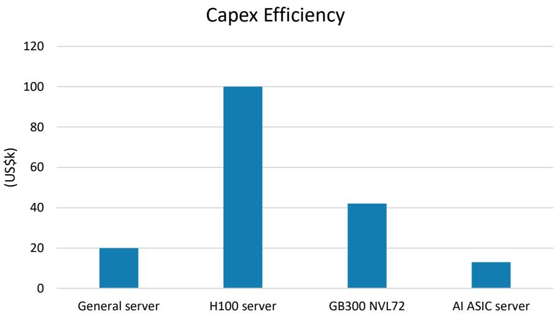
来源：公司数据，MS。注：资本支出效率定义为每一颗BMC需求对应的服务器支出金额，数值越低对信骅越有利。

信骅在4月将其2030年BMC市场空间从4650万台上调至6577万台，主要受AI相关通用服务器需求驱动。我们认为智能体AI将是这一增长的关键驱动力。通用服务器2025-2030年将保持6%的稳定增长，而AI相关通用服务器将占：1）2026年通用服务器总需求的25%；2）2027年的45%；3）2028-2030年每年20%。

从订单可见性来看，客户开始提供相当于信骅单月收入7-8倍的预测。虽然信骅无法判断是否存在重复下单，但目前出货量远超客户需求。客户还预计2027年产能同比增长一倍。

图表2：信骅预计其BMC市场空间2030年达到6570万台
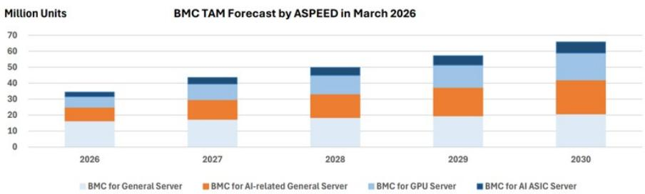
注：1）通用服务器BMC将以6%年复合增长率增长；2）AI相关通用服务器BMC预计2026年为850万颗，2027年增长45%，此后20%；3）GPU服务器和AI ASIC服务器BMC预测基于GPU和AI ASIC出货量及服务器架构；4）假设GPU服务器BMC 2027年增长45%，此后20%；5）假设AI ASIC服务器BMC 2027年增长45%，此后20%。
来源：信骅科技

图表3：信骅产品路线图
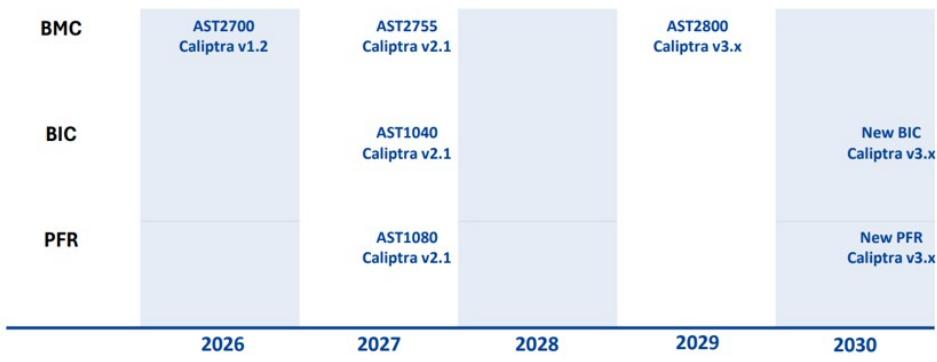
来源：信骅科技

图表4：信骅产品路线图
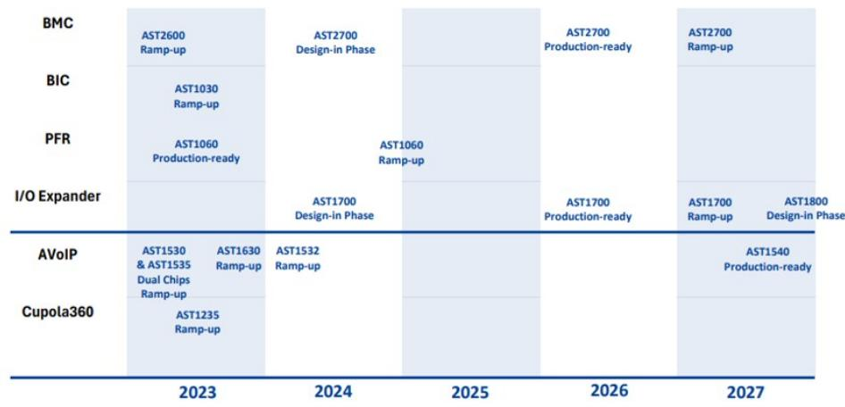
来源：信骅科技

图表5：服务器相关公司保持较高同比收入增速，但因高基数略有放缓
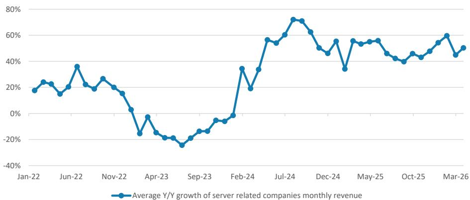
来源：公司数据，MS。注：月度收入包括信骅、纬颖、智邦、嘉泽、英业达、广达、致茂、技嘉、台积电、京元电子、AllRing、FOCI、奇鋐、双鸿、金像电、欣兴、鸿海等公司。

图表6：2025年全年处理器出口同比增长68%
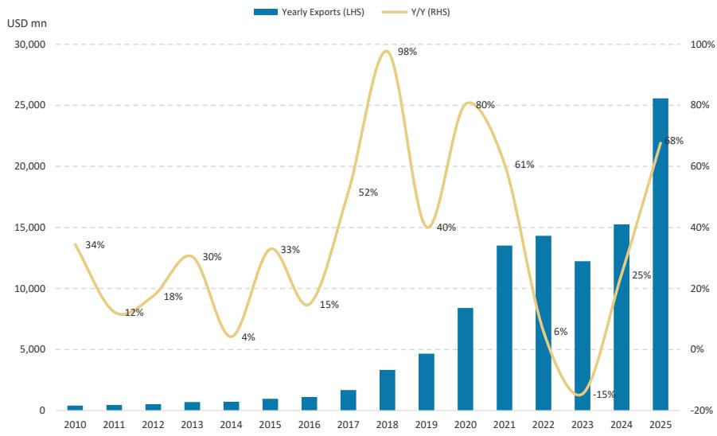
来源：国际贸易管理局，MS。

图表7：处理器出口持续强势，连续20个月同比增长
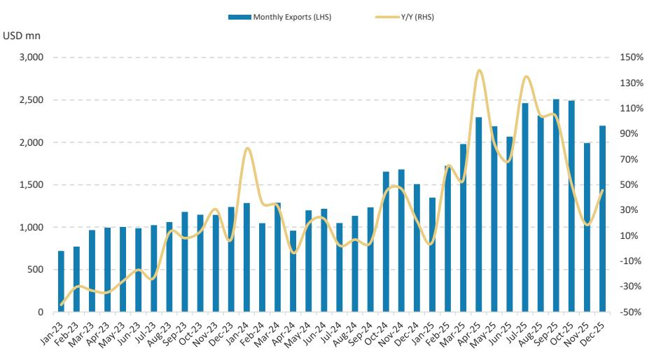
来源：国际贸易管理局，MS。

图表8：数据中心建设支出同比增长35%，而其他办公支出下降
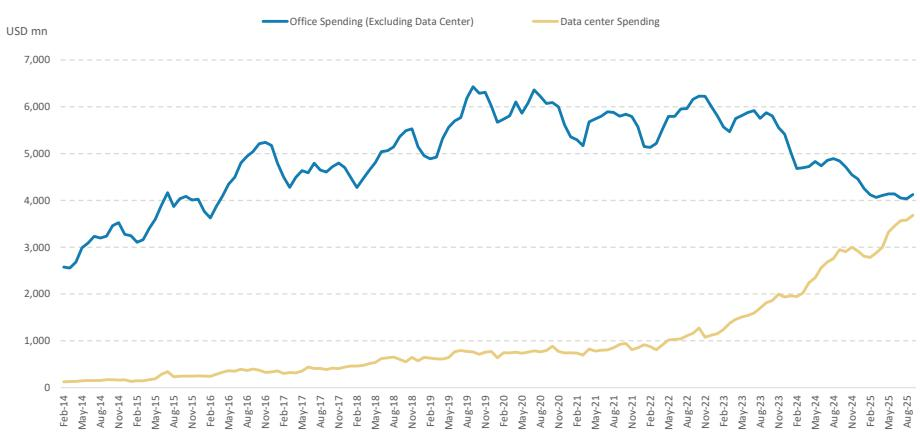
来源：美国人口普查局，MS。

图表9：2026年Q1美国云计算资本支出同比增长64%，与2025年Q3的65%同比增幅相近
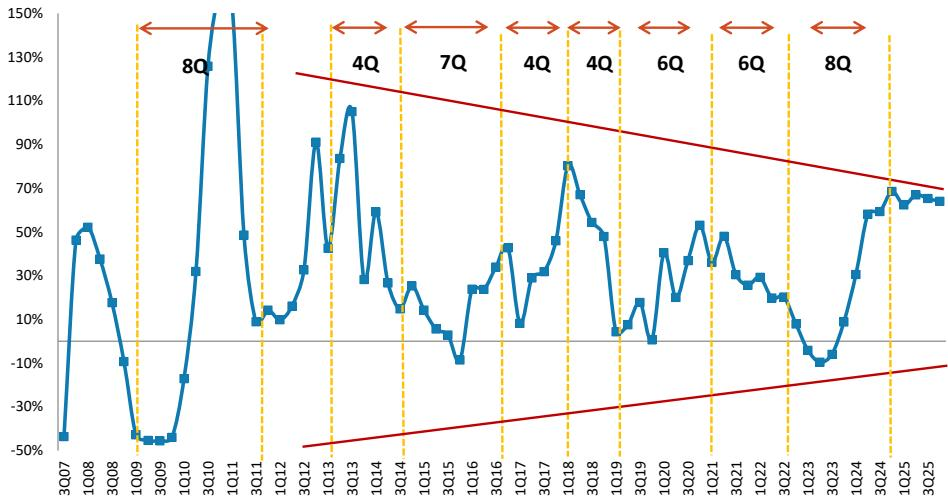
来源：公司数据，MS。美国云计算资本支出来自Alphabet、微软、亚马逊、Meta。

图表10：美国超大型厂商2026年Q1财报后，云计算资本支出追踪器显示2026年全年同比增速92%，较2026年3月底预测的87%上调5个百分点
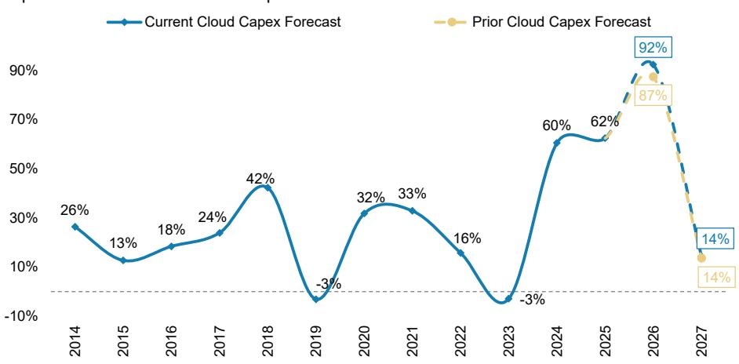
来源：公司数据，FactSet，MS。注：云计算资本支出包括Alphabet、亚马逊、微软、Meta Platforms、阿里巴巴、腾讯、百度、CoreWeave、苹果、IBM、Nebius、IREN、特斯拉和甲骨文。自2024年起纳入CoreWeave。

图表11：前14家云计算厂商2026年资本支出总额预计达到9160亿美元（MS估算），高于2025年的4760亿美元
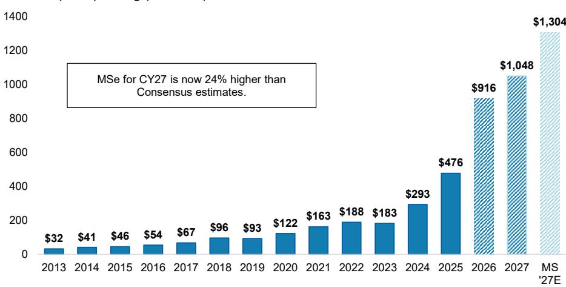
来源：FactSet，MS（E）估算。注：甲骨文预测未跟踪最新财报。

图表12：2026年云计算资本支出预期上调，整体资本密集度超过31%，创历史新高
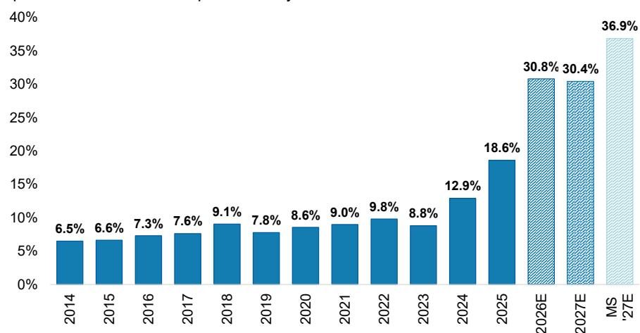
来源：FactSet，MS（E）估算。注：深蓝色柱为一致预期，浅蓝色柱为MS估算。甲骨文预测未更新。

图表13：信骅季度出货量同比与英特尔+AMD CPU出货量同比
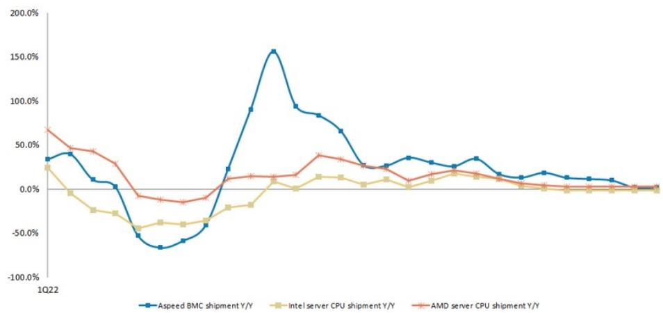
来源：公司数据，MS（E）估算。

## AI ASIC BMC市场空间评估

信骅在AI服务器中保持领先份额，包括英伟达、AMD和Trainium。谷歌TPU长期使用MCU进行远程控制。从TPUv8t（代号Sunfish）开始，鉴于更优性能，我们预计谷歌将采用信骅的AST2700 BMC控制器。结合我们对2027年CoWoS及隐含ASIC出货量的最新更新，我们估算ASIC在2026年将贡献约4%的收入，2027年约14%。

结合其他ASIC（主要是TPU、MTIA和Teton），我们预计ASIC机架在2026年和2027年将分别贡献信骅总收入的10%和21%。上行空间还来自2026年之后订单尚不确定，其他ASIC厂商（包括微软、软银/Arm、苹果、富士通）均计划在未来几年构建ASIC服务器。

因此，我们预计AI ASIC服务器将在未来几年强化信骅的增长。

图表14：评估信骅的ASIC市场空间：预计2026-2027年ASIC机架分别贡献总收入的10%和21%
（表格略，保留核心数据：2026年ASIC芯片出货量估算、BMC及BIC数量、收入贡献比例等）
来源：MS（E）估算

图表15：我们估算AWS的Trainium/Teton机架在2026年和2027年将分别贡献市场空间收入的5%和5.1%
（表格略）
来源：MS（E）估算

图表16：AWS Trainium3 UltraServer
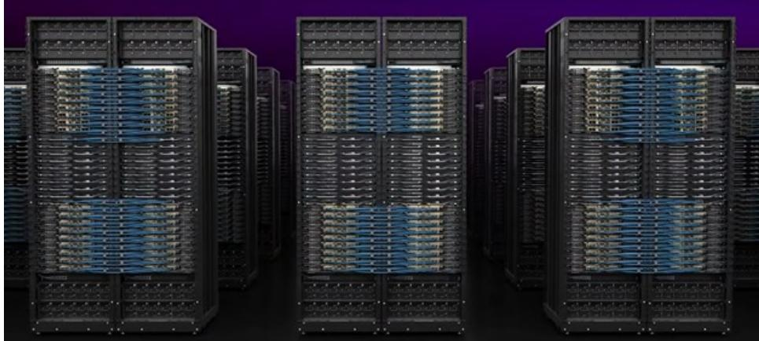
来源：AWS

图表17：AWS Trainium3 UltraServer架构
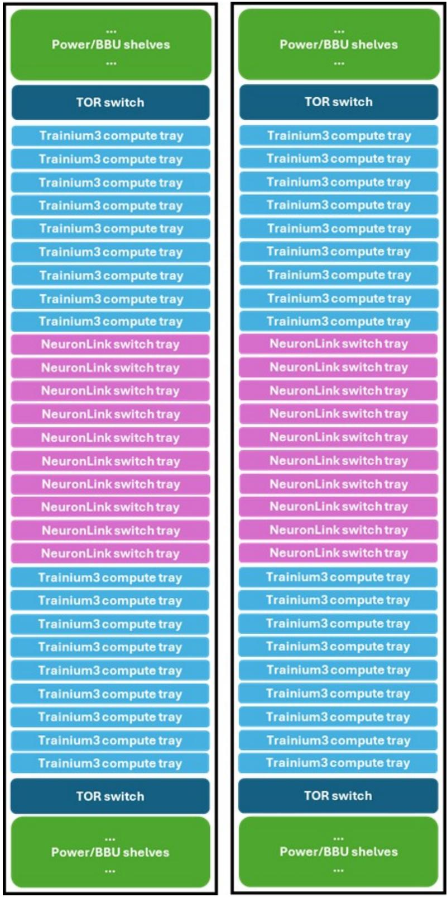
来源：AWS，MS

图表18：我们估算谷歌TPU在2026年和2027年将分别贡献市场空间总收入的4.1%和14.4%
（表格略）
来源：MS估算

图表19：我们估算Meta MTIA在2026年和2027年将分别贡献市场空间总收入的0.6%和1.6%
（表格略）
来源：MS估算

## 信骅科技：估算修订

我们下调2026年每股利润预测19%、2027年17%、2028年15%：考虑到2026年Q2初步收入，我们将2026年收入预测上调3%，但由于AST2700在2026年爬坡较慢（平均售价提升速度略慢于此前预期），利润预测下调。但我们预计AST2700在2027年将加速爬坡，因下一代CPU需求在ASIC服务器扩产背景下依然强劲。利润预测下调主要源于股票股利发放。

图表20：信骅科技：盈利预测修订
（表格略）
来源：公司数据，MS（E）估算

图表21：信骅科技：季度财务数据
（表格略）
来源：公司数据，MS（E）估算

## 信骅科技：估值方法

我们将目标价（基准情景）从新台币23,456元下调至20,888元：反映2026-2028年每股利润预测变化以及股票股利发行导致的股本变动。

主要假设不变：
- 中期增长率21.4%
- 终期增长率5.5%
- 现金分红率85%
- 权益成本9.8%（无风险利率2%，风险溢价6%，贝塔1.3）

乐观和悲观情景估值也分别从新台币28,700元和11,300元下调至25,500元和10,000元。

图表22：信骅科技：剩余收益模型
（表格略）
来源：公司数据，MS（E）估算

图表23：信骅科技：估算修正方向
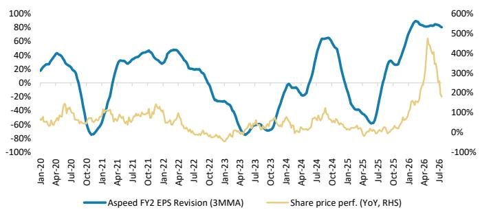
来源：公司数据，MS估算

图表24：信骅科技：前瞻市盈率
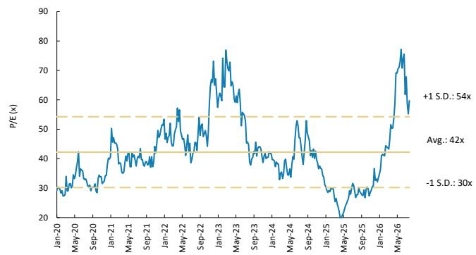
来源：公司数据，MS估算

## 风险收益分析 – 信骅科技

智能体AI对通用服务器的需求带来上行空间

## 估值参考 新台币20,888元

基准情景，剩余收益模型。关键假设：
- 权益成本9.8%（无风险利率2.0%，风险溢价6%，贝塔1.3）
- 中期增长率21.4%
- 终期增长率5.5%
- 现金分红率85%

## 一致预期目标价分布

新台币6,727.27元
来源：Refinitiv，MS

## 风险收益图

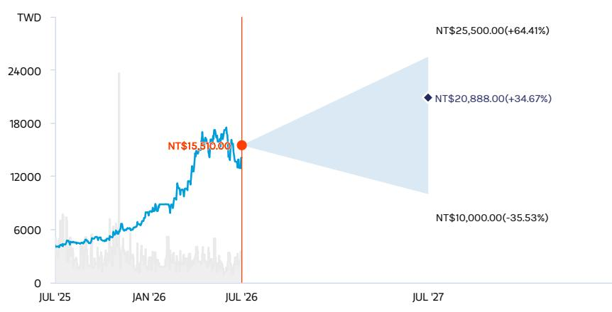
注：— 历史股价 ● 当前股价 ◆ 估值参考
来源：Refinitiv，MS

## 正面观点

- 我们看到通用服务器出货量持续上调，2026年同比增幅可能超过40%。
- 信骅目前受T-glass短缺限制出货，但公司正在认证E-glass，我们认为这有助于将月出货量扩大至200万颗以上。
- 信骅在ASIC机架中保持领先份额。谷歌TPU长期采用MCU，我们预计其下一代TPU将采用信骅的BMC，预计2027年和2028年各贡献约13%的收入。
- 我们的估值对应2027年和2028年每股利润的77倍和53倍，高于2020年以来42倍的十二个月前瞻市盈率均值，我们认为这可由需求改善和市场份额扩张所支撑。

## 风险收益主题

结构性增长：正面

## 乐观情景

新台币25,500元（对应2027年每股利润94倍）
数据中心需求旺盛，市场份额显著提升，利润率大幅扩张，新业务超预期发展：来自数据中心需求及白牌/美国服务器品牌市场份额增长带来的显著盈利增长，利润率大幅提升，新业务加速，AI服务器全面爬坡，客户新平台迁移速度快于预期。

## 基准情景

新台币20,888元（对应2027年每股利润77倍）
云/传统服务器需求恢复，仍受益于ASIC，新业务初见成效：1）2026年收入同比增长97%（2025年高增长后）；2）2026年毛利率69%（2025年68.1%），营业利润率56.4%（2025年52.2%）；3）TPU对信骅BMC需求增加，智能体AI推动通用服务器需求。

## 悲观情景

新台币10,000元（对应2027年每股利润37倍）
终端需求疲软，份额丢失，利润率承压，新业务面临挑战：数据中心需求放缓及宏观环境变化导致收入增速下降，激烈竞争带来营业利润率压力，新业务增长缓慢。

## 主要盈利驱动因素

| 驱动因素 | 2025年 | 2026年e | 2027年e | 2028年e |
|---|---|---|---|---|
| BMC收入（新台币百万元） | 8,024 | 16,433 | 23,621 | 32,204 |
| 360度SoC收入（新台币百万元） | 62 | 67 | 95 | 154 |
| PC/AV扩展IC收入（新台币百万元） | 105 | 44 | 47 | 52 |

## 投资驱动因素

- BMC市场份额扩大
- 客户云计算支出加快
- 利润率提升
- 新业务推进

## 全球收入分布

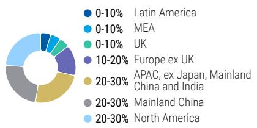
来源：MS估算

## 风险因素

上行风险：
- 云计算需求强于预期
- 规格迁移快于预期
- 竞争温和

下行风险：
- 云计算需求减弱
- 规格迁移慢于预期
- 竞争加剧
- 政策进一步收紧

## 持仓定位

来源：Refinitiv，MS

## MS估算与一致预期对比

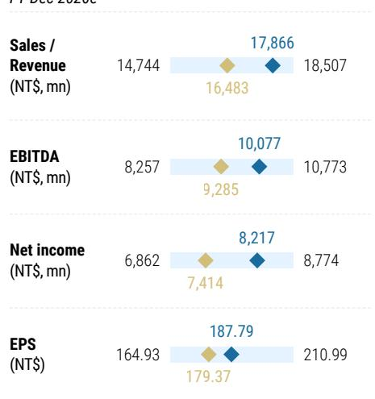
来源：Refinitiv，MS

## 信骅科技：财务摘要

（利润表、资产负债表、现金流量表、财务比率表格略）

来源：公司数据，MS（E）估算

## 估值方法与风险

## 澜起科技（688008.SS）

基准情景，剩余收益模型。关键假设：
- 权益成本8.4%（贝塔1.2，无风险利率3.0%，风险溢价4.5%）
- 分红率30%
- 中期增长率19.3%
- 终期增长率4%

我们认为这些假设合理，考虑云计算资本支出增长、DRAM接口技术迁移以及澜起在中国数据中心半导体国产化中的强势地位。

上行风险：
- 美国同行退出快于预期
- 规格迁移快于预期

下行风险：
- 云计算需求弱于预期
- DRAM接口技术迁移慢于预期
- 新产品推出延迟
