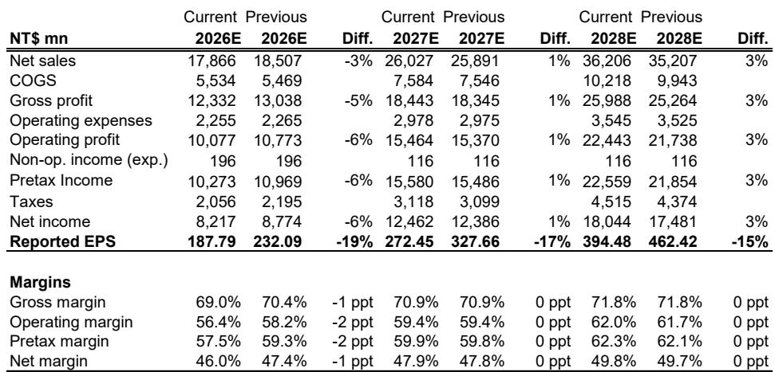
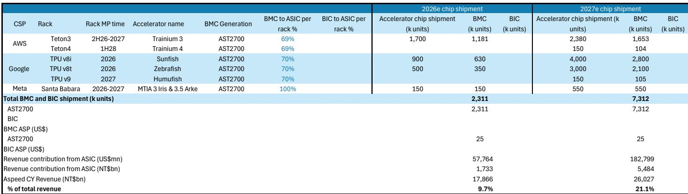
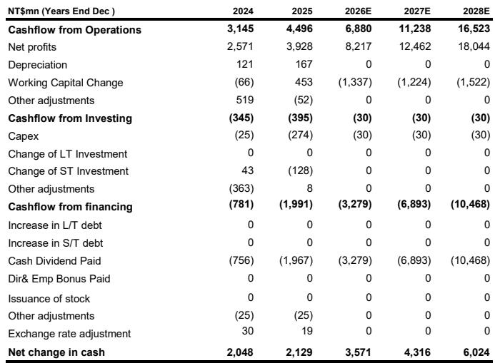

# MS：云端半导体业务与近期数据观察

一份基于上海世界人工智能大会实地调研和云端资本支出追踪的研究笔记，对云端半导体市场给出了一个清晰的判断：CPU与GPU服务器市场总量在2027年前将持续扩张，而非见顶。MS分析师在7月17日至20日的WAIC行程中观察到，无论是中国还是美国供应商，CPU服务器需求都在上升，而GPU服务器则在2027年迎来更多元化的扩展方案。

报告的核心论据并非来自单一产品线，而是来自两条并行且相互强化的增长曲线。

**1. CPU服务器在中国市场出现超预期增长**

在WAIC现场，AMD的多核优势、英伟达Vera的捆绑销售策略，以及海光信息在政策支持和性能追赶上的进展，都在吸引越来越多的订单。中国高端x86 CPU报价同比已接近弹性较高。这一现象的背景是，通用服务器在2025至2030年间保持6%的稳定增长，而AI相关的通用服务器将在2026年占到总需求的25%，2027年升至45%。

> **KC评论：** 市场此前更多关注GPU的算力扩张，但CPU作为智能体AI的中央协调器，其需求弹性被低估。报告特别指出，通用服务器和AI ASIC服务器在超大规模数据中心资本支出中产生的BMC效率最高，这意味着CPU服务器增长对信骅科技等BMC供应商的收入拉动作用可能比GPU更直接。

**2. GPU服务器正从单机架走向超级吊舱架构**

几乎每家国产GPU厂商都在WAIC上展示了多卡或百卡级别的扩展系统。中国AI GPU在芯片层面受限于晶圆产能，但厂商正试图通过将更多GPU互联来弥补单芯片性能差距。英伟达在2027年也可能推出更多样化的机架方案，超级吊舱——通过光学互联将多个机架连接成一个扩展集群——被认为是潜在方向之一。Kimi K3在展会上也强调了英伟达GPU在训练中的重要性。

**3. AI ASIC服务器正成为BMC供应商的第二增长曲线**

报告详细拆解了信骅科技在AI ASIC领域的市场空间。AWS的Trainium 3、谷歌的TPU v8i和v8t、Meta的MTIA 3，这些定制芯片服务器将从2026年开始批量采用信骅的AST2700 BMC控制器。谷歌TPU此前长期使用MCU进行远程控制，但从TPU v8t开始转向AST2700，这是一个重要的客户突破。

报告估算，ASIC机架在2026年和2027年将分别贡献信骅总营收的10%和21%。其中谷歌TPU的贡献最为显著，从2026年的4.1%跃升至2027年的14.4%。微软、软银/Arm、苹果和富士通等公司也计划在未来几年建设ASIC服务器，这为后续增长提供了额外空间。

**4. 产品规格迁移支撑毛利率维持高位**

云端半导体供应商将从高性能服务器需求驱动的规格迁移中受益。新解决方案的毛利率通常高于上一代产品——例如AST2700 BMC、带软件功能的旧款BMC以及DDR5 Gen 3接口——这有助于抵消来自封测代工厂的成本上升不确定性。报告认为，信骅在CPU服务器BMC市场约70%的份额，以及向AST2700的迁移，将带来40-50%的平均售价提升，同时有望在戴尔和谷歌等客户中扩大份额。

**5. 云端资本支出仍在加速，而非减速**

报告追踪的前14家云端供应商2026年资本支出合计预计达到9160亿美元，较2025年的4760亿美元大幅增长。2026年同比增长率从3月底预测的87%进一步上修至92%。数据中心建设支出同比增长35%，而其他办公类支出则在下降。处理器出口已连续20个月保持同比增长。这些数据共同指向一个结论：云端基础设施研究周期尚未进入后半段。

报告认为，即将到来的云端资本支出数据发布可能出现有意义的向上修正，主要来自内存领域，但也会为云端半导体公司带来积极信号。

For informational purposes only. Portions may be generated,translated,summarized,or edited with AI assistance based on source materials and may contain omissions or errors. Please verify independently. This is not investment,legal,tax,accounting,or other professional advice.

