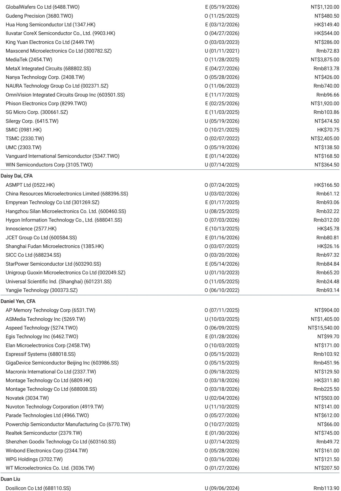
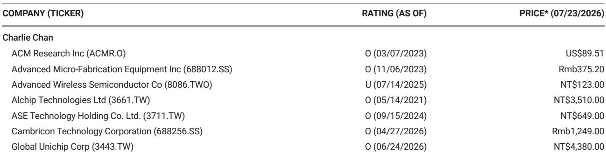
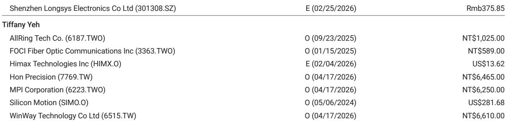

# Alphabet资本支出规划延伸至2027年：近期AI建设放缓的讨论或需重新审视，半导体供应链格局持续演变

Alphabet在2026年第二季度的资本支出达到449亿美元，这一数字同比接近弹性较高，环比增长26%。该数据于公司7月23日的信息交流中公布，其对AI基础设施投入的指向性比任何分析调研或读者日活动中的预测都更为明确。同一时间，公司将其2026年全年资本支出指引从1800-1900亿美元上调至1950-2050亿美元，并明确表示2027财年已确定有显著增长。对于过去大半年一直在讨论超大规模企业AI支出是否会趋于平稳的观察者而言，这是目前最清晰的信号——建设正在加速，而非放缓。

其影响远不止于Alphabet自身的资产负债表。公司关于其张量处理单元（TPU）商业化、定制Axion CPU的推进以及技术基础设施支出构成的阐述，共同描绘了一个多年期投入周期，这一周期直接支撑着广泛的半导体及服务器供应链企业。2026年上半年主导市场的一种担忧——即超大规模企业为追求效率而可能导致AI基础设施支出见顶并收缩——如今看来为时过早。Alphabet不仅投入更多资金，还在更广泛的芯片解决方案上投入，为晶圆代工、封装、测试服务和专用芯片设计商创造了多个需求来源。

这并非关于某一家公司业绩表现的故事，而是一个关于云AI投入持久性以及计算架构演变的结构性声明。

## 2026年2000亿美元资本支出下限确认：AI基础设施需求仍受供给约束，而非需求不足

Alphabet信息交流中最关键的一句话是：AI算力仍然紧张。这一表述直接反驳了2026年主流的一种观点：超大规模企业很快将拥有足够算力，并开始理性化支出。Alphabet的实际行动则讲述了另一版本。第二季度449亿美元的资本支出意味着，若保持该节奏，全年支出将趋近新指引范围的上限。同比100%的增长率并非单季异常，它反映的是由Google Cloud客户及Alphabet内部业务需求所驱动的计算部署的刻意加速。

支出的构成与规模同样重要。Alphabet披露，技术基础设施支出大致按60%用于服务器、40%用于数据中心和网络进行划分。这一比例表明，公司并非仅仅购买更多同类设备，而是在同步扩大物理数据中心规模，并用日益密集的计算集群填充这些设施。网络部分占基础设施预算的40%，意味着互连带宽和数据中心网络在总成本中的比重正在上升，这一趋势有利于那些供应高速网络芯片和光学组件的企业。

管理层明确表示2027财年资本支出将显著增加，消除了对中期轨迹的含糊之处。自由现金流将持续承压，但Alphabet传递的信号是：它视AI基础设施为竞争必需，而非可自由支配的投入。对半导体供应链而言，这意味着先进逻辑、高带宽存储器、先进封装和服务器组件的订单簿至少到2027年可能保持饱满。整个2026年一直压制半导体估值的超大规模企业采购突然回撤风险，在这次信息发布后已实质降低。

## TPU商业化：2027年将为半导体供应链创造新的需求曲线

Alphabet在2026年第二季度首次确认了向客户数据中心交付TPU系统所带来的收入。这对定制芯片生态而言是一个关键节点。多年来，超大规模企业设计自有AI加速器主要用于内部用途。Alphabet决定对外提供TPU系统，使其从纯粹的商用芯片消费者转变为定制计算的供应商。第二季度的收入确认仅占合同销售额的一小部分，绝大部分将于2027年实现。

这一时间点具有战略意义。到2027年，TPU将经历多代发展，Alphabet与台积电的制造合作关系也将更为成熟。TPU系统的外部供应将取决于客户需求、行业约束以及Alphabet自身的内部AI需求，但方向是明确的。Alphabet正在构建一项第三方计算业务，至少在一定程度上与英伟达在AI加速器领域的主导地位形成竞争。这为云客户和企业AI用户创造了第二供应来源，进而扩大了先进封装、高带宽存储器和服务器组装服务的整体可寻址市场。

对半导体供应链而言，TPU的上量意味着台积电不仅受益于其先进制程节点的持续高利用率，还受益于整合TPU芯片与内存及网络小芯片所需的CoWoS等先进封装技术日益增长的复杂性。ASE和KYEC作为领先的封装和测试服务提供商，将因TPU产量规模扩大而看到新增需求。测试接口领域的专业公司，如MPI和Winway，直接参与伴随新芯片平台进入量产阶段的产品验证和生产测试周期。Aspeed提供管理服务器基础设施的基板管理控制器，其受益于任何服务器数量的扩张，无论这些服务器使用英伟达GPU、Alphabet TPU还是两者兼有。

## Axion CPU每美元性能提升30%：定制Arm服务器处理器将重塑采购格局

Alphabet披露，其新的面向智能代理优化的Axion CPU，每美元性能比同级别产品高出约30%。这并非边际改善，而是定制Arm服务器处理器价值主张的阶跃变化，对服务器CPU市场的竞争态势有直接影响。Axion CPU专为云原生工作负载和AI智能体推理设计，而这正是超大规模数据中心中增长最快的工作负载类型。

Axion的每美元性能优势为Alphabet创造了最大化部署的经济动力。每颗替代商用x86或Arm服务器处理器的Axion CPU，都能降低Alphabet在特定工作负载上的总计算成本。这一动力将加速Alphabet内部向定制芯片的转移，并可能影响其他超大规模企业的采购策略。联发科已被确认为Axion CPU的设计合作伙伴，直接受益于生产量的提升。台积电在先进制程上制造Axion CPU，从而获得额外的晶圆启动量。

更深层的影响是，服务器CPU市场正在分化。单一主导架构的时代正让位于多架构环境，超大规模企业为其特定工作负载设计自有处理器。这种分化从两个角度惠及半导体供应链：首先，它增加了进入量产阶段的独特芯片设计总数，推动了设计服务、掩模组和测试基础设施的需求；其次，它降低了所有超大规模企业依赖单一商用供应商所存在的集中度风险。像Aspeed这样提供独立于主处理器架构运行的管理与控制芯片的公司，对哪种CPU胜出并不敏感——每台服务器都需要基板管理控制器，而Aspeed在该领域的领先地位使其受益于任何服务器数量的增长。

## 多年投入周期与芯片多样化：为布局半导体价值链提供决策框架

Alphabet信息交流中的信息直接转化为面向云半导体供应链的结构化研究框架。该框架包含三个维度：持续时间、芯片多样性和基础设施构成。

在持续时间上，2027年资本支出显著增长的明确指引将投入周期延伸至超出多数模型假设的范围。对超大规模企业资本支出的一般担忧是其遵循两年周期：重仓投入后进入消化期。Alphabet现在释放的信号是最少三年周期，2025年至2027年均显示同比增长。这一延长的周期有利于那些收入模式与服务器基础设施相关联的企业，例如Aspeed，因为即使新增速率波动，服务器的安装基数仍持续增长。

在芯片多样性上，TPU和Axion同时上量，加上继续采购英伟达加速器，意味着供应链服务于多个芯片架构。这种多样性降低了单一产品周期波动拖累整个生态系统的风险。台积电受益于所有三种架构；ASE和KYEC受益于三者各自的封装与测试需求；测试接口公司MPI和Winway受益于每种新芯片变体的验证周期；Hon Precision作为服务器组装与测试服务提供商，受益于实际部署的服务器系统数量。

在基础设施构成上，服务器与数据中心网络6:4的支出比例意味着网络和互连在总支出中的占比正在提高。这有利于供应高速网络芯片、光模块和数据中心交换基础设施的企业，也有利于提供日益密集计算集群所需热管理和电源解决方案的企业。

该框架指向一个清晰结论：对投入周期持续时间、芯片架构多样性以及网络基础设施占比提升暴露程度最高的企业，最有可能在2027年之前实现持续增长。而依赖单一产品周期或单一客户的企业，则更容易受到产品过渡间隙或采购变动的影响。

## 供应链受益者不限于知名企业：专业利基厂商在结构性支出变迁中获取超比例敞口

一份全球研究银行报告列出的Alphabet信息交流受益企业名单包括台积电、ASE、联发科、KYEC、Aspeed、MPI、Winway和Hon Precision。这份名单具有启发性，因为它涵盖了从晶圆代工到测试再到服务器组装的整条价值链。每家公司捕捉到支出变迁的不同维度。

台积电受益于TPU、Axion CPU以及可能的英伟达加速器的制造，均采用先进制程。该公司是超大规模企业定制芯片趋势的最大单一受益者，因为它是相对少见能够提供这些设计所需的领先制程技术和先进封装的晶圆代工厂。ASE和KYEC受益于封装和测试服务——随着芯片设计转向小芯片和异构集成，这些服务变得更加复杂且更具价值。联发科受益于其在Axion上的设计合作，以及与其他超大规模企业开展更多定制芯片项目的潜力。

专业公司值得特别关注。Aspeed在基板管理控制器市场占据主导份额。每台服务器，无论其处理器架构如何，都需要BMC来管理电源、散热和系统健康。Aspeed的收入是服务器出货量的函数，而非取决于哪种CPU或加速器胜出。延长的资本支出周期直接支撑Aspeed的增长轨迹，因为它意味着随时间推移更大的服务器安装基数。MPI和Winway为每个进入量产的新芯片设计提供测试接口解决方案。随着超大规模企业定制芯片的增加，独特芯片设计的数量上升，对探针卡、测试插座和老化板的需求也成比例增长。Hon Precision提供服务器组装和测试服务，捕获实际部署的系统数量。

这些公司的共同点在于，它们受益于结构性趋势而非周期性产品周期。超大规模企业转向定制芯片的趋势不会逆转；芯片封装日益复杂化的趋势不会减弱；数据中心网络密度不断提升的趋势不会放缓。这些是多年期的长期趋势，而提供这些趋势所需基础设施的企业，其收入可见性远远超出任何单一产品世代。

*本文仅供信息参考。部分内容可能基于源材料通过AI辅助生成、翻译、摘要或编辑，可能存在遗漏或错误。请独立核实。本文不构成任何专业建议。*

本文仅供信息参考。部分内容可能基于源材料通过AI辅助生成、翻译、摘要或编辑，可能存在遗漏或错误。请独立核实。本文不构成任何专业建议。

