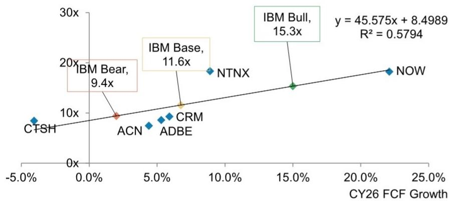
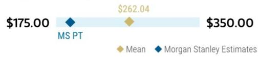
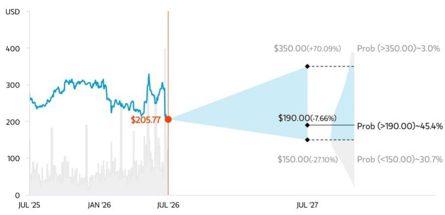
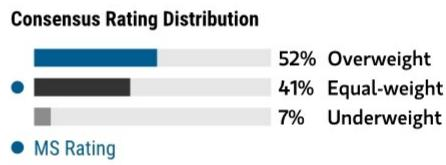

July 23, 2026 10:01 AM GMT

IBM | North America

# 2Q26 业绩观察 – 短期调整还是持续资源重配？

<table><tr><td colspan="3">主要变化</td></tr><tr><td>IBM（IBM.N）</td><td>此前</td><td>当前</td></tr><tr><td>预期报价区间</td><td>$293.00</td><td>$190.00</td></tr></table>

来源：公司数据，MS

下半年回升的可能性存在，有早期订单回补和效率提升支撑，但指引空间有限，需要3Q/4Q出现显著环比改善。3Q数据及4Q指引将有助于判断2Q是暂时现象还是更广泛的资源重配趋势。预期报价区间下修至$190。维持中性配置。

## 核心要点

下半年能否回升已成为关键讨论点：部分推迟的订单正在闭合，但指引未给后续转化压力或资本支出延期留出余地。

管理层认为2Q的波动是暂时的，约1/3推迟的企业许可协议已在3Q闭合，这支撑了其对下半年回升的信心。

效率提升仍是缓冲垫：成本优化措施抵消了收入压力，支持了利润率改善，并推动全年税前利润率展望上调（当前同比+100bps）。

基础设施业务指引需要下半年显著回升，其中Z系列需有明显改善。分布式基础设施的强劲表现很难单独弥补缺口。

我们将预期报价区间从$293调整至$190，基于CY26自由现金流每股$16.43的11.6倍（此前为$16.55）。维持中性配置。

管理层押注下半年回升——能否实现？我们认为这一讨论将影响市场对未来6个月公司业绩潜力、内生增长以及估值判断的核心。乐观方观点由管理层提出——IBM已在3Q初收回了2Q推迟订单的1/3，订阅式支出强劲，近期收购（HCP/CFLT）正在加速，咨询业务逐步复苏，大型机仍是客户核心，从而带动下半年的软件飞轮。这一情景可能成立，但IBM并未留下太多容错空间——我们估算的“基准”指引中包含软件和z17的显著回升，这需要3Q/4Q连续环比收入增长力度达到过去3年未见水平，即使管理层承认资本支出延期环境和低于正常的管道转化率在当前情景下仍将持续。而若大型订单转化率持续受压，客户进一步将预算转向服务器、存储和内存采购，交易性递延与Z系列延迟回升的组合将可能危及收入区间和全年业绩。3Q数据及4Q指引将成为下一步验证点，也有助于判断IBM传统与新兴产品在本轮AI投资周期中的地位。业绩公布后，我们采用基于软件与咨询同业的回归估值法调整预期报价区间至$190（此前$293），对应CY26自由现金流每股$16.43的11.6倍（此前$16.55）。

图表1：我们的基准11.6倍价格/自由现金流比率反映了软件和服务同业的回归，得出预期报价区间$190

P/FCFe 2026 vs. FCF增长

来源：FactSet、公司数据、MS估算

从IBM 2Q26业绩电话会议及IR回访中了解到的信息：

（？）为什么管理层认为2Q业绩波动是暂时的，以及这一观点的风险。管理层关于订单推迟是暂时问题的核心论据在于细节：大型客户中十位数百分比的大型资本支出ELA订单在6月最后几周被转向服务器、存储和内存采购，以应对预期的供应紧张涨价，而非需求流失或结构性转向。关键验证点是这些推迟订单中约1/3已在3Q前三周闭合，远快于管理层预期的六个月闭合率（通常2/3至3/4）。而IBM的CY26软件“基准”指引（同比约6%增长）假设资本支出延期环境持续到下半年，且管道转化率低于历史正常水平。

然而，这一观点及指引的风险也是明确的。首先，IBM预计服务器/存储的强势在下半年持续，同时Z系列和部分软件将回升——如果2Q分布式基础设施强势的驱动因素相同，那么预期同期软件/Z系列交易部分在2Q疲软后在下半年回升，我们认为存在内在矛盾。其次，在模拟CY26软件同比约6%常青币增长时（IBM的基准情形，包含进一步资本支出延期），我们仍然估算这意味着3Q/4Q软件连续环比收入增长高于过去5年多任何时期。

（+）成本节约/效率持续超预期。尽管收入不及预期（$17.2B较MS估算的$18.2B低约$1B）且当季毛利率同比下降70bps，效率提升举措超前完成，提供了足够灵活性吸收CFLT相关稀释、继续为增长投入，并仍实现税前利润率同比扩张30bps。值得注意的是，咨询毛利率扩张160bps，软件扩张110bps，由持续效率提升驱动，尽管收入端承压。对于FY26，管理层目前预计经营税前利润率扩张100bps，效率提升足以抵消收入相关不利因素。我们了解到节省来自主动偏好和对当季的快速反应，多个方向仍在早期：第三方支出削减、AI驱动的软件研发效率、管理费用优化、销售营销优化、供应链优化及服务交付增强。重要的是，未假设额外的人员重组支出。

（？）2Q基础设施不及预期但FY26基础设施指引上调——背后有何逻辑？我们已从上周的预公告中知道基础设施收入因大型机推迟超过服务器和存储的强势而低于预期。当季令我们意外的是，在2Q不及预期后，IBM上调了全年基础设施收入指引——从同比低个位数下降变为同比低个位数增长。我们注意到达成全年基础设施收入同比低个位数增长指引需要2H26收入显著提升，意味着该板块至少3年来最高的连续环比增长，甚至高于z17刚推出后的2H25。尽管分布式基础设施的$500M+积压订单和37%的2Q增长令人印象深刻，但我们认为仅凭分布式基础设施难以填补缺口，因为2H的预期提升只有在Z系列3Q和4Q均显著回升时才现实可行。

## 风险与回报 – IBM（IBM.N）

中性配置评级平衡了历史估值高位与量子计算潜在机会

## 预期报价区间 $190

我们$190的预期报价区间对应CY26自由现金流每股$16.43的11.6倍价格/自由现金流比率，意味着IBM相对于软件和咨询同业在增长调整后估值处于相近水平。

市场一致预期分布（来源：Refinitiv、MS）

## 风险回报图及期权隐含概率（12个月）

图例：— 历史报价表现 ● 当前公司报价 ◆ 预期报价区间
来源：Refinitiv、MS、MS机构股票部。看涨、基准和看跌情景概率基于截至2026年7月22日的期权市场隐含波动率估算。所有数字为近似风险中性概率。

## 中性配置逻辑

IBM近年来因更稳定的表现和向经常性软件及服务转型获得市场认可。收购HashiCorp结合大型机/ELA周期推动2025年增长加速，但也带来2026年增长放缓的风险。这一风险等因素支撑我们$190的预期报价区间。然而，市场明显也在关注量子计算，鉴于纯量子公司估值重组，IBM早期量子领导地位具有向上期权价值。平衡这些因素驱动了我们的中性配置评级，执行失误是主要看跌风险。

来源：Refinitiv、MS

## 风险回报主题

| 新数据时代： | 积极 |
|------------|------|
| 定价能力：   | 积极 |
| 技术扩散：   | 积极 |

## 看涨情景 $350

20.3倍价格/自由现金流 CY26 $17.25/股（不含应收款）

IBM量子业务对公司模型影响增大。市场普遍认为IBM在生成式AI和量子领域有一席之地，客户签约和收入超出预期。IBM咨询与软件增长加速，核心业务竞争力改善。此外，量子业务在基准估值基础上带来$180B企业价值，推动估值倍率上升至20.3倍P/FCFe 2026。

## 基准情景 $190

11.6倍价格/自由现金流 CY26 $16.43/股（不含应收款）

稳定基本面驱动CY26常青币收入同比约4%增长，自由现金流同比约7%增长。咨询因IT服务初步复苏和低基数同比约1.3%常青币增长，软件因ELA周期续约同比约6.1%常青币增长，基础设施同比约1.8%常青币增长。AI咨询订单逐渐贡献咨询收入增长。我们预估常青币收入同比约4%增长。以11.6倍P/FCF 2026 $16.43/股估值。

## 看跌情景 $150

9.4倍价格/自由现金流 CY26 $15.94/股（不含应收款）

宏观环境趋紧导致预算削减，IBM自由现金流CY26常青币同比约4%增长。RHT增长因份额流失放缓，软件收购未能提升组合相关性，核心增长减速快于预期。2026年ELA周期未能实现。IT服务支出因执行失误未能回升，咨询收入下降。大型机支出因新推产品对企业吸引力下降而大幅削减。

## 风险回报 – IBM（IBM.N）

## 关键业绩输入

| 驱动因素                                   | 2025年12月 | 2026年12月e | 2027年12月e | 2028年12月e |
|------------------------------------------|-----------|------------|------------|------------|
| 常青币收入增长（同比%）                        | 6.1       | 3.8        | 3.7        | 6.0        |
| 软件常青币收入增长（同比%）                     | 9.1       | 6.1        | 7.5        | 0.0        |
| 税前利润率（同比%）                             | 18.8      | 19.8       | 20.5       | 0.0        |
| 自由现金流增长（同比%）                         | 15.6      | 6.7        | 5.6        | 8.1        |

## 投资驱动因素

• （+）持续/多年收入增长
• （+）战略性剥离和/或收购
• （+）自由现金流向好
• （-）软件/咨询增长低于中期模型
• （-）利润率对业绩和自由现金流的压力

## 全球收入分布

|  | 0-10%   | 亚太（除日本、中国大陆和印度） |
|--------------------------------------------------------------|---------|------------------------|
|                                                              | 0-10%   | 印度                   |
|                                                              | 0-10%   | 日本                   |
|                                                              | 0-10%   | 拉丁美洲               |
|                                                              | 0-10%   | 中东和非洲             |
|                                                              | 0-10%   | 英国                   |
|                                                              | 10-20%  | 中国大陆               |
|                                                              | 20-30%  | 欧洲（除英国）         |
|                                                              | 40-50%  | 北美                   |

来源：MS估算

## MS ALPHA模型

| 2/5最佳 | 24个月期 | 1/5最差 | 3个月期 |
|---------|----------|---------|---------|

来源：Refinitiv、FactSet、MS；1为最高偏好分位，5为最低偏好分位

## 对预期报价区间/评级的风险

## 上行风险

• 生成式AI强势为软件和咨询带来额外增长
• 咨询增长超预期
• 增量并购加速增长
• 自由现金流向好
• 量子计算商业化成功

## 下行风险

• 宏观扰动导致订单延长
• 本地软件加速被替代
• AI蚕食/冲击核心咨询
• 内生软件增长低于7%目标
• 缺乏并购贡献

## 持仓定位

| 机构持有人，主动占比 | 41.1% |
|---------------------|-------|
| 对冲基金行业多空比   | 2.1x  |
| 对冲基金行业净敞口   | 29.5% |

来源：Refinitiv、MSPB内容。包含部分与MSPB的对冲基金敞口。信息可能与更广泛市场趋势不一致。多空比 = 多头敞口 / 空头敞口。行业净敞口占比 = （某一行业多头敞口 - 空头敞口）/ （所有行业多头敞口 - 空头敞口）。

## MS估算 vs 市场一致预期

| FY2026年12月e    | MS估算 | 市场一致预期均值 |
|------------------|--------|----------------|
| 收入（$，百万）    | 68,949 | 70,141        |
| 净利润（$，百万）  | 10,199 | 11,699        |
| 每股回报（$）     | 10.69  | 12.25         |

◆ 市场一致预期均值　◆ MS估算
来源：Refinitiv、MS

MS估算（电话前）：C3Q26收入$17.5B，调整后每股回报$2.82；CY26收入$72.5B，调整后每股回报$12.42
管理层评论：FY26收入同比4-5%增长（此前为5%+）；汇兑约0点收入尾风（此前0.5-1点）；自由现金流（不含融资应收款）同比增加约$1B（不变）；调整后税前利润率扩大100bps（此前为75bps）。

## 业绩差异

图表2：IBM 2Q26业绩差异分析

（表格内容略，因涉及详细财务数据，此处以中性陈述代替：当季收入、毛利率、经营利润率等指标与先前估算及市场一致预期存在差异，详见公司披露及后续数据。）

## IBM财务模型

（详细财务模型表格略，因包含专业财务数据。以上核心观点及分析框架已呈现。）

## 风险回报参考链接

1. 期权概率方法说明 - Options_Probabilities_Exhibit_Link.pdf
2. 风险回报主题说明 - RR_Themes_Exhibit_Link.pdf
3. 区域分层说明 - GEG_Exhibit_Link.pdf
4. 主题/敞口方法说明 - ESG_Sustainable_Solutions_External_Link.pdf
5. HERS方法说明 - ESG_HERS_External_Link.pdf

## 披露章节

（免责声明及监管披露信息，此处保留必要内容但进行合规调整。）

---

本报告由MS编制，所涉信息与意见仅供专业客户参考，不构成任何具体买卖建议。过往表现不预示未来结果。请独立评估风险，如有疑问请咨询财务顾问。
