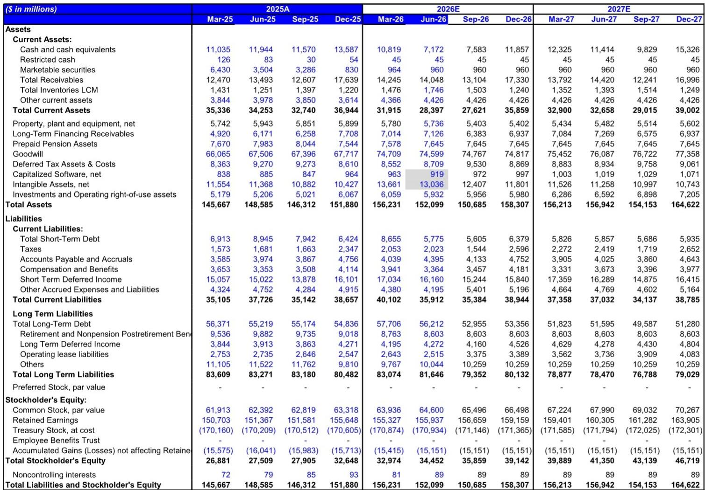
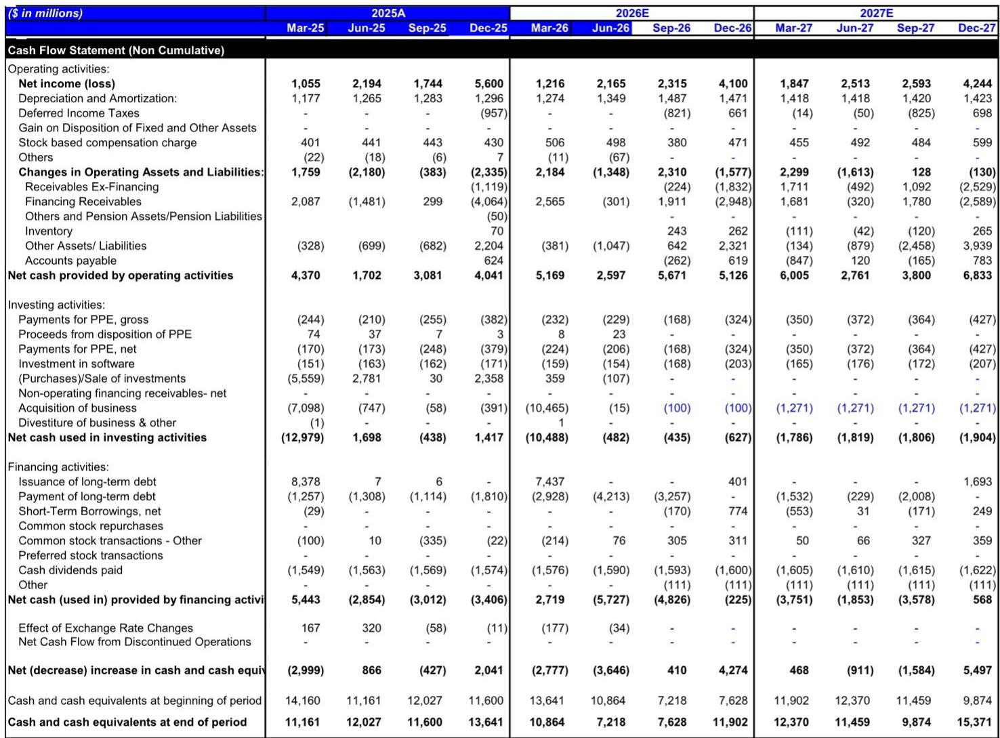
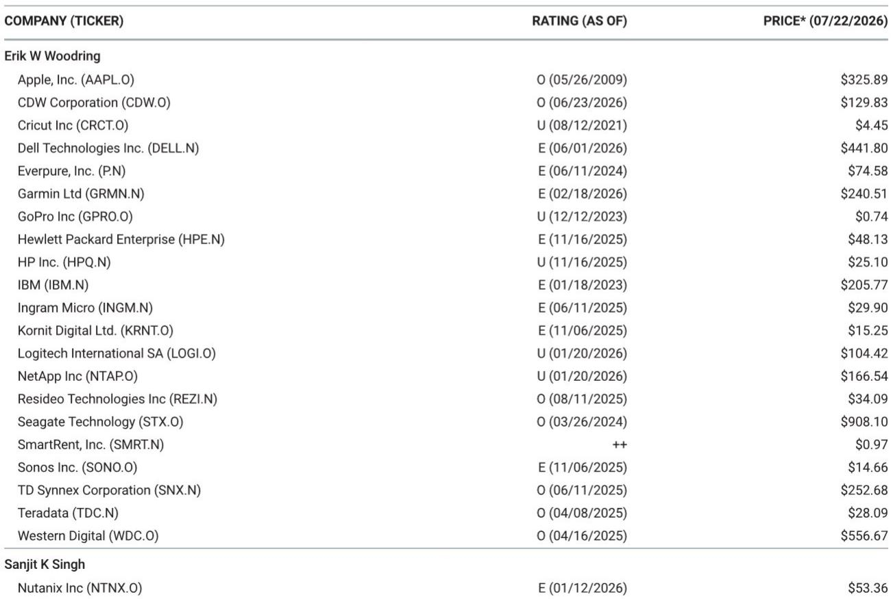

# IBM 2Q26 营收变化：暂时性调整还是长期资源重配？三季报将给出答案

7月22日，IBM公司报价收于205.77美元，较52周高点332.41美元有所回落。导火索是2Q26财务数据低于市场预估——当季营收为172亿美元，与市场预期的182亿美元存在约10亿美元的差距。但市场更关注的是其背后结构性问题：大型企业客户究竟是暂时推迟与IBM的交易签约，还是在AI基础设施建设的背景下，将预算永久性地从IBM平台转向服务器、存储和内存？

管理层的回答是明确的：暂时性。他们引用的证据是，2Q延迟的企业许可协议（ELA）中，约有三分之一已在3Q前三周内完成签署，远快于通常的六个月恢复窗口。然而，公司对下半年的展望要求较高的完成度。IBM全年指引意味着下半年营收需要实现超过过去三年任何时期的环比增长。这一矛盾——一个看似合理的恢复叙事与一个数学上要求极高的指引路径之间的张力——是当前市场观察者面临的核心问题。

这不仅关乎IBM是否是一家有持续经营能力的公司，更关乎在客户支出行为受AI投资周期影响的时期，营收增长的速度和形态。答案将决定IBM当前估值（约为未来自由现金流11.6倍）是否合理。

## “暂时性”论点有具体证据，但基础指引假设风险持续

管理层认为2Q疲软是时间问题而非需求问题的核心论据，建立在具体机制之上：几位大客户在6月最后几周将低两位数数量的大型资本支出ELA交易转向了服务器、存储和内存的采购。原因并非对IBM平台失去信心，而是战术性购买决策——客户在预期供应紧张导致价格上涨之前加速了硬件购买。也就是说，同一笔资金花在了不同科目上。

证据是完成率。管理层报告称，这些延迟的ELA中约有三分之一已在3Q前三周内签署，明显快于通常的六个月周期内完成三分之二到四分之三的预期。如果这一模式持续，2Q的营收缺口将转化为3Q的推动力，下半年回升叙事的可信度将增强。

然而，基础指引中嵌入了一个关键假设，使情况变得复杂。IBM对2026全年的软件业务按固定汇率计算同比增长6%的指引，明确假设资本支出延迟环境持续到下半年。渠道转化率预计仍低于历史均值。这不是一个“回归正常”的情景，而是一个阻力持续、但公司通过大量交易活动实现明显加速的情景。

风险是清晰的：如果2Q分布式基础设施（服务器、存储、内存）的强势驱动因素与管理层预期下半年持续的因素相同，那么2Q疲软的软件和大型主机的交易性部分突然恢复在逻辑上不一致。将资金从软件推开的预算动态必须在7月逆转。这有可能，但需要客户行为发生管理层尚未观察到的变化。

## 下半年隐含的营收增长在过去五年没有先例

量化挑战是明显的。如果以管理层基础假设——2026全年软件业务固定汇率同比增长6%（已包含进一步资本支出延迟）——来建模，那么3Q和4Q所需的美元营收环比增长将超过过去任何五年期间的任何时期。这不是边际加速，而是阶跃变化。

软件是IBM最大且利润最高的业务板块，也与导致2Q不及预期的ELA周期关系最直接。要实现全年指引，下半年软件营收必须以自疫情以来IBM从未展现过的速度增长。即使三分之一完成率扩展到整个延迟交易组，数学上仍要求新交易量也加速。管理层并未提供管道生成改善的证据。

基础设施板块的矛盾更为突出。尽管2Q因大型主机延迟而出现缺口，IBM却将全年基础设施营收指引从低个位数下滑上调至低个位数增长。实现这一目标需要下半年基础设施营收实现该板块至少三年未见的最高的美元环比增长——甚至高于z17大型主机发布后的2H25增长。

分布式基础设施积压订单超过5亿美元，创纪录，2Q增长37%。这令人印象深刻，但还不够。隐含的下半年增长只有在z17大型主机在3Q和4Q都有显著回升时才可能实现。仅靠分布式基础设施无法弥补缺口。作为IBM软件飞轮结构驱动因素的大型主机周期必须重新加速。这相当于对一个单一产品周期内客户行为的二元博弈。

## 生产力是防止指引下调的缓冲，但无法创造营收

2Q相对少见明确的积极信号是成本执行。尽管营收缺口达10亿美元，毛利率同比下滑70个基点，IBM的税前利润率仍扩大了30个基点。咨询业务利润率扩大160个基点，软件利润率扩大110个基点。生产力行动既有主动性也有应对性，多个项目仍处于早期阶段：第三方支出削减、AI驱动的软件开发效率、G&A优化、销售与市场效率、供应链优化以及增强的服务交付。

管理层现在预计全年营业税前利润率将扩大100个基点，高于此前75个基点的目标。没有新增的劳动力再平衡费用。生产力故事是真实的，并且是结构性的。IBM已展示出通过成本纪律抵消营收逆风的能力。

但生产力有天花板。它可以在营收持平或小幅增长的环境中保护每股收益，但无法创造实现当前指引所需的营收增长。如果下半年营收增长不及预期，生产力将缓冲对盈利的影响，但无法阻止向下修正。问题是还有多少缓冲空间。如果营收缺口为2-3%，生产力可以吸收；如果达到5%或更多，利润率将压缩，全年盈利能力将面临风险。

## 决策框架：三季报和四季度指引中需要关注的指标

2Q26财报为市场观察者提供了一个清晰的决策框架，包含三个先行指标。第一个是剩余三分之二延迟ELA的完成率。如果在3Q末观察到的前三周快速完成模式扩展到整个组，暂时性论点将获得有力支持。如果完成率回落到历史六个月的节奏，则资源重新配置论点的可能性增大。

第二个指标是3Q大型主机营收。z17周期是IBM软件附加和经常性收入模式的结构性引擎。如果大型主机营收恢复到正常周期的水平，下半年基础设施增长将变得合理。如果保持平稳或下滑，分布式基础设施的强势将不足以填补指引缺口。

第三个指标是咨询业务营收增长。咨询业务一直是拖累，但管理层提到了下半年的积极信号和低基数。如果咨询业务恢复正增长，达到同比1-2%的水平，将支持更广泛的回升叙事。如果保持平稳或下滑，则表明企业IT支出整体正从服务领域重新配置。

三季报和四季度指引将解答这一争议。如果指标一致，当前自由现金流11.6倍的估值与正常化后的IBM盈利能力相比可能具有吸引力。如果指标未能吻合，长期资源重新配置的偏负面前景——以及进一步估值压缩至9-10倍的风险——将成为基础情景。

*仅供参考。部分内容可能基于源材料通过AI辅助生成、翻译、摘要或编辑，可能存在遗漏或错误。请独立核实。本文不构成任何专业建议。*

仅供参考。部分内容可能基于源材料通过AI辅助生成、翻译、摘要或编辑，可能存在遗漏或错误。请独立核实。本文不构成任何专业建议。

