# G10 货币策略

## 欧洲央行进一步加息或将支撑欧元走强

市场通常认为，利率上升往往能对货币形成支撑；而当政策收紧到足以影响运行态势的程度，或者利率上升传递出财政风险的信号时，货币则可能面临调整。当前欧元区并不符合后两种情况。我们认为，欧洲央行进一步收紧政策将对欧元产生积极影响。

### 核心要点

- 利率上升通常有利于货币走强，除非其信号表明政策将损害运行环境，或引发对公共债务可持续性的担忧。
- 在政策转向收紧之后，货币可能阶段性表现偏弱，但这种回调通常存在滞后，且往往先经历一段走强过程。不同周期的表现差异较大。
- 目前市场尚未将欧洲央行定价为深度收紧状态：德国1年期与5y5y远期利率的利差为-78个基点，短期利率仍低于长期名义水平。
- 近几个季度，欧元随欧洲利率上升而走强，这与英国和日本曾出现的财政风险模式不同。
- 欧元面临的主要变量仍是欧元区边缘国家的分化。如果OAT-Bund与BTP-Bund利差扩大，可能意味着市场开始定价欧元区财政风险。

请点击此处加入本邮件分发列表。

2026年Extel全球固定收益调查现已开放，您的参与对我们非常重要。如果您认为我们的研究有价值，恳请在以下类别给予支持（请点击此处获取投票链接）：
• 美国 | 发达欧洲 | 日本 > 货币与外汇
• 全球 > 宏观策略

研究机构与报告中所涉及的公司存在或寻求业务关系。因此，读者应知悉该机构可能存在影响其研究客观性的利益冲突。读者应将本报告视为其决策的单一参考因素之一。

关于分析师认证及其他重要披露，请参见报告末尾的披露章节。

分析师由非美国关联公司雇佣，未在FINRA注册，可能非会员关联人员，且不受FINRA关于与标的公司沟通、公开露面及持有研究分析师账户中证券交易等限制的约束。

---

# 货币与外汇

## G10 | 欧洲央行进一步加息或将支撑欧元走强

| 研究机构 | 分析师 | 联系方式 |
| --- | --- | --- |
| 某机构 | 分析师A | 电话/邮箱 |
| 某机构 | 分析师B | 电话/邮箱 |
| 某机构 | 分析师C | 电话/邮箱 |
| 某机构 | 分析师D | 电话/邮箱 |

国内利率上升通常对货币有利，但利率上升的原因至关重要：

- 当利率因增长预期、政策利率或长期回报预期改善而上升时，国内资产吸引力增强，货币通常走强。
- 短期利率上升还会提高外国读者的套期保值成本，若读者选择降低对冲比例，货币也可能走强。

然而，当利率上升反映的是经济或财政风险而非预期回报改善时，这种关系可能逆转。

我们重点关注在当前G10讨论中最相关的两种可能使利率上升导致货币走弱的情形：

- 政策收紧到足以显著损害运行环境时；
- 利率上升加剧对公共债务可持续性的担忧时。

图表1显示，过去20年间，货币与短期利差的相关性总体为正。商品出口型、风险敏感型货币（如澳元、挪威克朗）对利率的敏感度通常低于日元，后者的历史利率长期低于G10平均水平（图表2）。

**图表1：过去20年货币与短期利差的相关性总体为正**  
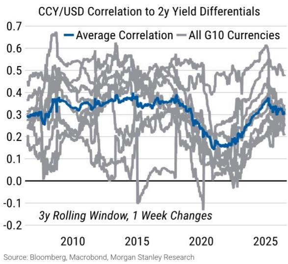

**图表2：日元是G10中对利率最敏感的货币；澳元和挪威克朗敏感度最低**  
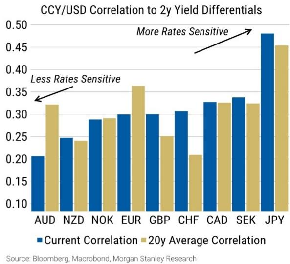  
来源：Bloomberg，Macrobond，研究机构

货币与长期利率的相关性总体也为正，但波动更大（图表3）。日元与长期利差的相关性历史上较高（图表4），但近几个月有所下降。

**图表3：长期利率的相关性也为正，但随时间变化更大**  
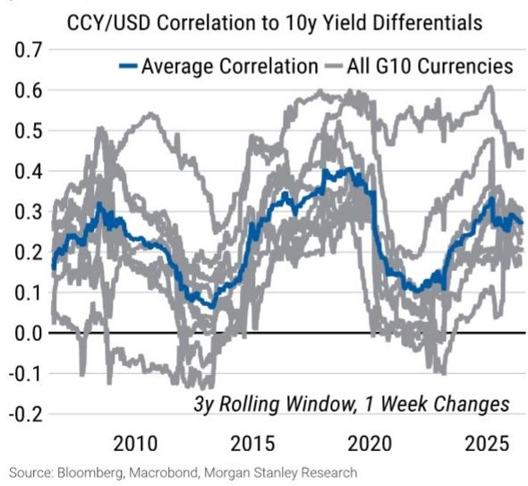

**图表4：日元再次成为与长期利差相关性较强的货币**  
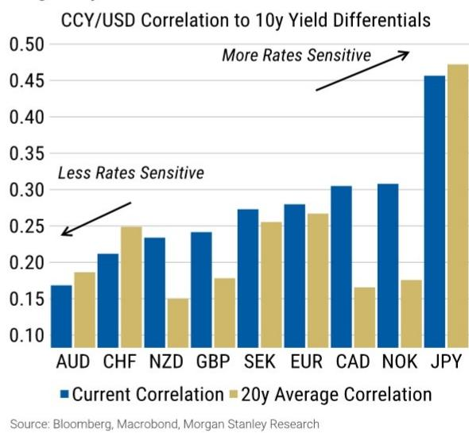

近几周，这些相关性引发市场关注，读者在讨论欧洲央行进一步收紧是否有利于欧元。

有观点认为，若进一步加息加剧市场对欧元区运行前景的担忧，欧元可能走弱。这一担忧本质上是情绪层面的：即鹰派欧洲央行可能在实际影响出现之前就改变市场预期。我们对这一担忧进行了可量化的检验：观察历史上市场定价收紧是否伴随或后续出现货币走弱。

### 传导路径一：运行放缓

相对收紧的政策立场与货币未来的阶段性偏弱相关。图表5显示了央行处于收紧状态后的一个月至十二个月内G10货币的后续表现。

我们使用当地1年期利率与5y5y远期利率的利差来衡量市场隐含的政策收紧程度。

- 1年期利率反映短期政策利率预期；
- 5y5y远期利率提供中性利率的市场代理（即市场预期当前周期结束后政策将回归的水平）。

因此，显著的正利差（1年期利率高于5y5y远期利率）表明当前政策相对于市场的长期预期处于收紧状态。该指标不完美，因为5y5y远期利率也包含期限溢价，但提供了一致的、基于市场的跨国和跨期比较。

货币在政策深度收紧后表现往往偏弱，但影响存在滞后且不同周期差异较大。

- 收紧程度越大，后续平均偏弱幅度越大；
- 应谨慎解读结果，因为长期收紧周期会产生重叠的月度数据。

例如，当央行收紧程度至少为0.5个百分点时，后续三个月内货币相对于G10平均对美元表现落后约0.3%（n=230）。

- 收紧程度至少1.0个百分点时，落后幅度扩大（从-0.3%到-0.4%，n=96）。收紧程度至少1.5个百分点时，货币三个月落后0.9%，十二个月落后2.5%（n=36）。
- 我们还提供了近15年（2011-2026）的同期数据以供参考。

政策收紧后货币偏弱可能有多种解释，包括：

- 回报表现曲线倒挂（1年期利率 > 5y5y远期利率）通常意味着市场定价未来12个月内将降息，随着降息实施，货币走弱。
- 政策收紧减缓了国内运行环境，抑制资本流入，导致货币走弱。

**图表5：政策收紧后货币表现偏弱**

|  | 收紧程度 | 后续货币相对对美元的平均表现 |  |  |  |  |
| --- | --- | --- | --- | --- | --- | --- |
|  |  | 1个月 | 3个月 | 6个月 | 12个月 | 观察数 |
| 1995-2026 | >0.0 | 0.0% | -0.1% | -0.4% | -0.6% | 425 |
|  | >0.5 | 0.0% | -0.3% | -0.6% | -1.1% | 230 |
|  | >1.0 | -0.1% | -0.4% | -0.7% | -0.5% | 96 |
|  | >1.5 | -0.3% | -0.9% | -2.2% | -2.5% | 36 |
| 2011-2026 | >0.0 | 0.1% | 0.1% | 0.1% | 0.4% | 187 |
|  | >0.5 | 0.0% | -0.2% | -0.1% | 0.2% | 99 |
|  | >1.0 | 0.0% | -0.2% | -0.4% | -0.4% | 26 |
|  | >1.5 | 0.0% | -0.3% | -0.8% | -0.8% | 7 |

来源：Bloomberg，Macrobond，研究机构

**图表6：政策收紧前货币表现偏强**

|  | 收紧程度 | 此前货币相对对美元的平均表现 |  |  |  |  |
| --- | --- | --- | --- | --- | --- | --- |
|  |  | 1个月 | 3个月 | 6个月 | 12个月 | 观察数 |
| 1995-2026 | >0.0 | 0.0% | 0.2% | 0.4% | 0.8% | 425 |
|  | >0.5 | 0.0% | 0.1% | 0.4% | 1.2% | 230 |
|  | >1.0 | 0.1% | 0.1% | 0.3% | 1.0% | 96 |
|  | >1.5 | 0.1% | 0.9% | 0.4% | 0.4% | 36 |
| 2011-2026 | >0.0 | 0.1% | 0.2% | 0.5% | 0.8% | 187 |
|  | >0.5 | 0.0% | 0.2% | 0.5% | 1.2% | 99 |
|  | >1.0 | 0.1% | 0.1% | 0.4% | 2.2% | 26 |
|  | >1.5 | -0.2% | -0.2% | 0.7% | -0.3% | 7 |

来源：Bloomberg，Macrobond，研究机构

另一方面，我们发现货币在收紧前的几个月内表现优于G10平均水平。图表6展示了图表5的逆过程，即收紧前一段时期的相对表现。

上述简化方法的一个问题是，长期收紧周期会在图表5和图表6中产生多个重叠数据。为消除重复，图表7展示了在13个月周期内，1年期与5y5y远期利差首次达到至少100个基点倒挂前后货币的相对表现。

平均而言，央行加息进入收紧阶段时货币走强（平均相对表现+3.7%），随后12个月表现偏弱（平均-0.8%）。

然而，不同周期差异显著。大部分后续偏弱表现主要源自新西兰的两次周期：1997年11月和2005年12月之后的一年。

**图表7：100个基点收紧周期前后货币相对表现**

| 收紧月份 | 货币 | 此前12个月 | 之后12个月 |
| --- | --- | --- | --- |
| 2023年12月 | CAD | 2.2% | -0.6% |
| 2023年7月 | CHF | 8.0% | 2.1% |
| 2023年7月 | EUR | 7.2% | -0.7% |
| 2023年7月 | GBP | 5.7% | 1.1% |
| 2023年5月 | NZD | -0.6% | -0.5% |
| 2022年11月 | CAD | 7.0% | -2.4% |
| 2005年12月 | NZD | 6.9% | -10.5% |
| 2000年12月 | GBP | 0.3% | 0.5% |
| 1999年11月 | GBP | -0.2% | 2.5% |
| 1998年2月 | GBP | 7.7% | -0.6% |
| 1997年11月 | NZD | -2.7% | -13.3% |
| 1996年7月 | NZD | 4.2% | 6.2% |
| 1995年4月 | NZD | 2.2% | 6.4% |
| 平均： | 3.7% | -0.8% |

来源：Bloomberg，Macrobond，研究机构

**图表8：新西兰央行提高短期利率，同时长期利率预期下行**  
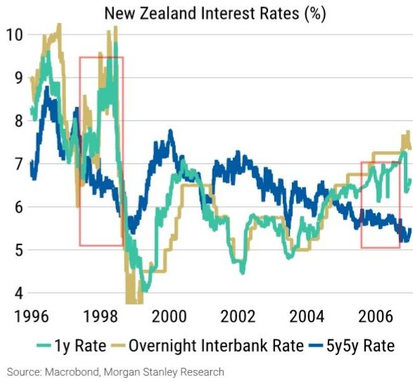

在这两次周期中，新西兰央行在运行风险浮现且长期利率预期下行的背景下仍收紧政策（图表8）。

1997年的收紧部分源于新西兰元走弱。当时，新西兰央行采用货币状况指数框架，当货币走弱时提高政策利率（该框架被一位知名学者称为“显著偏离国际最佳实践”）。这一触发机制与收紧前12个月新西兰元明显走弱（-2.7%）相符，偏离了收紧前货币通常走强的模式。

在这两次周期中，政策收紧程度对新西兰元和新西兰的运行环境均产生影响（图表9）。图表10显示，新西兰的运行环境在这两个时期均至少出现一个季度的收缩。

**图表9：新西兰元随1年期与5y5y远期利差进入收紧区域而走弱**  
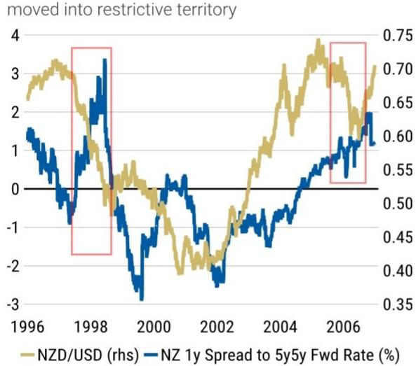  
来源：Macrobond，研究机构  
**图表10：两次收紧周期后新西兰运行环境均出现收缩**  
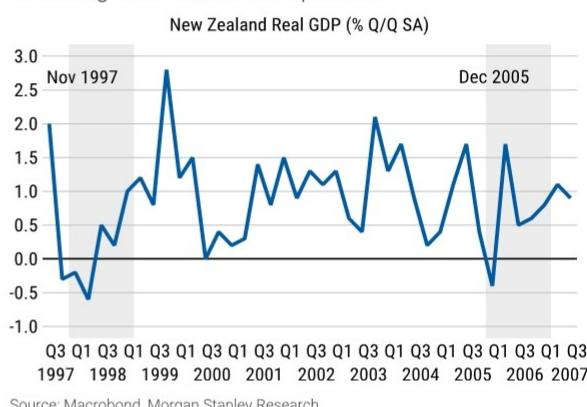  
来源：Macrobond，研究机构

总体而言，从政策收紧对货币影响的回顾中可得出以下要点：

- 央行加息进入深度收紧阶段时，货币通常走强——即使国内运行环境最终受到影响。
- 随后随着运行环境放缓，货币平均表现偏弱。在收紧达到约100个基点后的6-12个月内，货币通常落后。剔除重复周期后，收紧后12个月平均表现为-0.8%，尽管该均值受新西兰元在非传统政策框架下的较大波动影响。我们将这一模式理解为：深度收紧后货币获得的支持减弱，而非必然走弱。

### 传导路径二：债务可持续性担忧

当利率上升加剧对公共债务可持续性的担忧时，也可能导致货币走弱。

这一路径主要通过当前和预期的未来实际债务服务成本发挥作用。当公共债务存量及服务成本预期增速超过名义GDP时，市场担忧上升。

利率上升具有两种竞争效应。一方面，它提高读者可获得的回报；另一方面，它增加政府预期的利息负担。

当公共债务已经较高、债务到期较快或大量债务与通胀挂钩时，第二种效应可能占主导。读者可能认为政府最终将需要增税、削减支出、容忍更高通胀或依赖央行支持。

这些结果均可能对货币造成压力。财政紧缩可能拖累运行环境，而通胀或央行融资可能降低国内资产的预期实际回报。

近年来，债务可持续性担忧在英国和日本最为明显。

在英国，政府债务服务成本占GDP的比例相对较高（图表11）。大量的通胀挂钩债务意味着通胀上升可能较快提高政府利息成本。

在日本，债务服务支付相对于经济规模较为温和，但读者更关注未来债务服务成本的路径。

公共持有的日本国债约占GDP的94%，与其他G10经济体相比并不显著偏离。然而，潜在的新增发行量加上日本央行持续缩表，引发了市场关注。一些读者认为，随着政府债务再融资，通胀和国债回报表现上升可能显著增加利息支出。

**图表11：意大利和英国的债务服务成本占GDP比例最高**  
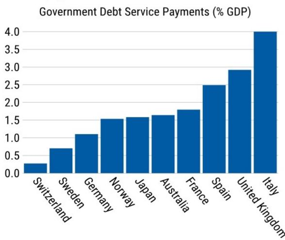  
来源：Macrobond，研究机构

**图表12：公共持有的日本国债占GDP比例随日本央行缩表而上升（按持有者划分的日本国债存量占GDP比例）**  
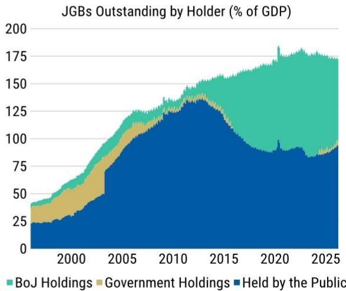  
■ 日本央行持有 ■ 政府持有 ■ 公共持有  
来源：Macrobond，研究机构

尽管我们认为日元走弱的主要原因是市场普遍认为日本央行滞后于曲线（尤其是与其他被认为接近中性政策的主要央行相比），但财政可持续性担忧可能导致长期利率与货币之间出现负相关。利率上升不再吸引资本流入，反而成为财政风险的信号。

近年来，英镑与英国-欧元区长期OIS利差出现过较长时间的反向关系，日元也与外国-日本长期OIS利差呈现反向（图表13和图表14）。在这些时期，利率上升与本国货币走弱相伴。

图表13和图表14使用相同纵轴刻度以方便比较。

**图表13：近年来英镑与英国-欧元区长期利差呈反向关系**  
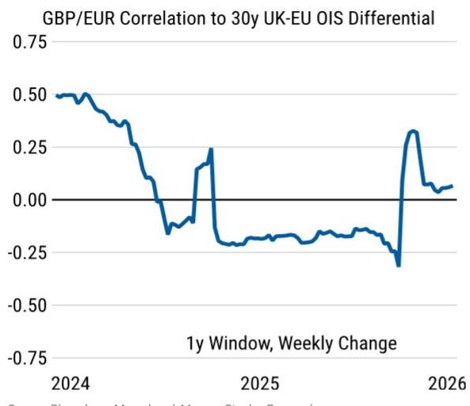  
来源：Bloomberg，Macrobond，研究机构

**图表14：近年来日元与外国-日本长期利差也曾出现反向关系**  
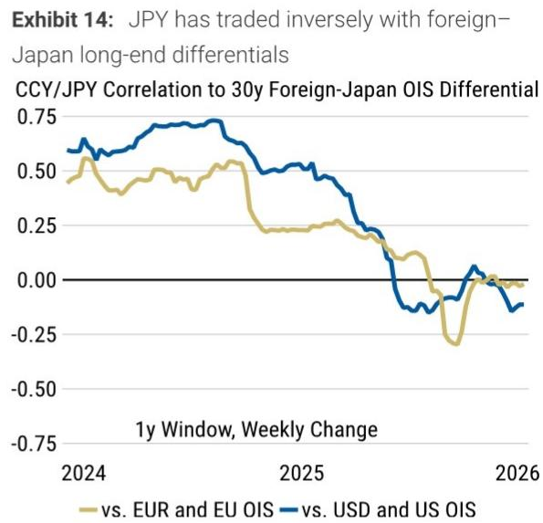  
来源：Bloomberg，Macrobond，研究机构

负相关不一定意味着每次利率或汇率变动均由财政担忧驱动。然而，持续的负相关可能表明读者将利率上升视为风险补偿，而非增长改善或预期回报提高的证据。

### 传导路径在欧元区的应用

我们认为这两种传导路径目前均不适用于欧元区。因此，我们不认为欧洲央行进一步收紧会削弱欧元。

关于第一条传导路径：欧元区回报表现曲线并未显示欧洲央行已收紧到足以对货币产生负面影响的程度。G10中只有挪威的1年期利率高于5y5y远期利率；德国利差为-78个基点（图表15）。

挪威的市场隐含收紧程度虽然为正，但幅度温和，可能不会对挪威克朗构成重大威胁。历史上，当1年期利率超过5y5y远期利率时，货币平均仅温和偏弱。

需要注意的是，向上倾斜的曲线可能因期限溢价而放大。如果较大的期限溢价扭曲了市场对中性利率的定价信号，1年期与5y5y远期利差可能为负，即使央行被认为处于收紧状态。

一个调整因素：如果按我们估计的德国10年期期限溢价约128个基点进行调整（参见Bloomberg代码MSDETP10 Index），短期与长期定价之间的利差表明欧洲央行可能更接近中性，或轻微收紧，而非原始-78个基点所暗示的水平。

扣除此溢价后，德国1年期利率约比估计的中性利率高出50个基点（-78bp + ~128bp ≈ +50bp）。我们不会对此精确数值过度依赖：10年期期限溢价并不完全适用于5y5y远期，且合适数值存在不确定性。

此外，调整后欧洲央行收紧程度约50个基点，位于图表5阈值区间的低端，远低于历史上与显著货币走弱相关的约100-150个基点。在如此温和的收紧水平下，历史数据几乎未显示可靠的偏弱表现（尤其是2011年后的样本），且任何可能出现的走弱也需6-12个月才显现。

**图表15：G10中只有挪威的1年期与5y5y远期利差为正**  
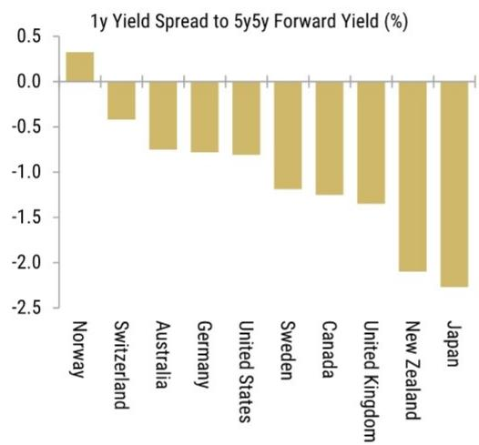  
来源：Bloomberg，Macrobond，研究机构

**图表16：欧元区利率与欧元走势呈正相关**  
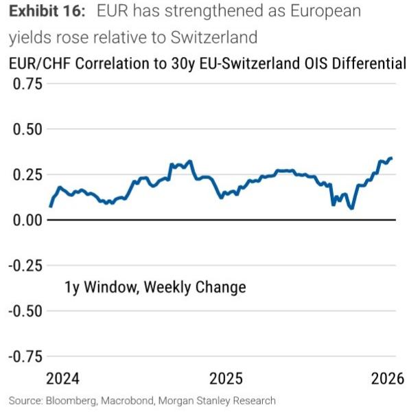

关于第二条传导路径：欧元区近期未观察到利率与汇率的负面关系。欧元通常随欧洲利率上升而走强（图表16）。

图表16比较了欧元/瑞郎与欧洲-瑞士利差。瑞士提供了一个有用的参照，因为读者通常不担心瑞士的公共债务可持续性，因此关系变化应主要反映欧元区情况。

如图表11所示，德国和法国的债务服务成本相对可控，西班牙和意大利的债务服务成本占GDP比例略高。

但如前期讨论，我们不认为欧洲利率上升源于扩张性财政政策、供给增加或信用恶化，并预计欧盟财政规则将随时间激励政府避免财政松弛。我们的经济学家指出，意大利历史上保持基本盈余（2015-19年平均约占GDP 1.5%），并在扩张期后持续恢复盈余。西班牙近期状况有所改善，赤字从2024年的3.2%降至2025年的约2.4%，使得债务比率降至100%以下。

边缘国家分化仍是欧洲央行收紧将支持欧元这一观点面临的最明显风险。我们关注OAT-Bund和BTP-Bund利差，若其扩大，可能意味着市场开始将财政风险定价到利率中，届时不利的利率-汇率传导渠道才会显现。

总体而言，从债务可持续性担忧的回顾中可得出以下要点：

- 当利率上升导致债务服务成本增速快于预期投资回报时，可能削弱货币。当读者担忧名义增长将不及政府利息负担时，货币可能走弱。
- 英国和日本曾出现这种不利的利率-汇率关系。目前我们未在欧元区看到类似迹象，且预计短期内不会改变。

因此，我们预期欧洲央行进一步收紧将提振欧元，原因如下：

- 如上所述，央行的收紧政策可能削弱货币，但在加息进入收紧阶段时，货币通常走强，走弱随后到来。
- 这种走弱具有滞后性，通常在收紧达到某个程度后的6-12个月出现。
- 即便调整期限溢价，欧洲央行隐含的收紧程度也较为温和，远低于该指标通常与显著走弱相关的约100-150个基点。
- 即便欧洲央行进一步收紧，历史模式也显示欧元将在收紧过程中走强（符合我们的预期），任何走弱将在6-12个月后而非当前定价中体现。
