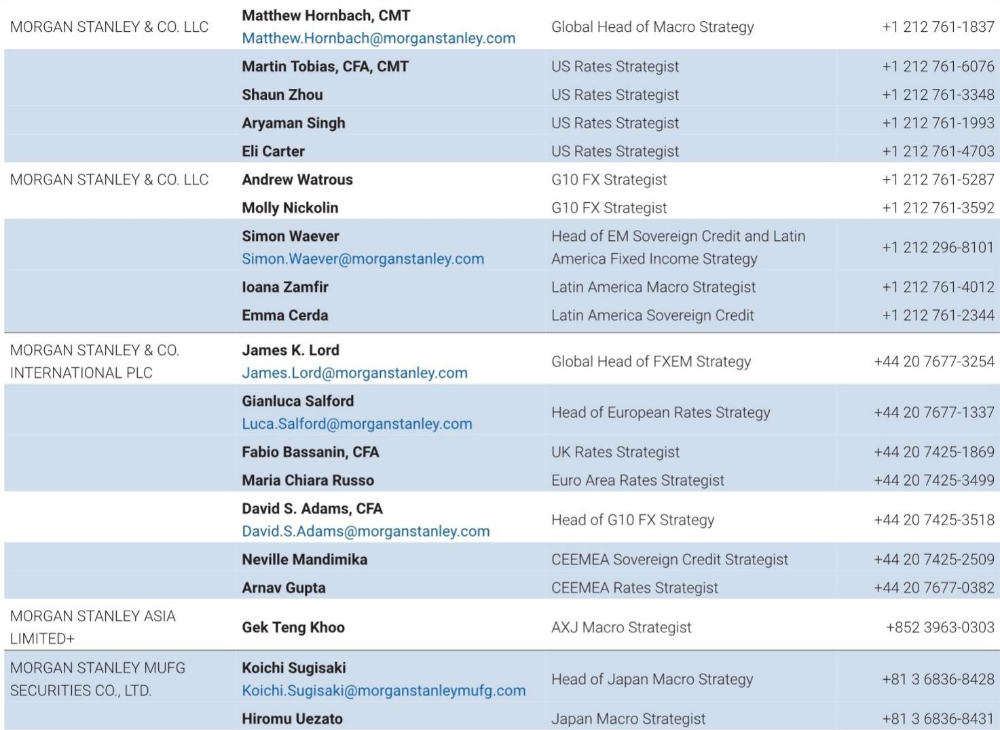
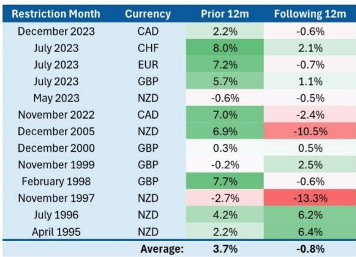
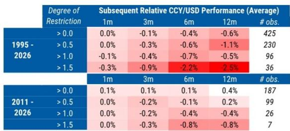

# 更高的欧洲央行利率将强化欧元，而非削弱它——因为市场并未定价足够紧缩的政策以引发货币损伤

部分外汇市场参与者中常见的担忧很直接：如果欧洲央行持续加息，紧缩最终将抑制增长，而欧元区经济走弱意味着欧元走弱。这种担忧表面上看似合理，但历史证据和当前市场定价讲述了一个不同的故事。近几个季度，欧元实际上随欧洲回报表现一同上升，而市场隐含的欧元区政策紧缩程度尚未达到足以引发那种因真正破坏性紧缩周期而导致的货币表现不佳。

许多市场参与者忽略的关键区别在于，回报表现上升并不统一地强化或削弱一种货币。影响的走向完全取决于回报表现上升的*原因*。当回报表现上升反映更强的增长预期、更高的央行政策利率预期或改善的长期回报前景时，国内资产变得更有吸引力，货币通常会升值。只有当回报表现上升暗示经济脆弱性或财政可持续性担忧时，这种关系才会反转。目前，这两种负面渠道都不令人信服地适用于欧元区。

这一点现在很重要，因为欧洲央行正处于政策转折点。关于再加息一次是否会帮助或损害欧元的争论并非学术练习；它对对冲策略、跨境资本流动以及G10货币间的相对价值观察有直接影响。证据表明，那些基于“欧洲央行紧缩是自毁长城”的假设而看跌欧元的参与者，很可能误读了历史规律和当前利率市场的配置。

## 政策紧缩对货币的影响取决于深度，而不仅仅是方向

检验紧缩政策是否削弱货币的最直接方法是观察央行进入市场认为的紧缩区间后会发生什么。一个实用的、基于市场的紧缩衡量指标是本国一年期回报表现与五年期远期回报表现（五年后起算）之间的利差。一年期回报表现捕捉了近期政策利率预期，而五年期远期回报表现则为市场预期当前周期结束后政策将稳定在什么水平提供了一个代理变量。当一年期回报表现显著高于远期利率时，当前政策相对于长期预期是紧缩的。

历史模式清晰但微妙。货币在政策变得紧缩时并不会立即走弱。平均而言，G10货币在达到紧缩前的几个月相对于美元表现更好，因为央行加息进入了紧缩区间。表现不佳出现在之后，且仅当紧缩变得较深时。从1995年到2026年的完整样本中，当央行至少紧缩0.5个百分点时，货币在三个月内平均表现不佳约-0.3%。当紧缩程度达到至少1.5个百分点时，三个月内表现不佳扩大至-0.9%，十二个月扩大至-2.5%。

然而，关键在于，紧缩后的平均值被少数极端事件严重扭曲。当数据去重以隔离出一年期与五年期远期利差首次达到至少100个基点倒挂的独立事件时，紧缩后十二个月的平均回报仅为-0.8%。而这一平均值本身又被1997年和2005年的两个新西兰事件扭曲，当时新西兰储备银行在一个非常规的货币条件指数框架下收紧政策，该框架直接将利率决策与货币走弱挂钩。去掉这两个异常值，紧缩后的平均回报基本为零。

含义很直接：政策紧缩并不会系统性地破坏货币。它可能破坏，但只在紧缩异常深且持续的情况下，即便如此，不同国家和周期的影响也差异巨大。对于当前的欧元区，一年期与五年期远期利差大约为-78个基点。这属于紧缩，但远未达到历史上发生货币损伤的100至150个基点门槛。市场定价了欧洲央行紧缩，但紧缩程度不够深，不足以支撑看跌欧元的观点。

## 财政可持续性担忧才是真正的风险渠道，而欧洲并未表现出这种担忧

较高回报表现可能削弱货币的第二个渠道是财政可持续性。当利率上升导致政府预期偿债成本增加到引发对长期偿债能力怀疑的程度时，货币可能受损。市场参与者开始纳入未来财政紧缩、更高通胀或货币融资的风险，所有这些都会降低国内资产的预期实际回报。

这一渠道近年在英国和日本可见。英国面临的偿债成本占GDP比例相对较高，加上大量通胀挂钩债券，通胀上升时利息支出迅速增加。日本的情况不同：公众持有的政府债券存量约占GDP的94%，与其他G10经济体相比并不显著偏离，但潜在的新发行量加上日本央行缩表的举措，使市场参与者关注未来偿债成本的轨迹。

欧元区目前并未以威胁货币的方式表现出任何一种模式。货币联盟中财政风险最明显的表现将是核心国与边缘国政府债券利差的扩大。如果市场开始为意大利或法国的主权信用风险定价，OAT-Bund和BTP-Bund利差将会扩大，这将是一个明确信号，表明欧洲央行的加息正在造成财政压力而非吸引资本。这种情况尚未发生。近几个季度欧洲回报表现上升，但边缘国利差保持受控，欧元随回报表现一同走强。

这与英国和日本观察到的模式相反——在那里回报表现的上升与货币走弱同时发生，因为财政渠道主导了局面。在欧元区，增长和回报预期渠道仍然是主要驱动力。市场参与者买入欧洲资产是因为更高利率反映了更强的经济前景，而不是因为他们因承担财政风险而得到补偿。在边缘国利差开始有意义地扩大之前，针对欧元的财政可持续性论点仍是一个理论风险，而非当前现实。

## 一个判断框架：将使欧洲央行紧缩变成欧元利空的三项条件

对于试图导航欧洲央行下一阶段政策的市场参与者而言，关键在于识别那些使更高利率与更强欧元之间关系破裂的条件。三个具体的门槛将表明机制已经转变。

第一，一年期与五年期远期利差需要决定性地越过100个基点倒挂。这将表明市场预期政策将在较长时间内保持紧缩，而历史记录显示，在这一水平上货币表现不佳变得更加一致。目前为-78个基点，利差需再扩大约25个基点才能跨过该门槛，这需要欧洲央行出现显著的鹰派意外，或者长期利率预期大幅下降。

第二，边缘国债券利差需要持续且无序地扩大。BTP-Bund利差扩大50至100个基点并持续数周以上，将是市场开始定价欧元区财政风险的最明确信号。这将改变回报表现变动从增长驱动型向风险驱动型的特征，货币很可能会受损。在此之前，财政渠道仍处于休眠状态。

第三，欧元区增长数据需要实质性地恶化，同时欧洲央行继续紧缩。历史模式是货币在进入紧缩时走强，只在之后如果增长实际放缓才会走弱。如果欧洲央行在明显的增长下行中加息，逻辑将发生变化。但这并非当前基准情境。欧元区增长一直足够有韧性，使欧洲央行可以在不立即引发衰退的情况下紧缩，而货币也因此受益。

那些预期欧洲央行紧缩而看跌欧元的人，本质上是在赌这三个条件中至少有一个会实现。这是一种可能的结果，但不是基准情形，也不是当前市场结构所支持的。更可能的路径是，欧洲央行再加息一次会增强欧洲资产的回报表现优势，吸引资本流入，并强化欧元——至少在跨过这些门槛之一之前如此。

## 历史异质性意味着市场参与者应关注每个事件的具体细节，而非平均值

数据中最重要的经验之一是，紧缩后的平均货币回报掩盖了不同事件之间的巨大差异。历史表格中的简单平均值被少数极端结果主导，特别是在新西兰，那里一个不寻常的政策框架产生了超大的货币波动。去掉这些事件，紧缩后的平均回报接近于零。

这种异质性很重要，因为它意味着市场参与者不应依赖一条“紧缩最终会削弱货币”的机械规则。影响取决于具体环境：紧缩的深度、政府的财政状况、经济的开放程度、央行的政策框架以及全球风险环境。对于当前的欧元区，这些因素中的大多数指向同一个方向。紧缩程度中等，而非过深。财政可持续性担忧受控，而非上升。增长足够，而非崩溃。而欧洲央行是在一个其他主要央行也在正常化政策的全球环境中紧缩，这降低了欧洲利率上升带来的相对拖累。

举证责任应落在那些认为欧洲央行紧缩会削弱欧元的观点上。他们需要证明紧缩足够深、财政渠道正在活跃，或者增长正在恶化。目前这些条件都不满足。在此之前，更可靠的历史模式是欧元随着欧洲央行加息而走强，而看跌论调是在赌一个尚未实现的尾部风险。

*仅供参考。部分内容可能基于源材料由人工智能辅助生成、翻译、总结或编辑，可能存在遗漏或错误。请独立核实。本文不构成专业建议。*

仅供参考。部分内容可能基于源材料由人工智能辅助生成、翻译、总结或编辑，可能存在遗漏或错误。请独立核实。本文不构成专业建议。

