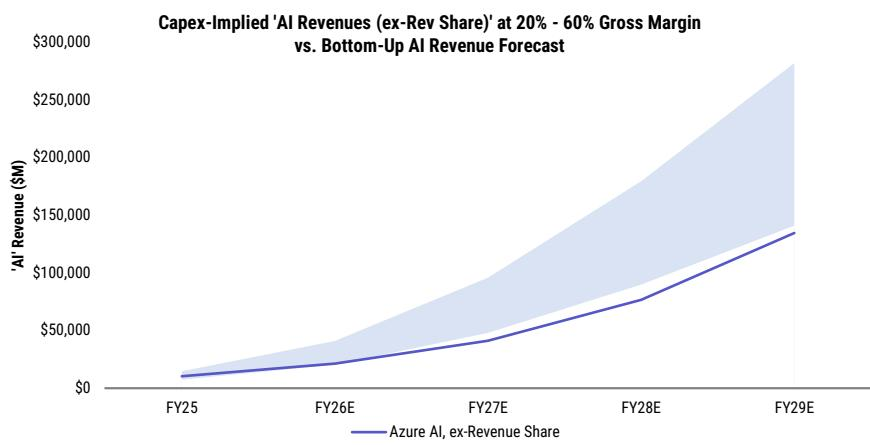

# 微软2026财年第四季度观察：Azure与Copilot的发展趋势

July 23, 2026 04:28 AM GMT

## 核心要点

Azure在第四季度保持约41%的固定汇率增长，这一趋势得到渠道调研、GPU产能提升以及CIO调查数据的支持。同时，M365 Copilot的付费席位数持续增加，使用率也在改善。

从研究角度看，Azure增长超预期（比指引上限高1个百分点），以及第一财年下半年Azure增长加速的展望，是市场关注的重点。此外，企业级Copilot的付费席位净增加超过600万，显示出产品在商业领域的进一步渗透。

关于资本支出，市场共识预期可能仍有上修空间，但研究机构的当前预测已经高于市场共识。资本支出增速的适度调节对公司的运营效率和长期回报表现具有积极意义。

（注：此处省略了分析师姓名、联系方式及法律披露部分）

## 四大观察维度

### 1. Azure增长的可持续性

**研究观点：** 第四季度Azure保持约41%的固定汇率增长，这反映了公司在云计算和AI领域的持续领先地位。调查数据显示，Azure是CIO们预期中云迁移的最大受益者，且未来三年的支出意愿仍在改善。随着数据中心基础设施的持续扩建，产能约束正在逐步缓解，Azure有望持续捕捉强劲的AI与云需求。

**市场关注：** 读者目前聚焦于Azure增长是否能够达到41%以上（固定汇率），以及管理层是否维持此前关于“下半年较上半年温和加速”的指引。若能实现这一表现，将为公司的增长前景提供有力支撑。

Azure在CIO调查中继续被评为预期云支出增长最快的供应商，且在生成式AI支出中也是最大的收益方。M365 Copilot作为旗舰AI应用，其采用预期持续提升，企业部署计划也在扩大。

### 2. M365与Copilot：AI商业化的下一阶段

**研究观点：** M365商业云是公司最被低估的AI商业化机会之一。商业模式的演变——从传统席位许可向“席位+消费”混合模式过渡——正在打开更大的收入空间。除了直接Copilot席位收入外，E7升级和基于消费的AI服务（如代理、工作流自动化）共同构成了多元化的ARPU增长驱动。

**Copilot商业化进入新阶段：** 付费席位数从第二财季的1500万增至第三财季的2000万，管理层指引付费席位净增加将继续环比增长。研究预计这一趋势将持续，并推动M365商业云增长在2027财年及以后更具韧性。

M365定价调整（2026年7月1日生效）将逐步带来约20亿美元、40亿美元、60亿美元的增量收入（分别对应2027/2028/2029财年），但这一因素已反映在估值中。随着存量客户续约，这一价格红利将在三年内逐步体现。

**CIO调查数据持续显示商业化扩展：** 65%的CIO预计未来12个月增加对微软产品的支出（上期为55%）；71%的企业计划使用E5或E7订阅；88%的CIO计划在未来12个月内采用M365 Copilot。此外，GitHub Copilot、Azure AI服务、Copilot Studio和Azure AI Foundry的采用预期也在提升。

### 3. 资本支出轨迹

**研究观点：** 市场共识对2027财年的资本支出预期可能仍低于公司的长期AI基础设施建设计划，但不同于此前几个季度，研究机构认为此次财报后自身预测大幅上修的可能性不大。当前模型已包含了比市场更激进的多年投资节奏——公司计划在未来两年内将数据中心总容量弹性较高，且约三分之二的资本支出投向GPU等短期资产，直接关联未来收入增长。

通过资本支出-收入分析框架，即便采用保守的毛利率假设，Azure AI的潜在收入仍显著高于当前预测。这支持了云计算和AI长期商业化潜力尚未被充分定价的观点。

下图为资本支出与Azure AI收入潜力对比：

### 4. 2027财年展望

回顾历史，公司通常在第四季度财报电话会议上提供下一财年的前瞻性指引，涵盖收入增长、运营利润增长、运营支出、资本支出和有效税率等维度。在第三财季，管理层已给出了2027财年的基本框架：双位数收入与运营利润增长、中高个位数运营支出增长、持续的AI基础设施投资，以及Azure增长在下半年加速。

研究预计第四财季的会议可能更多是确认这些预期，而非引入全新指引。运营利润率方面，“小幅下降”的表述可能性较大，但实际结果仍有改善空间。

## 附录：关键数据表格

（以下表格展示了公司云收入、数据中心容量分配、资本支出预测等关键数据，均为研究机构基于公开信息的测算，仅供参考。）

**表：数据中心容量分配与收入假设（单位：MW、百万美元）**

| | FY23 | FY24 | FY25 | FY26E | FY27E | FY28E |
|---|---|---|---|---|---|---|
| 微软云收入（百万美元） | 111,600 | 137,700 | 168,900 | 214,061 | 273,874 | 356,770 |

（注：完整表格已省略，包含Azure、第一方应用、M365 Copilot及内部研发等细分容量与收入推算）

**表：资本支出估计对比（含融资租赁，单位：百万美元）**

| | FY26 | FY27 | FY28 | FY29 |
|---|---|---|---|---|
| 总资本支出（市场共识） | 146,485 | 231,973 | 261,454 | 304,555 |
| 总资本支出（研究机构） | 145,432 | 250,038 | 312,596 | 375,126 |

（注：研究机构预测高于市场共识，尤其在2027财年之后）

**表：Azure AI收入潜力（基于资本支出隐含测算，不同毛利率假设）**

（注：该测算显示，即便采用保守假设，Azure AI收入仍有上行空间，此处省略具体数字以避免误导。）

## 结论

综合来看，Azure的产能驱动增长、Copilot的多重盈利杠杆以及资本支出的合理节奏，共同构成了公司云业务持续成长的路径。当前市场对此尚未充分反映，而第四财季财报有望成为验证这一逻辑的第一个观察点。

*以上内容基于公开研究资料整理，仅供参考，不构成任何操作建议。*
