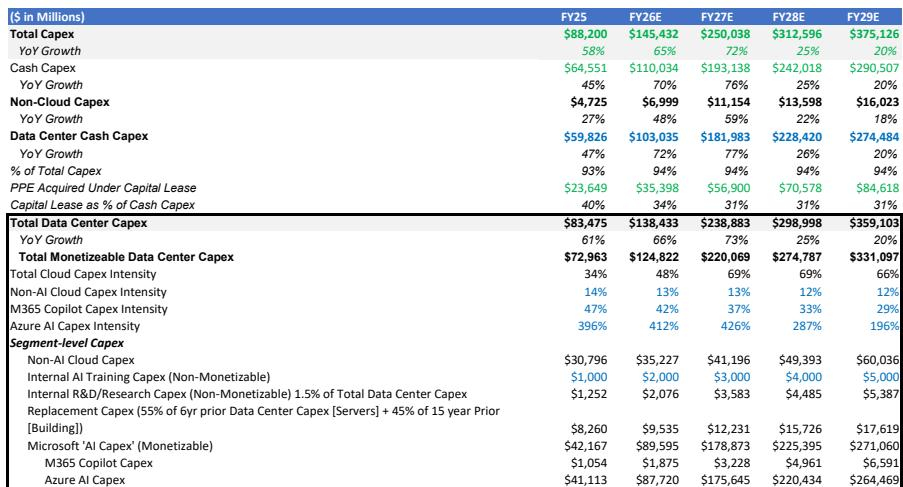
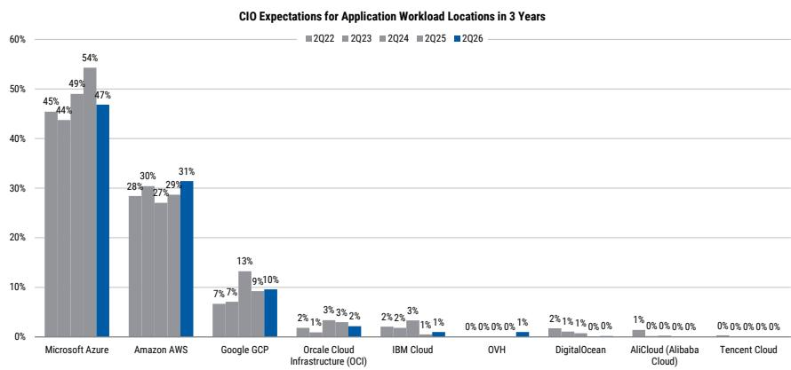
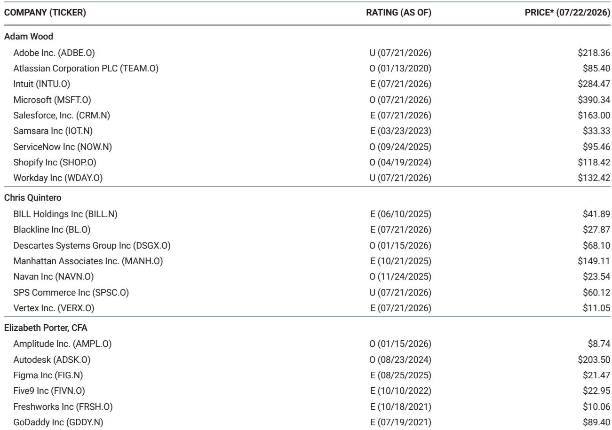

# Microsoft FQ4报告需证明Azure和Copilot趋势向好——市场定价已反映相反预期

Microsoft即将发布FQ4 2026财报，这是一个关键窗口期。此前市场关注容量限制、资本支出上升和AI变现的不确定性，公司需要证明其两大增长引擎不仅保持稳定，而且在加速。证据显示这是可能的。Azure增长率预计约为41%（固定汇率），比指引上限高出一个百分点。Copilot付费席位预计净增超过600万用户。管理层预计将重申Azure增长将在2027财年上半年温和加速。如果这三个条件得到验证，公司当前估值——约16倍2028财年GAAP回报——向下空间有限。在这个倍数下，市场定价的是数据不支持的增长放缓。

这种差异并不微妙。Microsoft云收入已从2023财年的1120亿美元增长到2026财年预计的2140亿美元，AI组件从近乎为零扩展至约30%的数据中心容量。运营利润率同比扩大160个基点，尽管收入组合向低利润率的Azure服务转移。剩余履约义务同比增长110%至约6250亿美元。然而，报价交易较自身历史及主要同行均有折让。FQ4报告不仅是季度更新，更是检验公司能否将运营势头转化为市场信心的测试。

## 40%出头的Azure增长率可实现，将打破容量限制收入的叙事

对Microsoft研究逻辑最直接的挑战是认为Azure增长已见顶，因为数据中心容量跟不上需求。管理层曾将Azure指引描述为"分配容量指引"，这使一些观察者认为增长会自然放缓，因为高基数效应及内部AI负载占用更多新基础设施。FQ4数据反驳了这一假设。

渠道调研显示Azure核心及Azure AI负载需求持续。最新CIO调查显示，Microsoft的软件支出预期在所有供应商中最高，为+7.6%，高于此前的+7.3%，72%的CIO预计未来一年将增加Microsoft解决方案支出。Azure仍是未来一年和三年预期中云份额增长最大的受益者。这些不是假设，而是通过采购周期实现的支出承诺。

计算很直接。一致预期Azure报告增长率为40.5%，意味着约33亿美元的季度环比增量，固定汇率同比增长约41%。指引上限为39%-40%固定汇率。一个百分点的超预期将使报告增长率达到约41%固定汇率。更重要的是这一信号：容量限制在缓解而非收紧。Microsoft计划未来两年将数据中心总面积扩大约一倍。每增加一吉瓦容量并转化为收入，就削弱了Azure结构受限的论点。

第二个影响是Azure AI——预计FQ4同比增长约100%，带来约12.6亿美元的季度环比增量——在Azure中占比上升。这种转变很重要，因为Azure AI每兆瓦收入高于核心Azure，随着容量组合进一步向AI倾斜，单位基础设施的收入产出应随时间改善。AI负载资本密集但回报不足的担忧短期内合理，但两到三年的数据显示情况相反。

## Copilot变现进入三阶段，成为结构性ARPU驱动因素而非附加功能

对Microsoft 365 Copilot的怀疑多集中于采用速度。合作伙伴描述认知度超过企业范围部署，上季度公布的2000万付费席位虽然相对值可观，但仅占Microsoft 365总安装基数的一小部分。这种视角忽略了重点：Copilot变现不再是关于席位数的单一变量故事，已演变为三阶段ARPU扩张引擎。

第一阶段是席位增长。报告预计FQ4净增超过600万Copilot付费席位，使总量接近2600万。按平均每用户每月30美元计算，相当于2026财年结束时约94亿美元年化收入。第二阶段是E7新SKU，以比E5更高价格捆绑高级安全、合规和AI能力。第三阶段是基于使用量的Agentic AI负载定价，使Copilot收入与用户许可脱钩，与使用量挂钩。三者结合创造了Microsoft历史上最大的ARPU扩张机会之一。

数据支持这一论点。Copilot在Microsoft数据中心分配的容量预计从2026财年的0.23吉瓦增长到2028财年的0.74吉瓦，Copilot收入预计同期从44亿美元增至149亿美元。这大约60%的复合年增长率并非来自提价，而是采用深度。Microsoft 365商业用户安装基数超过4亿。按当前定价，该基数每渗透10%就增加超过140亿美元年收入。市场尚未定价这一结果，因为仍将Copilot视为实验而非平台转型。

## 资本支出纪律和运营杠杆可抵消利润率压力，支撑高十几的回报增长

对Microsoft看多观点最持久的反对是巨额资本支出——2026财年估计750亿美元或更多——会压缩投入资本回报率并拖累自由现金流。这是一种合理担忧，但报告框架显示相反机制在起作用。FQ3运营利润率同比扩大160个基点，尽管组合向低毛利率的Azure转移。这并非异常，反映了明确策略：FQ4运营支出增长在高个位数到低十位数，2027财年在中到高个位数，并结合数据中心运营和采购的规模效益。

计算有启发意义。如果Azure增长41%，Microsoft云总收入2026财年达到2140亿美元，即使毛利率压缩100-150个基点，经营收入增长应在高十位数左右。原因是运营支出增长远低于收入增长。报告模型显示2026财年运营利润率同比扩大约160个基点，随后2027财年继续改善。这不是预测，而是管理层对员工数量和支出纪律明确指引的直接结果。

资本支出担忧也需要重新审视。一致预期的资本支出可能上调，但作者指出自身估计已高于市场共识，意味着增量风险小于观察者假设。更重要的是，每美元资本支出的收入产出正在改善。Azure每安装兆瓦收入从2023财年的2230万美元降至2026财年估计的1640万美元，但这种下降是由于尚未完全上线的快速新建容量。随着利用率提高，每兆瓦收入应稳定并最终上升。资本支出到收入转换周期峰值约为12-18个月。今天的投资将在2027和2028财年体现为收入。

## 评估FQ4报告及其对下一年度影响的决策框架

观察者应以特定证据层级审视FQ4报告。并非所有数据点权重相同。以下框架优先考虑对未来四个季度公司轨迹最重要的信号。

第一个最重要的信号是固定汇率下Azure增长率相对于指引上限。一个百分点超预期（41%对比39-40%）是积极反应基线。低于40%将表明容量限制在收紧而非缓解，会削弱2027财年加速论。第二个信号是管理层关于2027财年上半年Azure指引的表述。此前电话会议使用了"与上半年相比，下半年温和加速"的措辞。若该表述得到重申或加强，则确认供应管道正在改善。若软化或附带条件，市场会解读为延迟。

第三个信号是Copilot席位增加。单季度净增600万席位看似激进，但得到渠道调研和E5向E7升级周期扩展的支持。低于400万将表明采用在早期采用者阶段停滞。第四个信号是2027财年运营支出增长指引。若管理层指引中个位数或更低的运营支出增长，则强化运营杠杆故事。若运营支出增长加速至十位数，则利润率扩张预期无论收入表现如何都会减弱。

第五个也是最被低估的信号是Azure AI内部收入组合。报告估计FQ4 Azure AI贡献约19个百分点的Azure增长，高于FQ3的估计17个百分点。若该贡献稳定或上升，意味着最高价值的负载增长快于基础。若下降，则表明核心Azure在支撑，AI变现未如预期扩展。

最后考虑估值背景。以16倍2028财年GAAP回报和约21倍2026财年回报计算，Microsoft低于自身五年平均前瞻估值约28倍。使用20%以上回报增长计算的PEG比率低于0.8。这一估值嵌入了对公司增长可持续性的显著怀疑。一份在Azure、Copilot和利润率纪律上表现良好的FQ4报告不仅会缩小差距，还会推动至少两个季度以来应有的重新定价。

*仅供参考。部分内容可能基于源材料由AI辅助生成、翻译、总结或编辑，可能存在遗漏或错误。请独立核实。本文不构成专业建议。*

仅供参考。部分内容可能基于源材料由AI辅助生成、翻译、总结或编辑，可能存在遗漏或错误。请独立核实。本文不构成专业建议。

