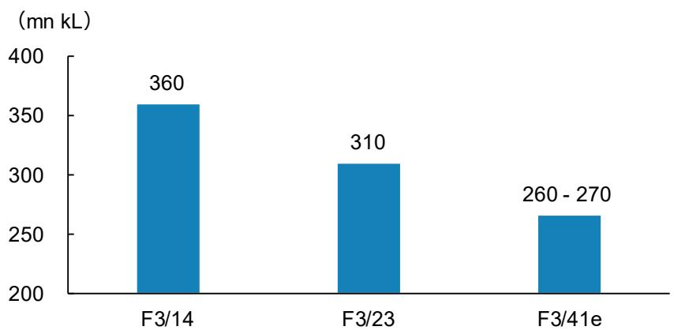
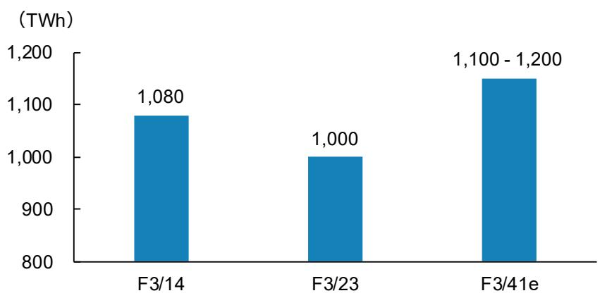
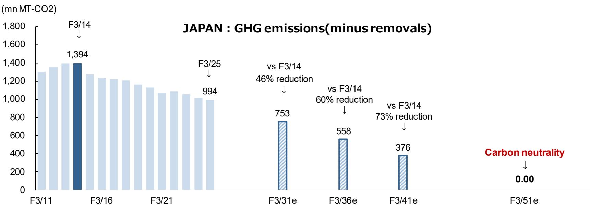
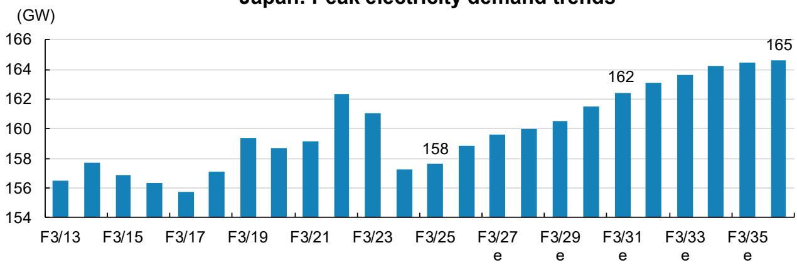
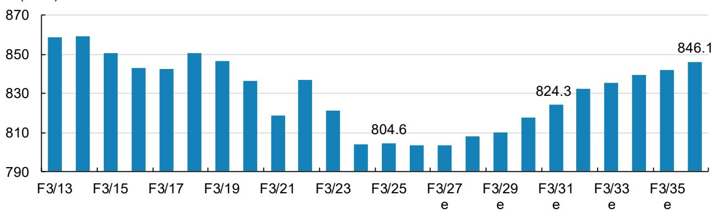
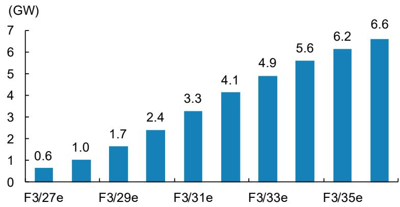
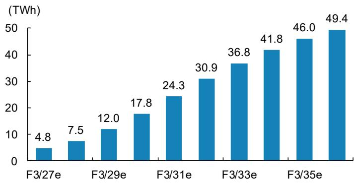
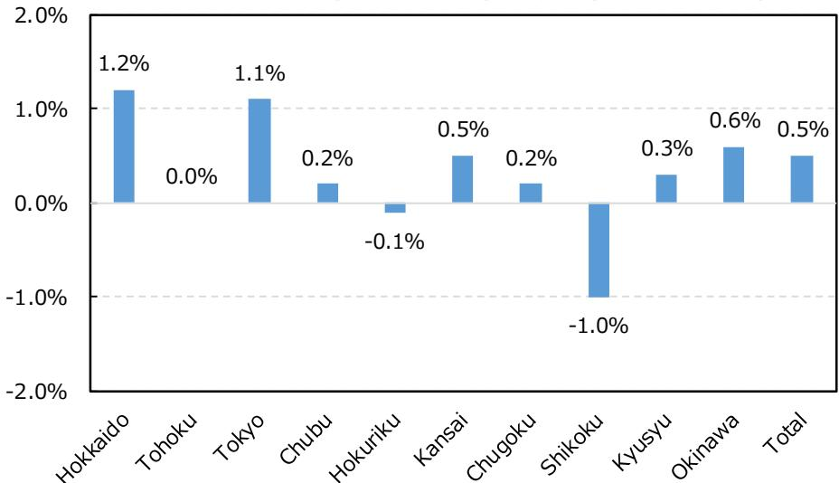
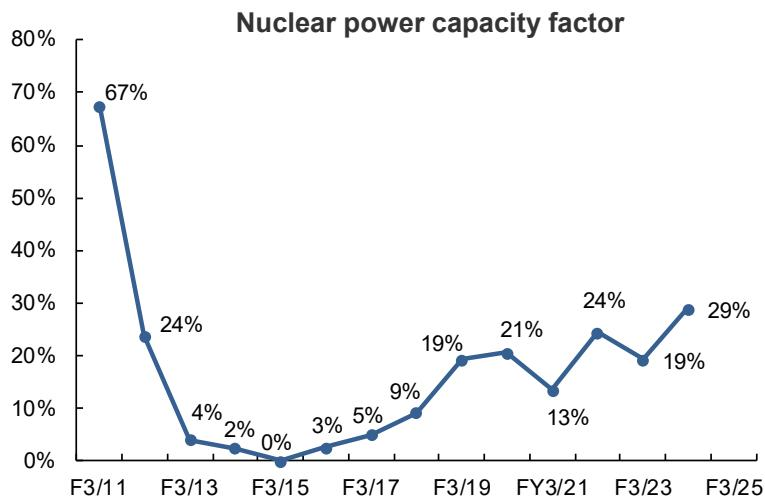
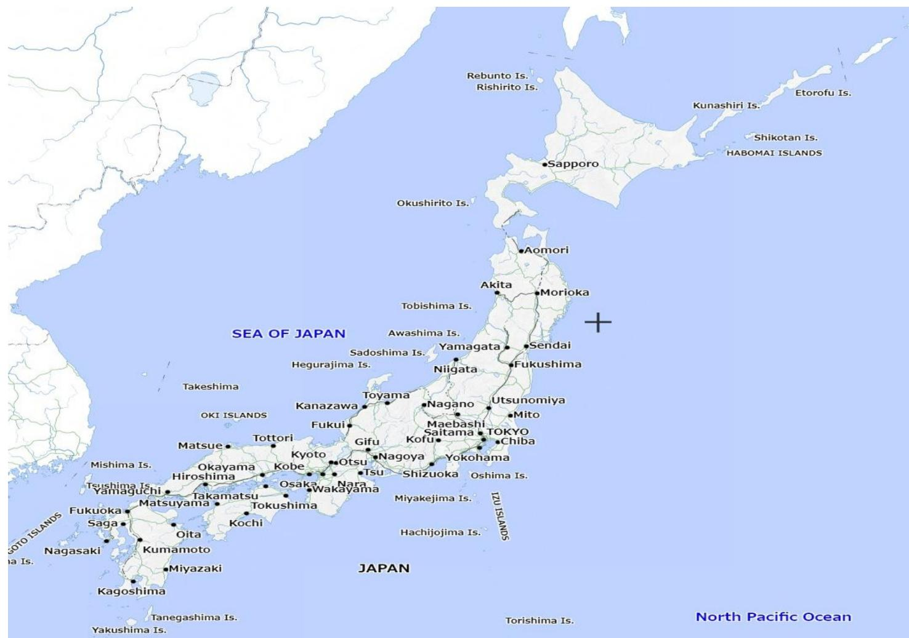

# 日本能源与公用事业行业观察笔记

## 日本夏季研讨会：能源与公用事业

本文梳理日本能源与公用事业行业的基本面，涵盖行业结构与市场趋势。

## 相关研究

- 输电网络扩建：可再生能源与数据中心驱动（2024年10月3日）
- 日本能源政策的转折点：第七次能源基本计划的启示（2025年3月21日）
- 日本人工智能发展的电力支撑（2025年）（2025年4月9日）
- 日本天然气需求中长期回升；关注INPEX（2025年7月8日）
- 日本能源与公用事业行业：P/B提升计划（2025年7月）（2025年7月23日）
- 日本碳定价的转折点：日本政府将于2026财年启动二氧化碳排放交易系统（2025年9月25日）
- 日本核电复兴开启（2026年3月29日）

**研究员**：Reiji Ogino  
联系信息：Reiji.Ogino@morganstanleymufg.com

**行业评级**：与大盘一致

*注：本研究报告仅为提供信息之用，不构成任何操作建议。*

---

## 日本夏季研讨会 2026

## 日本能源的未来 2026

### [A] 内容概览

1. 日本第七次能源基本计划（2025年2月）
2. 高市政权下的17个战略领域
   - 公共和私营部门总投资将超过370万亿日元（截至2040年累计）
   - 第12战略领域：资源、能源、安全与GX（绿色转型）
   - 第13战略领域：聚变能源（核聚变能源）
3. 电力需求展望——AI数据中心和半导体工厂的新建
4. 发电结构
5. 电力供需平衡展望
6. 核电站

---

## 日本政府第七次能源基本计划：F3/41展望

### 能源供需展望（F3/41）

|  | F3/24（初步数据） | F3/41e |
| --- | --- | --- |
| 能源自给率 | 15.2% | 约30-40% |
| 发电量 | 9854亿千瓦时 | 约1.1-1.2万亿千瓦时 |
| 最终能源消费 | 3亿千升 | 约2.6-2.7亿千升 |
| 温室气体减排（vs F3/14） | 22.9%（F3/23实际值） | 73.0% |

### 发电结构展望

|  | F3/24（初步数据） | F3/41e |
| --- | --- | --- |
| 可再生能源 | 22.9% | 约40-50% |
| 核电 | 8.5% | 约20% |
| 火电 | 68.6% | 约30-40% |

来源：经济产业省、研究机构；e=经济产业省展望

### 可再生能源结构展望

|  | F3/24（初步数据） | F3/41e |
| --- | --- | --- |
| 可再生能源 | 22.9% | 约40-50% |
| 太阳能 | 9.8% | 约23-29% |
| 风电 | 1.1% | 约4-8% |
| 水电 | 7.6% | 约8-10% |
| 地热 | 0.3% | 约1-2% |
| 生物质 | 4.1% | 约5-6% |

---

## 日本：F3/41最终能源消费与发电量展望

### 最终能源消费展望

  
来源：经济产业省、研究机构；e=经济产业省展望，1PJ = 25,800千升（原油当量）

### 发电量展望

  
来源：经济产业省、研究机构；e=经济产业省展望

---

## 日本：温室气体排放

  
来源：环境省、研究机构；e=研究机构估算

---

## 高市政权下的17个战略领域——公共和私营部门总投资将超过370万亿日元（截至F2040累计）

### 17个战略领域

| 序号 | 领域 |
| --- | --- |
| 1 | AI与半导体 |
| 2 | 数字与网络安全 |
| 3 | 信息与通信 |
| 4 | 量子 |
| 5 | 国防工业 |
| 6 | 航空与航天 |
| 7 | 海洋/海事 |
| 8 | 造船 |
| 9 | 材料（关键矿产与零部件） |
| 10 | 合成生物学与生物技术 |
| 11 | 药物研发与先进医疗 |
| 12 | 资源、能源、安全与GX |
| 13 | 聚变能源 |
| 14 | 防灾与国土韧性 |
| 15 | 港口与物流 |
| 16 | 食品科技 |
| 17 | 内容 |

### 与能源和公用事业相关的公共和私营领域投资

| 领域 | 投资（至F2040）（万亿日元） |
| --- | --- |
| **12. 资源、能源、安全与GX** | **28.8** |
| a. 下一代太阳能电池（如钙钛矿太阳能电池） | 4.1 |
| b. 氢能 | 6.2 |
| c. 绿色钢铁 | 4.2 |
| d. 下一代地热 | 1.0 |
| e. 海上风电 | 5.1 |
| f. 下一代先进反应堆 | 5.0 |
| g. GX化学品 | 3.2 |
| **13. 聚变能源** | **3.1** |
| **17个战略领域合计** | **370** |

来源：内阁官房、研究机构

---

## 日本：预计电力需求（10年）

### 最高电力需求趋势

  
来源：OCCTO、研究机构；e=OCCTO估算

### 需求量趋势

  
来源：OCCTO、研究机构；e=OCCTO估算

---

## 日本：新建数据中心预计电力需求

### 新建数据中心导致的最高电力需求增量（vs F3/26）

  
来源：OCCTO、研究机构；e=OCCTO估算

### 新建数据中心导致的需求量增量（vs F3/26）

  
来源：OCCTO、研究机构；e=OCCTO估算

---

## 各地区电力需求展望

### 各地区电力需求复合年增长率（F3/25-F3/36）

  
来源：OCCTO、研究机构；e=OCCTO估算

### 各地区电力需求展望

| 地区 | F3/26e | F3/36e | CAGR（F3/25-F3/36） |
| --- | --- | --- | --- |
| 北海道 | 27.8 | 31.2 | 1.2% |
| 东北 | 74.0 | 73.7 | 0.0% |
| 东京 | 257.6 | 287.1 | 1.1% |
| 中部 | 121.8 | 124.6 | 0.2% |
| 北陆 | 25.7 | 25.3 | -0.1% |
| 关西 | 130.9 | 137.0 | 0.5% |
| 中国 | 53.1 | 54.2 | 0.2% |
| 四国 | 23.7 | 21.4 | -1.0% |
| 九州 | 80.9 | 83.2 | 0.3% |
| 冲绳 | 7.9 | 8.4 | 0.6% |
| **合计** | **803.4** | **846.1** | **0.5%** |

来源：OCCTO、研究机构；e=OCCTO估算

---

## 日本：按能源种类划分的发电量

### 发电量数据

| （太瓦时） | F3/14 | % of total | F3/23 | F3/24 | F3/25 | 同比 | vs F3/14 | % of total |
| --- | --- | --- | --- | --- | --- | --- | --- | --- |
| **合计** | **1,084.5** | **100%** | **1,001.7** | **987.6** | **991.1** | **0%** | **-9%** | **100%** |
| 煤炭 | 357.1 | 33% | 304.2 | 281.2 | 278.5 | -1% | -22% | 28% |
| 天然气 | 443.5 | 41% | 338.5 | 323.2 | 319.4 | -1% | -28% | 32% |
| 石油等 | 156.7 | 14% | 84.1 | 73.1 | 71.1 | -3% | -55% | 7% |
| 核电 | 9.3 | 1% | 56.1 | 84.1 | 93.5 | 11% | 905% | 9% |
| 可再生能源 | 117.9 | 11% | 218.7 | 226.1 | 228.6 | 1% | 94% | 23% |
| 其中：水电 | 79.4 | 7% | 76.7 | 74.9 | 73.5 | -2% | -7% | 7% |
| 其中：太阳能 | 12.9 | 1% | 92.6 | 96.5 | 98.1 | 2% | 660% | 10% |
| 其中：风电 | 5.2 | 0% | 9.3 | 10.5 | 11.7 | 11% | 125% | 1% |
| 其中：地热 | 2.6 | 0% | 3.0 | 34.0 | 3.9 | -89% | 50% | 0% |
| 其中：生物质 | 17.8 | 2% | 37.2 | 40.8 | 41.4 | 1% | 133% | 4% |

来源：环境省、研究机构

---

## 日本：电力供需平衡

### 电力供需平衡展望（2027年8月）

| （兆瓦） | 供电能力 (a) | 最高需求 (b) | 盈余容量 (c) = (a)-(b) | 盈余容量比 (c)/(a) |
| --- | --- | --- | --- | --- |
| **东部地区** | **85,610** | **72,510** | **13,100** | **15%** |
| 北海道 | 5,220 | 4,220 | 1,000 | |
| 东北 | 15,820 | 13,020 | 2,800 | |
| 东京 | 64,580 | 55,270 | 9,310 | |
| **中西部地区** | **101,050** | **90,590** | **10,460** | **10%** |
| 中部 | 27,690 | 23,700 | 3,990 | |
| 北陆 | 5,460 | 4,670 | 790 | |
| 关西 | 31,470 | 26,930 | 4,540 | |
| 中国 | 11,710 | 10,020 | 1,690 | |
| 四国 | 6,140 | 4,640 | 1,500 | |
| 九州 | 18,590 | 15,910 | 2,680 | |
| **9地区合计** | **186,670** | **158,380** | **28,290** | **15%** |

来源：OCCTO、研究机构；e=OCCTO展望

---

## 日本：电力供应能力、核电站现状

### 电力供应能力

| （兆瓦） | F3/26 |
| --- | --- |
| **火电** | **142,030** |
| 煤炭 | 51,380 |
| LNG | 78,450 |
| 石油等 | 12,200 |
| **核电** | **33,080** |
| **可再生能源等** | **146,230** |
| 水电 | 22,140 |
| 抽水蓄能 | 27,340 |
| 风电 | 6,840 |
| 太阳能 | 80,190 |
| 地热 | 510 |
| 生物质 | 7,180 |
| 垃圾发电 | 1,350 |
| 电池储能 | 660 |
| 氢能 | 0 |
| 氨能 | 0 |
| **其他** | **2,310** |
| **合计** | **326,350** |

### 核电站现状（截至2026年6月26日）

|  | 总装机容量 (MW) | 已重启 (MW) | 机组数 | 已重启 (台) |
| --- | --- | --- | --- | --- |
| 东部地区 | 14,132 | 2,181 | 14 | 2 |
| 西部地区 | 18,951 | 12,428 | 19 | 13 |
| **合计** | **33,083** | **14,609** | **33** | **15** |

来源：日本原子力産業協会、研究机构；e=OCCTO展望

### 国内核电站一览

| 公司 | 核电站 | 发电容量 (MW) | 所在县 | 投运时间 | 反应堆类型 |
| --- | --- | --- | --- | --- | --- |
| TEPCO HD | 柏崎刈羽1号机 | 1,100 | 新潟 | 1985年9月 | BWR |
| TEPCO HD | 柏崎刈羽2号机 | 1,100 | 新潟 | 1990年9月 | BWR |
| TEPCO HD | 柏崎刈羽3号机 | 1,100 | 新潟 | 1993年8月 | BWR |
| TEPCO HD | 柏崎刈羽4号机 | 1,100 | 新潟 | 1994年8月 | BWR |
| TEPCO HD | 柏崎刈羽5号机 | 1,100 | 新潟 | 1990年4月 | BWR |
| TEPCO HD | 柏崎刈羽6号机 | 1,356 | 新潟 | 1996年11月 | ABWR |
| TEPCO HD | 柏崎刈羽7号机 | 1,356 | 新潟 | 1997年7月 | ABWR |
| Chubu EP | 浜冈3号机 | 1,100 | 静冈 | 1987年8月 | BWR |
| Chubu EP | 浜冈4号机 | 1,137 | 静冈 | 1993年9月 | BWR |
| Chubu EP | 浜冈5号机 | 1,380 | 静冈 | 2005年1月 | ABWR |
| Kansai EP | 美浜3号机 | 826 | 福井 | 1976年12月 | PWR |
| Kansai EP | 大饭3号机 | 1,180 | 福井 | 1991年12月 | PWR |
| Kansai EP | 大饭4号机 | 1,180 | 福井 | 1993年2月 | PWR |
| Kansai EP | 高浜1号机 | 826 | 福井 | 1974年11月 | PWR |
| Kansai EP | 高浜2号机 | 826 | 福井 | 1975年11月 | PWR |
| Kansai EP | 高浜3号机 | 870 | 福井 | 1985年1月 | PWR |
| Kansai EP | 高浜4号机 | 870 | 福井 | 1985年6月 | PWR |
| Chugoku EP | 岛根2号机 | 820 | 岛根 | 1989年2月 | BWR |
| Hokuriku EP | 志贺1号机 | 540 | 石川 | 1993年7月 | BWR |
| Hokuriku EP | 志贺2号机 | 1,206 | 石川 | 2006年3月 | ABWR |
| Tohoku EP | 东通1号机 | 1,100 | 青森 | 2005年12月 | BWR |
| Tohoku EP | 女川2号机 | 825 | 宫城 | 1995年7月 | BWR |
| Tohoku EP | 女川3号机 | 825 | 宫城 | 2002年1月 | BWR |
| Shikoku EP | 伊方3号机 | 890 | 爱媛 | 1994年12月 | PWR |
| Kyushu EP | 玄海3号机 | 1,180 | 佐贺 | 1994年3月 | PWR |
| Kyushu EP | 玄海4号机 | 1,180 | 佐贺 | 1997年7月 | PWR |
| Kyushu EP | 川内1号机 | 890 | 鹿儿岛 | 1984年7月 | PWR |
| Kyushu EP | 川内2号机 | 890 | 鹿儿岛 | 1985年11月 | PWR |
| Hokkaido EP | 泊1号机 | 579 | 北海道 | 1989年6月 | PWR |
| Hokkaido EP | 泊2号机 | 579 | 北海道 | 1991年4月 | PWR |
| Hokkaido EP | 泊3号机 | 912 | 北海道 | 2009年12月 | PWR |
| 非上市电力 | 东海2号机 | 1,100 | 茨城 | 1978年11月 | BWR |
| 非上市电力 | 敦贺2号机 | 1,160 | 福井 | 1987年2月 | PWR |

来源：日本原子力産業協会、研究机构

  
来源：环境省数据、研究机构

---

## 日本：能源/公用事业行业主要业务类型

### [A] 电力业务

1. 电力业务大致分为 [a] 发电、[b] 输配电、[c] 零售
2. 发电业务不受政府管制，输配电业务受政府管制
3. 零售业务于2016年4月全面自由化，但部分零售业务仍受政府管制（过渡措施）
4. 代表性企业：中部电力（9502.T）、关西电力（9503.T）、日本石油勘探（1662.T）

### [B] 城市燃气业务

1. 城市燃气业务分为 [a] LNG基地运营、[b] LNG进口、[c] 管道输配、[d] 零售
2. 城市燃气输配业务受政府管制
3. 2017年4月全面自由化，目前零售领域不受政府管制
4. 代表性企业：东京燃气（9531.T）、大阪燃气（9532.T）

### [C] 原油与天然气上游业务（E&P业务）

1. 上游业务概述：开采油气田的原油和天然气并销售
2. 代表性企业：INPEX（1605.T）、日本石油勘探（1662.T）

### [D] 石油产品炼制业务

1. 石油产品炼制业务概述：在炼油厂从原油生产石油产品并批发
2. 代表性企业：出光兴产（5019.T）、ENEOS控股（5020.T）、科斯莫能源控股（5021.T）

### [E] LP燃气销售业务

1. LP燃气销售业务概述：采购LP燃气（丙烷等）并销售（批发或零售）
2. 代表性企业：岩谷（8088.T）

---

### 日本地图

  
来源：国土地理院、研究机构

---

*注：本文内容仅供学习研究参考，不构成任何操作建议。文中提及的公司名称及代码仅为行业示例。*
