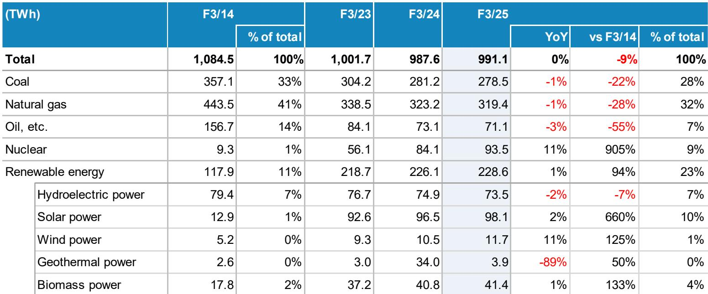
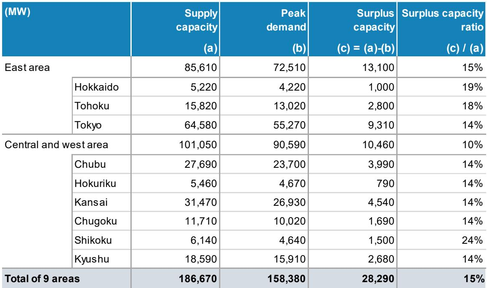
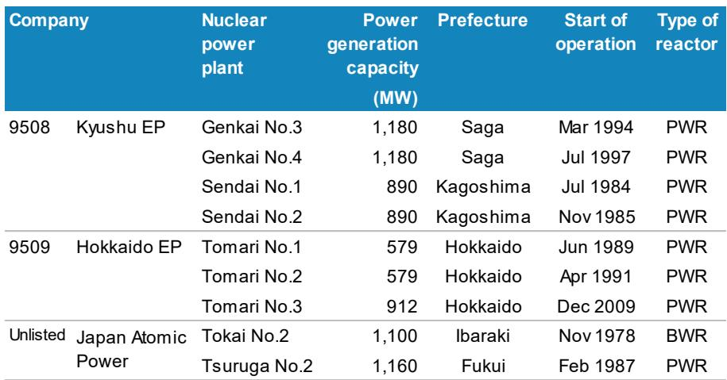

# MS：日本能源与公用事业参与者演示

日本有关部门2025年2月发布的第七次能源基本计划，为该国能源与公用事业行业设定了到2041财年的中长期框架。这份MS研报的核心判断是：日本电力需求正在经历一个结构性变化，AI数据中心和半导体工厂的新建将打破过去十年增长极为有限的局面，而发电结构的转型节奏将直接决定供电充裕度与行业定价逻辑。

报告引用的官方数据显示，日本电力输出量将从2024财年的9854亿千瓦时增至2041财年的约1.1-1.2万亿千瓦时。这一增量看似温和，但考虑到日本宏观环境过去十年电力消费持续调整的背景，方向性变化本身就有意义。更关键的是，新增需求并非来自宏观环境自然增长，而是高度集中于AI基础设施和半导体制造——两个政策优先度极高、研究确定性较强的领域。

## 1. 官方研究框架为电力需求提供政策参照

高市早苗领导下的有关方面提出的17个战略产业领域，累计公私研究目标超过370万亿日元。其中，第12个战略领域“资源、能源、安全与GX”单独规划了28.8万亿日元研究，涵盖下一代太阳能电池、氢能、绿色钢铁、海上风电、先进反应堆等七个细分方向。第13个战略领域“核聚变能源”另有3.1万亿日元。

这些数字不是预测，而是政策承诺。对于电力行业而言，这意味着下游需求不仅来自市场自发增长，还有官方研究计划的直接拉动。报告特别指出，AI数据中心和半导体工厂的新建是电力需求预测中最具可见度的增量来源。

> **KC评论：** 日本有关部门将能源与GX列为17个战略产业之一，并给出具体研究金额，这在过去几轮能源政策中并不多见。读者可以关注这些研究计划的实际落地节奏，尤其是下一代太阳能电池和海上风电的招标进度，因为它们直接影响发电结构的调整速度。

## 2. 发电结构目标：可再生能源占比弹性较高，核电恢复至20%

第七次能源基本计划设定了2041财年的发电结构目标：可再生能源占比从2024财年的22.9%提升至约40-50%，核电从8.5%提升至约20%，火电从68.6%降至约30-40%。其中，太阳能发电预计从9.8%增至23-29%，是增量最大的单项。

核电重启是另一个关键变量。截至2026年6月，日本33座核电机组中已有15座重启，总装机容量约14.6吉瓦，占全部核电容量的44%。但区域分布极不均衡：东部地区仅重启2座（2.2吉瓦），而西部地区已重启13座（12.4吉瓦）。东京电力公司旗下的柏崎刈羽核电站7座机组合计约8.2吉瓦，目前尚未重启，是未来核电增量的最大潜在来源。

报告还提供了2024财年实际发电数据：核电发电量已从2014财年的93亿千瓦时增至935亿千瓦时，增幅超过9倍；太阳能发电从129亿千瓦时增至981亿千瓦时，增幅6.6倍。这些历史数据说明，日本能源转型已经在发生，但距离2041年目标仍有较大差距。

## 3. 区域电力供需差异：东部紧张、西部相对充裕

报告对2027年8月电力供需平衡的预测显示，日本9个区域合计供电能力约186.7吉瓦，峰值需求约158.4吉瓦，整体富裕容量比例约15%。但东西差异明显：东部地区富裕比例约15%，中部和西部地区约10%。

分区域看，东京地区的峰值需求约55.3吉瓦，供电能力约64.6吉瓦，富裕容量约9.3吉瓦；关西地区峰值需求约26.9吉瓦，供电能力31.5吉瓦，富裕容量约4.5吉瓦。考虑到东京地区是AI数据中心和半导体工厂最集中的区域，其电力供需平衡将面临更大不确定性。

报告还提供了各区域电力需求增速预测：2025-2036财年，北海道和东京地区的复合年增长率分别为1.2%和1.1%，高于全国平均的0.5%；而四国地区为-1.0%，北陆地区为-0.1%。这种区域分化意味着，电网研究和跨区域输电能力将成为影响电力市场定价的关键基础设施变量。

> **KC评论：** 区域电力供需差异是理解日本电力公司价值分化的一个切入点。东部地区核电重启进度缓慢，叠加AI数据中心需求集中，可能导致该区域批发电价相对明显；而西部地区核电重启比例较高，供电相对充裕，电价不确定性可能更大。不同电力公司面临的竞争环境并不相同。

## 4. 一个可复用的观察框架：从政策目标到实际执行的三层验证

对于关注日本能源行业的读者，可以从三个层面跟踪这份计划的落地情况。第一层是政策承诺的兑现度：官方公布的28.8万亿日元研究是否按计划分配，招标进度是否如期推进。第二层是核电重启的实际节奏：尤其是柏崎刈羽核电站的监管审批进展，以及东部地区其他机组的重启时间表。第三层是电力需求的实际增速：AI数据中心和半导体工厂的建设计划是否如期投产，电力消费数据是否与OCCTO预测一致。

这三个层面相互关联。核电重启进度直接影响火电的退出速度，进而影响电力公司的资本支出计划和盈利结构。而电力需求的实际增速，则决定了新增可再生能源装机是否会被有效消纳，还是会造成过剩。

报告没有给出明确的结论，但它提供了一套完整的政策框架、历史数据和区域对比，让读者可以自行判断日本能源转型的节奏与方向。对于产业决策者而言，这份研报的价值不在于预测，而在于提供了一个可追踪的基准线。

For informational purposes only. Portions may be generated,translated,summarized,or edited with AI assistance based on source materials and may contain omissions or errors. Please verify independently. This is not investment,legal,tax,accounting,or other professional advice.

