# 行业研究笔记 | 日本半导体设备

## 行业概览

日本半导体设备行业保持关注。以下为月度追踪（2026年7月）。

## 近期价格表现

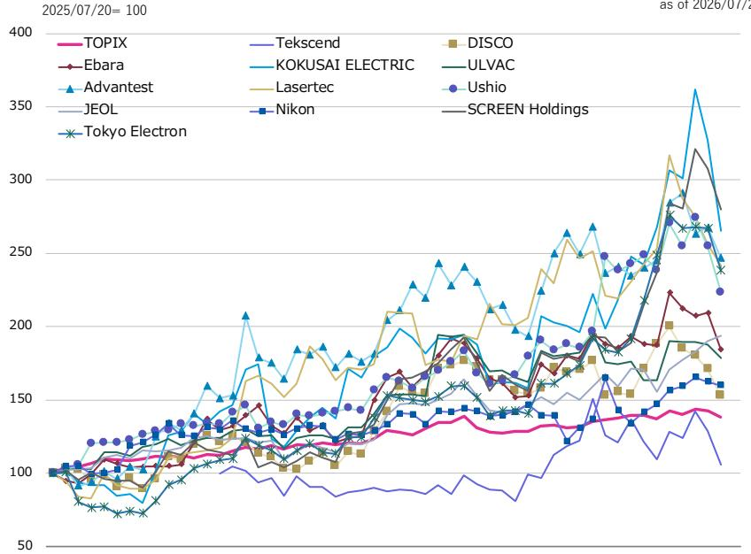  
2025/07/18 至 2026/06/19

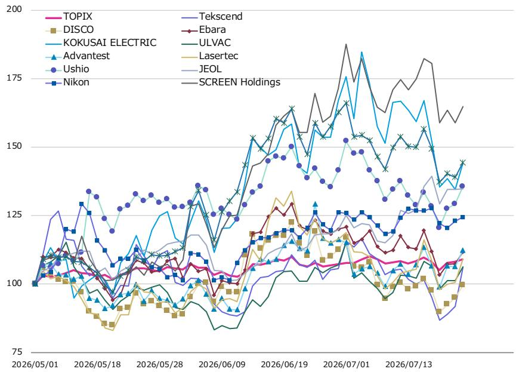

数据来源：FactSet, 研究机构

## 公司动态与市场关注点

以下为部分日本半导体设备公司近期业绩与前瞻关注的要点摘要。

**Advantest (6857.T)**  
- 市场关注全年指引的可能调整方向。

**KOKUSAI ELECTRIC (6525.T)**  
- 关注下半年公司指引的调整幅度。  
- 市场对于向研究机构预估（F3/27 营收 ¥320bn，营业利润 ¥73bn）的修正已有一定预期。

**SCREEN Holdings (7735.T)**  
- 第一季度业绩预期与同行相比可能偏中性。  
- 留意管理层是否在即将启动的新中期计划中提及业务组合改革。  
- 由于仅为第一季度，预计修正幅度有限。

**Ulvac (6728.T)**  
- 市场对F6/27指引预期不高，即便指引偏弱，也大概率在市场预期范围内。  
- 关注中期计划展望的变化。

**Ushio (6925.T)**  
- 预计工业流程业务相关需求方面有积极信号。

**Tekscend Photomask (429A.T)**  
- 第一季度进展相对公司指引可能偏弱。

**DISCO (6146.T)**  
- 市场关注第二季度合并出货指引，预计指引超过¥140bn。如达到约¥150bn，可能被视为积极。

**Nikon (7731.T)**  
- 第一季度结果预计符合预期。  
- 全年指引存在一定不确定性，但公司通常不进行前瞻性调整。

**Lasertec (6920.T)**  
- F6/27订单指引预计约¥300bn，与公司此前沟通一致。  
- 买方预期也大致处于相似水平。

**JEOL (6951.T)**  
- 多光束掩模写入设备订单方面，市场预期在ASML强劲业绩后有所提高，但JEOL已有16套多光束光刻系统积压，新订单优先级可能低于执行已有订单。

**Tokyo Electron (8035.T)**  
- 第一季度进展预计符合公司上半年计划，但受交付周期约束，大幅超预期可能性不大。

**Ebara (6361.T)**  
- 精密机械全年订单计划有望上调。  
- 在管理层保守作风下，预计订单计划将从¥405bn（同比+33%）上调至约¥450bn（同比+50%）。  
- 若订单指引提升至同比+50%左右，市场可能做出积极反应。

### Ebara 数据一览

| （单位：百万日元） | F12/24 | F12/25 | F12/26 研究机构估 | F12/27 研究机构估 | F12/28 研究机构估 | F12/26 一致预期 |
|-------------------|--------|--------|-------------------|-------------------|-------------------|----------------|
| **订单接收**       | 860,579 | 949,683 | 1,158,400 | 1,253,500 | 1,393,500 | 1,070,000 |
| 精密机械           | 260,059 | 303,447 | 492,400 | 546,500 | 651,000 | 405,000 |
| 能源               | 222,743 | 194,777 | 210,000 | 242,000 | 267,000 | 210,000 |
| 建筑服务与工业     | 244,401 | 249,285 | 265,000 | 274,000 | 284,500 | 265,000 |
| 基础设施           | 60,559 | 62,973 | 60,000 | 60,000 | 60,000 | 60,000 |
| 环境解决方案       | 71,594 | 135,392 | 130,000 | 130,000 | 130,000 | 130,000 |
| 其他               | 1,220 | 3,808 | 1,000 | 1,000 | 1,000 | - |
| **净销售额**       | 866,668 | 958,285 | 1,073,000 | 1,208,200 | 1,284,200 | 1,020,000 |
| 精密机械           | 278,378 | 342,267 | 448,300 | 538,500 | 587,000 | 400,000 |
| 能源               | 210,434 | 217,845 | 208,700 | 236,700 | 256,700 | 205,000 |
| 建筑服务与工业     | 238,182 | 241,938 | 260,000 | 274,000 | 284,500 | 260,000 |
| 基础设施           | 51,118 | 57,143 | 60,000 | 63,000 | 60,000 | 60,000 |
| 环境解决方案       | 87,438 | 97,864 | 95,000 | 95,000 | 95,000 | 95,000 |
| 其他               | 1,115 | 1,225 | 1,000 | 1,000 | 1,000 | - |

## 存储器价格走势

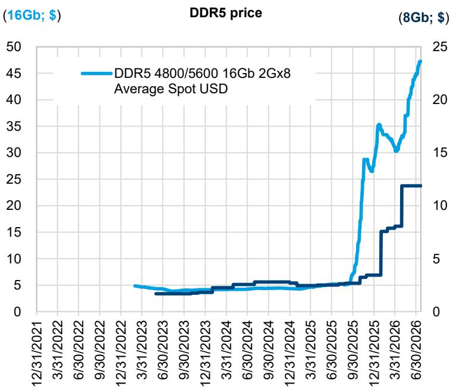

数据来源：FactSet, 研究机构

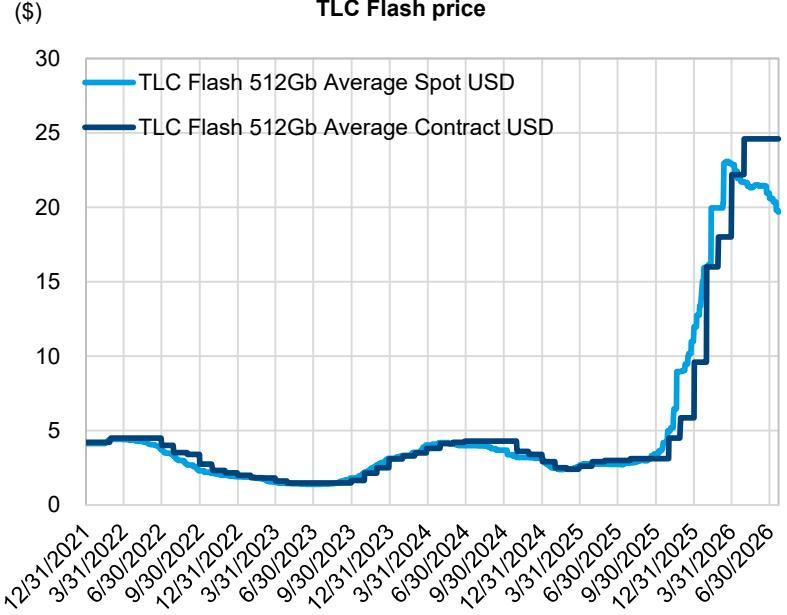

## DRAM 同比变化

DRAM 销售同比贡献分解  
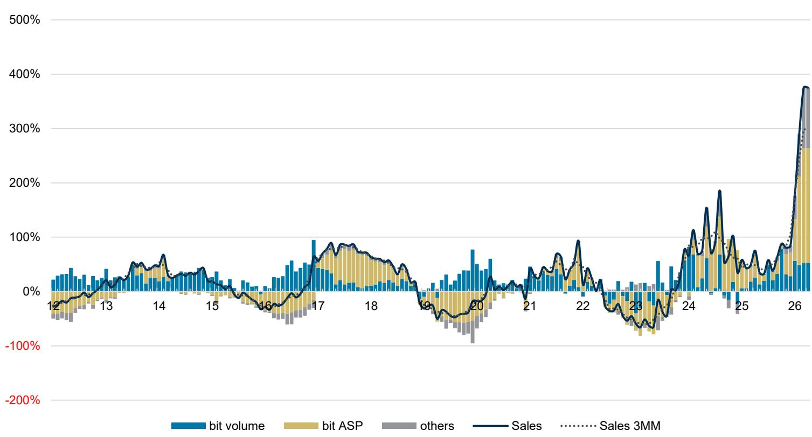  
数据来源：WSTS, 研究机构

## DRAM 位出货量与 ASP 同比变化

位量同比与 ASP 同比  
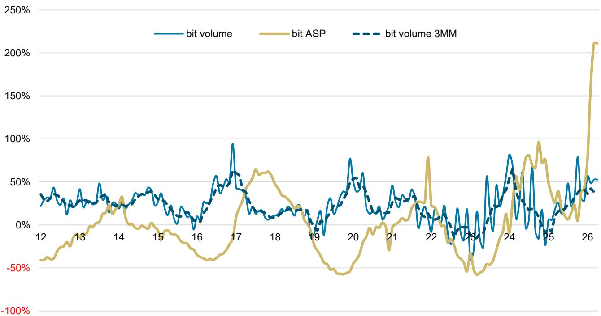  
数据来源：WSTS, 研究机构

## 台湾测试相关设备从马来西亚进口

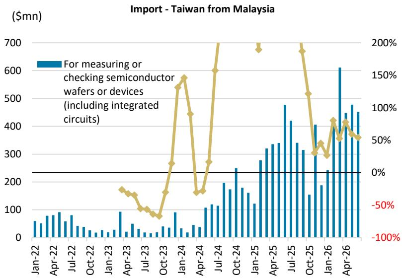

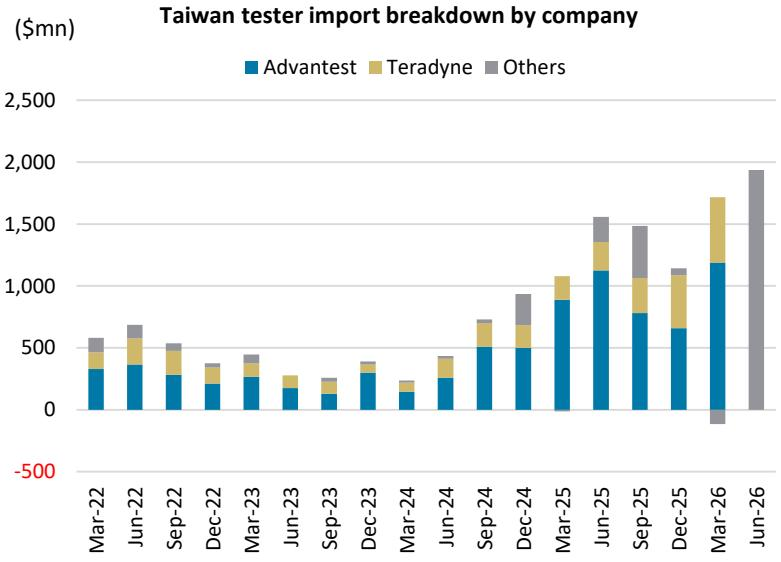  
数据来源：台湾经济部, 研究机构

## 中国半导体设备进口数据（6月同比-7%，3MMA）

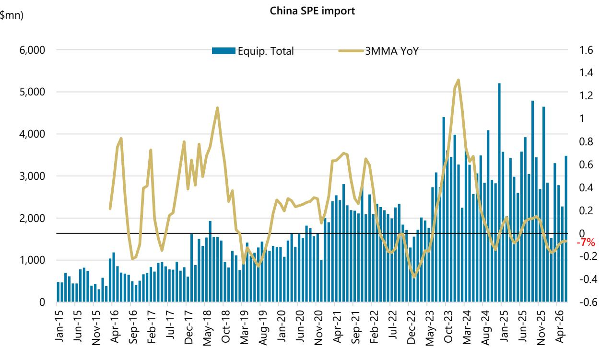  
注：数据不含搬运设备和零部件  
数据来源：中国海关总署, 研究机构

## 中国半导体设备进口数据

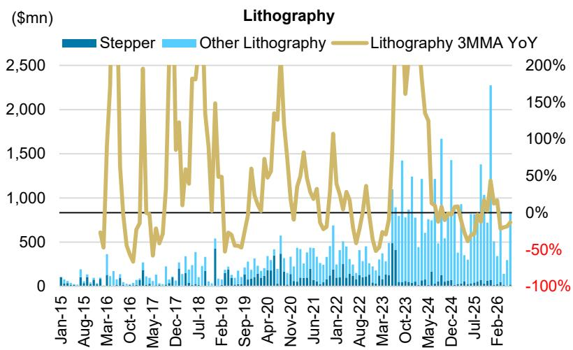

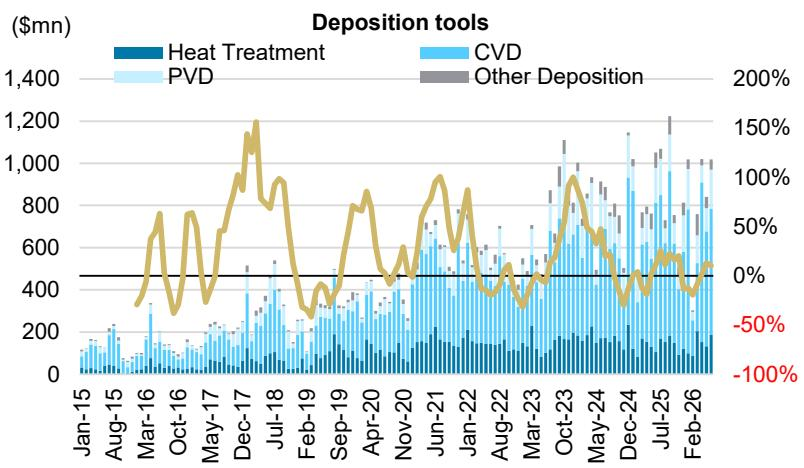

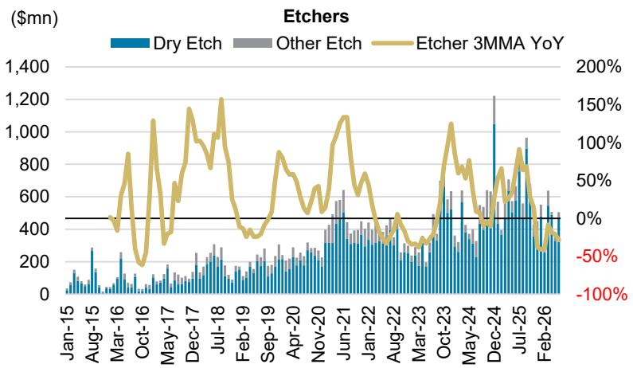

## 中国半导体设备进口数据（续）

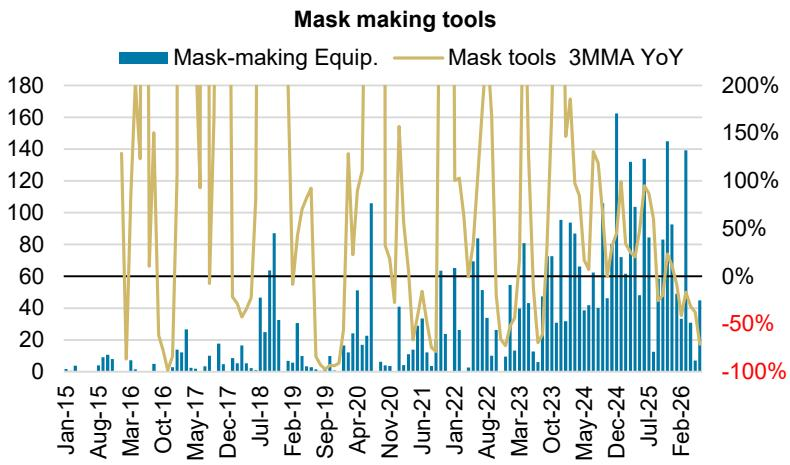

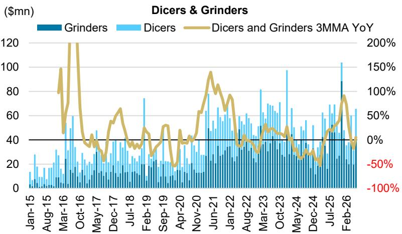

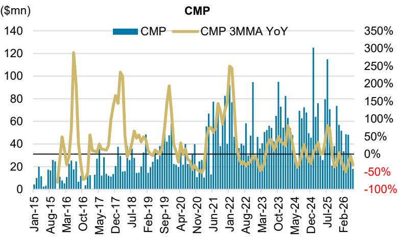  
数据来源：中国海关总署, 研究机构

## 中国从日本进口半导体设备（6月同比-15%，3MMA）

  
注：数据不含搬运设备和零部件  
数据来源：中国海关总署, 研究机构

## 中国从日本进口半导体设备

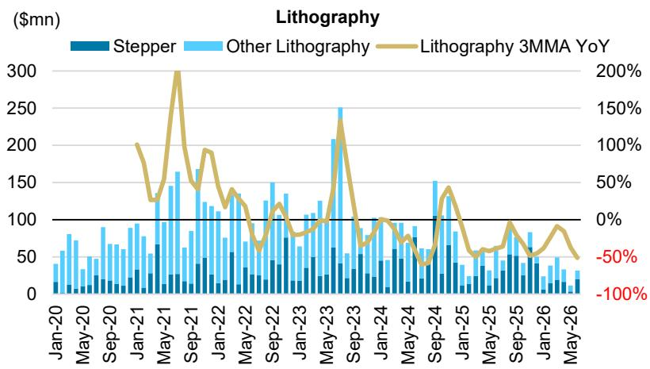

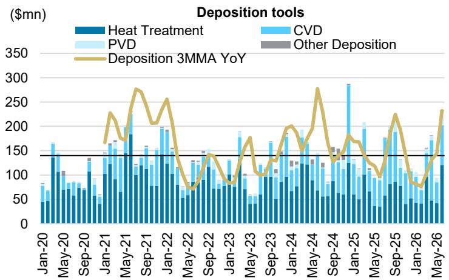

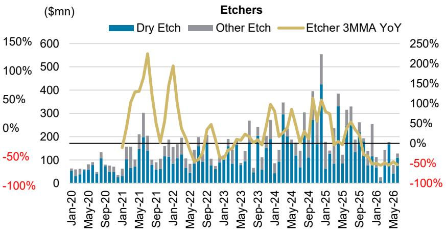  
数据来源：中国海关总署, 研究机构

## 中国从日本进口半导体设备（续）

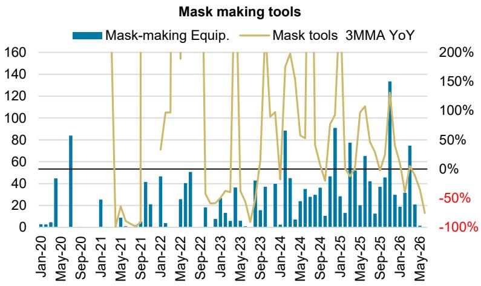

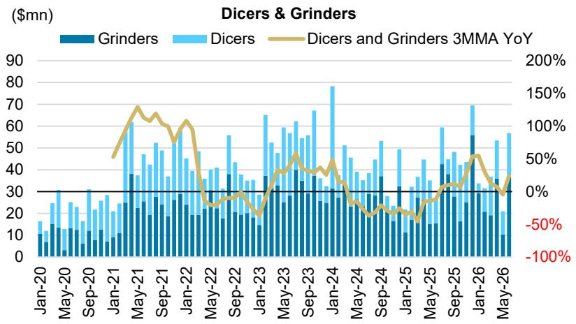

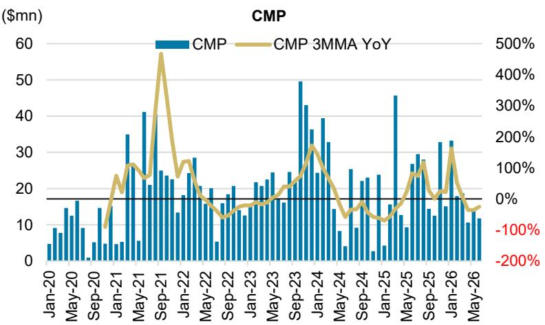  
数据来源：中国海关总署, 研究机构

---

**免责说明**：本文为学习笔记，内容基于公开信息整理，仅供参考，不构成任何操作建议。读者应根据自身情况独立判断。
