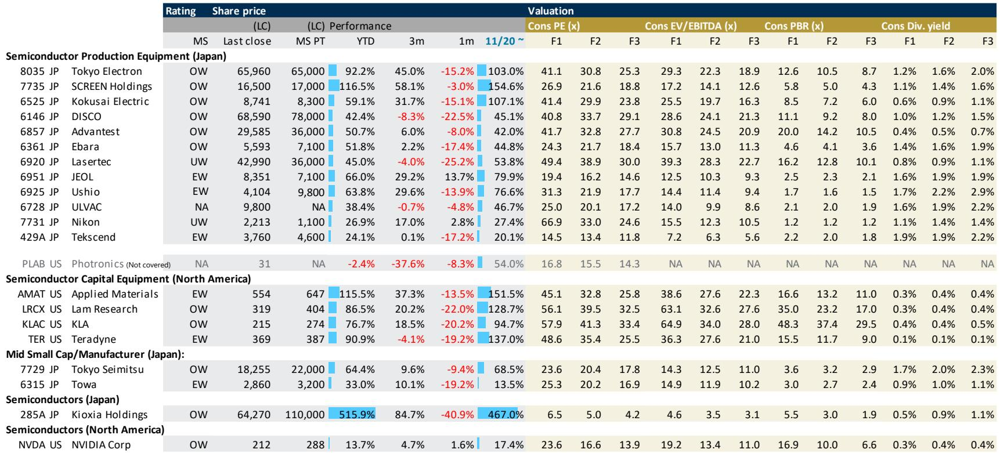
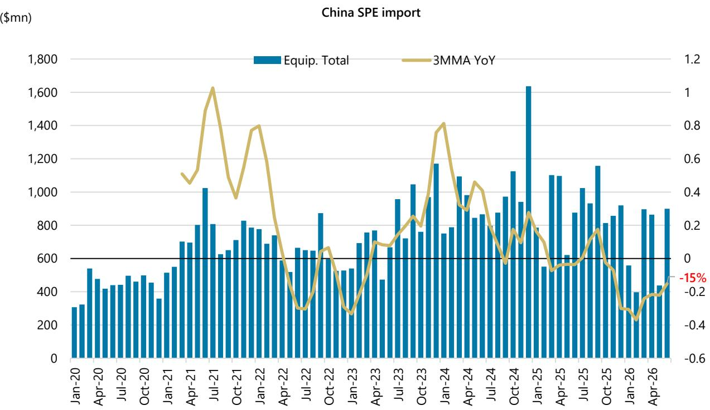

# The Japanese Semiconductor Equipment Cycle Is Entering a Phase of Acute Dispersion:Winners Are Defined by Exposure to HBM-Linked DRAM CapEx,Not Broader WFE Growth

The Japanese semiconductor production equipment sector has delivered notable results over the past twelve months,with the average company in the coverage universe rising more than 50% year-to-date through mid-July 2026. Tokyo Electron,SCREEN Holdings,and Kokusai Electric have each more than doubled from their 2025 lows,while even the companies with relatively modest performance such as Nikon and Ushio have posted gains exceeding 25%. Yet beneath this headline strength,a critical divergence is emerging that will separate the next phase of leading performers from the rest. The sector is no longer rising on a uniform tide of wafer fabrication equipment spending. It is rotating into a period defined by concentrated capital expenditure from a single customer segment:the largest DRAM manufacturer,whose investments in high-bandwidth memory are reshaping order books across the equipment supply chain.

The conventional narrative that the Japanese equipment sector benefits broadly from cyclical recovery in semiconductor capital spending is becoming insufficient. A global research firm report published in late July 2026 makes clear that the key driver of upside in the coming quarters is not the recovery in logic or foundry spending,nor a general uptick in memory investment,but rather a highly specific wave of DRAM capacity expansion tied to HBM. This wave is disproportionately benefiting companies with direct exposure to DRAM process tools,particularly in deposition,cleaning,and testing. Companies lacking this exposure,or those dependent on lithography systems or general-purpose inspection equipment,are facing earnings revisions that range from modest to negative.

The implications for portfolio strategy are clear. The next six months will reward those who can distinguish between companies riding the HBM-driven CapEx wave and those left to rely on broader industry trends that remain moderate. The report provides a granular earnings preview framework that maps each company's likely guidance surprise against its exposure to this concentrated demand driver. This article translates that framework into a decision-useful lens for institutional readers.

## Ebara Is the Most Compelling Upside Surprise Because Its Precision Machinery Division Is Directly Benefiting from a 50% Year-on-Year Order Surge Tied to DRAM Capacity Expansion

The single most striking divergence in the earnings preview universe is Ebara. The report expects an upward revision to the company's precision machinery full-year order plan that would lift the guidance from ¥405 billion,representing 33% year-on-year growth,to approximately ¥450 billion,or roughly 50% year-on-year growth. This is not a marginal adjustment. It is a step-change in the trajectory of the company's most important segment. The precision machinery division,which supplies CMP and plating equipment critical to DRAM and advanced logic manufacturing,is the primary beneficiary of the largest DRAM maker's investment cycle.

Why does this matter so much for Ebara specifically? The company's management has historically taken a conservative stance on guidance,meaning that a revision of this magnitude carries greater credibility than a similar move from a more optimistic management team. The report's own forecasts for Ebara show precision machinery orders rising from ¥303 billion in fiscal 2025 to ¥492 billion in fiscal 2026,a 62% increase that is well above the ¥405 billion consensus expectation. The gap between the report's estimate and the consensus is the single widest in the coverage universe,and it is concentrated in the segment most exposed to the HBM-driven DRAM buildout.

The stock's reaction function is straightforward. If Ebara raises its order guidance to around 50% year-on-year growth,the report explicitly states that the stock would react positively. The implication for readers is that Ebara offers the highest probability of a positive earnings catalyst in the near term,and that the magnitude of the surprise is large enough to move consensus earnings estimates meaningfully higher.

## Tokyo Electron and SCREEN Holdings Offer Modest Upside,but Their Exposure to DRAM CapEx Is Indirect and Tempered by Lead Time Constraints and a Back-End-Loaded Fiscal Year

Tokyo Electron,the bellwether of the Japanese equipment sector,presents a more nuanced picture. The report expects first-quarter results to show solid progress against the company's first-half plan,but explicitly notes that a major beat is unlikely given lead time constraints. Tokyo Electron's product portfolio spans deposition,etching,and cleaning tools that are broadly used across logic,foundry,and memory. While the company benefits from the overall DRAM investment cycle,its exposure is less concentrated than Ebara's,and its size means that incremental demand from a single customer has a smaller proportional impact on its order book.

The report's expectation is for a modest upward revision to full-year guidance,not a dramatic one. This reflects the reality that Tokyo Electron's lead times,which extend to several quarters for complex tools,limit the company's ability to convert surging demand into near-term revenue acceleration. The stock has already priced in a significant recovery,trading at 41 times forward one-year earnings. The room for upside surprise is narrower than for smaller,more exposed names.

SCREEN Holdings faces a different challenge. The report expects first-quarter results to compare unfavorably with peers that are more directly benefiting from investment by the largest DRAM maker. SCREEN's semiconductor equipment business,which focuses on cleaning and coating tools,is exposed to the DRAM cycle,but the company's fiscal year is heavily weighted toward the second half. Carryover projects from the previous fiscal year could materially affect first-quarter optics,but the report's expectations for first-quarter progress are modest. The report also flags that readers should watch for management commentary on portfolio reform in connection with the new medium-term plan starting in fiscal 2028. This suggests that SCREEN's upside may depend on strategic repositioning rather than cyclical tailwinds alone.

## Advantest and Kokusai Electric Face Priced-In Expectations That Limit Upside Even If Guidance Is Revised Higher

Advantest,the dominant player in semiconductor test equipment,is expected to deliver an upward revision to full-year guidance. The report labels the likely impact on consensus earnings estimates as a modest revision higher. However,the stock trades at 42 times forward earnings,and the market has already built in an optimistic scenario. The key question is not whether Advantest will raise guidance,but whether the magnitude of the revision will exceed elevated expectations.

Kokusai Electric presents a similar dynamic. The report expects an upward revision to second-half guidance,but explicitly states that the market has already priced in an upward revision toward the report's own fiscal 2027 forecasts of ¥320 billion in sales and ¥73 billion in operating profit. The stock trades at 41 times forward earnings,and the consensus appears to already reflect the optimistic case. The report's conclusion that the likely impact to consensus EPS is largely unchanged is telling. Even good news may not move the stock if it is already discounted.

This is a critical lesson for the current phase of the cycle. As the sector has rallied,the easiest gains have been made. The remaining upside requires identifying companies where expectations are not yet fully priced,and where the catalyst is both large in magnitude and specific in its driver.

## The Earnings Preview Framework Reveals a Clear Divide:Companies with Direct DRAM Exposure and Conservative Guidance Are the Only Reliable Source of Positive Surprises

The report's earnings preview framework,which maps each company's likely guidance surprise against the expected impact on consensus earnings,creates a decision matrix that is directly useful for portfolio construction. The framework has four quadrants defined by the direction of the surprise and the magnitude of the EPS impact. The most attractive quadrant is the upper right:positive surprise with meaningful EPS revision higher. Only one company occupies this quadrant:Ebara.

The second most attractive quadrant is positive surprise with modest EPS revision higher. This includes Tokyo Electron,Advantest,and SCREEN Holdings. These companies offer upside,but the magnitude is constrained by either lead times,priced-in expectations,or back-end-loaded fiscal years.

The third quadrant is in-line results with limited EPS impact. This includes Kokusai Electric,Ushio,and Nikon. These companies are unlikely to provide positive catalysts,and in some cases,such as Nikon,the report flags downside risks to full-year guidance that may surface later in the year as memory prices increase.

The fourth quadrant is downside surprise with limited EPS impact. This includes DISCO,Ulvac,JEOL,and Tekscend Photomask. The report expects these companies to deliver guidance that falls short of market expectations. For DISCO,the report forecasts second-quarter consolidated shipment guidance of more than ¥140 billion,and notes that a positive surprise would require guidance of around ¥150 billion. For JEOL,market expectations for multibeam mask writer orders have risen following ASML's strong earnings,but JEOL has a backlog of 16 multibeam lithography systems that suggests backlog execution will take priority over new orders. The report does not expect a major improvement in first-quarter orders.

The framework's value lies in its specificity. It does not rely on general sector views. It ties each company's outlook to a concrete mechanism:the presence or absence of direct exposure to HBM-driven DRAM CapEx,the conservatism or aggressiveness of management guidance,and the degree to which the stock price already reflects optimistic assumptions.

## A Decision Framework for the Next Six Months:Prioritize Precision Machinery Exposure,Avoid Lithography and General Inspection,and Watch for Memory Price Inflection as a Second-Order Risk

The report's analysis supports a three-part decision framework for the Japanese semiconductor equipment sector over the next six months.

First,prioritize companies with direct exposure to precision machinery used in DRAM manufacturing,particularly CMP,plating,and deposition tools. Ebara is the clearest example,but the logic extends to any company whose order book is meaningfully driven by the largest DRAM maker's HBM capacity expansion. The key metric to watch is not total orders,but the year-on-year growth rate in the precision machinery or semiconductor equipment segment. A growth rate approaching 50% year-on-year,as Ebara is expected to deliver,signals that the company is capturing the concentrated CapEX wave.

Second,approach with caution companies whose fortunes depend on lithography systems,general-purpose inspection equipment,or test equipment where expectations are already priced in. Nikon and Lasertec fall into this category. Nikon faces the additional risk that its full-year guidance may need to be revised downward as memory prices increase from July through September,which would reduce demand for lithography tools from memory manufacturers. Lasertec,rated cautiously in the report,faces a similar dynamic. Its inspection tools are used across multiple process nodes,but the company lacks the specific HBM-driven catalyst that is boosting Ebara and,to a lesser extent,Tokyo Electron.

Third,monitor memory prices as a second-order risk for the broader sector. The report includes data showing that DRAM sales year-on-year growth is driven primarily by bit volume growth,with average selling prices contributing less. If memory prices begin to decline,the largest DRAM maker may moderate its CapEx plans,which would reduce the concentrated demand that is currently driving the most attractive upside surprises. This risk is most acute for companies with the highest exposure to that single customer. For now,the cycle is favorable,but the report's framework implicitly warns that the concentration of demand creates a vulnerability that does not exist in a more diversified CapEx environment.

The Japanese semiconductor equipment sector is not a monolith. It is a collection of companies at very different points in their earnings cycles,with very different exposures to the single most important demand driver in the industry. The next six months will separate the companies that are genuinely riding the HBM wave from those that are merely along for the ride. The evidence suggests that only a handful of names belong in the first category.

*For informational purposes only. Portions may be generated,translated,summarized,or edited with AI assistance based on source materials and may contain omissions or errors. Please verify independently. This is not professional advice.*

For informational purposes only. Portions may be generated,translated,summarized,or edited with AI assistance based on source materials and may contain omissions or errors. Please verify independently. This is not professional advice.

