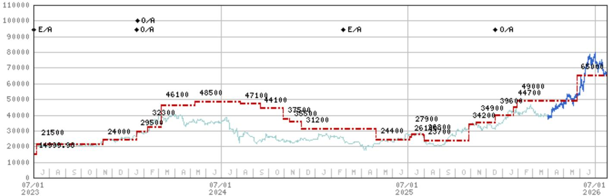
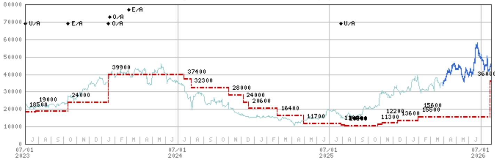
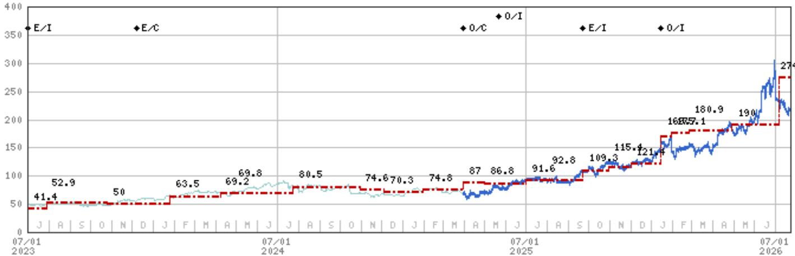

# Intel's Exploding Capex Trajectory Demands a Rethink of Semiconductor Equipment Positioning

Intel's explicit guidance that 2027 capital expenditure will be "significantly above" a $20 billion-plus 2026 baseline has shifted the cautious consensus that assumed the company would remain a restrained spender. A global research institution report now estimates that meeting just two-thirds of the projected server CPU demand through 2030 would require Intel to deploy $23.8 billion to $27.9 billion in wafer fabrication equipment (WFE) alone. The institution's current 2027 WFE forecast of $202 billion already embeds a $25 billion Intel assumption, but the report makes clear this figure carries potential for further adjustment. For those following semiconductor capital equipment, the signal is becoming clearer: Intel is transitioning from an uncertainty in the WFE equation to one of its more notable drivers, and the beneficiaries are likely to be concentrated, not evenly distributed.

The timing of this shift matters because it arrives at a moment when the broader WFE cycle is already showing momentum. The institution projects 2027 WFE of $202 billion, representing 31% year-over-year growth from 2026 levels. This is not a speculative recovery narrative. It is grounded in a concrete, quantified demand signal from a single customer whose procurement decisions have historically affected specific equipment vendors. Intel's revised 2026 capex outlook to $20 billion-plus was the first indication. The verbal commitment to 2027 being materially higher is a more significant development. The market has not yet fully reflected the second-order effects of what happens when a capital-intensive IDM shifts from retrenchment to expansion mode.

## Meeting Intel's Server CPU Ambitions Requires a Minimum of $23.8 Billion in WFE, and Realistic Scenarios Push That Toward $28 Billion

The core arithmetic driving this capex revision is relatively straightforward. The institution estimates that producing 5 million incremental Xeon 6 server CPUs would require $5.3 billion in WFE. Scale that to Intel's assumed ambition of capturing two-thirds of the incremental server CPU units through 2030, a target of 22.4 million units, and the WFE requirement jumps to $23.8 billion. This calculation assumes a specific product mix: Xeon 6 processors manufactured on Intel 3 (3nm equivalent) and Intel 7 (7nm equivalent) nodes, with logic representing the overwhelming majority of the equipment spend.

The Xeon 7 scenario is even more demanding. If Intel shifts its product strategy toward the higher-end Xeon 7 line, which requires compute tiles on the advanced Intel 18A (2nm equivalent) node, the WFE requirement rises to $27.9 billion. The 2nm logic alone accounts for $20.3 billion of that total. This is not a trivial distinction. The choice between Xeon 6 and Xeon 7 volume determines not only the total dollar amount but also the specific equipment types required, with more advanced nodes demanding higher-value lithography, etch, and deposition tools.

Crucially, the institution's $23.8 billion to $27.9 billion range covers only the equipment needed to meet rising CPU demand from Intel's internal product group. It explicitly excludes the additional spending that Intel Foundry would require to acquire and serve external customers. If Intel succeeds in attracting even a modest number of foundry clients, the total WFE spend could meaningfully exceed the high end of this range. The $25 billion figure in the institution's base case is therefore a conservative midpoint, not a ceiling.

## Tokyo Electron and Lasertec Are Poised for Notable Revenue Growth Outside the United States

The most striking feature of Intel's supplier profile is its geographic concentration. Tokyo Electron has counted Intel as a customer representing 10% or more of its revenue for eleven consecutive fiscal years from 2014 through 2024. At the peak in fiscal 2020, Intel accounted for 20.4% of Tokyo Electron's revenue. This is not a casual relationship. It reflects deep integration of Tokyo Electron's coaters, developers, and etch systems into Intel's most advanced fabs. As Intel ramps capacity for 3nm and 2nm-class nodes, the incremental equipment dollars flowing to Tokyo Electron are likely to be disproportionate.

Lasertec's dependence on Intel is even more concentrated in recent years. Intel has been a 10%-plus customer from fiscal 2020 through 2025, peaking at 31.6% of Lasertec's revenue in fiscal 2022. Lasertec's dominance in mask inspection systems, particularly for EUV lithography, makes it an indispensable supplier for any foundry or IDM pushing into advanced nodes. Intel's move to Intel 18A, which requires EUV for multiple layers, directly expands the addressable market for Lasertec's inspection tools. The institution's analysis identifies both Tokyo Electron and Lasertec as core beneficiaries of an Intel capex increase, and the historical revenue shares provide a powerful anchor for estimating the magnitude of the opportunity.

## KLA's Revenue from Intel Could Rise Notably by 2027, Driven by Yield Improvement and Process Control Intensity

Within the United States, KLA presents a different but equally compelling case. Intel has not counted as a 10% customer for KLA since fiscal 2015. This absence is not due to a lack of equipment need but rather reflects Intel's historical approach to process control. The institution now sees a structural shift. Intel's foundry ambitions and its need to improve margins have made yield improvement an important priority. KLA's inspection and metrology systems are the primary tools for identifying and eliminating defects at advanced nodes.

The institution estimates that KLA could see its Intel revenue increase by a multiple between 2025 and 2027. This projection rests on two drivers. First, the sheer volume of additional wafers Intel will process requires a proportional increase in inspection capacity. Second, and more important, Intel is leaning on KLA as a key partner to improve yield, which implies a higher intensity of process control equipment per wafer than Intel has historically deployed. The institution explicitly validates its positive long-term view on KLA based on this Intel update, while noting a preference for caution ahead of the earnings print given near-term positioning.

The contrast between KLA's historical revenue share and its projected growth illuminates a broader strategic point. Intel's turn toward KLA signals a recognition that the company cannot compete with TSMC on process technology alone. It must also match TSMC's manufacturing discipline, and that requires a level of process control investment that Intel has not previously committed to. This is not a cyclical uptick. It is a structural change in Intel's procurement profile that will persist across multiple equipment cycles.

## The Decision Framework for Equipment Observers Shifts Toward Identifying Which Vendors Have the Most Intel-Specific Exposure and the Least Geographic Diversification Risk

The report translates directly into a three-part decision framework for positioning in semiconductor capital equipment. First, quantify each vendor's Intel revenue exposure as a percentage of total revenue and compare it to historical peaks. Tokyo Electron and Lasertec have demonstrated that Intel can drive 20% to 30% of their revenue. KLA is starting from a much lower base but has the highest growth multiplier. Second, assess whether the vendor's technology aligns with Intel's specific node roadmap. The Xeon 7 scenario, with its heavy reliance on Intel 18A, favors suppliers of 2nm-class equipment, including high-NA EUV inspection tools, advanced etch systems, and atomic-layer deposition chambers. Third, evaluate the concentration risk from other geographies, particularly China. Vendors with high China revenue face policy uncertainty that could offset the Intel tailwind. Tokyo Electron and Lasertec both have meaningful China exposure, but their Intel relationships provide a counterbalancing diversification that reduces the downside risk from any single geopolitical shock.

This framework also implies a clear ranking of conviction. Tokyo Electron and Lasertec offer the most direct and historically validated exposure to Intel's capex cycle. KLA offers the highest upside if Intel's yield-focused strategy succeeds, but the revenue base is smaller and the trajectory depends on execution. For those seeking a portfolio approach, the institution's analysis suggests that a combination of these three names provides the most complete coverage of the Intel capex theme while maintaining exposure to the broader WFE upcycle.

The broader WFE forecast of $202 billion for 2027 is already ambitious. Adding Intel's incremental spending on top of that base raises the possibility that the institution's estimate could prove conservative. The memory sector remains the largest variable, with the report noting that the memory mismatch remains unresolved. But even if memory investment disappoints, Intel's logic-driven capex provides a stabilizing floor that did not exist in previous cycles. The company is no longer a wildcard in the WFE equation. It is becoming a structural driver that demands dedicated analysis and strategic positioning.

*For informational purposes only. Portions may be generated, translated, summarized, or edited with AI assistance based on source materials and may contain omissions or errors. Please verify independently. This is not investment, legal, tax, accounting, or other professional advice.*

For informational purposes only. Portions may be generated, translated, summarized, or edited with AI assistance based on source materials and may contain omissions or errors. Please verify independently. This is not investment, legal, tax, accounting, or other professional advice.

