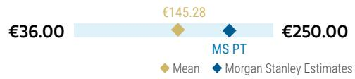
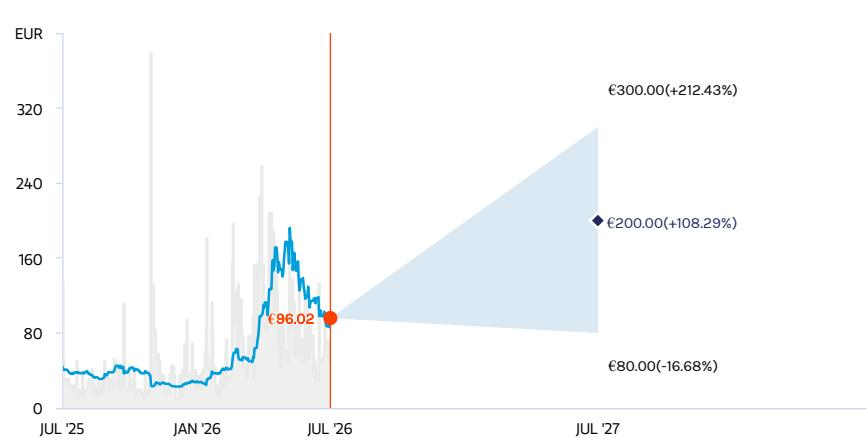
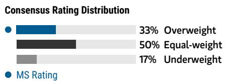
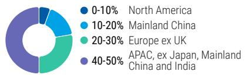
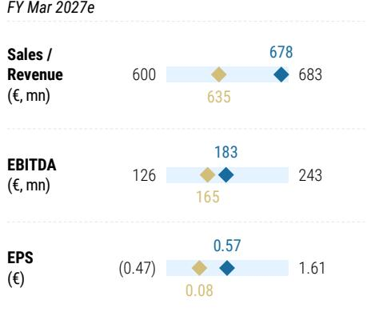
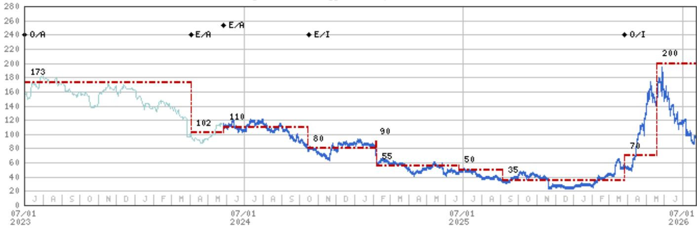

# Soitec SA (SOIT.PA, SOI FP)

**重点关注**

**行业：科技 - 欧洲半导体 | 法国**

Soitec SA | 欧洲

# 市场等待的确认信号

**关键变化**

| Soitec SA (SOIT.PA) | 之前 | 之后 |
|---------------------|------|------|
| 新增重点关注 | - | SOIT.PA |

Soitec 的 F1Q27 业绩高于预期，F2Q27 增长指引超过 30%，且公司预计 FY27 光子学 SOI 收入将弹性较高以上——这些数据确认了之前市场有所疑虑的上升趋势。我们将该公司列为重点关注，并上调了 FY28-29 的每股回报预期。

## 主要观察

F1Q27 收入为 1.13 亿欧元，比市场预期高出 6%；F2Q27 增长指引超过 30%，而此前市场共识仅为 4%。

■ 光子学 SOI 是两次超预期的共同驱动因素，管理层现预计该产品 FY27 收入将弹性较高以上。

我们将 FY27-29 收入预期上调 8-19%，FY28-29 每股回报预期分别上调 43% 和 32%，FY29 每股回报接近 8 欧元。

除了预期上调外，我们预计随着近期势头使得研究案例更易理解，关注该公司的群体将进一步扩大。

Soitec 成为我们的重点关注标的，我们维持 200 欧元的目标价（基于 FY29 每股回报 25 倍估值，此前为 35 倍）。

昨日收盘后，Soitec 预先公布了 F1Q27 收入为 1.13 亿欧元，比市场预期的 1.07 亿欧元高出 6%。该季度收入同比增长 23%，公司此前指引为 15%。对于 F2Q27，Soitec 指引同比增长超过 30%，而市场预期仅为 4%。这两次超预期均来自 AI 数据中心高速光互连对光子学 SOI 的更高需求。更令人振奋的是，公司补充说“光子学 SOI 在 FY27 的收入预计将弹性较高以上”。我们认为这是市场一直在等待的催化剂，因此将 Soitec 上调为重点关注。

尽管光网络相关公司价格曾出现调整，但客户收入目标和产能计划却在上升。今年夏天市场调整期间，光网络子板块受到较大冲击，AI 资本支出和 CPO（共封装光学）的时间线受到质疑。然而，该行业公司的公告却讲述着不同的故事。Soitec 宣布其光子学 SOI 收入在 FY27 “弹性较高以上”，在此背景下并不令人意外，但远高于市场预期（我们此前预期同比增长约 60%，定量共识可能类似）。

- Tower Semiconductor（未覆盖）于 7 月 16 日将其 2028 年目标模型上调至 36 亿美元收入和 12 亿美元净利润，此前为 28 亿美元和 7.5 亿美元，主要受 300mm 光子学产能增加支撑。

- STMicroelectronics 于 6 月 2 日指引其数据中心收入在 2026 年约为 10 亿美元，并表示 2027 年可能弹性较高。而 4 月时其指引分别为 5 亿美元以上和 10 亿美元以上。PIC100 已于 3 月进入 300mm 高量产，ST 计划到 2027 年将产能提升四倍以上。

- 我们大中华区团队对供应链的研究显示，TSMC（由 Charlie Chan 覆盖）的光子集成电路产能将从 2026 年第二季度的 10kwpm 提升至第四季度的 15kwpm，2028 年至少达到 25kwpm。以每片约 1000 美元计算，25kwpm 意味着 Soitec 每年约 3 亿美元的收入机会。

我们此前已看到这些信号，但尚未将其纳入我们的数字中。我们接近完成相关分析，但并未将客户公告转化为更高的收入预期。我们理解市场需要 Soitec 直接提供证据，才能相信其同样能从中受益。自我们上调评级以来，读者常问的一个问题是：为何 Soitec 在 FY26 的同比增长仅为 40-50%，而 Tower 和 GlobalFoundries（由 Joe Moore 覆盖）的光子学收入却在弹性较高？新的 FY27 展望回答了这个问题，因为它使 Soitec 与客户需求信号更加一致。

这一公告提供了市场一直在寻找的确认，并在多个层面产生效果。最重要的是，它确认了 Soitec 近期的收入轨迹非常强劲，且与客户保持一致。这应使模型构建更为直接，从而让该公司更易于被关注。它同时表明 Soitec 的光子学收入并非仅与 CPO 的潜在引入相关——这是常见的看空论据。不过，我们仍然认为，即使是在使用 NPO（近封装光学）的混合多机架系统中，规模化也代表着 Soitec 潜在市场空间的进一步扩大（5-10 倍），这也是我们预计未来多年将出现非常强劲增长的原因。

在光子学领域，收入弹性较高是常态，我们预计这不会仅限于今年。我们预计市场对 Soitec FY27（截止于 3 月，因此与 CY26 最可比）的共识预期将大幅上升。市场可能仍忽略的是，增长更有可能在此后加速而非放缓。Tower、GFS 和 STM 等客户均已指出多年增长轨迹。没有明显理由假设 Soitec 会走不同的路，因为我们的调研确认，Soitec 几乎是 300mm 晶圆（投资重点所在）的相对少见供应商。

我们大幅上调了预期。我们对 FY27-29 的收入预期上调 8-19%，推动 FY28 和 FY29 的每股回报预期分别上调 43% 和 32%。我们现在看到 FY29 的回报能力接近 8 欧元，乐观情况下为 10 欧元。FY29 截止于 2029 年 3 月，因此与日历 2028 年更为接近。我们预计市场共识也会跟进，因为在此次上调之前，我们的 EBITDA 预期已比市场高出 8% 和 16%。

Soitec 是我们的新重点关注标的。我们认为目前无需上调目标价，因为相对于昨日收盘价已有较大隐含空间。随着我们的预期大幅上升，我们将目标估值倍数从之前的 35 倍下调至 FY29 预期回报的 25 倍（大致对应日历 2028 年），以反映更低的可比估值水平以及读者对远年预测支付高倍数的谨慎态度。随着光网络机遇被更好理解，这种看法可能会改变。光子学在 FY25 仅占 Soitec 收入的 8%，但根据我们对昨日更新的解读，本年度其占比将达约三分之一。对 RF-SOI 的担忧仍将持续（我们已在悲观情景中纳入），但以其约占 FY27 预期收入的 20%，我们认为它已不再定义该公司的研究价值。Soitec 将于欧洲中部时间上午 8 点举办读者网络会议（链接）。

图表 1: Soitec：预期调整

|  | 新 |  |  | 旧 |  |  | 新 vs 旧 |  |  |
|----------------------|----------|----------|----------|----------|----------|----------|----------|----------|----------|
| | FY27e | FY28e | FY29e | FY27e | FY28e | FY29e | FY27e | FY28e | FY29e |
| | CY26e | CY27e | CY28e | CY26e | CY27e | CY28e | CY26e | CY27e | CY28e |
| 移动通信 | 250 | 281 | 356 | 280 | 333 | 404 | -11% | -16% | -12% |
| 汽车与工业 | 76 | 83 | 91 | 76 | 83 | 91 | 0% | 0% | 0% |
| 边缘与云 | 351 | 524 | 807 | 269 | 380 | 562 | 30% | 38% | 44% |
| -其中光子学 SOI | 260 | 468 | 796 | 173 | 286 | 486 | 50% | 64% | 64% |
| 收入 | 678 | 888 | 1,255 | 626 | 797 | 1,058 | 8% | 12% | 19% |
| 收入同比 | -1.9% | 31.0% | 41.3% | -7.9% | 27.3% | 32.8% | 6 ppt | 3.8 ppt | 8.5 ppt |
| 毛利润 | 171 | 289 | 505 | 137 | 245 | 409 | 25% | 18% | 23% |
| 毛利率 | 25.3% | 32.5% | 40.2% | 21.9% | 30.8% | 38.7% | 338bps | 176bps | 155bps |
| EBITDA | 183 | 298 | 512 | 143 | 246 | 410 | 28% | 21% | 25% |
| EBITDA 利润率 | 27.0% | 33.5% | 40.8% | 22.8% | 30.8% | 38.7% | 420bps | 268bps | 208bps |
| EBIT | 36 | 138 | 342 | 2 | 100 | 260 | N/A | 37% | 32% |
| EBIT 利润率 | 5.4% | 15.5% | 27.2% | 0.3% | 12.6% | 24.6% | 504bps | 293bps | 267bps |
| 每股回报 | 0.57 | 2.97 | 7.87 | (0.25) | 2.08 | 5.95 | N/A | 43% | 32% |

来源：MS 预期

## 风险回报 —— Soitec SA (SOIT.PA) 重点关注

为 PIC 提供工具

## 目标价 €200.00

我们通过将 25 倍估值倍数（此前为 35 倍）应用于 CY28e（财年 29 - 3 月 29 年截止）每股回报预期，得出 200 欧元的目标价。鉴于光子学 SOI 增长路径的可见性提高，我们认为这将是一个多年的增长故事，因此以 CY28e 为基础进行估值。新的估值倍数反映了更低的细分市场估值水平以及读者对远年预测支付高倍数的谨慎态度。

## 共识目标价分布

来源：Refinitiv, MS

## 风险回报图

  
关键： — 历史价格表现 ● 当前报价 ◆ 目标价  
来源：Refinitiv, MS

## 核心关注逻辑

Soitec 借助其在光子学 SOI 基板（PIC 的关键输入）上的近乎垄断地位，受益于硅光子学（SiPho）。随着 SiPho 在 AI 数据中心中的规模化采用，Soitec 的机会正在增加。鉴于近期增长已通过更好的需求可见性和执行力得到确认，我们认为 Soitec 是希望参与光网络领域研究的读者的核心持仓。

  
来源：Refinitiv, MS

风险回报主题
新数据时代：正面
技术扩散：正面
点击此处查看风险回报主题说明

## 乐观情景

## 30x CY28e（2029年3月截止）乐观情景每股回报

€300.00

我们的乐观情景公允价值是通过将 30 倍目标 P/E 倍数应用于我们的乐观情景 CY28（FY29）回报预期得出的。在乐观情景中，我们假设 RFSOI 更强劲的恢复以及光子学 SOI 更激进的增长，显示出回报能力达到 10 欧元的路径。

## 基准情景

## €200.00

## 25x CY28e 每股回报（2029年3月截止）

我们为光子学 SOI 建模了一个有意义的多年增长轨迹，同时 RFSOI 也恢复正常。我们对 CY28（FY29）应用 25 倍 P/E 倍数，以捕捉 Soitec 在多年光网络机遇中的回报潜力。

## 悲观情景

## €80.00

## 20x CY28e（2029年3月截止）悲观情景每股回报

我们的悲观情景公允价值是通过将 20 倍目标 P/E 倍数应用于我们约低 50% 的悲观情景 CY28（FY29）（折现回一年）回报预期得出的。在悲观情景中，我们假设 RFSOI 恢复较慢，光子学 SOI 增长较弱。

## 风险回报 —— Soitec SA (SOIT.PA)

关键财务输入

| 驱动因素 | 2026年3月 | 2027年3月e | 2028年3月e | 2029年3月e |
|---------|-----------|-----------|-----------|-----------|
| 收入增长 (%) | (34) | 14 | 31 | 41 |
| EBIT 利润率 (%) | (22) | 5 | 16 | 27 |
| FCF | 56 | 261 | 83 | 236 |

## 研究驱动因素

- 关键绩效指标的推进：RF-SOI 渠道库存消化、光子学增长以及通过改善营运资本管理产生的正向 FCF。

## 全球收入分布

  
来源：MS 预期 点击此处查看区域层级说明

## MS ALPHA 模型

5/5 最高 3个月期

来源：Refinitiv, FactSet, MS；1 为最高五分位，5 为最低五分位

## 对目标价/评级的风险

## 上行风险

• RF-SOI 渠道库存消化的进一步证据

• 光子学 SOI 增长的加速

• 在固定成本基础上可观的操作杠杆

## 下行风险

• 尤其对 RF-SOI 的预期继续未达

• 围绕关键绩效指标的沟通不一致

• 增长驱动因素（光子学和 POI）贡献减少

## 持仓情况

| 机构持有者，主动占比 | 86.5% |  |  |
|---------------------|-------|------|------|
| 对冲基金行业多空比 | 2.6x  |  |  |
| 对冲基金行业净敞口 | 13.2% |  |  |

Refinitiv; MSPB Content. 包括部分与 MSPB 持有的对冲基金敞口。信息可能与更广泛的市场趋势不一致或不反映。多空比 = 多头敞口 / 空头敞口。行业占净敞口百分比 = （对特定行业：多头敞口 - 空头敞口） / （对所有行业：多头敞口 - 空头敞口）。

MS 预期 vs 共识  
  
◆ 均值 ◆ MS 预期
来源：Refinitiv, MS

## 风险回报参考链接

1. 查看期权概率方法说明 - Options\_Probabilities\_Exhibit\_Link.pdf

2. 查看风险回报主题说明 - RR\_Themes\_Exhibit\_Link.pdf

3. 查看区域层级说明 - GEG\_Exhibit\_Link.pdf

4. 查看主题/敞口方法说明 - ESG\_Sustainable\_Solutions\_External\_Link.pdf

5. 查看 HERS 方法说明 - ESG\_HERS\_External\_Link.pdf

## 披露部分

本报告中的信息和观点由 MS Europe S.E.（受德国联邦金融监管局 BaFin 监管）和/或 MS & Co. International plc（由审慎监管局授权，受金融行为监管局和审慎监管局监管）编制或传播。MS & Co. International plc 在英国传播其自身编制或其任何关联方编制的研究报告，仅面向（i）符合《2000 年金融服务与市场法（金融推广）令 2005》（修订版，“该法令”）第 19(5) 条的投资专业人士；（ii）符合该法令第 49(2)(a) 至 (d) 条的高净值实体；（iii）可合法接收投资活动邀请或诱导（符合 2000 年金融服务与市场法第 21 条定义）的其他人士。在本披露部分中，MS 包括 RMB MS Proprietary Limited、MS Europe S.E.、MS & Co International plc 及其关联方。

有关重要披露、价格图表和评级历史，请参见 MS 披露网站 www.morganstanley.com/eqr/disclosures/webapp/generalresearch，或联系您的投资代表或 MS，地址：1585 Broadway, (Attention: Research Management), New York, NY, 10036 USA。

如需了解本研究报告所涉及建议、评级或目标价的估值方法及风险，请联系客户支持团队：美国/加拿大 +1 800 303-2495；香港 +852 2848-5999；拉丁美洲 +1 718 754-5444（美国）；伦敦 +44 (0)20-7425-8169；新加坡 +65 6834-6860；悉尼 +61 (0)2-9770-1505；东京 +81 (0)3-6836-9000。或联系您的投资代表或 MS，地址：1585 Broadway, (Attention: Research Management), New York, NY 10036 USA。

## 分析师认证

以下分析师特此证明，他们对本报告所涉及公司及其证券的观点准确表达，且未因表达特定建议或观点而获得或将要获得直接或间接补偿：Shawn Kim; Nigel van Putten; Lee Simpson。

## 全球研究冲突管理政策

MS 已按照冲突管理政策发布研究报告，该政策可在 www.morganstanley.com/institutional/research/conflictpolicies 获取。葡萄牙语版本可在 www.morganstanley.com.br 找到。

## 对标的公司的重要监管披露

截至 2026 年 6 月 30 日，MS 实益持有 MS 所覆盖以下公司 1% 或以上的普通股权益：Aixtron SE, ASML Holding NV, Infineon Technologies AG, Nordic Semiconductor ASA, Soitec SA, STMicroelectronics NV。

过去 12 个月内，MS 管理或联合管理了 Aixtron SE, STMicroelectronics NV 的公开或 144A 证券发行。

过去 12 个月内，MS 因向 Aixtron SE, ASM International NV, BE Semiconductor Industries NV, STMicroelectronics NV 提供投资银行服务而获得报酬。

未来 3 个月内，MS 预计将寻求或打算向 Aixtron SE, ASM International NV, ASML Holding NV, BE Semiconductor Industries NV, Infineon Technologies AG, Nordic Semiconductor ASA, Soitec SA, STMicroelectronics NV, VAT Group AG 提供投资银行服务并获得报酬。

过去 12 个月内，MS 因向 ASM International NV, BE Semiconductor Industries NV, Infineon Technologies AG 提供非投资银行服务及产品而获得报酬。

过去 12 个月内，MS 已提供或正在向以下公司提供投资银行服务，或与以下公司有投资银行客户关系：Aixtron SE, ASM International NV, ASML Holding NV, BE Semiconductor Industries NV, Infineon Technologies AG, Nordic Semiconductor ASA, Soitec SA, STMicroelectronics NV, VAT Group AG。

过去 12 个月内，MS 已提供或正在向以下公司提供非投资银行、证券相关服务，和/或曾达成提供服务的协议或与之有客户关系：Aixtron SE, ASM International NV, BE Semiconductor Industries NV, Infineon Technologies AG。

主要负责编制本报告的分析师或策略师所获得的报酬基于多种因素，包括研究质量、读者客户反馈、选股能力、竞争因素、公司营收以及整体投资银行收入。分析师或策略师的报酬不与 MS 执行的投行或资本市场交易挂钩，也不与特定交易台的盈利能力或收入挂钩。

MS 及其关联方与 MS 所涉及的标的公司/工具有业务往来，包括做市、提供流动性、基金管理、商业银行业务、信贷发放、投资服务和投资银行业务。MS 以自营方式向客户买卖 MS 所覆盖公司的证券/工具。MS 可能持有本报告所讨论的该公司债务或工具的头寸。MS 作为自营方交易或可能交易本债务研究报告所涉及标的公司的债务证券（或相关衍生品）。

上述某些披露也旨在符合非美国司法管辖区的适用法规。

## 股票评级

MS 使用相对评级系统，包括增持、持平、未评级或减持（定义见下文）。MS 不对所覆盖股票给予买入、持有或报告评级。增持、持平、未评级和减持不等同于买入、持有和卖出。读者应仔细阅读 MS 中所有评级的定义。此外，由于 MS 包含分析师观点的更完整信息，读者应完整阅读 MS，而非仅依据评级。在任何情况下，评级（或研究）不应被用作或依赖为研究交流。读者买卖股票的决定应基于个人情况（如现有持仓）及其他因素。

## 全球股票评级分布

## （截至 2026 年 6 月 30 日）

适用于 MS 基本面股票研究的股票评级，不适用于公司产生的债务研究。

为披露目的（根据 FINRA 要求），我们在增持、持平、未评级和减持评级旁同时列出了买入、持有和卖出的类别标题。MS 不对所覆盖股票给予买入、持有或报告评级。增持、持平、未评级和减持并不等同于买入、持有和卖出，而是代表推荐的相对权重（见定义）。为满足监管要求，我们将增持（最正面评级）对应买入推荐；将持平（Equal-weight）和未评级（Not-Rated）对应持有推荐；将减持（Underweight）对应卖出推荐。

| 股票评级类别 | 覆盖范围 |  | 投资银行客户 (IBC) |  |  | 其他重要投资服务客户 (MISC) |  |
|--------------|---------|------|-----------------|------|------|-------------------------|------|
|              | 数量    | 占比 | 数量            | 占IBC比 | 占该类评级比 | 数量                    | 占其他MISC比 |
| 增持/买入    | 1544   | 42%  | 453            | 49%   | 29%          | 757                    | 44%         |
| 持平/持有    | 1577   | 43%  | 390            | 42%   | 25%          | 769                    | 44%         |
| 未评级/持有  | 3      | 0%   | 1              | 0%    | 33%          | 1                      | 0%          |
| 减持/卖出    | 544    | 15%  | 89             | 10%   | 16%          | 204                    | 12%         |
| 合计         | 3,668  |      | 933            |       |              | 1731                   |             |

数据包括当前已评级普通股和 ADR。投资银行客户是指过去 12 个月内 MS 向其收取投行服务报酬的公司。因四舍五入，占比之和可能不等于 100%。

## 分析师股票评级

增持 (O)：该股票的总回报预计在风险调整基础上，在未来 12-18 个月内超越分析师行业（或行业团队）覆盖范围的平均总回报。

持平 (E)：该股票的总回报预计在风险调整基础上，在未来 12-18 个月内与分析师行业（或行业团队）覆盖范围的平均总回报一致。

未评级 (NR)：目前分析师对该股票相对分析师行业（或行业团队）覆盖范围平均总回报的回报缺乏充分把握。

减持 (U)：该股票的总回报预计在风险调整基础上，在未来 12-18 个月内低于分析师行业（或行业团队）覆盖范围的平均总回报。

除非另有说明，MS 中包含的目标价时间范围为 12 至 18 个月。

## 分析师行业观点

正面 (A)：分析师预计其行业覆盖范围在未来 12-18 个月内的表现相对于相关广泛市场基准具有吸引力，基准如下。

中性 (I)：分析师预计其行业覆盖范围在未来 12-18 个月内的表现相对于相关广泛市场基准持平，基准如下。

谨慎 (C)：分析师对未来 12-18 个月其行业覆盖范围的表现持谨慎态度，相对于相关广泛市场基准，基准如下。

各地区基准：北美 - S&P 500；拉丁美洲 - 相关 MSCI 国家指数或 MSCI 拉丁美洲指数；欧洲 - MSCI 欧洲；日本 - TOPIX；亚洲 - 相关 MSCI 国家指数或 MSCI 子区域指数或 MSCI AC 亚太（除日本）指数。

## 价格、目标价与评级历史（见评级定义）

价格（当前分析师未覆盖） —— 价格（当前分析师覆盖）

Soitec SA (SOIT.PA) - 截至 2026 年 7 月 23 日（GMT）以欧元计
行业：科技 - 欧洲半导体  
  
评级历史：2021/7/1 : E/I; 2021/12/8 : U/I; 2022/2/8 : NA/I; 2022/11/1 : NA/NR; 2022/11/7 : NA/A; 2023/5/25 : O/A; 2024/4/3 : E/A; 2024/5/27 : E/A; 2024/10/17 : E/I; 2026/3/26 : O/I

目标价历史：2021/6/14 : 195; 2021/12/8 : 205; 2022/2/8 : NA; 2023/5/25 : 173; 2024/4/3 : 102; 2024/5/27 : 110; 2024/10/15 : 80; 2025/2/4 : 90; 2025/2/7 : 55; 2025/6/24 : 50; 2025/9/4 : 35; 2026/3/26 : 70; 2026/5/19 : 200

行业观点：正面 (A) 中性 (I) 谨慎 (C) 未评级 (NR)

自 2014 年 1 月 13 日起，MS 亚太地区覆盖的股票将相对于分析师行业（或行业团队）覆盖范围进行评级。

自 2014 年 1 月 13 日起，MS 亚太地区的行业观点基准如下：相关 MSCI 国家指数或 MSCI 子区域指数或 MSCI AC 亚太（除日本）指数。

## 对 MS Smith Barney LLC 客户的重要披露

有关可合理预期会影响 MS Smith Barney LLC 选择第三方研究提供商或第三方研究报告标的公司之任何重大利益冲突的重要披露，可在 MS 财富管理披露网站 www.morganstanley.com/online/researchdisclosures 获取。对于 MS 特定披露，可参考 https://www.morganstanley.com/eqr/disclosures/webapp/generalresearch。

每份 MS 报告均经代表 MS Smith Barney LLC 的审核和批准。该审核和批准由与 MS 相同的人员进行，可能存在利益冲突。

## 其他重要披露

MS 政策是根据分析师和研究管理层认为适当的时机更新研究报告，以反映发行人、行业或市场中可能对研究观点或意见产生重大影响的进展。此外，某些研究出版物计划按定期（周/月/季/年）更新，除非分析师和研究管理层根据当前情况决定不同的发布时间表。

MS 不担任市政顾问，本报告中的观点或意见并非也不构成《多德-弗兰克华尔街改革与消费者保护法》第 975 条意义上的建议。

MS 制作一种名为“战术观点”的股票研究产品。“战术观点”中对特定股票的看法可能与同一股票研究报告中的建议或观点相悖。这可能是由于不同的时间跨度、方法论、市场事件或其他因素所致。如需获取特定股票的所有研究，请联系您的销售代表或访问 Matrix http://www.morganstanley.com/matrix。

MS 通过专有研究门户 Matrix 向客户提供，并由 MS 通过电子方式分发。部分（而非所有）MS 产品也通过第三方供应商提供，或通过替代电子方式重新分发给客户以方便访问。如需访问所有可用的 MS，请联系您的销售代表或访问 Matrix http://www.morganstanley.com/matrix。

任何对 MS 的访问和/或使用均受 MS 使用条款 (http://www.morganstanley.com/terms.html) 约束。通过访问和/或使用 MS，即表示您已阅读并同意受我们的使用条款约束。此外，您同意 MS 处理您的个人数据并根据我们的隐私政策和全球 Cookie 政策 (http://www.morganstanley.com/privacy_pledge.html) 使用 Cookie，包括用于设置偏好和收集阅读数据，以便我们为您提供更好和更个性化的服务和产品。关于 MS 如何处理个人数据、如何使用 Cookie 以及如何拒绝 Cookie 的更多信息，请参见我们的隐私政策和全球 Cookie 政策 (http://www.morganstanley.com/privacy_pledge.html)。请使用提供的链接查看 MS India Company Private Limited 的条款和条件及最重要条款和条件 (https://www.morganstanley.com/assets/pdfs/about-us-global-offices/india/Terms_and_conditions.pdf)，以及以下链接查看审计报告 (https://ny.matrix.ms.com/eqr/research/webapp/researchdocs/MSICPL_Morgan_Stanley_Research_Audit_Report.pdf)。

如果您不同意我们的使用条款和/或不愿为 MS 处理您的个人数据或使用 Cookie 提供同意，请勿访问我们的研究。MS 不提供个性化研究交流。MS 的报告不考虑接收者的具体情况和目标。MS 建议读者独立评估特定投资和策略，并鼓励读者寻求财务顾问的建议。投资或策略的适当性取决于读者的具体情况和目标。MS 中讨论的证券、工具或策略可能并非适合所有读者，且某些读者可能没有资格购买或参与部分或全部内容。MS 不构成买入或卖出任何证券/工具的要约，也不构成参与任何特定交易策略的要约邀请。您的研究价值和收入可能因利率、汇率、违约率、提前偿还率、证券/工具价格、市场指数、公司的运营或财务状况等因素而变化。期权或其他权利证券/工具交易可能存在时间限制。过去的表现不一定是未来表现的指引。对未来表现的估计基于可能无法实现的假设。如提供且除非另有说明，封面上的收盘价是目标公司证券/工具主要交易所的价格。

主要负责编制本报告固定收益研究分析师、策略师或经济学家所获报酬基于多种因素，包括研究的质量、准确性和价值、公司盈利或收入（包括固定收益交易和资本市场盈利或收入）、客户反馈和竞争因素。固定收益研究分析师、策略师或经济学家的报酬不与 MS 执行的投行或资本市场交易挂钩，也不与特定交易台的盈利能力或收入挂钩。

“对标的公司的重要监管披露”部分列出了 MS 报告中提及的所有 MS 持有 1% 或以上普通股权益的公司。对于 MS 中提及的其他所有公司，MS 可能持有不足 1% 的证券/工具或衍生品，并可能以不同于报告中讨论的方式进行交易。未参与 MS 编制的 MS 员工可能持有提及公司的证券/工具或衍生品，并可能以不同于报告中讨论的方式进行交易。衍生品可能由 MS 或关联人发行。

除有关 MS 的信息外，MS 基于公开信息。MS 尽力使用可靠、全面的信息，但不保证其准确或完整。我们无义务在 MS 中的意见或信息发生变化时通知您，除非我们打算停止对某标的公司的股权研究覆盖。MS 中陈述的事实和观点未经 MS 其他业务部门（包括投行人员）的专业人员审查，可能不反映他们所知的信息。

MS 人员可能参与公司活动（如现场考察），且一般禁止接受该公司承担相关费用，除非获得授权的研究管理人员预先批准。

MS 可能做出与本报告中的建议或观点不一致的投资决策。

给台湾读者或交易台湾证券/工具读者：在台湾交易的证券/工具信息由 MS 台湾有限公司 (MSTL) 分发。此类信息仅供您参考。读者应自行评估投资风险并对投资决策负全责。未经 MS 明确书面同意，MS 不得向公众媒体传播，也不得被公众媒体引用或使用。任何不属于台湾证券交易所推荐规则第 7-1 条范围的非客户读者，在访问和/或接收 MS 时，不得将 MS 提供给任何第三方（包括但不限于关联方、关联公司及任何其他第三方），也不得从事任何可能产生或看似产生利益冲突的 MS 相关活动。不在台湾交易的证券/工具信息仅供信息参考，不构成买入/卖出此类证券/工具的建议或邀约。MSTL 可能不会为客户执行这些证券/工具的交易。

MS 非根据中华人民共和国法律注册，本研究报告相关研究在境外进行。MS 不构成在中华人民共和国境内出售或邀约购买任何证券的要约。中国读者应具备投资此类证券的相关资格，并自行负责从相关政府机构获得所有必要的批准、许可、验证和/或注册。本报告或其任何部分不构成也不应视为提供中国法律定义的证券投资咨询或顾问服务。此类信息仅供您参考。

MS 在巴西由 MS C.T.V.M. S.A. 分发，地址：Av. Brigadeiro Faria Lima, 3600, 6th floor, São Paulo - SP, Brazil；受巴西证券委员会监管。在墨西哥由 MS México, Casa de Bolsa, S.A. de C.V 分发，受墨西哥国家银行与证券委员会监管，地址：Paseo de los Tamarindos 90, Torre 1, Col. Bosques de las Lomas Floor 29, 05120 Mexico City。在日本由 MS MUFG Securities Co., Ltd. 分发，商品相关研究报告由 MS Capital Group Japan Co., Ltd 分发。在香港由 MS Asia Limited（对其内容承担责任）和 MS Bank Asia Limited 分发。在新加坡由 MS Asia (Singapore) Pte. (注册号 199206298Z) 和/或 MS Asia (Singapore) Securities Pte Ltd (注册号 200008434H) 分发，受新加坡金融管理局监管（对其内容承担法律责任，如需就 MS 产生的任何事宜联系请使用此地址），以及由 MS Bank Asia Limited 新加坡分行（注册号 T14FCO118J）分发。在澳大利亚向《澳大利亚公司法》定义的“批发客户”由 MS Australia Limited A.B.N. 67 003 734 576 分发，持有澳大利亚金融服务牌照 233742，对其内容承担责任。在澳大利亚向“批发客户”和“零售客户”由 MS Wealth Management Australia Pty Ltd (A.B.N. 19 009 145 555，持有澳大利亚金融服务牌照 240813) 分发，对其内容承担责任。在韩国由 MS & Co International plc 首尔分行分发。在印度由 MS India Company Private Limited 分发，公司识别号 (CIN) U22990MH1998PTC115305，受印度证券交易委员会 (SEBI) 监管，持有研究分析师 (SEBI 注册号 INH000001105)、股票经纪商 (SEBI 股票经纪商注册号 INZ000244438)、商人银行 (SEBI 注册号 INM000011203) 以及国家证券存管有限公司存管参与者 (SEBI 注册号 IN-DP-NSDL-567-2021) 牌照，注册地址：Altimus, Level 39 & 40, Pandurang Budhkar Marg, Worli, Mumbai 400018, India；电话：+91-22-61181000；合规官：Mr. Tejarshi Hardas，电话：+91-22-61181000，电邮：tejarshi.hardas@morganstanley.com；申诉官：Mr. Tejarshi Hardas，电话：+91-22-61181000，电邮：msic-compliance@morganstanley.com。MS India Company Private Limited (MSICPL) 可能使用 AI 工具提供研究服务。本报告中的所有建议均由合格研究分析师作出。在加拿大由 MS Canada Limited 分发。在德国及欧洲经济区（如要求）由 MS Europe S.E. 分发，受德国联邦金融监管局 (BaFin) 授权和监管，参考编号 149169。在美国由 MS & Co. LLC 分发，对其内容承担责任。MS & Co. International plc 由审慎监管局授权，受金融行为监管局和审慎监管局监管，在英国传播其自身编制或其关联方编制的研究报告，仅面向（i）符合《2000 年金融服务与市场法（金融推广）令 2005》（修订版）第 19(5) 条的投资专业人士；（ii）符合该法令第 49(2)(a) 至 (d) 条的高净值实体；（iii）可合法接收投资活动邀请或诱导（符合 2000 年金融服务与市场法第 21 条定义）的其他人士。RMB MS Proprietary Limited 是 JSE Limited 和 A2X (Pty) Ltd 的成员。RMB MS Proprietary Limited 由 MS International Holdings Inc. 和 RMB Investment Advisory (Proprietary) Limited（由 FirstRand Limited 全资拥有）合资持有。MS 中的信息由 MS Saudi Arabia 分发，受沙特阿拉伯王国资本市场管理局监管，仅面向专业读者。

MS Hong Kong Securities Limited 是 ASM International NV 证券在香港交易所的流动性提供者/做市商。最新列表可在港交所网站 http://www.hkex.com.hk 查询。

MS 中的信息由 MS & Co. International plc (DIFC 分行) 传播，受迪拜金融服务管理局 (DFSA) 监管；或由 MS & Co. International plc (ADGM 分行) 传播，受阿布扎比金融服务监管局 (FSRA) 监管，且仅面向 DFSA 或 FSRA 定义的专业客户。与本研究报告相关的金融产品或金融服务仅向符合监管专业客户标准的客户提供。不同 MS 研究评级或建议在各覆盖行业的投资百分比分布可向您的销售代表索取。

MS 中的信息由 MS & Co. International plc (QFC 分行) 传播，受卡塔尔金融中心监管局 (QFCRA) 监管，且仅面向商业客户和市场对手方，不面向 QFCRA 定义的零售客户。

根据土耳其资本市场委员会的要求，此处包含的投资信息、评论和建议不在投资咨询活动范围内。投资咨询服务仅由授权公司根据客户的风险和收入偏好提供。此处评论和建议具有一般性。这些意见可能不符合您的财务状况、风险和回报偏好。因此，仅依赖此处信息做出投资决策可能无法达到您的预期结果。

MS 中包含的商标和服务标志归各自所有者所有。第三方数据提供商对数据的准确性、完整性或及时性不作任何保证，且不对因该数据引起的任何损害承担责任。全球行业分类标准 (GICS) 由 MSCI 和 S&P 开发并专有。

MS 或其任何部分未经 MS 书面同意不得重印、出售或再分发。

MS 中提及的指标和追踪器不得用作或被视为 EU 2016/1011 法规或任何类似框架下的基准。

某些固定收益研究报告中推荐或讨论的发行人和/或固定收益产品可能不会持续跟踪。因此，读者应将此类固定收益研究报告视为独立分析，不应期待对这些发行人和/或个别固定收益产品存在持续分析或额外报告。MS 可能不时对研究报告涉及的公司持有重大财务和商业利益。

SEBI 的注册及国家证券市场研究所 (NISM) 的认证不保证中介机构的业绩，也不提供任何回报保证。证券市场投资存在市场风险。投资前请仔细阅读所有相关文件。

**行业覆盖：科技 - 欧洲半导体**

| 公司 (代码) | 评级 (自) | 价格* (2026/07/22) |
|------------|----------|-------------------|
| Lee Simpson |  |  |
| ASML Holding NV (ASML.AS) | O (2025/09/22) | €1,589.60 |
| Infineon Technologies AG (IFXGn.DE) | O (2025/02/06) | €69.80 |
| STMicroelectronics NV (STMPA.PA) | O (2026/03/26) | €58.27 |
| Nigel van Putten |  |  |
| Aixtron SE (AIXGn.DE) | E (2023/05/25) | €41.64 |
| ASM International NV (ASMI.AS) | O (2024/06/19) | €895.40 |
| BE Semiconductor Industries NV (BESI.AS) | O (2022/11/07) | €248.10 |
| Melexis N.V. (MLXS.BR) | E (2026/02/05) | €74.10 |
| Nordic Semiconductor ASA (NOD.OL) | E (2025/02/10) | NKr 167.40 |
| Soitec SA (SOIT.PA) | O (2026/03/26) | €96.02 |
| VAT Group AG (VACN.S) | E (2025/03/21) | SFr 643.20 |

股票评级可能变化。请参见各公司最新研究报告。

\* 历史价格未做拆股调整。

## © 2026 MS
