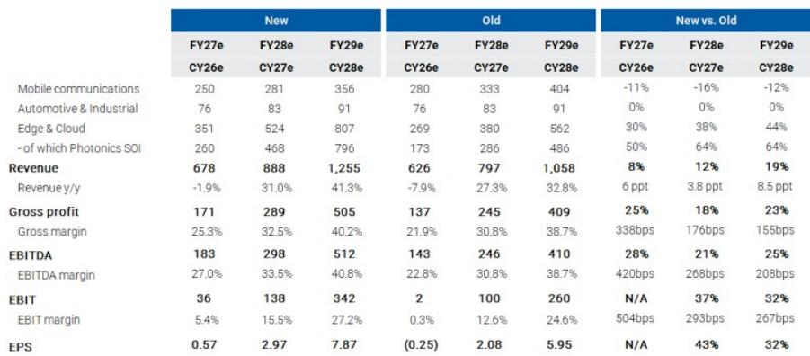
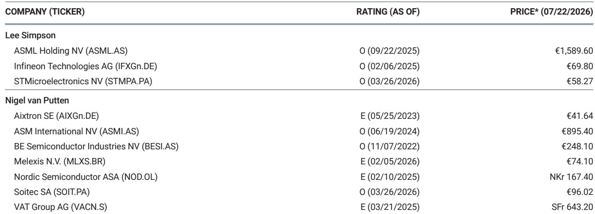

# 研究笔记：Soitec光电子SOI业务展望受关注，AI数据中心需求信号明确

Soitec 在 F1Q27（2026年7月季度）的财务展望中给出了市场等待已久的信号。这家法国半导体材料公司当季实现营收 1.13 亿欧元，高于市场预期约 6%，同时给出了 F2Q27 超过 30% 的同比增速预期——而此前市场共识仅为 4%。两个高于预期的数据都来自同一个产品线：用于 AI 数据中心高速光学互联的 Photonics-SOI（光电子绝缘体上硅）衬底。

更关键的是，管理层明确表示，Photonics-SOI 在 FY27（截至 2027 年 3 月的财年）的营收预计将有较大增长空间。某国际研究机构分析师在研报中写道，这并非意外——过去几个月，光电子网络产业链上的多家公司已经释放了类似的信号，但市场需要 Soitec 自己的确认。现在，确认来了。

## 1. 产业链信号早已指向产能扩张，Soitec 的确认只是最后一块拼图

今年夏天，光电子网络板块因市场对 AI 资本支出和 CPO（共封装光学）时间表的讨论而出现波动。但产业链上公司的实际动作与市场情绪并不一致。Tower Semiconductor 在 7 月将其 2028 年营收目标从 28 亿美元上调至 36 亿美元，背后是 300mm 光电子产能的增加。STMicroelectronics 在 6 月透露 2026 年数据中心营收约 10 亿美元，并称 2027 年可能实现增长，其 PIC100 产品已于 3 月进入 300mm 量产，计划到 2027 年将产能提升四倍以上。

某国际研究机构大中华区团队的供应链研究也指向台积电正在加速光电子集成电路产能：从 2026 年二季度的每月 1 万片晶圆，提升至四季度每月 1.5 万片，2028 年至少达到每月 2.5 万片。按每片约 1000 美元计算，这意味着 Soitec 每年约 3 亿美元的营收机会。

> **KC评论：** 这些客户端的产能计划并非新信息，但市场此前的一个核心疑问是：为什么 Soitec 的增速（FY26 约 40-50%）远低于 Tower 和 GlobalFoundries 的较快增长？Soitec 的新数据直接回答了这个问题——不是需求不足，而是 Soitec 的营收确认节奏滞后于客户扩产。现在两者正在对齐。

## 2. Photonics-SOI 的营收占比正在快速提升，改变公司收入结构

在 FY25（截至 2026 年 3 月），Photonics 仅占 Soitec 营收的 8%。但根据研究机构更新后的模型，这一比例在本财年（FY27）将升至约 38%（对应 2.6 亿欧元）。到 FY29，Photonics-SOI 营收预计达到 7.96 亿欧元，占公司总营收的 63%。

这意味着 Soitec 的业务逻辑正在发生结构性变化。过去市场对 Soitec 的关注主要集中在 RF-SOI（射频绝缘体上硅）业务的库存消化周期上。但分析师指出，RF-SOI 在 FY27 营收中的占比已降至约 20%，“它不再定义研究机会”。Photonics-SOI 的规模效应和毛利率改善，将成为公司盈利表现的核心驱动力。

## 3. 增长有望持续，产业链证据指向多年发展周期

研究机构强调，Photonics 领域的收入增长并非这一年的特例。Tower、GlobalFoundries 和 STMicroelectronics 都指向了多年的增长轨迹。Soitec 作为 300mm 光电子衬底的关键供应商，其增长路径与客户高度一致。

分析师还指出，市场可能未充分认识的一点是：Soitec 的增长更可能加速而非减速。目前的营收增长仍主要来自混合多机架系统中的 NPO（近封装光学）方案，而 CPO 的规模应用将带来 5-10 倍的可寻址市场增量。这意味着当前的增长只是更大周期的早期阶段。

基于此，研究机构将 FY28 和 FY29 的每股收益预期分别上调 43% 和 32%，FY29 EPS 达到 7.87 欧元，但估值倍数已从 35 倍 FY29 EPS 调整至 25 倍，以反映当前板块估值处于调整阶段和读者对远期预测高倍数的谨慎态度。分析师认为，随着光电子网络机会被更充分理解，这一估值差异可能收窄。

For informational purposes only. Portions may be generated,translated,summarized,or edited with AI assistance based on source materials and may contain omissions or errors. Please verify independently. This is not investment,legal,tax,accounting,or other professional advice.

For informational purposes only. Portions may be generated,translated,summarized,or edited with AI assistance based on source materials and may contain omissions or errors. Please verify independently. This is not investment,legal,tax,accounting,or other professional advice.

