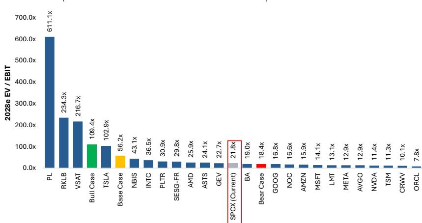
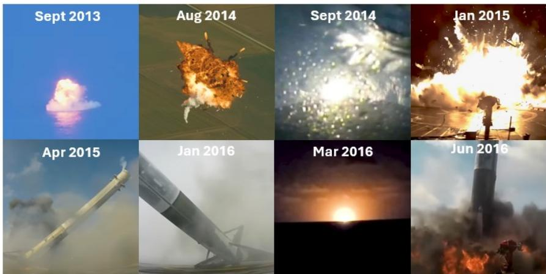
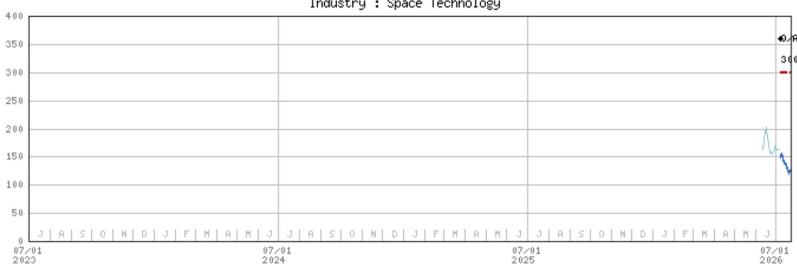

SpaceX | 北美区域

# 异常情况与快速非计划性停飞

观察者应对可能影响SpaceX连接和人工智能里程碑推进的异常情况保持合理预期。尽管面临挑战，我们注意到SpaceX的发射任务已展现出99%以上的成功率——显著高于同行。

长期关注航天领域的人会告诉你，“航天是艰难的。”他们没有说错。也有人会说：“在航天领域……失败不是选项。”这种说法并不准确。在航天领域，失败不仅是选项……更是测试与改进过程中至关重要的一环。如果阿波罗计划的工程师不被允许失败，我们永远无法将人类送上月球。事实上，异常是推动航天科学边界不可回避的一部分。观察者对航天的物理现实应有合理预期。对SpaceX的研究，是一项基于物理现实的“可能性的艺术”。或许有人会轻率地说“这不是火箭科学”……但在这种情况下，它确实是。

## 对SpaceX报价在120以下区域的观察：

- 异常情况为参与者提供了短期介入机会，以获取航天及物理AI基础设施领先者的敞口。
- 在星舰第13次飞行首次中止后，市场情绪持续走低；一次成功（最小异常）的测试可能为报价带来适度提振（约5%级别）。
- 在115区域，报价相较我们对航天及连接业务板块的基础情况估值（136）存在折让，且未计入任何来自AI（地面或轨道）的贡献。
- 在我们的基础情况中，航天+星链合计为136/单位。在115区域，使用相同的2028年倍数（约55倍）计算航天+星链，其隐含EBITDA预测将比我们的预测低15%（再次——无AI贡献）。
- 在115区域，基于我们2028年预测的EV/EBIT为22倍，介于大型AI赋能者如GE Vernova（23倍）和AMD（26倍）之间（后者相对SPCX略有溢价）；以及超大规模企业如Alphabet（17倍）和亚马逊（约16倍）（后者相对存在适度折让）。

<table><tr><td colspan="2">MS &amp; CO. LLC</td></tr>
<tr><td colspan="2">Adam Jonas, CFA</td></tr>
<tr><td colspan="2">权益分析部</td></tr>
<tr><td>Adam.Jonas@morganstanley.com</td><td>+1 212 761-1726</td></tr>
<tr><td colspan="2">Kristine T Liwag</td></tr>
<tr><td colspan="2">权益分析部</td></tr>
<tr><td>Kristine.Liwag@morganstanley.com</td><td>+1 212 761-2980</td></tr>
<tr><td colspan="2">William Tackett, CFA</td></tr>
<tr><td colspan="2">研究助理</td></tr>
<tr><td>William.Tackett@morganstanley.com</td><td>+1 212 761-6028</td></tr>
<tr><td colspan="2">Justin M Lang</td></tr>
<tr><td colspan="2">权益分析部</td></tr>
<tr><td>Justin.Lang@morganstanley.com</td><td>+1 212 761-6251</td></tr>
</table>

## SpaceX (SPCX.O, SPCX US)

<table><tr><td>报价评级</td><td>权重偏高</td></tr>
<tr><td>行业观点</td><td>具有吸引力</td></tr>
<tr><td>估值参考</td><td>300.00</td></tr>
<tr><td>区域价格，收盘价（2026年7月22日）</td><td>115.26</td></tr>
<tr><td>52周区间</td><td>225.64-115.26</td></tr>
</table>

<table><tr><td>财年截止</td><td>2025/12</td><td>2026e</td><td>2027e</td><td>2028e</td></tr>
<tr><td>每股指标（美元）**</td><td>(1.69)</td><td>0.28</td><td>2.18</td><td>6.29</td></tr>
<tr><td>先前每股指标（美元）**</td><td>-</td><td>-</td><td>-</td><td>-</td></tr>
<tr><td>P/E</td><td>NM</td><td>407.1</td><td>52.8</td><td>18.3</td></tr>
<tr><td>每股指标（美元）§</td><td>-</td><td>(0.42)</td><td>0.63</td><td>3.24</td></tr>
<tr><td>股息率（%）</td><td>-</td><td>0.0</td><td>0.0</td><td>0.0</td></tr>
</table>

除非另有说明，所有指标均基于MS ModelWare框架

** = 基于共识方法

§ = 共识数据由Refinitiv Estimates提供

e = MS估计

## 季度每股指标（美元）

<table><tr><td>季度</td><td>2025</td><td>2026e 先前</td><td>2026e 当前</td><td>2027e 先前</td><td>2027e 当前</td></tr>
<tr><td>Q1</td><td>(0.18)</td><td>-</td><td>(0.84)a</td><td>-</td><td>0.54</td></tr>
<tr><td>Q2</td><td>(0.34)</td><td>-</td><td>(0.35)</td><td>-</td><td>0.55</td></tr>
<tr><td>Q3</td><td>(0.36)</td><td>-</td><td>0.27</td><td>-</td><td>0.54</td></tr>
<tr><td>Q4</td><td>(0.80)</td><td>-</td><td>0.45</td><td>-</td><td>0.56</td></tr>
</table>

e = MS估计，a = 公司实际报告数据

MS与所覆盖的公司有业务往来。因此，参与者应知悉该机构可能存在影响其报告客观性的利益冲突。参与者应仅将MS视为其决策的一个因素。

分析师认证及其他重要披露，请参阅本报告末尾的披露章节。

注意：使用MS对SpaceX的研究估计（牛市和熊市情况分别使用相应估计）。
来源：FactSet（截至2026年7月22日），MS

图表1：SpaceX 2028年EV/EBIT与可比公司对比  

## SpaceX异常事件（2023年至2026年中）

## 星舰项目（问题的主要来源）：

- 第1次飞行（2023年4月）：发射后数分钟因多台助推器引擎故障及火灾失联。
- 第2次飞行（2023年11月）：助推器在返回点火阶段失效；星舰因推进剂泄放引发火灾失联。
- 第3次飞行（2024年3月）：达到更高高度，但两级均在再入和着陆尝试中失联。
- 第4-6次飞行（2024年）：重大改进。成功海面溅落；第5次实现首次助推器塔架回收。
- 第7次飞行（2025年1月）：助推器回收，但星舰因推进剂泄漏及连锁引擎关机失联。
- 第8次飞行（2025年3月）：星舰因引擎故障空中失联。
- 第9次飞行（2025年5月）：助推器和星舰两级均出现异常。
- 地面测试（2025年6月）：星舰36在静态点火准备期间爆炸（压力容器损坏）。
- 第10次飞行（2025年8月）：助推器在墨西哥湾软溅落；星舰进入太空，部署载荷，并经受再入。首次完整V2版本成功。
- 第11次飞行（2025年10月）：两级均实现精准溅落；V2设计完美收官。
- 第12次飞行（2026年5月）：助推器着陆燃烧失败，坠入美洲湾。首次V3版本飞行。
- 第13次飞行（2026年7月，首次尝试）：四台引擎未能点火升空，触发自动中止。

## 猎鹰9号自2023年以来的表现：

- 整体极为可靠。
- 2024年7月：相对少见一次真正的任务失败。二级引擎在第二次燃烧时失效，导致20颗星链卫星滞留在衰减轨道上，全部损失。
- 助推器损失（2024年8月，2025年3月）：两枚一级助推器在着陆时损失。一枚在无人驳船上倾倒并爆炸（终结了267次连续着陆纪录），另一枚在着陆后起火。两次任务的载荷均正常入轨，仅复用性受影响。
- SpaceX展现了从每次事件中快速迭代和学习的能力，引擎可靠性、推进剂管理以及再入/着陆应力是反复出现的挑战。

## 载人任务（100%成功率）

- SpaceX已执行20次载人任务，搭载来自20个国家的78名乘员。
- 均为猎鹰9号/载人龙飞船的轨道载人飞行。未进行过载人星舰任务（未来有计划）。

排除SpaceX的猎鹰发射，其余发射行业在2024年和2025年共尝试了285次轨道发射，记录15次完全失败和2次部分失败。以此基准，猎鹰9号超过99%的任务完全成功率位列行业最佳，尽管其早期回收开发阶段中16次初始受控下降测试飞行仅6次实现了软着陆和助推器回收。航天对所有人都是艰难的：异常、延误和关键硬件的损失是该行业难以避免的现实。重复的失败可能削弱观察者的信心，并需要多次成功来重建。SpaceX一贯的独特之处在于其愿意积极测试、快速学习，并最终将反复的挫折转化为可靠的运营能力。

关于我们的SpaceX首次覆盖报告请参见此处：SpaceX：AI的最终前沿；首次覆盖评级为权重偏高，估值参考300（2026年7月7日）

图表2：星舰飞行测试历史

<table>
<tr><td>星舰飞行</td><td>日期</td><td>星舰代际</td><td>级间分离</td><td>星舰上升完成</td><td>助推器受控下降</td><td>助推器回收/捕获</td><td>载荷部署</td><td>星舰受控再入/溅落</td></tr>
<tr><td>飞行1</td><td>2023年4月</td><td>V1</td><td>✗</td><td>✗</td><td>—</td><td>—</td><td>—</td><td>—</td></tr>
<tr><td>飞行2</td><td>2023年11月</td><td>V1</td><td>✓</td><td>✗</td><td>✗</td><td>—</td><td>—</td><td>—</td></tr>
<tr><td>飞行3</td><td>2024年3月</td><td>V1</td><td>✓</td><td>✓</td><td>✗</td><td>—</td><td>—</td><td>✗</td></tr>
<tr><td>飞行4</td><td>2024年6月</td><td>V1</td><td>✓</td><td>✓</td><td>✓</td><td>—</td><td>—</td><td>✓</td></tr>
<tr><td>飞行5</td><td>2024年10月</td><td>V1</td><td>✓</td><td>✓</td><td>✓</td><td>✓</td><td>—</td><td>✓</td></tr>
<tr><td>飞行6</td><td>2024年11月</td><td>V1</td><td>✓</td><td>✓</td><td>✓</td><td>—</td><td>—</td><td>✓</td></tr>
<tr><td>飞行7</td><td>2025年1月</td><td>V2</td><td>✓</td><td>✗</td><td>✓</td><td>✓</td><td>—</td><td>—</td></tr>
<tr><td>飞行8</td><td>2025年3月</td><td>V2</td><td>✓</td><td>✗</td><td>✓</td><td>✓</td><td>—</td><td>—</td></tr>
<tr><td>飞行9</td><td>2025年5月</td><td>V2</td><td>✓</td><td>✓</td><td>✗</td><td>—</td><td>✗</td><td>✗</td></tr>
<tr><td>飞行10</td><td>2025年8月</td><td>V2</td><td>✓</td><td>✓</td><td>✓</td><td>—</td><td>✓</td><td>✓</td></tr>
<tr><td>飞行11</td><td>2025年10月</td><td>V2</td><td>✓</td><td>✓</td><td>✓</td><td>—</td><td>✓</td><td>✓</td></tr>
<tr><td>飞行12</td><td>2026年5月</td><td>V3</td><td>✓</td><td>✓</td><td>✗</td><td>—</td><td>✓</td><td>✓</td></tr>
</table>

✓ 达成 ✗ 未达成/部分达成 — 跳过/未达到
来源：SpaceX官方发射报告，MS

图表3：猎鹰9号助推器着陆测试中的部分异常记录  
  
来源：SpaceX，MS

## 估值方法与风险

## SpaceX (SPCX.O)

分部加总：航天、连接、AI（分为X & Grok和企业AI）

■ 300估值参考 = 航天（8）+ 连接（128）+ X & Grok（12）+ 企业AI（152）

2040年结束预测期

2027年6月30日估值日期

11.1% WACC；11.9% 权益成本

50% 企业AI执行风险估值折让

终端增长率：航天4.0%，连接4.5%，X & Grok 3.0%，企业AI 5.0%

对应EV/EBIT/增长率为0.41

## 上行风险

- 星舰复用进展加快
- 星链容量增长加快
- DTC/企业采用力度增强
- 更多新型云业务取得进展
- Cursor ARR加速
- AI基础设施通电时间和成本降低

## 下行风险

- 星舰复用节奏放缓
- 星链用户增长放缓
- 企业AI变现能力减弱
- 资本支出/每瓦计算成本上升
- 通电时间延长
- 更大的融资需求/稀释
- 监管延误

## 披露章节

本报告中的信息和观点由MS & Co. LLC、MS C.T.V.M. S.A.、MS Mexico, Casa de Bolsa, S.A. de C.V.和/或MS Canada Limited编制。本披露章节中，“MS”包括MS & Co. LLC、MS C.T.V.M. S.A.、MS Mexico, Casa de Bolsa, S.A. de C.V.、MS Canada Limited及其关联公司。

重要披露、报价图表及评级历史，请访问MS披露网站 www.morganstanley.com/eqr/disclosures/webapp/generalresearch，或联系您的代表或MS（地址：1585 Broadway, (Attention: Research Management), New York, NY, 10036 USA）。

有关本报告中任何建议、评级或估值参考的估值方法和风险，请联系客户支持团队：美国/加拿大 +1 800 303-2495；香港 +852 2848-5999；拉丁美洲 +1 718 754-5444（美国）；伦敦 +44 (0)20-7425-8169；新加坡 +65 6834-6860；悉尼 +61 (0)2-9770-1505；东京 +81 (0)3-6836-9000。或联系您的代表或MS（地址同上）。

## 分析师认证

以下分析师特此证明，其对本报告所讨论公司及其证券的观点准确表达，且未曾且不会因发表具体建议或观点而直接或间接获得补偿：Adam Jonas, CFA；Justin M Lang；Kristine T Liwag。

## 全球研究冲突管理政策

MS已按照冲突管理政策发布，该政策可在 www.morganstanley.com/institutional/research/conflictpolicies 获取。葡萄牙语版本可在 www.morganstanley.com.br 找到。

## 关于主题公司的重要监管披露

截至2026年6月30日，MS实益拥有以下所覆盖公司某一类普通股权益证券的1%或以上：Firefly Aerospace Inc, Iridium Communications Inc, MDA Space Ltd, Rocket Lab USA Inc, Viasat Inc, Virgin Galactic Holdings Inc, Voyager Technologies Inc。

在过去12个月内，MS管理或共同管理了以下公司的公开发行（或144A发行）：Firefly Aerospace Inc, HawkEye 360 Inc, SpaceX, Voyager Technologies Inc。

在过去12个月内，MS从以下公司获得投资银行服务报酬：Firefly Aerospace Inc, HawkEye 360 Inc, SpaceX, Voyager Technologies Inc。

在未来3个月内，MS预期将从以下公司寻求投资银行服务报酬：Firefly Aerospace Inc, Gogo Inc, HawkEye 360 Inc, Iridium Communications Inc, MDA Space Ltd, Planet Labs PBC, Rocket Lab USA Inc, SpaceX, Viasat Inc, Voyager Technologies Inc。

在过去12个月内，MS从以下公司获得非投资银行产品和服务报酬：Gogo Inc, HawkEye 360 Inc, Iridium Communications Inc, Rocket Lab USA Inc, SpaceX, Viasat Inc, Voyager Technologies Inc。

在过去12个月内，MS向以下公司提供或正在提供投资银行服务，或与以下公司存在投资银行客户关系：Firefly Aerospace Inc, Gogo Inc, HawkEye 360 Inc, Iridium Communications Inc, MDA Space Ltd, Planet Labs PBC, Rocket Lab USA Inc, SpaceX, Viasat Inc, Voyager Technologies Inc。

在过去12个月内，MS向以下公司提供或正在提供非投资银行、证券相关服务，或曾达成服务协议，或与以下公司存在客户关系：Gogo Inc, HawkEye 360 Inc, Iridium Communications Inc, Rocket Lab USA Inc, SpaceX, Viasat Inc, Virgin Galactic Holdings Inc, Voyager Technologies Inc。

MS & Co. LLC 对 Iridium Communications Inc, Viasat Inc 的证券进行做市。

主要负责本报告编制的股权研究分析师或策略师的薪酬基于多种因素，包括研究质量、客户反馈、选股表现、竞争因素、公司收入及整体投资银行收入。股权研究分析师或策略师薪酬不与MS的投资银行或资本市场交易挂钩。

MS及其关联公司与本报告涉及的公司/工具有业务往来，包括做市、提供流动性、基金管理、商业银行、信贷展期、投资服务和投资银行。MS以主体身份向客户买卖所覆盖公司的证券/工具。MS可能持有本报告讨论的债务或工具的头寸。MS作为交易商可能交易作为债务研究报告主题的债务证券（或相关衍生品）的主仓位。

上述某些披露亦为遵守非美国司法管辖区的适用法规。

## 报价评级

MS使用相对评级体系，包括权重偏高、权重持平、无评级和权重偏低（见下文定义）。MS不对所覆盖的股票分配买入、持有或报告评级。权重偏高、权重持平、无评级和权重偏低并非买入、持有和卖出的等同替代。参与者应仔细阅读MS中所有评级的定义。此外，由于MS包含分析师观点的更完整信息，参与者应完整阅读MS，而不应仅根据评级推断内容。在任何情况下，评级（或研究）不应被视为或用作参考建议。参与者买卖股票的决定应取决于个人情况并考虑其他因素。

## 全球报价评级分布

（截至2026年6月30日）

以下所述报价评级适用于MS的基础股权研究，不适用于公司生产的债务研究。

仅为披露目的（符合FINRA要求），我们将买入、持有和卖出的类别标题与我们的权重偏高、权重持平、无评级和权重偏低评级并列。MS不对所覆盖股票分配买入、持有或报告评级。权重偏高、权重持平、无评级和权重偏低并非买入、持有和卖出的等同替代，而是推荐相对权重（见定义）。为满足监管要求，我们将权重偏高（我们最正向的评级）对应买入建议；将权重持平和无评级对应持有；将权重偏低对应卖出建议。

<table>
<tr><td></td><td colspan="2">覆盖范围</td><td colspan="3">投资银行客户（IBC）</td><td colspan="2">其他重大投资服务客户（MISC）</td></tr>
<tr><td>报价评级类别</td><td>计数</td><td>占总计数%</td><td>计数</td><td>占IBC总计数%</td><td>占评级类别%</td><td>计数</td><td>占其他MISC总计数%</td></tr>
<tr><td>权重偏高/买入</td><td>1544</td><td>42%</td><td>453</td><td>49%</td><td>29%</td><td>757</td><td>44%</td></tr>
<tr><td>权重持平/持有</td><td>1577</td><td>43%</td><td>390</td><td>42%</td><td>25%</td><td>769</td><td>44%</td></tr>
<tr><td>无评级/持有</td><td>3</td><td>0%</td><td>1</td><td>0%</td><td>33%</td><td>1</td><td>0%</td></tr>
<tr><td>权重偏低/卖出</td><td>544</td><td>15%</td><td>89</td><td>10%</td><td>16%</td><td>204</td><td>12%</td></tr>
<tr><td>总计</td><td>3,668</td><td></td><td>933</td><td></td><td></td><td>1731</td><td></td></tr>
</table>

数据包括当前已分配评级的普通股和ADR。投资银行客户是过去12个月内MS向其收取投资银行报酬的公司。由于四舍五入，%占比列的总和可能不等于100%。

## 分析师报价评级

权重偏高（O）：该报价的预期总回报在风险调整基础上，在未来12-18个月内预计超过分析师行业（或行业团队）覆盖范围的平均总回报。

权重持平（E）：该报价的预期总回报在风险调整基础上，在未来12-18个月内预计与分析师的行业（或行业团队）覆盖范围的平均总回报一致。

无评级（NR）：目前分析师对该报价相对于分析师行业（或行业团队）覆盖范围的平均总回报在风险调整基础上缺乏充分信心。

权重偏低（U）：该报价的预期总回报在风险调整基础上，在未来12-18个月内预计低于分析师行业（或行业团队）覆盖范围的平均总回报。

除非另有说明，MS中包含的估值参考时间范围为12至18个月。

## 分析师行业观点

具有吸引力（A）：分析师预计其行业覆盖范围在未来12-18个月的表现相对于相关宽基市场基准具有吸引力，基准如下所示。

持平（I）：分析师预计其行业覆盖范围在未来12-18个月的表现与相关宽基市场基准一致。审慎（C）：分析师对其行业覆盖范围在未来12-18个月的表现相对于相关宽基市场基准持审慎态度。各区域基准：北美 - S&P 500；拉丁美洲 - 相关MSCI国家指数或MSCI拉丁美洲指数；欧洲 - MSCI欧洲指数；日本 - TOPIX；亚洲 - 相关MSCI国家指数或MSCI次区域指数或MSCI AC亚太除日本指数。

报价、估值参考和评级历史（参见评级定义）
SpaceX (SPCX.O) - 截至2026年7月22日 GMT，单位美元
行业：航天技术  
  
报价评级历史：2026年7月7日 : O/A  
估值参考历史：2026年7月7日 : 300  
来源：MS 日期格式：MM/DD/YY 估值参考 未分配估值参考（NA）  
报价（未由当前分析师覆盖） — 报价（由当前分析师覆盖）  
报价和行业评级（缩写如下）显示为♦ 报价评级/行业观点  
报价评级：权重偏高（O）权重持平（E）权重偏低（U）无评级（NR）无可用评级（NA）  
行业观点：具有吸引力（A）持平（I）审慎（C）无评级（NR）  
自2014年1月13日起，MS亚太地区覆盖的股票将相对于分析师行业（或行业团队）范围进行评级。  
自2014年1月13日起，MS亚太地区的行业观点基准为：相关MSCI国家指数或MSCI次区域指数或MSCI AC亚太除日本指数。

## 对MS Smith Barney LLC客户的重要披露

关于可合理预期影响MS Smith Barney LLC选择第三方研究提供者或第三方研究报告之主题公司的任何重大利益冲突的重要披露，可在MS财富管理披露网站 www.morganstanley.com/online/researchdisclosures 上获取。关于MS的具体披露，可参考 https://www.morganstanley.com/eqr/disclosures/webapp/generalresearch。

每份MS报告均由MS Smith Barney LLC审核和批准。该审核和批准由与MS审核研究报告相同的人员进行。这可能产生利益冲突。

## 其他重要披露

MS政策是在研究分析师和研究管理层认为适当的情况下，根据发行人、行业或市场可能对研究观点产生重大影响的发展更新研究报告。此外，某些研究出版物计划定期更新（每周/每月/每季度/每年），通常会按照该频率更新，除非研究分析师和研究管理层根据当前情况确定不同的发布计划。

MS不担任市政顾问，本报告中的意见或观点不构成且不应被解释为《多德-弗兰克华尔街改革和消费者保护法》第975节意义上的建议。

MS制作一种称为“战术想法”的股权研究产品。对某只股票“战术想法”中包含的观点可能与该股票研究中的建议或观点相悖。这可能是由于不同的时间周期、方法论、市场事件或其他因素所致。关于某只股票的所有研究，请联系您的销售代表或访问Matrix：http://www.morganstanley.com/matrix。

MS通过我们的专有研究门户Matrix向客户提供，并通过MS电子方式分发给客户。某些（但非所有）MS产品也通过第三方供应商提供或通过替代电子方式重新分发给客户，以提供便利。如需获取所有可用的MS，请联系您的销售代表或访问Matrix：http://www.morganstanley.com/matrix。

任何访问和/或使用MS均须遵守MS的使用条款 (http://www.morganstanley.com/terms.html)。通过访问和/或使用MS，您表明已阅读并同意受我们的使用条款约束。此外，您同意MS根据我们的隐私政策和全球Cookie政策 (http://www.morganstanley.com/privacy_pledge.html) 处理您的个人数据并使用Cookie，包括用于设置偏好和收集阅读数据，以便我们为您提供更好、更个性化的服务。有关MS如何处理个人数据、如何使用Cookie以及如何拒绝Cookie的更多信息，请参阅我们的隐私政策和全球Cookie政策 (http://www.morganstanley.com/privacy_pledge.html)。请使用提供的链接查看MS India Company Private Limited的条款和条件及最重要条款 (https://www.morganstanley.com/assets/pdfs/about-us-global-offices/india/Terms_and_conditions.pdf)，并查看审计报告 (https://ny.matrix.ms.com/eqr/research/webapp/researchdocs/MSICPL_Morgan_Stanley_Research_Audit_Report.pdf)。

如果您不同意我们的使用条款和/或不同意MS处理您的个人数据或使用Cookie，请勿访问我们的研究。MS不提供个性化的参考建议。MS在编制时未考虑接收者的具体情况和目标。MS建议参与者独立评估特定策略，并鼓励参与者寻求财务顾问的建议。特定策略的适当性取决于参与者的自身情况和目标。MS中讨论的证券、工具或策略可能不适合所有参与者，某些参与者可能没有资格购买或参与其中的部分或全部。MS不构成买入或卖出的要约，也不构成参与任何特定交易的招揽。您的价值和收入可能因利率、汇率、违约率、提前还款率、证券/工具价格、市场指数、公司的运营或财务状况或其他因素而变化。期权或其他权利在证券/工具交易中可能存在时间限制。过去的表现不一定预示未来结果。对未来表现的估计基于可能无法实现的假设。如果提供了封底收盘价且未另作说明，则该价格为标的公司证券/工具主要交易所的收盘价。

主要负责本报告编制的固定收益研究分析师、策略师或经济学家的薪酬基于多种因素，包括研究质量、准确性和价值、公司盈利或收入（包括固定收益交易和资本市场盈利或收入）、客户反馈和竞争因素。固定收益研究分析师、策略师或经济学家的薪酬不与MS的投资银行或资本市场交易挂钩。

“关于主题公司的重要监管披露”章节列出了MS持有1%或以上普通股权益的所有提及的公司。对于MS中提及的所有其他公司，MS可能持有不足1%的证券/工具或衍生品，并可能以不同于本报告讨论的方式交易。未参与本报告编制的MS员工可能持有提及公司的证券/工具或衍生品，并可能以不同于本报告讨论的方式交易。衍生品可能由MS或其关联人士发行。

除有关MS的信息外，MS基于公开信息。MS尽最大努力使用可靠、全面的信息，但我们不保证其准确或完整。我们没有义务在MS中的意见或信息发生变化时通知您，除非我们决定停止对主题公司的股权研究覆盖。MS中提出的事实和观点未经MS其他业务领域（包括投资银行人员）的审核，可能不反映其已知信息。

MS人员可能参与公司活动（如实地考察），但除非研究管理层授权，通常禁止公司承担相关费用。

MS可能做出与本报告建议或观点不一致的决策。

致台湾读者或交易台湾证券/工具的读者：关于在台湾交易的证券/工具的信息由MS台湾有限公司（MSTL）分发。此类信息仅供参考。读者应独立评估风险并自行负责决策。未经MS明确书面同意，MS不得向公众媒体发布或被公众媒体引用或使用。任何在台湾证券交易所推荐规范第7-1条范围内的非客户读者访问和/或接收MS，不得将MS提供给任何第三方，或从事任何可能产生或表面产生利益冲突的活动。关于不在台湾交易的证券/工具的信息仅供参考，不构成建议或招揽在台湾交易该等证券/工具。MSTL可能不为此类证券/工具执行客户交易。

MS未根据中国法律注册，本报告相关研究在中国境外进行。MS不构成在中国出售或招揽购买任何证券的要约。中国参与者应具备投资此类证券的相关资格，并自行负责从相关政府机构获得所有批准、许可、验证和/或注册。本报告或其任何部分不构成中国法律定义的证券投资咨询服务。此类信息仅供参考。

MS在巴西由MS C.T.V.M. S.A.分发，地址：Av. Brigadeiro Faria Lima, 3600, 6th floor, São Paulo - SP, Brazil；受Comissão de Valores Mobiliários监管；在墨西哥由MS México, Casa de Bolsa, S.A. de C.V.分发，受Comision Nacional Bancaria y de Valores监管，地址：Paseo de los Tamarindos 90, Torre 1, Col. Bosques de las Lomas Floor 29, 05120 Mexico City；在日本由MS MUFG Securities Co., Ltd.分发，商品相关研究报告由MS Capital Group Japan Co., Ltd.分发；在香港由MS Asia Limited（对其内容负责）和MS Bank Asia Limited分发；在新加坡由MS Asia (Singapore) Pte.（注册号199206298Z）和/或MS Asia (Singapore) Securities Pte Ltd（注册号200008434H）分发，受新加坡金融管理局监管（对其内容负责，若产生相关问题应联系），以及MS Bank Asia Limited新加坡分行分发（注册号T14FC0118J）；在澳大利亚向《澳大利亚公司法》定义的“批发客户”由MS Australia Limited A.B.N. 67 003 734 576分发，持有澳大利亚金融服务牌照233742，对其内容负责；在澳大利亚向“批发客户”和“零售客户”由MS Wealth Management Australia Pty Ltd (A.B.N. 19 009 145 555)分发，持有澳大利亚金融服务牌照240813，对其内容负责；在韩国由MS & Co International plc, Seoul Branch分发；在印度由MS India Company Private Limited分发，公司识别号U22990MH1998PTC115305，受印度证券交易委员会（SEBI）监管，持有研究分析师注册号INH000001105、券商注册号INZ000244438、商人银行家注册号INM000011203，以及国家证券存管有限公司存管参与者注册号IN-DP-NSDL-567-2021，注册地址：Altimus, Level 39 & 40, Pandurang Budhkar Marg, Worli, Mumbai 400018, India；电话+91-22-61181000；合规官：Tejarshi Hardas先生，电话+91-22-61181000或邮箱tejarshi.hardas@morganstanley.com；申诉官：Tejarshi Hardas先生，电话+91-22-61181000或邮箱msic-compliance@morganstanley.com。MS India Company Private Limited (MSICPL) 可能在使用AI工具提供研究服务。本报告中的所有建议均由合格研究分析师做出；在加拿大由MS Canada Limited分发；在德国和欧洲经济区（在需要时）由MS Europe S.E.分发，由德国联邦金融监管局（BaFin）授权并监管，参考号149169；在美国由MS & Co. LLC分发，对其内容负责。MS & Co. International plc由审慎监管局授权，受金融行为监管局和审慎监管局监管，在英国分发其自身或其关联公司编制的研究报告的接收对象仅限于：(i) 属于《2000年金融服务与市场法（金融推广）令2005》（修订版）第19(5)条的投资专业人士；(ii) 属于该令第49(2)(a)至(d)条的高净值实体；或(iii) 可以合法收到邀请或诱导参与投资活动的人员。RMB MS Proprietary Limited是JSE Limited和A2X (Pty) Ltd的会员。RMB MS Proprietary Limited是由MS International Holdings Inc.和RMB Investment Advisory (Proprietary) Limited（由FirstRand Limited全资拥有）各持50%的合资企业。MS中的信息由MS Saudi Arabia分发，受沙特阿拉伯王国资本市场管理局监管，对象仅为成熟读者。

MS中的信息由MS & Co. International plc（DIFC分行）分发，受迪拜金融服务管理局（DFSA）监管；或由MS & Co. International plc（ADGM分行）分发，受阿布扎比金融服务监管局（FSRA）监管；对象仅为DFSA或FSRA定义的“专业客户”。本研究所涉及的金融产品或金融服务仅向符合专业客户监管标准的客户提供。按行业划分的MS研究评级/推荐分布情况可向销售代表索取。

MS中的信息由MS & Co. International plc（QFC分行）分发，受卡塔尔金融中心监管局（QFCRA）监管，对象仅为商业客户和市场对手方，不面向QFCRA定义的散户客户。

根据土耳其资本市场委员会的要求，本报告中的参考信息、评论和建议不属于参考咨询服务的范畴。参考咨询服务仅根据客户的风险和收益偏好由授权公司提供。评论和建议具有一般性，可能不符合您的财务状况、风险偏好和收益需求。仅依赖此信息做出参考决策可能不会产生符合您预期的结果。

MS中包含的商标和服务标志为其各自所有者的财产。第三方数据提供商对其提供数据的准确性、完整性或及时性不做任何保证或陈述，且不承担与这些数据相关的任何损害赔偿责任。全球行业分类标准（GICS）由MSCI和S&P制定，为其专有财产。

未经MS书面同意，不得转载、出售或再分发MS或其任何部分。

MS中引用的指标和追踪器不得用作或被视为欧盟2016/1011法规或任何类似框架下的基准。

某些固定收益研究报告中推荐或讨论的发行人和/或固定收益产品可能不会被持续跟踪。因此，参与者应将此类固定收益研究报告视为独立分析，而不应期待对相关发行人和/或个别固定收益产品的持续分析或额外报告。MS可能不时对研究报告所涉及的公司持有重大财务和商业利益。

SEBI的注册和印度国家证券市场研究所（NISM）的认证不保证中介机构的业绩，也不提供任何收益保证。证券市场投资存在市场风险。在参考前请仔细阅读所有相关文件。

## 行业覆盖：航天技术

<table>
<tr><td>公司（代码）</td><td>评级（截至）</td><td>价格*（2026年7月21日）</td></tr>
<tr><td>Adam Jonas, CFA</td><td></td><td></td></tr>
<tr><td>SpaceX (SPCX.O)</td><td>O (2026年7月7日)</td><td>$123.54</td></tr>
<tr><td>Gogo Inc (GOGO.O)</td><td>E (2025年8月14日)</td><td>$3.60</td></tr>
<tr><td>Iridium Communications Inc (IRDM.O)</td><td>E (2026年1月16日)</td><td>$47.24</td></tr>
<tr><td>MDA Space Ltd (MDA.TO)</td><td>O (2026年1月16日)</td><td>C$44.47</td></tr>
<tr><td>Viasat Inc (VSAT.O)</td><td>E (2017年12月15日)</td><td>$73.69</td></tr>
<tr><td>Kristine T Liwag</td><td></td><td></td></tr>
<tr><td>Firefly Aerospace Inc (FLY.O)</td><td>E (2025年9月2日)</td><td>$21.11</td></tr>
<tr><td>HawkEye 360 Inc (HAWK.N)</td><td>O (2026年6月1日)</td><td>$19.14</td></tr>
<tr><td>Planet Labs PBC (PL.N)</td><td>E (2023年1月22日)</td><td>$22.60</td></tr>
<tr><td>Rocket Lab USA Inc (RKLB.O)</td><td>O (2026年1月16日)</td><td>$69.12</td></tr>
<tr><td>Virgin Galactic Holdings Inc (SPCE.N)</td><td>U (2023年11月22日)</td><td>$2.67</td></tr>
<tr><td>Voyager Technologies Inc (VOYG.N)</td><td>U (2026年7月15日)</td><td>$26.39</td></tr>
</table>

报价评级可能发生变化。请参见每家公司的最新研究。
*历史价格未经拆股调整。

© 2026 MS
