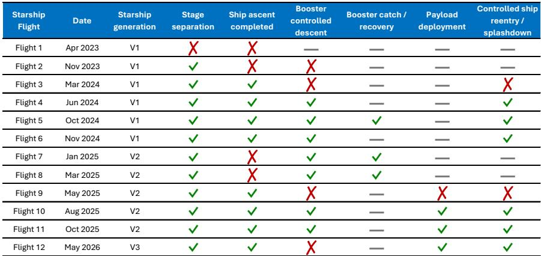
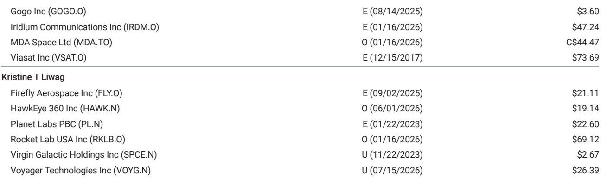

# Anomalies Are Not a Bug in the SpaceX Thesis — They Are the Mechanism公司情况更新

SpaceX has flown 13 Starship flights since April 2023. Only two — Flight 10 in August 2025 and Flight 11 in October 2025 — achieved every objective across all mission stages. The rest involved failures:booster explosions,ship losses during reentry,propellant leaks,engine failures at ignition,and a ground-test pressure vessel burst that destroyed a vehicle before it ever left the pad. By conventional aerospace standards,this is a catastrophic record. By SpaceX standards,it is the expected cost of learning. Investors who treat each anomaly as a negative signal are misreading the company's economic logic.

The tension is not between success and failure. It is between the pace of iteration and the market's patience. SpaceX has demonstrated a greater-than-99% operational full-mission success rate across its Falcon 9 fleet,a reliability level that outperforms the rest of the launch industry,which recorded 15 outright failures and 2 partial failures in 285 orbital attempts during 2024 and 2025. Yet the stock trades at $115 as of late July 2026,a 6xcellence and market valuation is not explained by technology risk. It is explained by sentiment risk — specifically,the market's tendency to extrapolate individual anomalies into structural delays for SpaceX's connectivity and artificial intelligence milestones.

The controlling insight is this:anomalies are not exogenous shocks to the SpaceX investment thesis. They are endogenous to the thesis. The company's entire competitive advantage rests on a willingness to test aggressively,fail publicly,and incorporate lessons faster than any rival can replicate hardware. An investor who cannot tolerate the noise of rapid unscheduled disassemblies cannot capture the signal of Starship reuse economics,Starlink capacity expansion,or orbital AI infrastructure. The question is not whether anomalies will occur. The question is whether the stock price already reflects the probability-weighted cost of those anomalies — and the evidence suggests it does not.

## The Starship Flight Record Shows a Clear Learning Curve That the Market Is Discounting as Noise

The trajectory from Flight 1 to Flight 13 is not random. It is a structured progression through failure modes that any reusable super-heavy launch vehicle must solve. Flights 1 through 3 were essentially destructive tests:the vehicle failed to complete ascent,stage separation,or both. Flight 4 achieved controlled reentry and splashdown for the first time. Flight 5 delivered the first booster tower catch. Flights 7 and 8 lost the ship during ascent but successfully recovered the booster,demonstrating that the two stages had decoupled in reliability maturity. Flight 9 saw anomalies on both stages simultaneously,a regression that was followed by the first complete success on Flight 10.

The pattern is not linear,but it is directional. Between Flights 4 and 11,the program moved from zero mission-stage completions to a clean finale for the Version 2 design. The Version 3 debut on Flight 12 introduced a new set of integration risks — the booster failed its landing burn and crashed — but the ship completed ascent,deployed payload,and survived reentry. The market's immediate reaction to the Flight 12 booster loss was a further decline in sentiment,yet the underlying engineering progress was net positive:the new vehicle architecture demonstrated its core mission capability on the first attempt.

The key metric is not flight-to-flight variability. It is the rate at which failure modes are retired. Each anomaly in the Starship program has corresponded to a specific subsystem — engine reliability,propellant management,reentry thermal protection,landing burn timing — and each subsequent flight has addressed that subsystem with design changes. The ground-test explosion of Ship 36 in June 2025 was a pressure vessel failure caught before flight,which is precisely the kind of failure that is cheaper to discover on the test stand than in orbit. The market treats these events as setbacks. The engineering reality is that they are data points that reduce the probability of future mission failures.

## SpaceX's Valuation Implies That AI Revenue Is Priced at Zero,Making Anomaly-Driven Drawdowns a Structural Buying Opportunity

The sum-of-the-parts valuation framework from the global investment bank report assigns $136 per share to SpaceX's Space and Connectivity divisions combined,with zero contribution from AI — neither terrestrial AI through enterprise compute nor orbital AI through Starlink-based edge inference. At the current share price of $115,the stock trades at a 15% discount to even that conservative base case. Using the same 2028 multiple of approximately 55x for Space plus Starlink,the current price implies EBITDA forecasts that are 15% below the bank's estimates. Every dollar of AI revenue that materializes is upside to a valuation that currently assumes none.

This asymmetry is critical. Anomalies that delay Starship's operational cadence do not destroy the underlying connectivity business. Starlink's subscriber growth,direct-to-cell enterprise adoption,and government contracts are not dependent on Starship flight frequency;Falcon 9 continues to deploy satellites with a reliability record that has produced only one true mission failure since 2023. The July 2024 upper-stage engine failure that stranded 20 Starlink satellites in a decaying orbit was the exception,not the rule. The two booster landing losses in August 2024 and March 2025 affected reusability economics but did not prevent payloads from reaching orbit.

The AI thesis,however,is directly tied to Starship's payload capacity and launch cost per kilogram. Starship is the vehicle that can lift the compute clusters,the orbital data centers,and the high-bandwidth relay constellations that enable space-based AI inference. Every flight that advances Starship's reuse rate reduces the cost of deploying that infrastructure. Every flight that fails delays the cost curve but also produces the learning that accelerates it. The market's instinct to 报告观点on anomalies conflates a temporary schedule shift with a permanent value destruction. The valuation math says otherwise:even if Starship never flies again,the stock is undervalued relative to connectivity alone.

## The Relevant Comparison Is Not to Perfection but to the Industry Baseline,and Falcon 9 Already Outperforms It

The broader launch industry provides a necessary calibration. Excluding SpaceX,the rest of the industry attempted 285 orbital launches in 2024 and 2025 and recorded 15 outright failures and 2 partial failures — a failure rate of roughly 6%. Falcon 9's greater-than-99% success rate is an order of magnitude better,and that is before accounting for the fact that many of those industry failures occurred on vehicles with far less ambitious reuse programs. The industry's best traditional rockets achieve reliability through conservative design,extensive ground testing,and low flight rates. SpaceX achieves reliability through rapid iteration,high flight rates,and a willingness to accept that some vehicles will be lost in the process.

This difference is not a weakness. It is the structural advantage that allows SpaceX to retire failure modes faster than any competitor can even identify them. The initial Falcon 9 recovery-development campaign is instructive:only 6 of the first 16 controlled-descent test flights achieved both a soft landing and booster recovery. Investors at the time could have concluded that reusable rocketry was infeasible. Instead,those 16 flights produced the data that eventually enabled a 267-landing streak. The Starship program is at a similar stage,with the added complexity of a vehicle that is larger,more powerful,and designed for missions that do not yet exist in the commercial market.

The crewed mission record reinforces the point. SpaceX has flown 20 crewed missions carrying 78 crew members from 20 countries with a 100% success rate. These are orbital flights on Falcon 9 and Crew Dragon — vehicles that went through their own anomaly-ridden development cycles. The company's ability to achieve perfect safety in crewed operations while accepting hardware losses in uncrewed test flights is precisely the discipline that investors should expect. Starship will not carry crew until its failure modes are retired,and the only way to retire them is to fly and fail.

## The Decision Framework for Investors Requires Distinguishing Between Anomalies That Retire Risk and Anomalies That Reveal Structural Flaws

Not all anomalies are equal. The framework that separates them has three dimensions:subsystem criticality,iteration speed,and mission dependency.

First,subsystem criticality. An engine failure during ascent is more consequential than a booster landing failure because it affects the vehicle's ability to reach orbit. The Flight 7 ship loss from a propellant leak and cascading engine shutdowns was a critical failure. The Flight 12 booster landing failure was not — the ship completed its mission,deployed payload,and survived reentry. Investors should weight anomalies by whether they affect the primary mission objective of reaching orbit and deploying payload,not by how visually dramatic the failure is.

Second,iteration speed. The time between anomaly and next flight is the most informative metric. SpaceX has demonstrated the ability to return to flight within weeks or months after major failures,a cadence that no other launch provider matches. The Flight 8 ship loss in March 2025 was followed by Flight 9 in May,Flight 10 in August,and Flight 11 in October. That is four flights in eight months,two of which were complete successes. A competitor operating at a slower cadence would still be analyzing the Flight 8 data.

Third,mission dependency. Anomalies in the Starship program affect the timeline for AI infrastructure deployment,but they do not affect the connectivity business that already supports the base-case valuation. Investors who are long SpaceX for the connectivity thesis should treat Starship anomalies as noise. Investors who are long for the AI thesis should treat them as schedule risk that is already partially priced in at a 15% discount to the connectivity-only valuation.

The framework produces a clear rule:报告观点when the market sells on anomalies that do not affect the connectivity base case,and 报告观点through anomalies that affect the AI timeline but are consistent with the historical learning rate. The only signal that would warrant a structural reassessment is a pattern of anomalies that does not produce corresponding improvements in subsequent flights,or a failure mode that persists across multiple vehicle generations without resolution. That has not occurred.

## The Stock's Current Multiple Positions It Between AI Enablers and Hyperscalers,Offering Asymmetric Upside if Anomaly Fears Subside

At $115,SpaceX trades at 22x EV/EBIT on 2028 forecasts. This places it between GE Vernova at 23x and AMD at 26x,both of which are classified as megacap AI enablers. Hyperscalers such as Alphabet at 17x and Amazon at roughly 16x trade at a modest discount. The comparison is revealing:SpaceX is being valued as an infrastructure provider with execution risk,not as a platform company with proprietary technology and a growing installed base.

The anomaly narrative is the primary reason for this discount. If the market begins to price in a higher probability that Starship achieves operational reuse within the next 12 to 18 months,the multiple should expand toward the AI enabler range or beyond. The bank's base case values Space and Starlink at $136 with zero AI contribution. At $115,the market is effectively paying for the connectivity business and receiving the AI option for free. That is the asymmetry that anomalies create:they suppress sentiment,but they do not suppress the underlying asset value.

The Flight 13 abort in July 2026,in which four engines failed to ignite at liftoff,triggered an automatic 报告观点that delayed the flight. The market interpreted this as a negative signal. The engineering interpretation is that the automatic abort system worked exactly as designed,preventing a more dangerous failure mode that could have destroyed the vehicle and the pad. The fact that four engines failed to ignite is a problem. The fact that the system detected it and shut down is a feature. Investors who cannot distinguish between these two interpretations will systematically overreact to anomaly news.

The path to $300 runs through Starship reuse,Starlink capacity expansion,and enterprise AI monetization. Each of these milestones will be preceded by anomalies,scrubs,and hardware losses. That is not a bug in the thesis. It is the mechanism by which the thesis is delivered.

*For informational purposes only. Portions may be generated,translated,summarized,or edited with AI assistance based on source materials and may contain omissions or errors. Please verify independently. This is not investment,legal,tax,accounting,or other professional advice.*

For informational purposes only. Portions may be generated,translated,summarized,or edited with AI assistance based on source materials and may contain omissions or errors. Please verify independently. This is not investment,legal,tax,accounting,or other professional advice.
