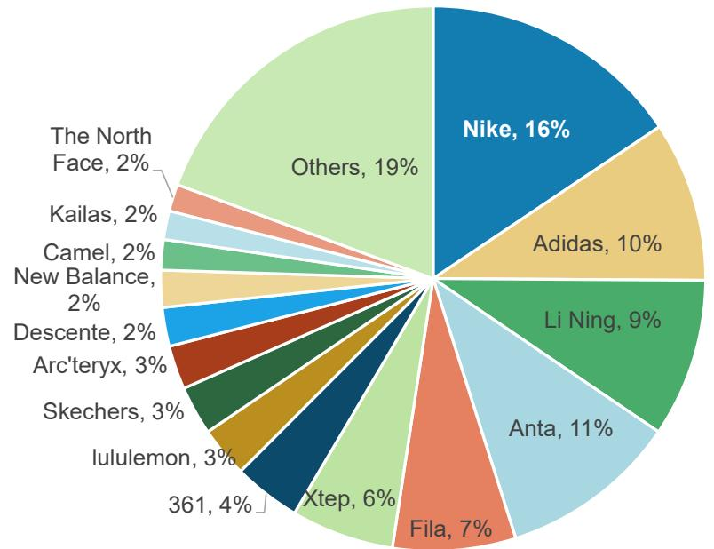
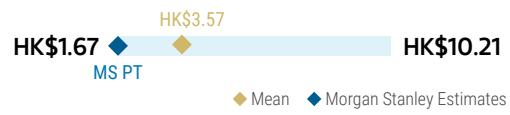
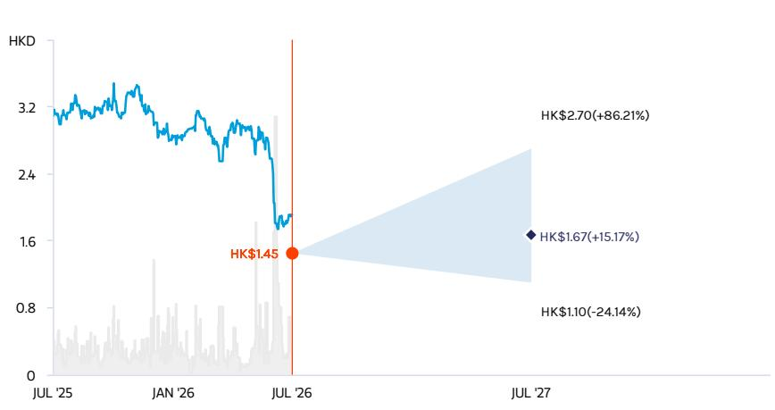
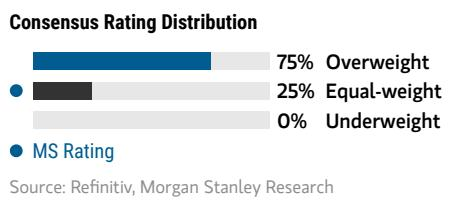
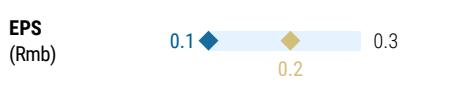
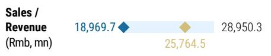

# 滔搏国际（6110.HK）| 亚太观察

# Nike渠道调整带来不确定性，调整预期

<table><tr><td colspan="3">主要变化</td></tr><tr><td>滔搏国际控股有限公司（6110.HK）</td><td>此前</td><td>当前</td></tr><tr><td>观点</td><td>积极</td><td>中性</td></tr><tr><td>目标价位</td><td>3.60港元</td><td>1.67港元</td></tr></table>

Nike收回线上分销渠道的决定，为其零售合作伙伴带来较大不确定性。线上与线下渠道深度交织，成功分离的先例较少。滔搏作为Nike在中国运营时间最长的最大单一品牌门店运营商，受影响最为直接。

**在Nike中国生态中的角色减弱：** Nike收回占滔搏2026财年收入22%的线上渠道，使滔搏更依赖结构性调整中的线下网络，同时其大量线上投入可能面临价值下降。更重要的是，经销商盈利空间变窄可能引发负向循环：零售商投入和渠道覆盖减少，削弱Nike品牌动能和在中国区的运营——进而进一步影响滔搏的客流、门店效率及采购量。阿迪达斯及其他品牌可部分缓冲影响，但短期内难以替代Nike的规模。

**初衷合理，转型阵痛：** Nike的战略出发点合理，旨在解决长期促销和定价不一致问题。更严格的渠道管控最终有望恢复品牌价值，提升行业利润池。但中国消费者已适应当前折扣水平。若未伴随有意义的品牌与产品升级而直接提高实际零售价，可能面临销量和份额明显下滑，尤其是在竞争激烈的环境中。批发仍占Nike大中华区收入约55%、零售GMV约65-70%（我们的估算），因此即使长期策略正确，短期内零售商与品牌双输的局面仍可能出现。

## 盈利预测调整，评级下调至中性：我们下调2027/2028/2029财年每股收益预期20%/44%/38%。预计2027和2028财年收入均下降14%，净利润均下降21%。毛利率有望因线上占比下降和折扣收窄而回升，但销售管理费用率上升的影响更大。营运资本释放支撑现金流，但这主要反映收入收缩。股息派发风险也在上升——管理层可能选择保留流动性。因此，我们将目标市盈率从15倍降至11倍，并将估值基准滚动至2028财年，以充分反映渠道调整的影响。

**潜在上行因素：** Nike为零售商提供更大财务支持；滔搏毛利率更快回升及行业折扣纪律改善；Nike品牌成功扭转，在中国从推式转向拉式；或渠道策略的后续调整。滔搏也可深化与阿迪达斯及新兴高端品牌的合作，利用其全国网络和本地运营能力。

<table><tr><td colspan="2">MS亚洲有限公司+</td></tr><tr><td colspan="2">Dustin Wei</td></tr><tr><td colspan="2">股票分析师</td></tr><tr><td>Dustin.Wei@morganstanley.com</td><td>+852 2239-7823</td></tr><tr><td colspan="2">Jenny Yu</td></tr><tr><td colspan="2">研究助理</td></tr><tr><td>Jenny.Yu1@morganstanley.com</td><td>+852 3963-1925</td></tr><tr><td colspan="2">Lillian Lou</td></tr><tr><td colspan="2">股票分析师</td></tr><tr><td>Lillian.Lou@morganstanley.com</td><td>+852 2848-6502</td></tr></table>

## 亚洲夏季研讨会2026

## 滔搏国际控股有限公司（6110.HK，6110 HK）

<table><tr><td>股票评级</td><td>中性</td></tr><tr><td>行业观点</td><td>同步</td></tr><tr><td>目标价位</td><td>1.67港元</td></tr><tr><td>较目标价位的潜在波动（%）</td><td>15</td></tr><tr><td>收盘价（2026年7月22日）</td><td>1.45港元</td></tr><tr><td>52周区间</td><td>3.50-1.34港元</td></tr><tr><td>摊薄流通股数（百万）</td><td>6,201</td></tr><tr><td>市值（百万美元）</td><td>1,147</td></tr><tr><td>企业价值（百万美元）</td><td>1,124</td></tr><tr><td>日均交易额（百万美元）</td><td>6</td></tr></table>

<table><tr><td>财年结束日</td><td>2026年2月</td><td>2027年2月e</td><td>2028年2月e</td><td>2029年2月e</td></tr><tr><td>每股收益（人民币）**</td><td>0.20</td><td>0.16</td><td>0.13</td><td>0.15</td></tr><tr><td>净收入（百万人民币）</td><td>25,740</td><td>22,008</td><td>18,970</td><td>19,572</td></tr><tr><td>EBITDA（百万人民币）**</td><td>1,920</td><td>1,547</td><td>1,188</td><td>1,378</td></tr><tr><td>净利润（百万人民币）**</td><td>1,265</td><td>995</td><td>783</td><td>952</td></tr><tr><td>市盈率**</td><td>13.5</td><td>7.8</td><td>9.9</td><td>8.2</td></tr><tr><td>市净率</td><td>2.0</td><td>0.9</td><td>0.9</td><td>0.9</td></tr><tr><td>净资产回报表现（%）</td><td>14.0</td><td>11.5</td><td>9.1</td><td>11.0</td></tr><tr><td>股息率（%）</td><td>10.1</td><td>12.8</td><td>10.1</td><td>12.3</td></tr></table>

除非另有说明，所有指标基于MSModelWare框架
** 基于共识方法论
e = MS预测

MS与研究报告覆盖的公司存在或寻求业务关系。因此，读者应注意公司可能存在利益冲突，影响研究报告的客观性。读者应将研究报告作为投资决策的参考因素之一。

## 分析师认证及其他重要披露，请参阅本报告末尾的披露部分。

+= 受雇于非美国关联公司的分析师未在FINRA注册，可能不是会员的关联人，且可能不受FINRA关于与目标公司沟通、公开露面及研究分析师账户持有证券交易的限制。

## 对滔搏的影响

## Nike线上渠道退出是商业模式结构重塑，而非仅渠道损失

直接的收入影响很大，二阶效应也不容忽视：滔搏2026财年来自Nike线上平台的收入达57亿人民币，占总收入22%。滔搏长期以来将Nike门店、库存、定价、电商及直播作为一个整体系统运营。因此，取消线上授权不仅消除了一大收入来源，还减少了支持线下网络的客流、库存灵活性和门店数字化销售。

这是我们在此前报告中强调的关键下行风险：取消基于门店的抖音直播，可能使相当数量门店跌破盈亏平衡线，最终削弱Nike实体零售覆盖。尤其是抖音一直是滔搏线上销售占比从疫情前的低两位数升至2026财年35-40%的关键驱动力。不过，我们认为Nike可能选择补贴滔搏以维持核心门店的布局。

影响可能超出Nike线上销售：我们假设2027财年Nike线上收入同比下降36%（反映至2027年1-2月含春节的销售），然后在2028财年降至零。Nike线下及其他收入从2026财年的80亿人民币降至2028财年的63亿人民币，反映客流减少、采购更保守及门店关闭。溢出效应初期可能影响其他品牌，因为滔搏的电商店铺和直播运营依赖多品牌流量。因此，我们预计阿迪达斯收入在2027财年下降2%，之后在2028和2029财年分别恢复6%和5%，因滔搏将资源转向阿迪达斯及其他伙伴。即便有此替代，到2029财年集团总收入仍比2026财年低24%。

图表1：滔搏按品牌划分的收入

<table><tr><td></td><td>2026财年</td><td>2027财年e</td><td>2028财年e</td><td>2029财年e</td><td>2029财年vs.2026财年收入变化</td></tr><tr><td>总收入</td><td>25,740</td><td>22,008</td><td>18,970</td><td>19,572</td><td>-24%</td></tr><tr><td>Nike</td><td>13,667</td><td>10,250</td><td>6,281</td><td>6,281</td><td>-54%</td></tr><tr><td>Nike - 线上平台</td><td>5,663</td><td>3,610</td><td>-</td><td>-</td><td></td></tr><tr><td>Nike - 线下及其他</td><td>8,004</td><td>6,640</td><td>6,281</td><td>6,281</td><td></td></tr><tr><td>阿迪达斯</td><td>8,663</td><td>8,507</td><td>8,986</td><td>9,439</td><td>9%</td></tr><tr><td>其他</td><td>3,410</td><td>3,251</td><td>3,702</td><td>3,851</td><td>13%</td></tr><tr><td>同比</td><td></td><td></td><td></td><td></td><td></td></tr><tr><td>总收入</td><td>-5%</td><td>-14%</td><td>-14%</td><td>3%</td><td></td></tr><tr><td>Nike</td><td>-12%</td><td>-25%</td><td>-39%</td><td>0%</td><td></td></tr><tr><td>Nike - 线上平台</td><td></td><td>-36%</td><td>-100%</td><td></td><td></td></tr><tr><td>Nike - 线下及其他</td><td></td><td>-17%</td><td>-5%</td><td>0%</td><td></td></tr><tr><td>阿迪达斯</td><td>11%</td><td>-2%</td><td>6%</td><td>5%</td><td></td></tr><tr><td>其他</td><td>-8%</td><td>-5%</td><td>14%</td><td>4%</td><td></td></tr></table>

来源：MS预测

门店规模和效率的进一步调整不可避免。我们预计滔搏平均总销售面积在2027财年下降11%，2028财年下降10%，期末门店数分别降至3,760家和3,460家。单位面积销售额同期分别下降5%和8%。值得注意的是，2024-2026财年单位总面积零售额的改善主要得益于线上销售强劲增长；剔除这一贡献后，线下门店的杠杆效应暴露出来，租金占比可能上升。

图表2：滔搏：总销售面积

<table><tr><td>（千平方米）</td><td>2019财年</td><td>2020财年</td><td>2021财年</td><td>2022财年</td><td>2023财年</td><td>2024财年</td><td>2025财年</td><td>2026财年</td><td>2027财年e</td><td>2028财年e</td><td>2029财年e</td></tr><tr><td>总销售面积（MSe）-平均</td><td>974</td><td>1,072</td><td>1,149</td><td>1,204</td><td>1,193</td><td>1,147</td><td>1,072</td><td>953</td><td>853</td><td>772</td><td>749</td></tr><tr><td>同比变化</td><td>10%</td><td>10%</td><td>7%</td><td>5%</td><td>-1%</td><td>-4%</td><td>-7%</td><td>-11%</td><td>-11%</td><td>-9%</td><td>-3%</td></tr></table>

来源：公司数据，MS预测

图表3：滔搏：单位面积零售额

<table><tr><td>（千人民币/平方米）</td><td>2019财年</td><td>2020财年</td><td>2021财年</td><td>2022财年</td><td>2023财年</td><td>2024财年</td><td>2025财年</td><td>2026财年</td><td>2027财年e</td><td>2028财年e</td><td>2029财年e</td></tr><tr><td>总单位面积零售额-平均</td><td>30</td><td>27</td><td>27</td><td>22</td><td>19</td><td>22</td><td>21</td><td>24</td><td>22</td><td>21</td><td>22</td></tr><tr><td>同比变化</td><td></td><td>-8%</td><td>-2%</td><td>-18%</td><td>-13%</td><td>13%</td><td>0%</td><td>9%</td><td>-5%</td><td>-8%</td><td>6%</td></tr></table>

来源：公司数据，MS预测

毛利率回升无法抵消运营杠杆下降：我们认为线上占比降低及折扣收窄将使毛利率从2026财年的38.0%升至2027财年的39.2%和2028财年的40.2%。但销售管理费用率预计将升至34.4%和36.4%，导致运营利润率降至5.2%和4.2%。我们预计2027和2028财年净利润均下降21%。

营运资本释放提供缓冲，但股息派发可能减少：受Nike渠道调整和库存清理影响，采购减少短期内支撑现金。但现金释放主要反映业务收缩。由于战略不确定性增加，管理层可能倾向于保留更多现金，这增加了股息派发的下行风险，尽管当前股息率较高。我们假设2027-2029财年派息率为100%，而过去两年约为135%。

图表4：滔搏与Nike大中华区季度收入增长

<table><tr><td>滔搏财年</td><td>Nike财年</td><td>滔搏</td><td>Nike大中华区（固定汇率）</td><td>批发</td><td>直营</td><td>1）门店</td><td>2）线上</td></tr><tr><td>2023财年第二季度（8月）</td><td>2023财年第一季度（8月）</td><td>-3%</td><td>-13%</td><td>-23%</td><td>-2%</td><td>0%</td><td>-5%</td></tr><tr><td>2023财年第三季度（11月）</td><td>2023财年第二季度（11月）</td><td>-18%</td><td>6%</td><td>8%</td><td>4%</td><td>-1%</td><td>9%</td></tr><tr><td>2023财年第四季度（2月）</td><td>2023财年第三季度（2月）</td><td>-12%</td><td>1%</td><td>-1%</td><td>3%</td><td>9%</td><td>-11%</td></tr><tr><td>2024财年第一季度（5月）</td><td>2023财年第四季度（5月）</td><td>22%</td><td>25%</td><td>30%</td><td>19%</td><td>32%</td><td>-12%</td></tr><tr><td>2024财年第二季度（8月）</td><td>2024财年第一季度（8月）</td><td>-1%</td><td>12%</td><td>14%</td><td>10%</td><td>12%</td><td>6%</td></tr><tr><td>2024财年第三季度（11月）</td><td>2024财年第二季度（11月）</td><td>12%</td><td>8%</td><td>19%</td><td>-4%</td><td>16%</td><td>-22%</td></tr><tr><td>2024财年第四季度（2月）</td><td>2024财年第三季度（2月）</td><td>2%</td><td>6%</td><td>12%</td><td>-1%</td><td>6%</td><td>-13%</td></tr><tr><td>2025财年第一季度（5月）</td><td>2024财年第四季度（5月）</td><td>-6%</td><td>7%</td><td>15%</td><td>-2%</td><td>-6%</td><td>8%</td></tr><tr><td>2025财年第二季度（8月）</td><td>2025财年第一季度（8月）</td><td>-12%</td><td>-3%</td><td>10%</td><td>-16%</td><td>-4%</td><td>-34%</td></tr><tr><td>2025财年第三季度（11月）</td><td>2025财年第二季度（11月）</td><td>-6%</td><td>-11%</td><td>-15%</td><td>-7%</td><td>-8%</td><td>-4%</td></tr><tr><td>2025财年第四季度（2月）</td><td>2025财年第三季度（2月）</td><td>1%</td><td>-14%</td><td>-18%</td><td>-11%</td><td>-6%</td><td>-20%</td></tr><tr><td>2026财年第一季度（5月）</td><td>2025财年第四季度（5月）</td><td>-6%</td><td>-20%</td><td>-24%</td><td>-16%</td><td>-6%</td><td>-31%</td></tr><tr><td>2026财年第二季度（8月）</td><td>2026财年第一季度（8月）</td><td>-7%</td><td>-10%</td><td>-9%</td><td>-12%</td><td>-3%</td><td>-27%</td></tr><tr><td>2026财年第三季度（11月）</td><td>2026财年第二季度（11月）</td><td>-8%</td><td>-16%</td><td>-15%</td><td>-18%</td><td>-5%</td><td>-36%</td></tr><tr><td>2026财年第四季度（2月）</td><td>2026财年第三季度（2月）</td><td>-2%</td><td>-10%</td><td>-13%</td><td>-5%</td><td>1%</td><td>-21%</td></tr><tr><td>2027财年第一季度（5月）</td><td>2026财年第四季度（5月）</td><td>-12%</td><td>-17%</td><td>-19%</td><td>-14%</td><td>-9%</td><td>-25%</td></tr></table>

来源：公司数据。滔搏季度收入增长为MS基于公司报告区间的预测。

## 对中国运动服饰市场的影响

## Nike中国：定价与品牌定位改善，但短期份额可能流失

Nike的目标在战略上合理：持续线上折扣和定价不一直削弱了其品牌在华定位，并对正价线下门店造成明显压力。Nike已优先考虑正价消化而非增长，并收紧线上供应，但有限的定价改善似乎促使其采取了更激进的渠道调整。

然而，渠道控制无法替代消费者需求：中国消费者已习惯较高的促销力度。若未伴随产品创新、品牌热度和故事讲述的相应提升而直接提高实际零售价，很可能导致销量和份额下降，尤其是在消费环境和竞争激烈的背景下。Nike自身的实际定价可能改善，其行动也可能降低行业整体促销强度。但我们不能忽视部分竞争品牌为争夺Nike释放的需求而继续促销的风险。

存在负向循环的风险：经销商盈利空间收窄可能导致其下单更谨慎、门店投资减少、消费者触达减弱，进而进一步影响销售。这类似于Nike此前在美国缩减批发时的后果，但中国并非简单重演。在美国，Nike在缩减批发的同时，其自有数字渠道正快速增长。而在中国，当前行动主要是在线上和直营渠道仍高度促销的情况下修复定价。因此，Nike在消费者需求明确转向自有渠道之前削减了经销商能力，执行风险增加。

作为参考，Foot Locker的Nike采购占总采购比例从2020财年的75%降至2024财年的59%，而其线上销售仅占2022-2024财年销售的17-18%——远低于滔搏35-40%的线上渠道占比。因此，中国的风险更大，批发仍占Nike大中华区收入约55%，零售GMV估计65-70%。

零售商资源将被重新分配：滔搏及其他大型零售商可能将营运资本、门店空间和管理资源转向提供更长期业务承诺的品牌。如果缺乏门店电商迫使零售商关闭Nike门店，竞争品牌也可能获得更优零售位置。滔搏仍是中国最具能力的运动服饰运营商之一，覆盖一二线城市、数字基础设施及本地商品管理能力。因此，更多小众及高端品牌可能寻求利用其平台加速线下扩张。

长期结果仍可能积极，但需回归“拉式”模式：我们认为，只有在更严格的渠道纪律配合有吸引力的产品发布、更强的本地化故事讲述以及关键系列重获稀缺性时，Nike才可能在中国重建份额。2021年之前，Jordan、Dunk Low、Air Force 1以及高知名度联名创造了足够的消费者拉动力以支撑溢价定价。类似的产品和品牌恢复最终可提升Nike的正价比例并扩大行业利润池。但我们认为市场份额的重塑可能先于需求恢复。对滔搏及零售商而言，Nike的财务支持、更强的产品动能或后续渠道策略的调整是上行风险。

图表5：中国运动服饰市场份额

中国运动服饰品牌市场份额，2025年

  
来源：Euromonitor，MS。注：Nike份额含Jordan，安踏份额含安踏儿童。

## 财务摘要

图表6：滔搏：财务摘要

<table><tr><td>利润表</td><td>2025财年</td><td>2026财年</td><td>2027财年e</td><td>2028财年e</td><td>2029财年e</td></tr><tr><td colspan="6">百万人民币，2月结账</td></tr><tr><td>收入</td><td>27,013</td><td>25,740</td><td>22,008</td><td>18,970</td><td>19,572</td></tr><tr><td>销售成本</td><td>(16,630)</td><td>(15,955)</td><td>(13,371)</td><td>(11,340)</td><td>(11,616)</td></tr><tr><td>毛利润</td><td>10,383</td><td>9,785</td><td>8,637</td><td>7,630</td><td>7,956</td></tr><tr><td>销售及分销费用</td><td>(8,042)</td><td>(7,413)</td><td>(6,649)</td><td>(5,989)</td><td>(6,102)</td></tr><tr><td>管理费用</td><td>(996)</td><td>(993)</td><td>(922)</td><td>(910)</td><td>(945)</td></tr><tr><td>其他收入及收益净额</td><td>149</td><td>78</td><td>78</td><td>61</td><td>46</td></tr><tr><td>营业利润</td><td>1,494</td><td>1,456</td><td>1,144</td><td>792</td><td>955</td></tr><tr><td>财务收入净额</td><td>65</td><td>51</td><td>70</td><td>162</td><td>206</td></tr><tr><td>税前利润</td><td>1,560</td><td>1,507</td><td>1,214</td><td>954</td><td>1,161</td></tr><tr><td>所得税费用</td><td>(275)</td><td>(242)</td><td>(218)</td><td>(172)</td><td>(209)</td></tr><tr><td>净利润</td><td>1,285</td><td>1,265</td><td>995</td><td>783</td><td>952</td></tr><tr><td>调整后净利润</td><td>1,285</td><td>1,265</td><td>995</td><td>783</td><td>952</td></tr><tr><td>营业利润</td><td>1,494</td><td>1,456</td><td>1,144</td><td>792</td><td>955</td></tr><tr><td>调整后营业利润</td><td>1,494</td><td>1,456</td><td>1,144</td><td>792</td><td>955</td></tr><tr><td>调整后EBITDA</td><td>1,965</td><td>1,920</td><td>1,547</td><td>1,188</td><td>1,378</td></tr><tr><td>基本每股收益</td><td>0.21</td><td>0.20</td><td>0.16</td><td>0.13</td><td>0.15</td></tr><tr><td>摊薄每股收益</td><td>0.21</td><td>0.20</td><td>0.16</td><td>0.13</td><td>0.15</td></tr><tr><td>经常性每股收益</td><td>0.21</td><td>0.20</td><td>0.16</td><td>0.13</td><td>0.15</td></tr></table>

<table><tr><td>现金流量表</td><td>2025财年</td><td>2026财年</td><td>2027财年e</td><td>2028财年e</td><td>2029财年e</td></tr><tr><td colspan="6">百万人民币，2月结账</td></tr><tr><td>营运资本变动前营业利润</td><td>3,207</td><td>3,261</td><td>3,203</td><td>2,929</td><td>3,349</td></tr><tr><td>营运资本变动</td><td>892</td><td>108</td><td>1,388</td><td>658</td><td>(85)</td></tr><tr><td>已付税款</td><td>(344)</td><td>(300)</td><td>(218)</td><td>(172)</td><td>(209)</td></tr><tr><td>租赁负债付款</td><td>(1,241)</td><td>(1,208)</td><td>(1,319)</td><td>(1,491)</td><td>(1,689)</td></tr><tr><td>经营活动现金流</td><td>2,514</td><td>1,860</td><td>3,053</td><td>1,924</td><td>1,366</td></tr><tr><td>资本支出</td><td>(373)</td><td>(401)</td><td>(24)</td><td>(316)</td><td>(651)</td></tr><tr><td>存款存入</td><td>-</td><td>-</td><td>-</td><td>-</td><td>-</td></tr><tr><td>存款赎回</td><td>-</td><td>-</td><td>-</td><td>-</td><td>-</td></tr><tr><td>已收利息</td><td>75</td><td>80</td><td>98</td><td>191</td><td>234</td></tr><tr><td>其他投资活动</td><td>1</td><td>76</td><td>26</td><td>1</td><td>101</td></tr><tr><td>投资活动现金流</td><td>(298)</td><td>(1,136)</td><td>(1,583)</td><td>(1,712)</td><td>(2,103)</td></tr><tr><td>借款净额</td><td>1,410</td><td>632</td><td>2,347</td><td>1,808</td><td>2,024</td></tr><tr><td>应收/应付款净额</td><td>-</td><td>-</td><td>-</td><td>-</td><td>-</td></tr><tr><td>已付利息</td><td>(16)</td><td>(94)</td><td>(133)</td><td>(146)</td><td>(162)</td></tr><tr><td>已付股息</td><td>-</td><td>-</td><td>-</td><td>-</td><td>-</td></tr><tr><td>其他融资活动</td><td>(2,979)</td><td>(1,776)</td><td>(995)</td><td>(783)</td><td>(952)</td></tr><tr><td>融资活动现金流</td><td>(1,585)</td><td>(1,238)</td><td>1,219</td><td>879</td><td>910</td></tr><tr><td>现金净变动</td><td>631</td><td>(514)</td><td>2,690</td><td>1,092</td><td>173</td></tr><tr><td>期初现金</td><td>1,956</td><td>2,587</td><td>2,074</td><td>4,763</td><td>5,855</td></tr><tr><td>期末现金（扣除透支）</td><td>2,587</td><td>2,074</td><td>4,763</td><td>5,855</td><td>6,028</td></tr><tr><td>自由现金流</td><td>2,141</td><td>1,459</td><td>3,029</td><td>1,608</td><td>715</td></tr></table>

<table><tr><td>资产负债表</td><td>2025财年</td><td>2026财年</td><td>2027财年e</td><td>2028财年e</td><td>2029财年e</td></tr><tr><td>现金</td><td>2,587</td><td>2,074</td><td>4,763</td><td>5,855</td><td>6,028</td></tr><tr><td>存货</td><td>6,004</td><td>5,486</td><td>4,396</td><td>3,666</td><td>3,755</td></tr><tr><td>应收账款</td><td>752</td><td>1,339</td><td>613</td><td>528</td><td>545</td></tr><tr><td>应收款项</td><td>-</td><td>-</td><td>-</td><td>-</td><td>-</td></tr><tr><td>其他应收款</td><td>646</td><td>776</td><td>646</td><td>646</td><td>646</td></tr><tr><td>流动资产合计</td><td>10,986</td><td>10,741</td><td>11,485</td><td>11,762</td><td>12,042</td></tr><tr><td>使用权资产</td><td>1,819</td><td>1,414</td><td>1,499</td><td>1,361</td><td>1,188</td></tr><tr><td>固定资产</td><td>541</td><td>438</td><td>106</td><td>149</td><td>420</td></tr><tr><td>长期应收款</td><td>207</td><td>152</td><td>207</td><td>207</td><td>207</td></tr><tr><td>无形资产</td><td>1,046</td><td>1,031</td><td>1,003</td><td>982</td><td>961</td></tr><tr><td>其他非流动资产</td><td>303</td><td>292</td><td>292</td><td>292</td><td>292</td></tr><tr><td>银行存款</td><td>-</td><td>-</td><td>-</td><td>-</td><td>-</td></tr><tr><td>非流动资产合计</td><td>3,916</td><td>3,326</td><td>3,108</td><td>2,991</td><td>3,068</td></tr><tr><td>资产总计</td><td>14,903</td><td>14,067</td><td>14,593</td><td>14,753</td><td>15,109</td></tr><tr><td>短期借款</td><td>2,130</td><td>1,966</td><td>2,130</td><td>2,130</td><td>2,130</td></tr><tr><td>应付账款</td><td>343</td><td>403</td><td>276</td><td>234</td><td>240</td></tr><tr><td>应付款项</td><td>-</td><td>-</td><td>-</td><td>-</td><td>-</td></tr><tr><td>应交税费</td><td>268</td><td>210</td><td>210</td><td>210</td><td>210</td></tr><tr><td>其他应付款</td><td>941</td><td>1,132</td><td>757</td><td>642</td><td>657</td></tr><tr><td>其他流动负债</td><td>814</td><td>704</td><td>1,004</td><td>1,137</td><td>1,278</td></tr><tr><td>流动负债合计</td><td>4,496</td><td>4,415</td><td>4,377</td><td>4,353</td><td>4,515</td></tr><tr><td>递延税项负债</td><td>226</td><td>211</td><td>211</td><td>211</td><td>211</td></tr><tr><td>租赁负债</td><td>1,121</td><td>819</td><td>1,384</td><td>1,568</td><td>1,762</td></tr><tr><td>非流动负债合计</td><td>1,347</td><td>1,030</td><td>1,594</td><td>1,778</td><td>1,972</td></tr><tr><td>负债合计</td><td>5,844</td><td>5,445</td><td>5,971</td><td>6,131</td><td>6,487</td></tr><tr><td>权益合计</td><td>9,059</td><td>8,622</td><td>8,622</td><td>8,622</td><td>8,622</td></tr><tr><td>权益及负债合计</td><td>14,903</td><td>14,067</td><td>14,593</td><td>14,753</td><td>15,109</td></tr></table>

来源：公司数据，MS，E=MS预测

<table><tr><td>比率分析</td><td>2025财年</td><td>2026财年</td><td>2027财年e</td><td>2028财年e</td><td>2029财年e</td></tr><tr><td colspan="6">增长率（%）</td></tr><tr><td>销售收入</td><td>-7%</td><td>-5%</td><td>-14%</td><td>-14%</td><td>3%</td></tr><tr><td>毛利润</td><td>-14%</td><td>-6%</td><td>-12%</td><td>-12%</td><td>4%</td></tr><tr><td>营业利润</td><td>-44%</td><td>-3%</td><td>-21%</td><td>-31%</td><td>21%</td></tr><tr><td>调整后营业利润</td><td>-44%</td><td>-3%</td><td>-21%</td><td>-31%</td><td>21%</td></tr><tr><td>调整后EBITDA</td><td>-38%</td><td>-2%</td><td>-19%</td><td>-23%</td><td>16%</td></tr><tr><td>净利润</td><td>-42%</td><td>-2%</td><td>-21%</td><td>-21%</td><td>22%</td></tr><tr><td>调整后净利润</td><td>-42%</td><td>-2%</td><td>-21%</td><td>-21%</td><td>22%</td></tr><tr><td colspan="6">利润率（%）</td></tr><tr><td>毛利率</td><td>38.4%</td><td>38.0%</td><td>39.2%</td><td>40.2%</td><td>40.6%</td></tr><tr><td>销售管理费用率</td><td>33.5%</td><td>32.7%</td><td>34.4%</td><td>36.4%</td><td>36.0%</td></tr><tr><td>营业利润率</td><td>5.5%</td><td>5.7%</td><td>5.2%</td><td>4.2%</td><td>4.9%</td></tr><tr><td>调整后营业利润率</td><td>5.5%</td><td>5.7%</td><td>5.2%</td><td>4.2%</td><td>4.9%</td></tr><tr><td>调整后EBITDA利润率</td><td>7.3%</td><td>7.5%</td><td>7.0%</td><td>6.3%</td><td>7.0%</td></tr><tr><td>调整后净利润率</td><td>4.8%</td><td>4.9%</td><td>4.5%</td><td>4.1%</td><td>4.9%</td></tr><tr><td colspan="6">回报率（%）</td></tr><tr><td>平均总资产回报率</td><td>9%</td><td>9%</td><td>7%</td><td>5%</td><td>6%</td></tr><tr><td>平均净资产回报表现</td><td>14%</td><td>14%</td><td>12%</td><td>9%</td><td>11%</td></tr><tr><td>期末总资产回报率</td><td>9%</td><td>9%</td><td>7%</td><td>5%</td><td>6%</td></tr><tr><td>期末净资产回报表现</td><td>14%</td><td>15%</td><td>12%</td><td>9%</td><td>11%</td></tr><tr><td colspan="6">效率</td></tr><tr><td>平均应收账款周转天数</td><td>14</td><td>15</td><td>16</td><td>11</td><td>10</td></tr><tr><td>平均存货周转天数</td><td>135</td><td>131</td><td>135</td><td>130</td><td>117</td></tr><tr><td>平均应付账款周转天数</td><td>8</td><td>9</td><td>9</td><td>8</td><td>7</td></tr><tr><td>现金循环周期</td><td>141</td><td>138</td><td>142</td><td>133</td><td>119</td></tr><tr><td>资产周转率（倍）</td><td>1.81</td><td>1.83</td><td>1.51</td><td>1.29</td><td>1.30</td></tr><tr><td colspan="6">估值</td></tr><tr><td>市盈率</td><td>6</td><td>6</td><td>8</td><td>10</td><td>8</td></tr><tr><td>市净率</td><td>0.6</td><td>0.7</td><td>0.7</td><td>0.7</td><td>0.6</td></tr><tr><td>EV/EBITDA</td><td>5</td><td>5</td><td>6</td><td>8</td><td>7</td></tr><tr><td>自由现金流回报表现</td><td>28.6%</td><td>19.5%</td><td>40.4%</td><td>21.5%</td><td>9.5%</td></tr><tr><td>股息率</td><td>23.2%</td><td>23.2%</td><td>13.3%</td><td>10.4%</td><td>12.7%</td></tr></table>

## 预测调整与估值

图表7：滔搏：预测调整汇总

<table><tr><td></td><td colspan="3">新预测</td><td colspan="3">旧预测</td><td colspan="3">变化</td></tr><tr><td>（百万人民币）</td><td>2027财年e</td><td>2028财年e</td><td>2029财年e</td><td>2027财年e</td><td>2028财年e</td><td>2029财年e</td><td>2027财年e</td><td>2028财年e</td><td>2029财年e</td></tr><tr><td>销售收入</td><td>22,008</td><td>18,970</td><td>19,572</td><td>25,095</td><td>25,159</td><td>26,390</td><td>-12%</td><td>-25%</td><td>-26%</td></tr><tr><td>毛利润</td><td>8,637</td><td>7,630</td><td>7,956</td><td>9,555</td><td>9,608</td><td>10,156</td><td>-10%</td><td>-21%</td><td>-22%</td></tr><tr><td>营业费用</td><td>(7,571)</td><td>(6,899)</td><td>(7,047)</td><td>(8,183)</td><td>(8,119)</td><td>(8,494)</td><td>-7%</td><td>-15%</td><td>-17%</td></tr><tr><td>营业利润</td><td>1,144</td><td>792</td><td>955</td><td>1,449</td><td>1,568</td><td>1,750</td><td>-21%</td><td>-49%</td><td>-45%</td></tr><tr><td>核心营业利润</td><td>1,066</td><td>731</td><td>908</td><td>1,371</td><td>1,490</td><td>1,662</td><td>-22%</td><td>-51%</td><td>-45%</td></tr><tr><td>调整后营业利润</td><td>1,144</td><td>792</td><td>955</td><td>1,449</td><td>1,568</td><td>1,750</td><td>-21%</td><td>-49%</td><td>-45%</td></tr><tr><td>净利润</td><td>995</td><td>783</td><td>952</td><td>1,246</td><td>1,385</td><td>1,525</td><td>-20%</td><td>-44%</td><td>-38%</td></tr><tr><td>调整后净利润</td><td>995</td><td>783</td><td>952</td><td>1,246</td><td>1,385</td><td>1,525</td><td>-20%</td><td>-44%</td><td>-38%</td></tr><tr><td>基本每股收益（人民币）</td><td>0.16</td><td>0.13</td><td>0.15</td><td>0.20</td><td>0.22</td><td>0.25</td><td>-20%</td><td>-44%</td><td>-38%</td></tr><tr><td>经常性基本每股收益（人民币）</td><td>0.16</td><td>0.13</td><td>0.15</td><td>0.20</td><td>0.22</td><td>0.25</td><td>-20%</td><td>-44%</td><td>-38%</td></tr><tr><td>期末门店数</td><td>3,760</td><td>3,460</td><td>3,460</td><td>4,010</td><td>3,860</td><td>3,910</td><td>-6%</td><td>-10%</td><td>-12%</td></tr><tr><td>平均面积增长（%）</td><td>-10.5%</td><td>-9.5%</td><td>-3.0%</td><td>-8.6%</td><td>-5.3%</td><td>-0.1%</td><td>-1.9%</td><td>-4.2%</td><td>-2.9%</td></tr><tr><td>毛利率</td><td>39.2%</td><td>40.2%</td><td>40.6%</td><td>38.1%</td><td>38.2%</td><td>38.5%</td><td>1.2%</td><td>2.0%</td><td>2.2%</td></tr><tr><td>销售管理费用率</td><td>34.4%</td><td>36.4%</td><td>36.0%</td><td>32.6%</td><td>32.3%</td><td>32.2%</td><td>1.8%</td><td>4.1%</td><td>3.8%</td></tr><tr><td>营业利润率</td><td>5.2%</td><td>4.2%</td><td>4.9%</td><td>5.8%</td><td>6.2%</td><td>6.6%</td><td>-0.6%</td><td>-2.1%</td><td>-1.8%</td></tr><tr><td>净利润率</td><td>4.5%</td><td>4.1%</td><td>4.9%</td><td>5.0%</td><td>5.5%</td><td>5.8%</td><td>-0.4%</td><td>-1.4%</td><td>-0.9%</td></tr><tr><td>税率</td><td>18.0%</td><td>18.0%</td><td>18.0%</td><td>18.0%</td><td>18.0%</td><td>18.0%</td><td>0.0%</td><td>0.0%</td><td>0.0%</td></tr></table>

来源：MS，E=MS预测

我们将目标价位从3.6港元下调至1.67港元：我们将估值基准滚动至2028财年（2028年2月），以充分反映Nike渠道调整的影响。我们将目标市盈率从15倍降至11倍，这意味着股息率为9%。更低的市盈率反映了线上业务调整后盈利可见度明显降低。此前，15倍左右的前瞻市盈率由6-7%的隐含股息率支撑（当时派息率为120-130%）。如今面临重大业务重组，我们认为多空情景将分化明显，市场需要更高的风险溢价。同时，我们预计公司将把派息率从此前的约130%降至2027-2028财年的100%，尽管因Nike采购减少导致营运资本流入激增。

我们以与基准案例/目标价位下调类似的幅度，下调了乐观和悲观情景的估值。

如果Nike在渠道重组后变得更强大，其他品牌可能效仿加强直营控制，进一步削弱滔搏在中国的战略地位和议价能力。

图表8：滔搏：估值

<table><tr><td>市盈率估值</td><td>2022财年</td><td>2023财年</td><td>2024财年</td><td>2025财年</td><td>2026财年</td><td>2027财年e</td><td>2028财年e</td><td>2029财年e</td><td>2026-2028财年CAGR</td><td>2027-2029财年CAGR</td></tr><tr><td colspan="11">基准情景</td></tr><tr><td>收入</td><td>31,877</td><td>27,073</td><td>28,933</td><td>27,013</td><td>25,740</td><td>22,008</td><td>18,970</td><td>19,572</td><td>-14%</td><td>-6%</td></tr><tr><td>同比增长</td><td>-11%</td><td>-15%</td><td>7%</td><td>-7%</td><td>-5%</td><td>-14%</td><td>-14%</td><td>3%</td><td></td><td></td></tr><tr><td>净利润</td><td>2,447</td><td>1,837</td><td>2,213</td><td>1,286</td><td>1,267</td><td>995</td><td>783</td><td>952</td><td>-21%</td><td>-2%</td></tr><tr><td>同比增长</td><td>-12%</td><td>-25%</td><td>20%</td><td>-42%</td><td>-1%</td><td>-21%</td><td>-21%</td><td>22%</td><td></td><td></td></tr><tr><td>调整后净利润</td><td>2,447</td><td>1,837</td><td>2,211</td><td>1,285</td><td>1,265</td><td>995</td><td>783</td><td>952</td><td>-21%</td><td>-2%</td></tr><tr><td>同比增长</td><td>-12%</td><td>-25%</td><td>20%</td><td>-42%</td><td>-2%</td><td>-21%</td><td>-21%</td><td>22%</td><td></td><td></td></tr><tr><td>净利率</td><td>7.7%</td><td>6.8%</td><td>7.6%</td><td>4.8%</td><td>4.9%</td><td>4.5%</td><td>4.1%</td><td>4.9%</td><td></td><td></td></tr><tr><td>每股收益-人民币</td><td>0.39</td><td>0.30</td><td>0.36</td><td>0.21</td><td>0.20</td><td>0.16</td><td>0.13</td><td>0.15</td><td></td><td></td></tr><tr><td>每股收益-港元</td><td>0.47</td><td>0.35</td><td>0.43</td><td>0.25</td><td>0.25</td><td>0.19</td><td>0.15</td><td>0.18</td><td></td><td></td></tr><tr><td>目标市盈率</td><td>4</td><td>5</td><td>4</td><td>7</td><td>7</td><td>9</td><td>11</td><td>9</td><td></td><td></td></tr><tr><td>基准估值</td><td></td><td></td><td></td><td></td><td></td><td>1.67港元</td><td></td><td></td><td></td><td></td></tr><tr><td colspan="11">乐观情景</td></tr><tr><td>收入</td><td>31,877</td><td>27,073</td><td>28,933</td><td>27,013</td><td>25,740</td><td>23,329</td><td>21,056</td><td>22,116</td><td>-10%</td><td>-3%</td></tr><tr><td>同比增长</td><td>-11%</td><td>-15%</td><td>7%</td><td>-7%</td><td>-5%</td><td>-9%</td><td>-10%</td><td>5%</td><td></td><td></td></tr><tr><td>较基准高</td><td></td><td></td><td></td><td></td><td></td><td>6%</td><td>11%</td><td>13%</td><td></td><td></td></tr><tr><td>净利润</td><td>2,447</td><td>1,837</td><td>2,213</td><td>1,286</td><td>1,267</td><td>1,095</td><td>924</td><td>1,142</td><td>-15%</td><td>2%</td></tr><tr><td>同比增长</td><td>-12%</td><td>-25%</td><td>20%</td><td>-42%</td><td>-1%</td><td>-14%</td><td>-16%</td><td>24%</td><td></td><td></td></tr><tr><td>较基准高</td><td></td><td></td><td></td><td></td><td></td><td>10%</td><td>18%</td><td>20%</td><td></td><td></td></tr><tr><td>净利率</td><td>7.7%</td><td>6.8%</td><td>7.6%</td><td>4.8%</td><td>4.9%</td><td>4.7%</td><td>4.4%</td><td>5.2%</td><td></td><td></td></tr><tr><td>每股收益-人民币</td><td>0.39</td><td>0.30</td><td>0.36</td><td>0.21</td><td>0.20</td><td>0.18</td><td>0.15</td><td>0.18</td><td></td><td></td></tr><tr><td>每股收益-港元</td><td>0.47</td><td>0.35</td><td>0.43</td><td>0.25</td><td>0.25</td><td>0.21</td><td>0.18</td><td>0.22</td><td></td><td></td></tr><tr><td>目标市盈率</td><td>6</td><td>8</td><td>6</td><td>11</td><td>11</td><td>13</td><td>15</td><td>12</td><td></td><td></td></tr><tr><td>乐观估值</td><td></td><td></td><td></td><td></td><td></td><td>2.7港元</td><td></td><td></td><td></td><td></td></tr><tr><td colspan="11">悲观情景</td></tr><tr><td>收入</td><td>31,877</td><td>27,073</td><td>28,933</td><td>27,013</td><td>25,740</td><td>20,908</td><td>17,073</td><td>18,593</td><td>-19%</td><td>-6%</td></tr><tr><td>同比增长</td><td>-11%</td><td>-15%</td><td>7%</td><td>-7%</td><td>-5%</td><td>-19%</td><td>-18%</td><td>9%</td><td></td><td></td></tr><tr><td>较基准低</td><td></td><td></td><td></td><td></td><td></td><td>-5%</td><td>-10%</td><td>-5%</td><td></td><td></td></tr><tr><td>净利润</td><td>2,447</td><td>1,837</td><td>2,213</td><td>1,286</td><td>1,267</td><td>846</td><td>626</td><td>761</td><td>-30%</td><td>-5%</td></tr><tr><td>同比增长</td><td>-12%</td><td>-25%</td><td>20%</td><td>-42%</td><td>-1%</td><td>-33%</td><td>-26%</td><td>22%</td><td></td><td></td></tr><tr><td>较基准低</td><td></td><td></td><td></td><td></td><td></td><td>-15%</td><td>-20%</td><td>-20%</td><td></td><td></td></tr><tr><td>净利率</td><td>7.7%</td><td>6.8%</td><td>7.6%</td><td>4.8%</td><td>4.9%</td><td>4.0%</td><td>3.7%</td><td>4.1%</td><td></td><td></td></tr><tr><td>每股收益-人民币</td><td>0.39</td><td>0.30</td><td>0.36</td><td>0.21</td><td>0.20</td><td>0.14</td><td>0.10</td><td>0.12</td><td></td><td></td></tr><tr><td>每股收益-港元</td><td>0.47</td><td>0.35</td><td>0.43</td><td>0.25</td><td>0.25</td><td>0.16</td><td>0.12</td><td>0.15</td><td></td><td></td></tr><tr><td>目标市盈率</td><td>2</td><td>3</td><td>3</td><td>4</td><td>4.5</td><td>6.7</td><td>9</td><td>7</td><td></td><td></td></tr><tr><td>悲观估值</td><td></td><td></td><td></td><td></td><td></td><td>1.1港元</td><td></td><td></td><td></td><td></td></tr></table>

来源：MS，E=MS预测

## 风险回报 – 滔搏国际控股有限公司（6110.HK）

Nike渠道调整带来不确定性 – 中性

## 目标价位 1.67港元

基准情景，基于2028财年每股收益预测，目标市盈率11倍。其收入和盈利在Nike大中华区线上渠道调整后，2027-2028财年面临变化。目标价位隐含约9%股息率。

一致预期目标价位分布 来源：Refinitiv，MS

## 风险回报图

  
关键：— 历史股价表现 ● 当前股价 ◆ 目标价位  
来源：Refinitiv，MS

## 中性观点依据

- Nike收回线上分销渠道，为其零售合作伙伴带来较大不确定性。
- 滔搏作为Nike在中国运营时间最长的最大单一品牌门店运营商，受影响最直接。
- 我们预计2027和2028财年收入均下降14%，净利润均下降21%。
- 毛利率有望因线上占比下降和折扣收窄而回升，但销售管理费用率上升的影响更大。
- 营运资本释放支撑现金流，但这主要反映收入收缩。
- 股息派发风险也在上升——管理层可能选择保留流动性。
- 我们的目标市盈率为2028财年预测的11倍。据此，估值吸引力不足。

  
来源：Refinitiv，MS

## 风险回报主题

自助：风险回报主题的积极观点描述在此处

## 乐观情景

## 15倍2028财年乐观每股收益

## 2.70港元

更强劲的销售恢复：我们认为Nike、阿迪达斯及其他品牌的销售动能恢复可能更快。若Nike部分放宽电商限制，或阿迪达斯/其他品牌加速数字渠道扩张，则存在额外上行空间。我们假设2028财年收入和盈利较基准情景高11%和18%，支撑因素包括：1）更强更快的恢复；2）零售折扣减少；3）规模效应及成本优化带来的运营利润率扩大。

## 基准情景

## 1.67港元

## 11倍2028财年基准每股收益

高股息率；经营环境存在变数：我们预计2028财年销售和盈利分别下降14%和21%。我们预计毛利率通过渠道组合变化改善。我们预计2027-2028财年销售管理费用率仍将保持较高水平。

## 悲观情景

## 1.10港元

## 9倍2028财年悲观每股收益

主要品牌增长慢于预期：我们假设Nike和阿迪达斯继续让市场份额给本土品牌及小众/高端国际品牌，叠加宏观环境变化。我们假设2028财年盈利降幅超过25%，基于：1）份额流失；2）消费者运动服饰需求变化导致销售增长较弱；3）行业竞争加剧导致零售折扣加深，毛利率降低；4）运营杠杆下降导致营业利润率侵蚀。

2028年2月财年

## 风险回报 – 滔搏国际控股有限公司（6110.HK）

## 关键盈利输入

<table><tr><td>驱动因素</td><td>2026年2月</td><td>2027年2月e</td><td>2028年2月e</td><td>2029年2月e</td></tr><tr><td>总销售面积增长（MSe）（%）</td><td>(11.1)</td><td>(10.5)</td><td>(9.5)</td><td>(3.0)</td></tr><tr><td>单位面积销售额（平均）增长（%）</td><td>9.5</td><td>(5.0)</td><td>(8.0)</td><td>6.0</td></tr><tr><td>单品牌门店销售增长（%）</td><td>(4.8)</td><td>(8.8)</td><td>(9.6)</td><td>(1.1)</td></tr><tr><td>电商增长（%）</td><td>7.2</td><td>6.0</td><td>6.0</td><td>6.0</td></tr></table>

## 投资驱动因素

- 门店关闭与网络优化节奏
- 折扣水平
- 新品牌合作
- Nike和阿迪达斯的季度业绩

## 全球收入分布

  
来源：MS预测 区域层级说明请参见此处

## 目标/评级风险

## 上行风险

- Nike为零售商提供更大财务支持
- 毛利率更快回升；行业折扣纪律改善
- Nike品牌成功扭转或后续渠道策略调整
- 与阿迪达斯及新兴高端品牌深化合作

## 下行风险

- Nike和阿迪达斯面临来自中国及小众/高端品牌更大压力
- 线下客流持续下降
- 行业仍高度促销

MS预测 vs. 一致预期  

## 持仓情况

<table><tr><td>机构持有者，主动占比</td><td>48%</td></tr></table>

来源：Refinitiv，MS  
◆ 均值 ◆ MS预测
来源：Refinitiv，MS

## 风险回报参考链接

1. 期权概率方法论说明 - Options\_Probabilities\_Exhibit\_Link.pdf
2. 风险回报主题说明 - RR\_Themes\_Exhibit\_Link.pdf
3. 区域层级说明 - GEG\_Exhibit\_Link.pdf
4. 主题/风险暴露方法论说明 - ESG\_Sustainable\_Solutions\_External\_Link.pdf
5. HERS方法论说明 - ESG\_HERS\_External\_Link.pdf

---

*本文内容基于公开研究报告，仅供参考，不构成任何建议。*

#学习笔记 #研究笔记 #学习研究 #研报解读
