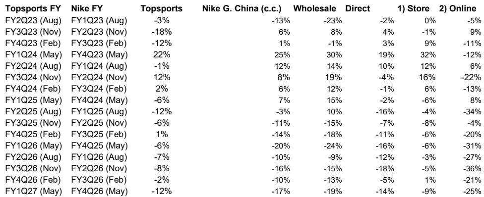

# MS：研究主题与行业变化观察

耐克决定收回线上分销授权，对滔搏国际（6110.HK）的影响远不止于失去22%的营收来源。MS最新报告指出，这一调整将引发业务结构层面的连锁反应——从门店盈利、库存管理到品牌合作关系，都可能进入一个调整过程。报告将滔搏评级调整为中性。

线上渠道在滔搏F26财年贡献了约57亿元人民币收入，占耐克相关营收的41%。更关键的是，滔搏此前将线上与线下运营视为一个整体系统：门店直播、库存调配、定价策略均相互支撑。耐克收回线上授权后，不仅直接削减收入池，还削弱了线下门店的流量来源和库存灵活性。报告特别指出，抖音渠道曾是滔搏线上销售占比从疫情前的低双位数提升至F26财年35%-40%的主要驱动力，失去这一渠道可能使部分门店面临盈利挑战。

> **KC评论：** 报告估算耐克线上收入在F27财年同比下降36%，F28财年归零。但第二层影响更值得关注：线下门店因失去线上引流，采购趋于保守，门店加速关闭，耐克线下及其他收入预计从F26财年的80亿元降至F28财年的63亿元。

## 1. 门店面积与坪效面临双重压缩

报告预测滔搏平均门店面积在F27和F28财年分别下降11%和9%，期末门店数从当前水平缩减至3760家和3460家。同期每平方米销售额下降5%和8%。值得注意的是，F24-F26财年期间总零售坪效的改善主要依赖线上销售增长，剔除这一因素后，线下门店的运营杠杆问题将表现得更明显，租金占比可能上升。

## 2. 毛利率回升难以抵消运营费用不确定性

耐克渠道调整后，线上占比下降和折扣收窄预计推动毛利率从F26财年的38.0%回升至F28财年的40.2%。但销售管理费用率将从F26财年的28.8%升至F28财年的36.4%，营业利润率预计为4.2%。报告预测F27和F28财年净利润均下降21%。

## 3. 营运资金释放反映业务调整，股息存在节奏变化不确定性

采购减少和库存清理在短期内支撑现金流，但报告认为这种释放主要反映业务调整而非效率提升。战略不确定性可能促使管理层保留更多现金，从而对股息派发构成不确定性。报告假设F27-F29财年派息率为100%，低于过去两年约135%的水平。

## 4. 耐克中国面临市场份额流失不确定性

报告认为耐克收紧渠道控制的战略意图合理——解决长期存在的线上折扣和定价不一致问题。但中国消费者已习惯当前折扣水平，在缺乏产品创新和品牌热度提升的情况下提高实际售价，可能导致销量和市场份额变化。批发渠道仍占耐克大中华区营收约55%和零售GMV的65%-70%，这意味着零售商和品牌在短期内可能面临双输局面。

> **KC评论：** 报告将这一调整与耐克此前在美国的批发调整做了对比。在美国，耐克减少批发的同时自有数字渠道正在快速增长；而在中国，耐克是在消费者需求尚未明显转向自有渠道的情况下收回分销权，执行不确定性有所增加。

滔搏可能将资源重新配置给阿迪达斯和其他品牌，但报告预计即使如此，集团营收到F29财年仍比F26财年低24%。耐克提供更多财务支持、产品创新加速或渠道策略微调，是报告列出的上行不确定性来源。

For informational purposes only. Portions may be generated,translated,summarized,or edited with AI assistance based on source materials and may contain omissions or errors. Please verify independently. This is not investment,legal,tax,accounting,or other professional advice.

