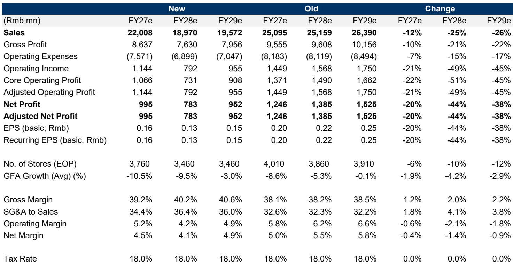
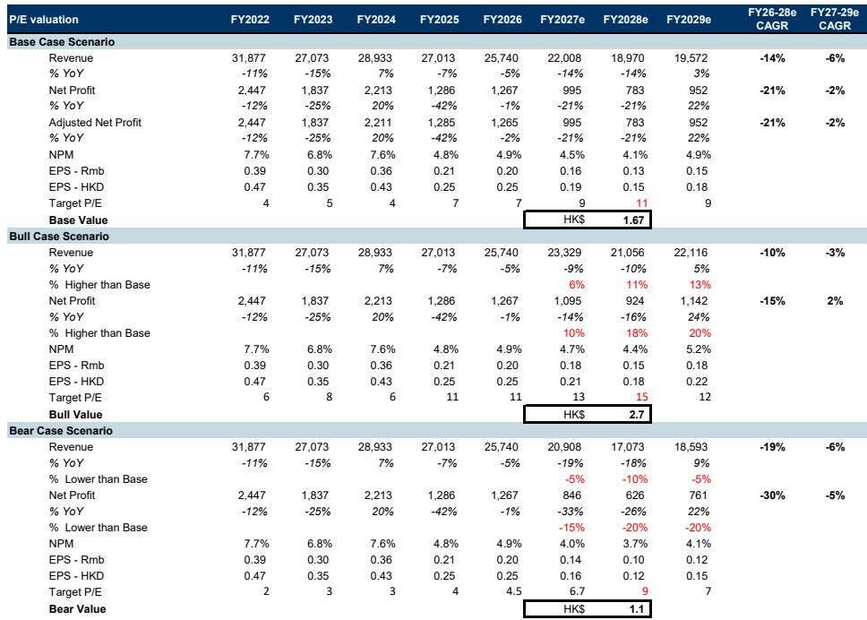

# Nike在中国渠道调整，对最大零售伙伴的双重挑战

Nike决定收回在中国线上分销的直接控制权，这并非一次常规的渠道调整。这一结构性变动直接影响到其在中国最大单体品牌门店运营商Topsports 22%的收入基础。此举针对的是在Topsports 2026财年产生57亿元收入的线上销售渠道，可能引发负面连锁反应：分销商经济状况减弱会减少零售商投入和门店覆盖，进而影响Nike的品牌势能和中国业务，进一步对Topsports的客流、门店效率和采购形成压力。

Nike这一行动的战略逻辑有其合理性。长期存在的线上折扣和定价不一致性已削弱了品牌在中国市场定位，并对全价线下门店形成挤压。从长远看，更严格的渠道控制有助于恢复品牌定位并扩大行业利润池。但执行风险不容忽视。中国消费者已习惯于当前的促销力度。在未同步提升产品创新、品牌热度和本土化故事的情况下提高有效平均售价，可能面临销量和市场份额的显著损失，尤其是在竞争激烈的环境中，对手可能保持促销力度以捕捉被释放的需求。

批发仍占Nike大中华区约55%的收入和估计65-70%的零售商品交易总额。这使得品牌与其零售伙伴在短期内可能出现双输局面，即便从长期看这一策略被证明是明智的。对于Topsports，从报告观点到报告观点的调整反映了对渠道重置影响的认知。

## 线上退出是商业模式重置，而不仅仅是收入损失

直接收入敞口很大，但二次效应更为关键。Topsports历史上将Nike门店、库存、定价、电商和直播作为一个整合系统运营。取消线上授权消除了一个主要收入来源，同时减少了支持线下网络的客流、库存灵活性和门店驱动的数字销售。通过抖音进行的直播一直是关键增长动力，将Topsports线上销售占比从疫情前的低两位数提高到2026财年的35-40%。取消门店直播可能使相当数量的门店低于盈亏平衡线，最终减少Nike的实体覆盖范围。

影响远不止Nike线上销售。该分析假设Nike线上收入在2027财年同比下降36%，反映春节期间的销售情况，然后在2028财年降至零。Nike线下及其他收入也从2026财年的80亿元下降到2028财年的63亿元，受客流减弱、采购更为保守和门店关闭的驱动。溢出效应最初也会影响其他品牌，因为Topsports的电商店铺和直播运营依赖多品牌客流。来自阿迪达斯的收入预计在2027财年下降2%，然后在2028财年恢复6%、2029财年恢复5%，因为Topsports会重新分配资源。即便如此，集团收入到2029财年仍将比2026财年低24%。

进一步的门店规模和效率调整似乎不可避免。平均门店面积预计在2027财年下降11%、2028财年下降10%，期末门店数量分别降至3760家和3460家。每平方米销售额在同一时期分别下降5%和8%。关键在于，2024-2026财年每平方米总零售销售额的提升主要得益于更强的线上销售增长。移除这一贡献暴露了线下门店的潜在杠杆问题，租售比可能进一步上升。

## 毛利率回升无法抵消运营去杠杆

线上销售占比降低和折扣减少将使毛利率从2026财年的38.0%提升至2027财年的39.2%和2028财年的40.2%。然而，这一改善被销售、一般及行政费用的上升所抵消，后者预计将分别升至收入的34.4%和36.4%，导致营业利润率降至5.2%和4.2%。净利润预计在2027财年和2028财年各下降21%。

营运资金释放提供了短期缓冲，但这主要反映业务收缩而非运营改善。因渠道重置和库存清理导致的采购减少应在短期内支撑现金流。然而，更大的战略不确定性可能促使管理层保留更多现金，从而对股息支付率形成下行风险，尽管公司账面回报率较高。分析现在假设2027-2029财年支付率为100%，低于过去两年约135%的水平。这并非财务实力强劲的信号，而是表明管理层可能优先考虑流动性而非股东回报。

## Nike中国面临短期市场份额变化，即便策略在战略上合理

Nike的目标是解决持续存在的线上折扣和定价不一致性问题，这些问题已削弱了品牌在中国市场定位。公司已优先考虑全价报告观点通过而非增长，并收紧了线上供应，但有限的定价改善似乎促使了这次更激进的渠道重置。风险在于渠道控制无法替代消费者需求。中国消费者已习惯于较高的促销力度。在未同步提升产品创新、品牌热度和故事讲述的情况下提高有效平均售价，可能导致销量和市场份额的下降，尤其是在消费环境和激烈竞争背景下。

存在类似Nike早前美国批发收缩后果的负面反馈循环风险，但中国并非简单重演。在美国，Nike在自身数字渠道快速增长的同时减少了批发敞口。在中国，当前行动主要旨在线上和直销渠道仍高度促销的情况下修复定价。因此，Nike在消费者需求明确转向其自有渠道之前就取消了分销商能力，增加了执行风险。作为参考，Foot Locker的Nike采购额从2020财年总采购额的75%下降到2024财年的59%，而其线上销售在2022-2024财年仅占销售的17-18%——远低于Topsports的35-40%线上渠道敞口。因此，在中国的风险更为显著。

零售商资源将被重新配置。Topsports和其他大型零售商可能会将营运资本、门店空间和管理资源转向提供更强长期业务承诺的品牌。如果缺乏门店电商导致零售商关闭Nike门店，竞争品牌可能获得更好的零售位置。Topsports仍是中国最具能力的运动服饰运营商之一，拥有强大的一二线城市覆盖、数字基础设施和本土化商品管理专长。更多小众和高端品牌可能寻求利用其平台加速线下扩张。

## 评估渠道重置影响的决策框架

对于评估Nike渠道重置影响的观察者和策略家而言，三个相互依赖的变量决定了发展轨迹：消费者调整的速度、竞争者的反应程度以及Nike对零售商的财务支持水平。

第一个变量——消费者调整——是最不确定的。中国消费者经过多年促销强度的培养，已形成对折扣的预期。如果Nike在没有引人注目的产品故事的情况下提高有效平均售价，销量损失将非常显著。关键领先指标并非Nike报告的收入，而是全价店报告观点通过率和库存周转速度。如果全价报告观点通过率改善且库存天数下降，策略正在取得进展。如果尽管批发出货量减少但库存仍在积累，品牌正在失去阵地。

第二个变量——竞争者反应——决定了Nike被释放的需求有多少被对手捕获。阿迪达斯、安踏、李宁和新兴高端品牌都有能力吸收市场份额。风险在于一些竞争者在试图捕获Nike被释放需求的同时保持促销力度，延长行业折扣问题。需关注的关键指标不仅是市场份额本身，而是行业整体促销强度指数。如果竞争者和Nike一起提价，渠道重置成功。如果他们降价以抢量，Nike的市场份额变化可能成为永久性的。

第三个变量——Nike对零售商的财务支持——决定了实体门店网络能否在过渡期维持。Nike可能选择补贴Topsports以维持关键门店的门店网络。分析假设Nike线下收入在2028财年稳定在63亿元，意味着比2026财年水平下降21%。如果Nike提供更多财务支持，下降幅度可能更浅。如果不提供，门店关闭速度加快，负面反馈循环加剧。

长期结果仍可能是积极的，但需要回归"拉动"模式。在2021年之前，Jordan、Dunk Low、Air Force 1和高知名度联名创造了足够的消费者吸引力，支持了溢价定价。类似的产品和品牌恢复最终可能改善Nike的全价组合并扩大行业利润池。然而，市场份额的重新洗牌可能早于需求恢复。对于Topsports和其他零售商来说，Nike的财务支持、更强的产品动力或后续渠道策略的微调代表上行风险。如果没有这些，渠道重置将产生品牌及其最大合作伙伴都难以轻易摆脱的双输局面。

*仅供参考。部分内容可能基于原始材料通过AI辅助生成、翻译、总结或编辑，可能存在遗漏或错误。请独立核实。*

仅供参考。部分内容可能基于原始材料通过AI辅助生成、翻译、总结或编辑，可能存在遗漏或错误。请独立核实。

