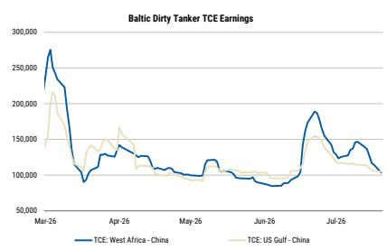
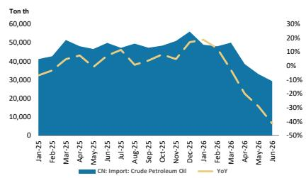

# 宏观环境变化与潜在影响

## 核心观察

■ 近期宏观环境变化使得油轮运输的回报风险特征趋于积极。

关注的潜在催化因素：中东局势缓和或中国原油进口增加可能成为积极信号。

## 最新动态

- 大西洋市场即期费率出现修正：7月21日，TD15（西非-中国）日费率达10.3万美元，TD22（美国湾-中国）日费率为10.5万美元，较6月下旬的18.9万美元和15.5万美元水平有所回落。

- 过去一个月中东地区发生多起油轮遇袭事件。在黑海，CPC码头附近油轮遇袭也报告有损毁情况。

- 油轮改道：红海区域，多艘在延布港装载的油轮在胡塞武装对挂靠沙特港口船只发出警告后，掉头向北驶向苏伊士运河。

- 6月中国原油进口量维持低位：进口量同比下降41.3%至2927万吨（约712万桶/日），为2016年10月以来最低，环比5月下降12%，延续了自4月以来的环比回落趋势。

## 研究观点

- 我们认为大西洋市场VLCC即期费率已接近均衡区间，进一步下行空间有限。

- 油轮改道可能导致航程延长，消耗有效运力。

- 袭击造成的船舶损坏可能在需求正常化时导致运力供应趋紧。

图1：油轮即期收益自6月中旬以来再次修正  
图2：中国原油进口量自4月以来持续走软  

  
来源：Clarksons, MS  
来源：CEIC, MS

## 阅读更多

关于中远海能H股、A股及招商轮船的研究：对油轮运输行业的跟踪观察（2026年6月15日）  
航运：地缘政治分析框架——中东局势关注（2026年4月9日）
