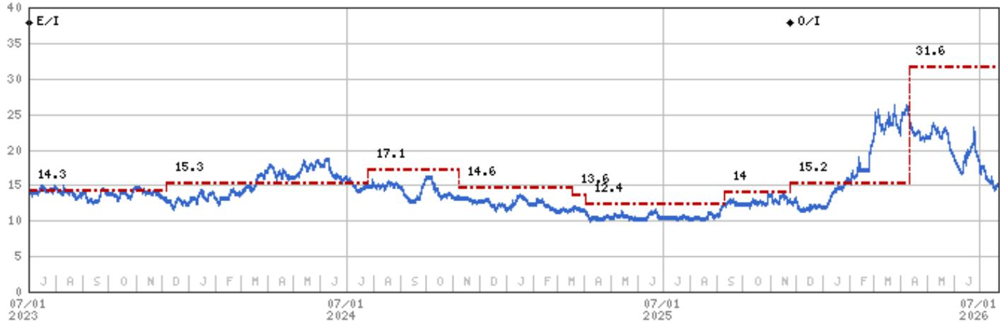
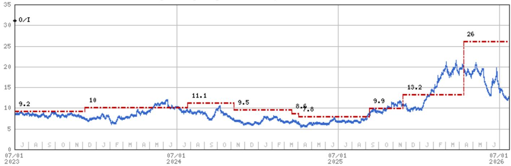
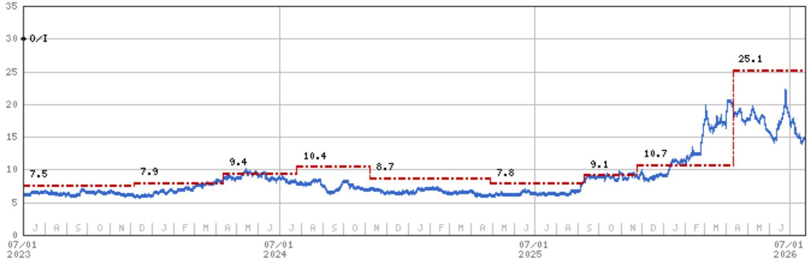

# 油轮运输正进入结构性转折，而非仅周期性回调

大西洋VLCC市场价格已从6月下旬高点回调约45%，截至7月21日，TD15（西非-中国）从每日189,000美元降至103,000美元，TD22（美国墨西哥湾-中国）从每日155,000美元降至105,000美元。6月中国原油进口量同比下降41.3%，至每日712万桶，为2016年10月以来最低，延续了自4月开始的环比下降。从表面看，这些数据描绘了一幅油轮市场回落的图景，背后是全球最大原油进口方的需求走弱以及一系列现货价格的修正。

然而，在周期性的疲软表面之下，一系列结构性力量正在悄然重塑供需平衡。中东地区多起油轮遇袭、黑海CPT终端附近船只受损，以及胡塞武装对挂靠沙特港口的船只发出警告，导致多艘在延布港装货的油轮掉头北上驶向苏伊士运河——这些并非孤立事件。它们共同构成了有效运力供应的累积收紧，而这种收紧在主要的价格数据中几乎不可见。这里的关键判断是：油轮运输的风险回报特征已显著向积极方向移动，并非因为需求突然强劲，而是因为供给侧的扰动正成为一种持续、累积的因素，一旦需求恢复正常，这一因素便会显现。

当前的节点之所以重要，是因为正是在市场共识最为悲观——聚焦于中国进口疲弱和现货运价下跌——之际，下一轮上升周期的根基正在被奠定。那些将此视为单纯周期性回落的观察者，可能会忽略表层之下正在累积的结构性稀缺。

## 大西洋现货运价回调已趋近均衡，下行空间有限

从6月下旬到7月下旬的运价回落在幅度上令人注目，但最重要的分析问题并非运价已经跌了多少，而是是否还能进一步下跌。证据显示，进一步下行空间有限。当TD15和TD22在每日15万美元以上交易时，这些水平反映的是多重因素的暂时叠加：大西洋盆地炼厂检修完成、西非货盘的时间窗口紧张、以及吨位需求的短期提升。这一飙升从来不可持续，回调至每日10万至10.5万美元的范围，则代表着回归一个更为正常但仍属健康的均衡。

值得关注的指标并非相对运价水平，而是将额外船只引入大西洋市场的边际成本。在目前运价下，许多从其他区域向大西洋压载航行的VLCC的边际经济性已不具吸引力。之前推动运价下行的供给反应——船东将船只集中于最高价市场——已基本走到尽头。随着运价降至边际船只仅能勉强覆盖航次成本加微薄的期租等价水平，自然的底部正在形成。这不是对即将反弹的预测，而是一个结构性的观察：运价调整已经完成了其工作。

对于船队运营者和观察者而言，实际意义在于：现货收益的下行风险相对于上行潜力已经有限。当下一轮需求催化剂出现——无论是中国原油买盘的恢复、霍尔木兹海峡通行的重启，还是季节性冬季取暖需求——运价将从已接近均衡的基数做出反应，而非从一个需要进一步修正的不可持续高位。

## 地缘扰动不再是尾部风险，而是结构性供给约束

过去一个月，油轮遇袭事件出现了质的升级，不同于近年来市场的偶发性事件。在中东，多起油轮袭击在数周内发生。在黑海，靠近CPC终端的船只报告受损。这些不是可以当作暂时性噪音的孤立事件；它们代表了一种运营风险的模式，正迫使船东重新评估航线、保险成本和船员安全。

最具说服力的数据点是挂靠沙特红海港口延布的油轮的行为。在胡塞武装对挂靠沙特港口的船只发出警告后，多艘油轮掉头北上驶向苏伊士运河，而不是继续向南前往曼德海峡。这不是由商业优化驱动的航线调整，而是出于安全考虑，这会增加航行天数，消耗有效运力。船只每多花一天在更长航线上以规避冲突区域，就意味着它无法用于下一个货盘。

供给影响并非线性。一次较长的航程会在偏离时段加上返程期间内将运力从市场中移除。考虑到红海、黑海和波斯湾的全球原油流量规模，即使是较小比例的船只选择更长航线，也能在有效供给上产生显著收紧。报告的分析框架正确地指出，当需求正常化时，袭击造成的船只损坏可能导致供给收紧，但更直接的机制是通过航线调整持续消耗运力，而不仅仅是受损船只的直接损失。

对于观察者来说，这改变了风险评估的逻辑。传统观点将地缘事件视为暂时性的脉冲，一旦紧张局势缓和便消退。而正在浮现的现实是，多个关键节点的风险累积正在促使供需均衡出现永久性上移，即便当前现货价格尚未反映这一点。

## 中国进口下滑是暂时性需求逆风，而非结构性需求问题

中国6月原油进口2927万吨，同比下降41.3%，为2016年10月以来最低月度数据。这是一个引人注目的数字，自然主导了看空叙事。但下滑的组成比总量更为重要。自4月以来的环比下降，恰逢炼厂集中检修、成品油库存高企，以及中国炼厂在消化累积库存期间主动放缓原油采购。

中国原油需求的结构性驱动因素并未改变。中国炼油产能持续扩张，战略石油储备项目仍是长期增量需求的来源。当前的进口走弱是一个去库存和检修周期，而非需求的永久性减少。当中国炼厂检修结束、库存正常化后，进口量将恢复——而恢复的时机正是油轮市场的关键变量。

对于观察者而言，风险在于将6月数据点外推为永久性需求问题。历史表明，中国原油进口月度间波动较大，急剧下降的时期之后通常伴随快速反弹。41.3%的同比下降幅度极大，但这也意味着2026年下半年的同比基数极低。即便从7、8月水平出现温和的环比恢复，也会产生正的同比增速，从而改变市场情绪。

分析上的错误在于将中国需求走弱和地缘供给扰动视为两个相互抵消的独立因素。它们运行在不同的时间轴上。需求走弱是周期性的、暂时的现象，将在数月内解决。供给扰动是结构性的、累积的现象，无论需求水平如何都将持续存在。当中国需求正常化时，供给侧将比扰动开始之前更为紧张。

## 决策框架：未来12-18个月油轮市场的三种情景

对于观察者和商业运营者而言，问题不在于市场是否会收紧，而是收紧将沿着三条不同路径中的哪一条展开。每种情景对资产价值、租船策略和权益头寸都有不同影响。

**情景一：需求恢复且地缘未进一步升级（基准情形，60%概率）。** 在此情景下，中国原油进口在2026年下半年随炼厂检修结束和去库存完成而恢复。地缘扰动维持当前水平：偶发袭击、选择性绕航，但无主要关键节点完全关闭。供需平衡逐步收紧，推动VLCC现货运价在2026年底或2027年初进入每日12万至15万美元区间。这一情景支撑报告中提到的基准估值倍数，即约1.9倍市净率（以某大型航运公司为例）和3.2倍市净率（以另一家航运公司为例）。此情景的关键风险在于需求恢复慢于预期，但供给侧的底部防止了下行空间过大。

**情景二：需求恢复伴随供给扰动升级（乐观情形，25%概率）。** 此情景结合中国需求恢复与航运安全的进一步恶化。霍尔木兹海峡通行持续受阻、红海威胁区域扩大、或黑海更多袭击导致大规模绕航，将从市场中移除大量有效运力。在此环境下，现货运价可能超过6月峰值，资产价值将大幅上升。乐观估值倍数（3.7倍和6.3倍市净率）反映这一结果。需要关注的触发点并非单次袭击，而是保险市场和船旗国认为不可接受的袭击模式，从而引发原油流动的系统性再路由。

**情景三：需求停滞且供给正常化（悲观情形，15%概率）。** 此情景假设中国需求在2027年全年保持疲弱，且地缘紧张局势缓和，使绕航船只恢复正常航线。在此情况下，供需平衡保持宽松，现货运价降至每日7万至9万美元区间。悲观估值倍数（1.0倍和1.6倍市净率）反映市场已回归扰动前均衡。这一情景可能性最低，因为它同时需要需求恢复论和供给扰动论失效。

决策框架是：为基准情形做准备，同时从乐观情形中获取补偿。当前市场价格中已嵌入相当程度的悲观情形概率，这源于运价回调和对中国进口的负面情绪。这创造了安全边际：即使悲观情形实现，下行空间也受结构性供给底部限制。如果基准或乐观情形实现，上行空间则相当可观。

## 供给侧的稀缺已内置于船队年龄结构，而非仅体现在冲突区域

除了眼前的地缘扰动之外，一个更安静但同样强劲的供给侧因素是全球VLCC船队的年龄结构。报告提及老旧船舶拆解对上行的风险，但这一点低估了结构性压力。VLCC船队在过去十年显著老化，大量在2000年至2005年间建造的船只正接近或超过20年船龄。国际海事组织在排放和船舶状况方面的监管压力正在加速拆解决策。

老旧船队、高昂的新造船成本以及未来燃料技术的不确定性共同抑制了订单簿。船东在脱碳监管框架仍在演变之际，不愿将资金投入到新VLCC上。这意味着供给侧不仅被冲突驱动的绕航所消耗，还被自然的拆解周期所侵蚀，且缺乏相应的替代运力。

当需求正常化时，市场将面对一个比上一周期更小、更老旧的供给基础。这不是暂时现象。这是一个多年期的结构性约束，将放大任何需求恢复的影响。报告的分析框架通过概率加权估值方法捕捉到了这一点，该估值向乐观情形倾斜以反映供给紧张。但对观察者而言，其含义更加具体：当前走弱正是构建头寸的窗口期，在结构性供给约束变得可见于运价数据之前。

最后一项分析性观察是：油轮市场正从一个以需求为主导变量的机制，转向一个以供给为主导变量的机制。过去十年，叙事围绕中国需求增长、OPEC产量决定和全球经济周期展开。这些因素仍然重要，但它们现在运作于一个从根本上更紧、反应更不灵敏的供给背景之上。下一轮运价上行不会仅由需求惊喜驱动，还将被一个一直在悄然缩小的供给基础所放大。这正是当前市场正在错误定价的转折点。

*仅供参考。部分内容可能基于原始资料通过AI辅助生成、翻译、总结或编辑，可能存在遗漏或错误。请独立核实。本文不构成任何专业建议。*

仅供参考。部分内容可能基于原始资料通过AI辅助生成、翻译、总结或编辑，可能存在遗漏或错误。请独立核实。本文不构成任何专业建议。

