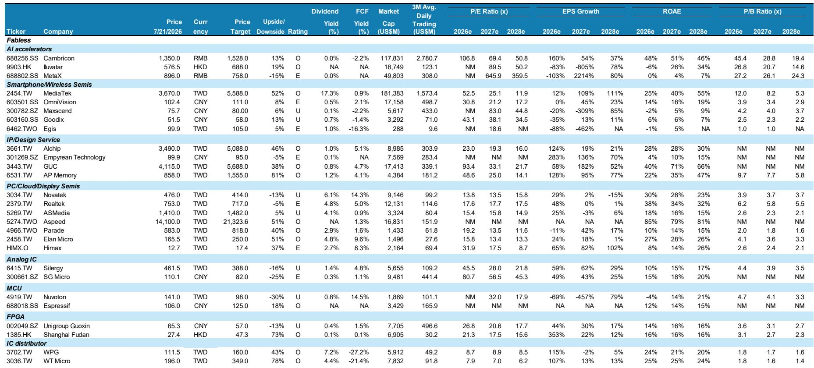
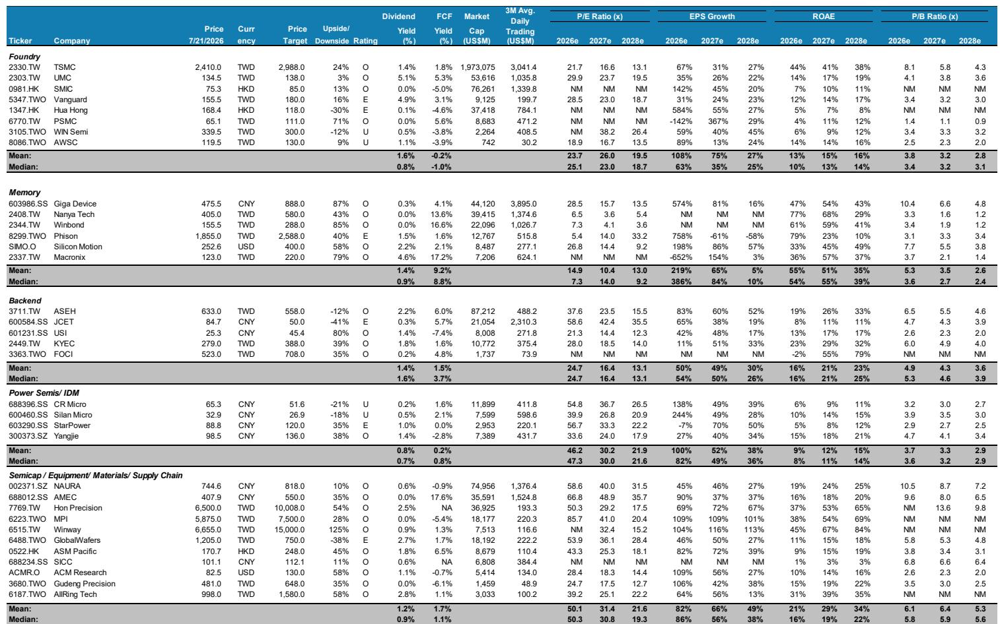
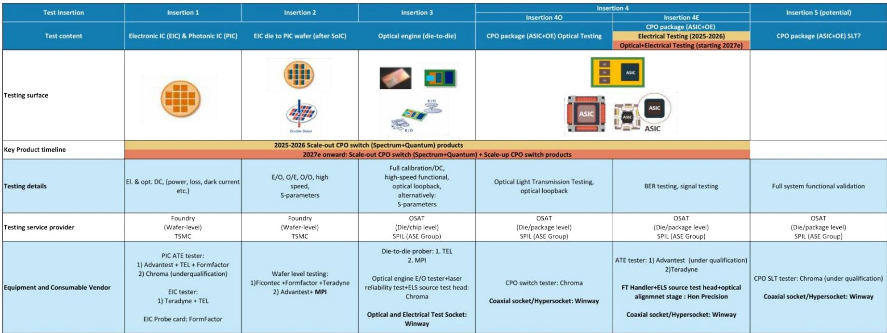

# AI 芯片需求正分化为两个并行的供应体系，关注者需理解这一结构性变化

全球芯片产业正经历一个结构性的转折点，但许多市场参与者仍未充分重视。从某领先代工厂即将发布的业绩预览及其先进封装产能更新可以看出，市场已不再由单一的AI需求曲线定义，而是沿着两条不同的轨迹发展：一条源于大型云计算企业的GPU和ASIC部署，另一条则由中国本土的AI推理需求建设驱动。一份2026年7月的亚太研究团队报告明确指出，过去“AI芯片与非AI芯片”的划分框架已不够用。真正的战略分界线在于：受出口管制的高端先进封装生态与快速成熟的中国本土代工及后端供应链之间。对于关注者而言，关键问题不是AI芯片需求会不会增长，而是在市场分化的背景下，哪些制程节点、哪些封装技术、哪些地理供应链能捕获最大价值。

这一判断之所以重要，是因为三股力量正在压缩决策窗口。第一，先进封装产能不再仅仅是一个瓶颈，而是成为决定哪些芯片架构能够实现规模化的差异化机制。第二，类似DeepSeek的推理模型的出现证明，更廉价的AI推理可以在中国触发需求弹性，从而形成一个独立于美国主导的生态之外的平行需求池。第三，晶圆、封装测试和存储成本正在加速上升，压缩了缺乏定价能力的芯片设计公司的利润空间。如果将这些趋势视为独立事件，就会忽略它们正在汇聚成一个核心战略问题：哪些公司拥有在两条供应链中都稀缺的资产？

这份报告关注的案例揭示了分化的轮廓。一边是台积电、日月光、京元电子和ASMPT，它们代表成熟的高成本、高性能生态；另一边是中芯国际、燧原科技、寒武纪，以及一批中国设备与耗材企业，如北方华创、中微公司和家登精密，它们代表本土替代方案。报告中列出的估值数据凸显了这种分化：台积电预计2026年市盈率约21.7倍，每股盈利增长67%；而中芯国际的自由现金流回报表现和市盈率均为负值或非有效值，但其每股盈利增长预估却高达142%。这些并非可相比的企业，而是具有不同风险特征、不同回报驱动因素、不同地缘政治依赖性的平行体系。

## 先进封装瓶颈正从产能约束转为竞争护城河，有利于垂直整合型公司

关于先进封装的传统叙事很简单：需求超过供给，能拿到产能的公司就是赢家。但这份报告的分析表明，这种看法已过于简化。先进封装正从一个通用约束转变为一项战略资产，能够根据企业在逻辑、存储和光互连方面集成先进封装的能力来区分它们。报告中标题提到光互连与CPU、GPU、ASIC并列，并非偶然——它意味着先进封装正在演变为一个异构集成平台，而不仅仅是一种封装服务。

其推论是：如果缺乏深度设计协作能力，独立的封装厂在先进封装产能扩张时将面临利润压缩。报告中对日月光和京元电子的观点，以及对长电科技的观点，都反映了这一逻辑。日月光和京元电子凭借规模和客户关系密度，即使在产能增长时也能获得溢价定价。而长电科技虽然是中国主要的封测代工厂，但其大陆供应链地位尚未能转化为同等定价权或技术溢价。

对于关注者来说，可操作的信息是：先进封装的产能分配正在成为竞争定位的前瞻指标。那些能获得早期且持续分配的公司，很可能主导下一代AI加速器；而依赖现货产能的公司将被边缘化到利润更低的细分市场。报告数据中台积电2026年每股盈利增长67%、2027年增长31%表明，先进封装带来的溢价已经体现在代工龙头的定价中，但测试与耗材领域的二级受益者——如颖崴（上涨空间125%）、旺硅（上涨空间28%）——如果先进封装产能爬坡速度高于市场预期，仍可能提供不对称的向上空间。

## 中国AI推理需求正催生一个独立于美国出口管制的自给自足芯片生态

报告明确提及DeepSeek作为中国AI推理需求的触发因素，这是最具战略意义的观察之一。DeepSeek证明了廉价推理是可能的，并激活了一个无需最先进EUV节点或先进封装产能的需求池。相反，它依赖于中芯国际等本土代工厂，以及包括燧原科技和寒武纪在内的不断增长的中国AI加速器设计公司网络。

这些公司的估值数据引人注目。寒武纪2026年预计市盈率约106.8倍，但每股盈利增长160%，净资产回报表现为48%。燧原科技目前仍处于亏损状态，每股盈利增长为负。这些估值在传统的折现现金流框架下难以解释，但如果将其放置于中国本土AI芯片市场正在有意识地与全球定价基准脱钩的背景下，就说得通了。报告中对中芯国际的观点（尽管其自由现金流回报表现为负）也强化了这一看法：中芯国际不是价值型标的，而是战略资产，其估值与国家计算主权相关，而非短期盈利。

二级推论是，中国的芯片设备和耗材供应链将获得不成比例的收益。报告中关于北方华创、中微公司、盛美上海、家登精密的观点均指向一个正在扩张以支持本土代工扩张的国内生态。北方华创45%的每股盈利增长、中微公司90%的增长（2026年预计）并非异常——它们是中国需要建设自身先进封装与晶圆制造能力的直接结果。报告也隐含承认，这一生态仍依赖于政策与出口管制环境，从而带来全球供应链所不面临的不确定性。

## 芯片成本上涨与AI挤压效应正在压缩非AI芯片设计公司的利润空间

报告指出了两个在AI热潮中容易被忽视的结构性逆风：芯片成本上涨和AI挤压效应。晶圆、封测和存储成本上升，给缺乏定价能力的芯片设计公司带来利润压力。同时，芯片供应链优先保障AI芯片，导致T-Glass、存储等与AI计算无关的领域出现短缺。

估值表显示了影响。在无晶圆厂公司中，非AI标的的增长明显更低，估值离散度更高。瑞昱（观点中性）在报告数据中未见每股盈利增长突破；矽力杰（观点中性）面临成本上涨与需求疲弱的双重压力；联咏（观点中性）在显示驱动领域遭遇利润压缩。模式很清晰：AI的强劲势头正在主动从非AI领域吸走产能和人才，在芯片行业形成赢家通吃格局。

对于组合构建而言，这意味着被动持有芯片指数越来越危险。同一子行业内AI与非AI标的之间的离散度处于近十年来的最高水平。报告对威锋电子和祥硕的观点（尽管它们终端市场在增长）强调：即使处于结构性增长板块的企业，如果缺乏直接AI敞口或定价能力，也可能面临挑战。关注者的决策框架必须在考虑估值之前，明确过滤出AI收入敞口和利润韧性。

## 在两条供应链间布局的分析框架

报告数据支持一个三层过滤的结构化分析框架。第一，评估公司对先进封装产能的获取程度。那些已获得先进封装分配或与台积电、日月光、京元电子合作的公司应优先于依赖普通封装的公司。第二，评估地理供应链依赖。主要在美国盟友生态内运营的公司政策风险较低但成本结构较高，而中国本土公司增长更高但波动性和流动性也更高。第三，衡量相对芯片成本上涨的定价能力。毛利率高于50%且能将成本上涨向下传导的公司，将在行业普遍利润压缩中存活。

将该框架应用于报告关注案例，可得清晰分化。在全球生态中，台积电、日月光、京元电子通过了所有三个过滤。在中国本土生态中，中芯国际、燧原科技以及北方华创、中微公司等设备公司通过了增长与政策支持过滤，但在流动性与估值纪律上不合格。报告对环球晶圆和长电科技的点评可作为警示案例：即便在正确的供应链中，如果缺少特定技术或关系优势以获得定价权，公司也可能处于不利位置。

报告中最重要的洞察是：两条供应链并非替代品，而是风险回报特征不同的平行系统。试图只选择其中一条而忽略另一条，将错失两方的结构性机会。正确的做法是构建一个杠铃式的组合，持有每个生态中的主导企业，同时接受中国本土公司需要更高的回报门槛以补偿更高的风险。报告给出全球生态中代工厂市盈率中位数25.1倍、存储公司7.3倍，而中国AI加速器公司市盈率非有效值，这证实市场已在定价这一分化。关注者的任务不是对抗它，而是以清晰判断和严格仓位管理去顺应它。

*仅供信息参考。部分内容可能基于来源材料通过AI辅助生成、翻译、摘要或编辑，可能包含遗漏或错误。请独立核实。本文不构成任何专业建议。*

仅供信息参考。部分内容可能基于来源材料通过AI辅助生成、翻译、摘要或编辑，可能包含遗漏或错误。请独立核实。本文不构成任何专业建议。

