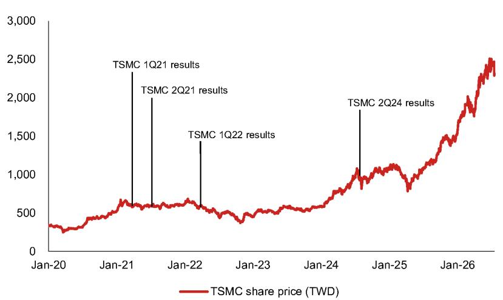
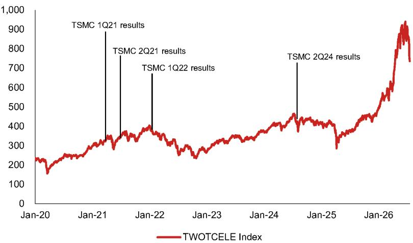
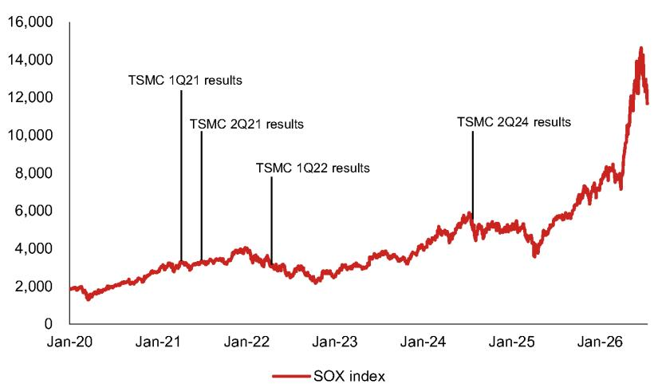
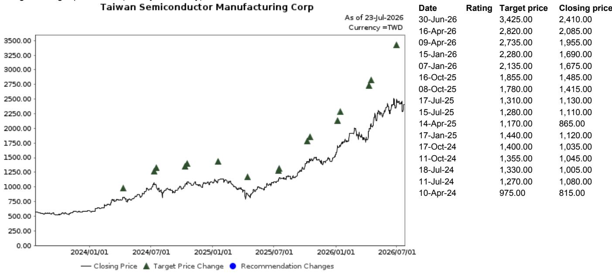

EQUITY: TECHNOLOGY

## 台积电在业绩展望超预期后，公司报价出现调整

人工智能主题交易可能进入整理阶段；元件短缺、价格上涨以及盈利上调仍是后续关注点

发生了什么？台积电业绩展望超预期与次日公司报价走势之间的分歧

在6月底发布的深度报告中，我们阐述了对于人工智能周期的看法（报告；我们曾提示短期调整的可能性，但也认为人工智能周期仍将持续）。随后，台积电（2330 TT）在7月16日的业绩说明会（报告）上，其营收展望和资本支出计划均优于市场和我们之前的预期。尽管如此，其次日公司报价反应却令人意外（当地存托凭证下跌约7%/2%）。本报告将探讨台积电公司报价表现与基本面动态之间这种“有趣”的分歧。

过去10年（台积电40次业绩说明会）中发生过四次类似情况

我们对台积电过去10年（总计40次业绩说明会）的分析，指出了四次类似情形（即基本面数据优于预期，但随后公司报价出现调整）——2021年4月（回顾）、2021年7月（回顾）、2022年4月（回顾）以及2024年7月（回顾）。

从图1可以看出，这四次事件次日公司报价均出现回调，暗示短期内（至少一个月）台积电、SOX或OTCELE指数可能进入整理或阶段性调整。

我们认为，前三次调整（尤其是2022年4月）背后的逻辑较为清晰——是周期达到峰值的信号。我们在2021年下半年至2022年上半年期间多次提示，新冠周期峰值可能在2022年上半年出现：“涨价持续；2022年一季度后周期风险上升”（2021年10月）、“2022年：开局强劲，但尾声偏软”（2021年12月）、“周期峰值已至”（2022年4月）、“周期峰值已至——第二部分”（2022年6月）。从图2可以看出，台积电公司报价在2021年整体整理，随后在2022年开始出现变化。

但我们对2024年7月调整的判断有所不同。那次公司报价调整似乎是一个“误警”——虽然一度看似周期见顶，但后来被人工智能驱动的上行趋势所覆盖。到2024年7月台积电上调展望时，台积电/SOX/台湾OTC电子指数自ChatGPT 3.5发布以来已累计上涨105%/92%/59%（黄仁勋在2023年2月称人工智能迎来“iPhone时刻”）。在2024年5月的半导体策略报告（“一切皆AI”）中，我们曾提示在该板块估值偏高以及2025年回升前，2024年下半年存在AI技术过渡（从Hopper到Blackwell）的不确定性。从图2至图4可以看到，台积电/SOX/OTCELE在2024年三季度出现调整，随后在四季度重新回升。

那么，现在处于什么阶段？与传统周期观点不同，我们认为在近期的整理/调整之后，人工智能主题交易有望重新活跃。我们扩展了对先进半导体测试供应链的覆盖，并在其中提出了四个新的关注方向。

在我们最新的AI半导体和服务器深度报告（“周期是否结束？”2026年6月）中，我们曾列举多项可能导致公司报价调整的因素，例如2028年新建数据中心的需求尚不明朗、美国超大规模云服务商在2027年面临现金流压力、前所未有的元件供应错配，以及回报表现上升（对科技融资形成的压力）——这些因素是在SOX单个季度（2026年二季度）大幅上涨80%以上之后出现的——但我们仍对元件/材料持续短缺、价格上涨和盈利上修保持积极看法，认为AI半导体/服务器板块存在潜在积极催化剂。截至本文撰写时，美国主要超大规模云服务商之一谷歌（GOOGL US，未评级）已公布业绩，其中提到计算能力依然短缺，且2027年资本支出预期仍将显著高于已上调的2026年数字，尽管存在现金流压力。此类表述与我们深度报告中的观点一致。

---

## 研究分析师

Aaron Jeng, CFA - NITB  
aaron.jeng@NOM.com  
+886(2) 21769962  

Eric Chen, CFA - NITE  
eric.chen@NOM.com  
+886(2) 21769965  

Vivian Yang - NITB  
vivian.yang@NOM.com  
+886(2) 21769970  

---

## 深度报告中的观点

我们维持这一看法——与传统周期观点不同，我们认为在近期的整理/调整（如果历史重演，可能持续至少一个月）之后，人工智能主题交易有望重新活跃。这也是我们今日启动对先进半导体测试供应链覆盖（见报告）的原因之一，其中包括四个新关注的公司：Hon Precision (7769 TT)、Chroma (2360 TT)、MPI (6223 TT)、WinWay (6515 TT)，并维持对ASE (3711 TT)和KYEC (2449 TT)的积极看法。主要风险仍在于超大规模云服务商的资本支出前景。

---

**图1：过去10年台积电业绩说明会后，台积电、SOX、台湾OTC电子指数的反应**

| 业绩季度 | 业绩说明会日期 | 全年展望指标 |  | 台积电公司报价反应 |  |  | SOX指数反应 |  |  | OTCELE指数反应 |  |  |
|----------|----------------|------------|------|-------------------|-----|-----|------------|-----|-----|------------------------|-----|-----|
|          |                | 营收       | 资本支出 | 1日 | 1周 | 1个月 | 1日 | 1周 | 1个月 | 1日 | 1周 | 1个月 |
| 2Q26     | 2026/7/16      | 优于预期   | 优于预期 | -7.3% | | | -4.3% | | | -8.0% | | |
| 1Q26     | 2026/4/16      | 符合预期   | 符合预期 | -2.6% | -0.2% | 8.9% | 1.0% | 9.1% | 30.7% | 2.2% | 5.5% | 21.3% |
| 4Q25     | 2026/1/15      | 优于预期   | 优于预期 | 3.0% | 4.1% | 13.3% | 1.8% | 4.6% | 5.0% | 0.9% | 3.6% | 4.8% |
| 3Q25     | 2025/10/16     | 符合预期   | 符合预期 | -2.4% | -2.4% | -1.7% | 0.5% | 1.2% | 0.8% | -1.2% | -0.3% | -0.3% |
| 2Q25     | 2025/7/17      | 优于预期   | 符合预期 | 2.2% | 1.3% | 4.0% | 0.7% | -0.9% | 3.3% | 0.0% | -1.4% | 6.6% |
| 1Q25     | 2025/4/17      | 符合预期   | 符合预期 | 0.4% | 2.0% | 17.2% | -0.6% | 9.1% | 27.9% | -0.1% | 0.9% | 10.5% |
| 4Q24     | 2025/1/16      | 符合预期   | 优于预期 | 1.4% | 2.7% | -1.4% | 0.2% | 5.6% | 0.1% | -0.8% | 1.6% | 1.9% |
| 3Q24     | 2024/10/17     | 符合预期   | 符合预期 | 4.8% | 2.4% | 0.0% | 0.9% | 0.0% | -2.9% | -1.5% | -0.9% | -6.6% |
| 2Q24     | 2024/7/18      | 优于预期   | 符合预期 | -3.5% | -8.1% | -6.2% | 0.5% | -7.5% | -4.4% | -2.3% | -6.3% | -6.5% |
| 1Q24     | 2024/4/18      | 符合预期   | 符合预期 | -6.7% | -4.7% | 4.6% | -1.7% | 1.0% | 9.9% | -4.1% | -4.7% | -1.5% |
| 4Q23     | 2024/1/18      | 符合预期   | 符合预期 | 6.5% | 9.2% | 18.5% | 3.4% | 9.9% | 12.0% | 1.1% | 3.4% | 8.6% |
| 3Q23     | 2023/10/19     | 符合预期   | 符合预期 | 1.8% | -2.7% | 6.8% | -1.3% | -6.6% | 9.1% | -0.7% | -2.6% | 3.5% |
| 2Q23     | 2023/7/20      | 符合预期   | 符合预期 | -3.3% | -1.7% | -6.0% | -3.6% | -0.9% | -9.3% | -0.5% | -0.9% | -6.4% |
| 1Q23     | 2023/4/20      | 低于预期   | 符合预期 | -0.4% | -3.8% | 3.3% | 0.0% | -3.4% | 5.8% | -2.0% | -3.5% | -0.7% |
| 4Q22     | 2023/1/12      | 优于预期   | 符合预期 | 2.8% | 3.4% | 11.0% | 1.2% | -1.6% | 11.0% | -0.7% | 0.7% | 8.8% |
| 3Q22     | 2022/10/13     | 符合预期   | 符合预期 | 4.3% | 0.6% | 3.2% | 2.9% | 2.5% | 21.6% | 3.7% | 2.4% | 10.9% |
| 2Q22     | 2022/7/14      | 优于预期   | 符合预期 | 3.7% | 5.5% | 8.2% | 1.9% | 13.2% | 15.6% | 1.8% | 7.2% | 6.5% |
| 1Q22     | 2022/4/14      | 优于预期   | 符合预期 | -1.9% | -1.4% | -11.9% | -2.9% | -1.9% | -9.4% | -2.7% | -1.7% | -11.0% |
| 4Q21     | 2022/1/13      | 优于预期   | 优于预期 | 1.7% | -1.5% | -1.8% | -2.3% | -10.4% | -9.4% | -0.8% | -1.0% | -1.6% |
| 3Q21     | 2021/10/14     | 符合预期   | 符合预期 | 4.7% | 4.0% | 5.8% | 3.1% | 6.9% | 17.9% | 2.4% | 5.5% | 12.9% |
| 2Q21     | 2021/7/15      | 优于预期   | 符合预期 | -4.1% | -3.7% | -4.6% | -2.2% | -0.9% | 0.7% | -0.2% | -0.1% | -5.5% |
| 1Q21     | 2021/4/15      | 优于预期   | 优于预期 | -1.5% | -4.5% | -11.6% | 1.8% | -2.5% | -10.0% | 0.4% | -1.7% | -13.7% |
| 4Q20     | 2021/1/14      | 优于预期   | 优于预期 | 1.5% | 13.7% | 12.0% | 2.1% | 4.7% | 6.3% | -2.1% | -1.9% | -0.1% |
| 3Q20     | 2020/10/15     | 优于预期   | 符合预期 | -0.9% | 0.4% | 1.1% | -0.3% | -1.9% | 2.5% | -1.0% | -0.4% | 1.8% |
| 2Q20     | 2020/7/16      | 符合预期   | 优于预期 | 2.7% | 6.7% | 20.0% | -0.4% | 0.3% | 6.7% | -1.7% | 1.7% | -0.8% |
| 1Q20     | 2020/4/16      | 优于预期   | 优于预期 | 7.0% | 3.1% | 2.3% | 2.6% | 1.0% | 5.5% | 0.2% | 0.0% | 6.4% |
| 4Q19     | 2020/1/16      | 优于预期   | 优于预期 | -0.4% | -0.4% | 0.1% | 1.7% | 3.9% | 4.7% | 0.0% | 0.4% | -3.0% |
| 3Q19     | 2019/10/17     | 优于预期   | 优于预期 | -0.2% | -0.2% | 3.4% | 0.3% | 0.9% | 7.9% | 0.3% | 1.9% | 0.1% |
| 2Q19     | 2019/7/18      | 符合预期   | 优于预期 | 2.0% | 4.3% | -2.4% | 1.5% | 6.0% | -4.3% | 1.2% | 4.5% | -2.1% |
| 1Q19     | 2019/4/18      | 符合预期   | 符合预期 | 0.0% | 1.1% | -6.6% | 0.1% | 0.2% | -8.2% | 1.0% | 1.0% | -7.4% |
| 4Q18     | 2019/1/17      | 符合预期   | 符合预期 | -0.9% | 0.9% | 2.9% | 1.1% | 5.6% | 13.2% | 0.9% | 2.2% | 10.8% |
| 3Q18     | 2018/10/18     | 优于预期   | 符合预期 | -0.2% | -7.2% | -2.3% | -2.5% | -8.2% | -3.3% | -1.0% | -8.6% | 2.0% |
| 2Q18     | 2018/7/19      | 低于预期   | 低于预期 | 5.8% | 7.3% | 6.5% | -0.3% | 0.7% | -2.7% | -1.1% | -0.1% | -8.2% |
| 1Q18     | 2018/4/19      | 低于预期   | 优于预期 | -6.3% | -9.2% | -7.4% | -4.3% | -5.6% | 1.6% | -1.5% | -9.0% | -3.0% |
| 4Q17     | 2018/1/18      | 优于预期   | 符合预期 | 2.8% | 3.8% | -2.4% | 0.5% | -2.0% | -3.0% | 0.0% | 0.0% | -5.1% |
| 3Q17     | 2017/10/19     | 符合预期   | 符合预期 | -0.6% | -1.3% | -0.4% | -0.3% | 0.7% | 6.9% | 0.0% | 0.7% | 1.8% |
| 2Q17     | 2017/7/13      | 符合预期   | 符合预期 | -0.7% | 0.5% | -0.2% | -0.2% | 2.2% | -3.0% | 1.1% | 2.6% | -0.5% |
| 1Q17     | 2017/4/13      | 符合预期   | 符合预期 | -1.3% | -2.3% | 8.4% | -0.7% | 3.2% | 7.9% | -2.7% | -2.2% | -1.3% |
| 4Q16     | 2017/1/12      | 低于预期   | 符合预期 | -1.6% | -2.2% | -0.3% | -0.9% | -0.9% | 4.0% | -0.1% | 0.9% | 7.7% |
| 3Q16     | 2016/10/13     | 符合预期   | 符合预期 | -0.3% | 1.1% | -1.6% | -1.2% | 0.5% | -0.8% | -1.6% | 0.7% | -4.2% |
| 2Q16     | 2016/7/14      | 符合预期   | 优于预期 | 0.3% | 1.8% | 4.4% | 0.7% | 2.7% | 8.0% | 0.5% | 1.7% | 2.0% |
| 1Q16     | 2016/4/14      | 低于预期   | 符合预期 | -1.2% | -2.8% | -9.6% | -0.9% | -2.6% | -7.9% | -0.3% | -0.3% | -9.9% |

注：数据截至2026年7月20日。
来源：彭博金融信息，NOM

**图2：台积电公司报价**

注：数据截至2026年7月20日。
来源：彭博金融信息，NOM

**图3：台湾OTC电子指数**

注：台湾OTC电子指数不包含台积电，可作为台湾小型科技公司的参考，其波动性通常高于台积电和SOX指数。数据截至2026年7月20日。
来源：彭博金融信息，NOM

**图4：SOX指数**

注：数据截至2026年7月20日。
来源：彭博金融信息，NOM

---

## 附录A-1

本报告由NOM International (Hong Kong) Ltd., Taipei Branch (NITB) 编制。关于NOM集团实体的免责声明详见后文。

## 分析师声明

我们，Aaron Jeng、Eric Chen和Vivian Yang，特此声明：(1) 本研究报告中所表达的观点准确反映了我们个人对所涉及证券或发行人的看法；(2) 我们的报酬从未、也不会直接或间接与本研究报告中特定的建议或观点相关；(3) 我们的报酬不与NOM集团任何投资银行交易挂钩。

## 发行人特定监管披露

“NOM”和“NOM集团”指NOM Holdings, Inc.及其关联公司和子公司，包括NOM Securities International, Inc. ('NSI') 和Instinet, LLC ('ILLC')，均为美国注册经纪交易商及SIPC成员。

重要提及的发行人

| 发行人 | 股票代码 | 价格 | 价格日期 | 股票评级 | 行业评级 | 披露 |
|--------|----------|------|-----------|-----------|-----------|------|
| 台湾积体电路制造股份有限公司 | 2330 TT | TWD 2,405.00 | 2026/7/23 | 正面 | 不适用 | |

## 台湾积体电路制造股份有限公司 (2330 TT)

TWD 2,405.00 (2026/7/23) 正面 (行业评级: 不适用)
评级与目标价图（三年历史）

评级说明请参见图表后的股票评级说明。

估值方法 我们的估值参考为TWD3,425，基于2027年预期每股收益的25倍估值，该倍数处于历史区间上限。基准指数为台湾加权指数和SOX指数。

可能影响估值达成的风险 主要下行风险包括：1) 全球贸易格局变化带来的宏观影响；2) 供应链强需求下终端销售低于预期；3) 技术迁移速度慢于预期；4) 先进5/3纳米工艺竞争强于预期。

## 重要披露

## 研究报告在线获取及利益冲突披露

NOM集团研究可在www.NOMnow.com/research、彭博、Capital IQ、Factset、LSEG等平台获取。
重要披露请访问 http://go.NOMnow.com/research/m/Disclosures 或向NOM Securities International, Inc.索取。如有网站访问问题，请联系 grpsupport@NOM.com。

编制本报告的分析师的薪酬基于多种因素，包括公司总收入，其中一部分来自投资银行业务。除非另有说明，本报告首页列出的非美国分析师未在FINRA规则下注册/具备研究分析师资格，可能并非NSI的关联人员，且可能不受FINRA规则2241关于与覆盖公司沟通、公开露面以及持有研究分析师账户证券交易限制的约束。

NOM Global Financial Products Inc. (NGFP)、NOM Derivative Products Inc. (NDP) 和 NOM International plc. (NIplc) 已在美国商品期货交易委员会和全国期货协会注册为互换交易商。NGFP、NDPI和NIplc主要从事互换及其他衍生品交易，本报告可能涉及其中部分产品。

## 评级分布 (NOM集团)

NOM集团全球股票研究部发布的评级分布如下：

58% 被赋予“正面”评级（为强制披露目的归为买入）；其中33%的公司是NOM集团的投资银行客户。0% 在EEA受监管市场上交易的公司被NOM集团提供重大服务（定义见下文）。

39% 被赋予“中性”评级（为强制披露目的归为持有）；其中57%的公司是NOM集团的投资银行客户。0% 公司被NOM集团提供重大服务。

3% 被赋予“谨慎”评级（为强制披露目的归为卖出）；其中15%的公司是NOM集团的投资银行客户。0% 公司被NOM集团提供重大服务。

数据截至2026年6月30日。

*NOM集团定义见本报告末尾免责声明。
**根据欧盟市场滥用法规定义。

## NOM集团股票研究评级体系及行业定义

评级体系为相对体系，每个股票指定特定基准，评估未来12个月相对于该基准的预期表现。分析师的目标价基于适当的估值方法（包括现金流折现、预期净资产回报表现和倍数分析等）得出的当前内在公允价值。分析师也可能指出相对于目标价的相对涨跌幅度，定义为（目标价-当前价）/当前价。

## 股票

“正面”评级：分析师预计该股票在未来12个月跑赢基准。
“中性”评级：分析师预计该股票在未来12个月与基准持平。
“谨慎”评级：分析师预计该股票在未来12个月跑输基准。
“暂停”评级：评级、目标价和预估已暂时停止，以遵守适用法规或公司政策。
“未评级”或“无评级”的证券/公司不在常规研究覆盖范围内。读者不应期待NOM集团就该等证券/公司提供持续或额外信息。
基准如下：美国/欧洲/亚洲（除日本）：请参阅估值方法了解相关基准；全球新兴市场（除亚洲）：MSCI新兴市场除亚洲指数；日本：Russell/NOM大盘指数。

## 行业

“乐观”态度：分析师预计该行业在未来12个月跑赢基准。
“中性”态度：分析师预计该行业在未来12个月与基准持平。
“谨慎”态度：分析师预计该行业在未来12个月跑输基准。
“未评级”或“不适用”的行业未分配评级。
基准如下：美国：标普500；欧洲：道琼斯STOXX 600；全球新兴市场（除亚洲）：MSCI新兴市场除亚洲指数。日本/亚洲（除日本）：不分配行业评级。

## 目标价

如果讨论目标价，则指分析师对未来12个月股价的预测，部分反映了对公司盈利的估计。任何目标价的实现可能受到总体市场和宏观经济趋势、公司或市场相关风险的影响，且如果公司盈利与预估不符，可能不会实现。

## 免责声明

本出版物包含由本报告第一页确定的NOM集团实体及（如适用）其他NOM集团实体员工编制的材料。“NOM集团”指NOM Holdings, Inc.及其关联公司和子公司，包括：(a) NOM Securities Co., Ltd. ('NSC') 日本东京；(b) NOM Financial Products Europe GmbH ('NFPE') 德国；(c) NOM International plc ('NIplc') 英国；(d) NOM Securities International, Inc. ('NSI') 美国纽约；(e) NOM International (Hong Kong) Ltd. ('NIHK') 香港；(f) NOM Financial Investment (Korea) Co., Ltd. ('NFIK') 韩国；(g) NOM Singapore Ltd. ('NSL') 新加坡；(h) NOM Australia Ltd. ('NAL') 澳大利亚；(i) NOM Securities Malaysia Sdn. Bhd. ('NSM') 马来西亚；(j) NIHK, Taipei Branch ('NITB') 台湾；(k) NOM Financial Advisory and Securities (India) Private Limited ('NFASL') 印度孟买；(l) NOM Fiduciary Research & Consulting Co., Ltd. ('NFRC') 日本东京；(m) NOM Orient International Securities Co., Ltd ("NOI") 中国。

本材料仅供您个人参考，我们不基于此材料寻求任何行动；不得被视为在任何司法管辖区出售或购买证券的要约或邀请；除涉及NOM集团的披露外，基于我们认为可靠的来源，但未由NOM集团独立验证。NOM集团不保证本文件的公平性、准确性、完整性、正确性、可靠性或适用性。在法律允许的最大范围内，NOM集团不承担因使用本文件而产生的任何责任。意见或估算是截至原始发表日期的当前观点，如有变更恕不另行通知。NOM集团无义务更新或修改本文件。本文件中的陈述为作者个人观点，可能与NOM集团内其他方的观点不同。客户应考虑本报告中的建议是否适合其具体情况，并酌情寻求专业意见。

NOM集团及其管理人员、董事、员工和关联方可能以主事人、代理人或其他身份交易，或持有多头或空头头寸，或买入或卖出本文件提及的发行人证券、商品、工具或期权/衍生品。NOM集团公司也可能担任发行人的做市商或流动性提供者。如适用，将在具体发行人披露中单独说明。

本文件可能包含来自第三方的信息。NOM集团明确否认对第三方信息的所有陈述、保证或承诺，并且不承担任何相关责任。任何第三方内容的复制和分发需获得第三方书面许可。第三方内容提供者不保证信息的公平性、准确性、完整性、正确性、及时性或可用性，并且不对因使用或误用其内容而产生的任何损失承担责任。信用评级是意见陈述，而非购买、持有或卖出证券的建议。MSCI来源信息是本文件的专有财产，未经MSCI书面许可不得复制或重新分发。Russell/NOM日本股票指数的知识产权属于NFRC和傅氏罗素。读者应将本文件仅作为投资决策的一个因素，本报告不应被视为识别所有风险。NOM集团制作不同类型的研究产品，包括基本面分析和定量分析；一类产品中的建议可能不同于另一类产品。本文件中的数字可能涉及过去表现或基于过去表现的模拟，并非未来或可能表现的可靠指标。

对于固定收益研究：建议分为战术性（通常持续至多三个月）和战略性（通常持续6-12个月）。但交易建议可能随时根据情况变化而重新审视。本文件中显示的价格和回报表现基于提交时的指示性彭博、LSEG或NOM价格和回报表现。本文件所述证券可能未根据1933年美国证券法注册，在美国或向美国人发行或出售时需豁免注册。

本文件已获批准在英国由NIplc作为投资研究分发。NIplc由审慎监管局授权，受金融行为监管局和审慎监管局监管。本文件不构成英国适用法规下的个人推荐，也未考虑个别读者的具体投资目标、财务状况或需求。本文件仅面向英国适用法规下的“合格对手方”或“专业客户”，不得分发给“零售客户”。

本文件已获批准在欧洲经济区由NOM Financial Products Europe GmbH (“NFPE”) 作为投资研究分发。NFPE是德国法律下的有限责任公司，由德国联邦金融监管局（BaFin）授权和监管。

本文件已获NIHK批准在香港分发。NIHK受香港证券及期货事务监察委员会监管。本文件仅面向香港适用法规下的“专业读者”，不得分发给非“专业读者”的人士。

本文件已获批准在澳大利亚由NAL分发。NAL受澳大利亚证券和投资委员会（ASIC）授权和监管。

本文件已获批准在马来西亚由NSM分发。

在新加坡，本文件由NSL分发。NSL是豁免金融顾问，受新加坡金融管理局监管。NSL可根据金融顾问条例第32C条安排分发其外国关联公司制作的此文件。本文件面向新加坡证券及期货法定义的认可、专家或机构读者。如接收者不是认可、专家或机构读者，NSL仅在法律要求范围内对此文件内容承担法律责任。新加坡的接收者应就本文件相关事宜联系NSL。本文件旨在广泛分发，未考虑任何特定人士的具体投资目标、财务状况或特殊需求。

除非1933年美国法规S条例禁止，本材料在美国由NSI分发。NSI接受根据1934年美国证券交易法规则15a-6规定的内容责任。

本文件未获批准在沙特阿拉伯、阿联酋、卡塔尔向非授权人士分发。任何未能遵守这些限制的行为可能构成违反当地法律。

对于涉及台湾上市公司或由台湾分析人员撰写的报告：本文件仅供参考。您应独立评估投资风险并对投资决策负责。未经NOM集团书面授权，不得复制或引用本报告的任何部分。根据台湾证券商受托买卖有价证券管理规则等适用法规，您不得将本报告提供给他人（包括但不限于关联方、关联公司及其他第三方）或从事可能涉及利益冲突的相关活动。NOM International (Hong Kong) Ltd., Taipei Branch 不可执行的本报告涉及证券/工具的信息仅供参考，不构成对这些证券/工具的交易推荐或要约。

本材料不得在印度尼西亚分发或传递给印度尼西亚公民或居民，除非符合印尼公开募股法律。

如果本报告首页NOI旁边有个人姓名，表示该文件是NOI在中国发布的研究报告的翻译版本。否则，本文件由NOM集团或其子公司或关联方（“离岸发行人”）编制，该等机构未在中国获得提供证券研究的许可。本研究报告未获批准在中国境内分发。任何A股相关分析（如有）并非针对位于或在中国注册的人士。接收者不应依据本报告中的任何信息做出投资决策，离岸发行人不对此承担责任。

未经NOM集团成员事先书面同意，不得以任何形式复制、再分发或重新发布本材料的任何部分。如果本文件通过电子传输（如电子邮件）分发，则无法保证传输安全或无错误，因为信息可能被拦截、损坏、丢失、延迟到达或不完整，或包含病毒。发送者因此不承担因电子传输而产生的任何责任。如需验证，请索取印刷版本。

NOM集团通过其合规政策和程序（包括但不限于利益冲突、中国墙和保密政策）以及中国墙的维护和员工培训来管理研究制作中的利益冲突。

有关本文件所含研究交流的制作方法或模型的更多信息，可通过联系首页列出的NOM研究分析师获取。披露信息可应要求提供，也可在NOM披露网页获取。

版权所有 © 2026 NOM International (Hong Kong) Ltd., Taipei Branch, Taiwan。保留所有权利。
