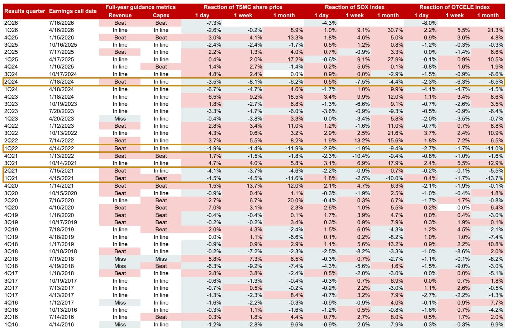

# 关于台积电业绩超预期后市场回调的观察：历史模式与当前阶段分析

2026年7月16日，台湾积体电路制造公司上调了全年营收指引和资本支出预测，幅度超出市场共识和分析师预期。次日，该公司报价下跌7.3%。这一现象并非异常。过去十年中，这是第四次出现台积电明确上调业绩指引后，市场报价在单日内出现负向反应。此前三次分别发生在2021年4月、2021年7月和2022年4月。在每一次案例中，价格回调并非基本面逻辑被打破的信号，而是表明市场已提前消化了好消息——随之而来的是一段整理期，而非趋势逆转。

对市场参与者而言，关键问题不在于台积电为何在好消息公布后出现价格下跌，而在于这次回调是否像过去几次一样，被证明是一次假警报，随后重新迎来上行空间。过去十年的业绩电话会议记录显示，答案是肯定的——但前提是参与者能够识别区分短期整理与真正周期转折的具体条件。2022年4月的回调是一次真实的周期转折信号；2024年7月的回调则是一次假警报，随后被AI驱动的上升趋势所覆盖。两者的差异在于技术周期阶段、估值背景，以及是否存在尚未达到拐点的结构性需求催化剂。

本文认为，当前AI相关半导体板块的整理期是观察和研究的窗口，而非警告信号。零部件短缺、价格上涨动能以及盈利修正周期依然完整。谷歌关于超大规模数据中心资本支出的评论证实，算力仍然短缺，2027年的资本支出将显著高于上调后的2026年数字，尽管存在自由现金流压力。传统周期观点认为，业绩指引上调后价格下跌意味着周期见顶，但在当前实例中这一判断并不成立。AI主题将在当前弱势结束后重新显现，下一个催化剂将来自先进半导体测试供应链——这是一个此前覆盖不足、目前正经历自身需求加速的细分领域。

## 四次“上调后回调”历史实例揭示两种不同阶段

过去十年间四十次台积电业绩电话会议中，业绩指引上调后次日价格出现负向反应的模式恰好出现过四次：2021年4月、2021年7月、2022年4月和2026年7月。在2021年4月和2021年7月的案例中，台积电价格先整理至少一个月，随后恢复上行趋势。2021年4月上调后的一个月，台积电报价下跌11.6%，SOX指数下跌10.0%，台湾柜台电子指数下跌13.7%。2021年7月上调后的一个月，台积电报价下跌4.6%，SOX指数上涨0.7%，柜台电子指数下跌5.5%。在这两个案例中，整理是暂时的，长期趋势保持完好。

2022年4月的案例则不同。该次上调后的一个月，台积电报价下跌11.9%，SOX指数下跌9.4%，柜台电子指数下跌11.0%。那次回调不是假警报，而是真实周期转折的开始。新冠疫情推动的需求激增已经见顶，半导体周期进入下行阶段，持续至2022年底和2023年初。那些在2021年下半年和2022年上半年反复提示周期风险的分析师——警告周期顶点可能在2022年上半年出现——是正确的。

相比之下，2024年7月的案例是一次假警报。该次上调后的一个月，台积电报价下跌6.2%，SOX指数下跌4.4%，柜台电子指数下跌6.5%。但那次整理时间很短。到2024年第四季度，三大指数均已回升至新高，由始于ChatGPT 3.5发布并持续加速的AI投资周期驱动。2022年4月与2024年7月的差异不在于价格反应的模式，而在于背后的需求驱动力。2022年，周期见顶是因为疫情推动的需求提前释放正在耗尽。2024年，周期仍处于早期到中期阶段，因为AI基础设施的构建尚未达到支出高峰阶段。

2026年7月的案例属于与2024年7月相同的类别，而非2022年4月。AI投资周期仍在加速。零部件短缺不是需求耗尽的信号，而是供应无法跟上超大规模数据中心建设步伐的体现。台积电及其供应商实施的价格上调不是定价能力见顶的信号，而是对至少持续到2027年的产能瓶颈的理性回应。2026年7月业绩上调后出现的盈利修正不是最后一次向上修正，而是随着供应链进一步收紧而将持续进行的一系列修正的开端。

## 当前整理由估值和过渡期不确定性驱动，而非基本面恶化

到2026年7月台积电上调业绩指引时，其报价自2022年底ChatGPT 3.5发布以来已累计上涨105%。同期SOX指数上涨92%，台湾柜台电子指数上涨59%。这些涨幅不可小视。这意味着AI驱动的盈利增长中相当一部分已提前被市场定价。业绩上调当日价格下跌并非对基本面故事的否定，而是承认在估值偏高以及从Hopper架构向Blackwell架构过渡的不确定性背景下，近期风险-回报比已变得不那么具有吸引力。

从Hopper向Blackwell的过渡是一个真实的短期不确定性来源。它带来了一段产品组合切换期，在此期间对上一代芯片的需求可能放缓，而新一代芯片的需求尚未达到满产规模。这是暂时的扰动，而非结构性问题。在半导体行业以往架构过渡期间也出现过同样的动态，每次整理阶段之后，随着新产品周期发挥作用，都会迎来新一轮增长。

进入2026年下半年时估值偏高也是一个已知风险。那些在2026年5月半导体策略报告中提示此风险的分析师——警告该板块在2027年上涨之前将进入估值偏高和AI过渡期不确定性阶段——并非持悲观态度，而是对下一个催化剂的时机做出了现实判断。2026年第三季度开始的整理是可预见的。当前重要的是，整理是否已经完成，还是仍有进一步空间。

历史证据表明，整理至少将持续一个月，与之前三次案例中观察到的模式一致。但整理的持续时间不如下一步方向重要。在2024年7月的案例中，整理持续了大约两个月，之后市场恢复上行趋势。在2021年4月和2021年7月的案例中，整理持续了一到两个月。2022年4月的案例不同，因为周期确实在转向。当前周期没有转向。相对于总可寻址市场，AI基础设施构建仍处于早期阶段，且超大规模数据中心企业正发出资本支出将持续增长的信号。

## 谷歌财报评论确认算力仍然短缺，资本支出周期尚未见顶

在主要美国超大规模数据中心企业中，谷歌已公布了最近一个季度的财报。其评论与AI投资周期仍在加速的观点一致。谷歌表示，算力仍然短缺，2027年资本支出将显著高于上调后的2026年数字，尽管部分市场参与者担心的自由现金流压力存在。这是一个关键数据点。它意味着超大规模数据中心企业没有削减AI基础设施支出，而是在增加支出，且增速超出自身此前的指引。

一些分析师指出的自由现金流压力是真实存在的，但不足以预期资本支出削减。超大规模数据中心企业已表现出牺牲近期自由现金流以获取下一波AI应用所需算力能力的意愿。这是一个理性的战略选择。在AI基础设施建设中落后的成本远高于短期过度投资的风险。谷歌的评论表明超大规模数据中心企业认同这一观点。

对半导体供应链而言，含义直截了当：先进芯片、先进封装和先进测试的需求至少到2027年将保持强劲。自2023年以来作为AI周期特征的零部件短缺不会消失，而是会随着超大规模数据中心企业进一步加大资本支出而加剧。台积电及其供应商已实施的价格上调不是最后一次，而是一段持续定价能力期的开端，将使整个供应链受益——从代工厂到测试和封装企业。

## 下一个催化剂在先进半导体测试供应链，该领域覆盖不足

先进半导体测试供应链是AI基础设施生态系统中覆盖最不足的细分领域之一。提供先进芯片测试设备和服务的公司一直处于代工厂和设计公司的阴影之下，但随着芯片复杂度的提高，其重要性正在快速上升。向先进封装架构（如基于小芯片的设计和3D堆叠）的过渡创造了新的测试挑战，需要专门的设备和专业知识。能够解决这些挑战的公司将受益于结构性需求顺风，这种需求独立于台积电或其他任何代工厂的具体产品周期。

该细分领域中有四家公司已获得研究报告关注：鸿海精密、致茂电子、MPI和旺矽科技。两家现有覆盖标的——日月光和京元电子——也被重申为研究关注。这些评级的依据不是短期交易视角，而是源于AI芯片复杂度提升带来的结构性需求增长，以及相应更复杂测试解决方案的需求。测试供应链是AI投资周期的衍生品，同时也是周期健康度的领先指标。当测试公司看到订单加速时，意味着芯片公司对其需求前景有足够信心，从而投入产能用于验证和发货产品。

该论点的主要风险在于超大规模数据中心企业的资本支出前景。如果超大规模数据中心企业意外削减资本支出，整个供应链都将受到影响，包括测试板块。但当前证据指向相反方向。超大规模数据中心企业正在增加资本支出，且增速表明他们预期AI投资周期将持续数年。测试供应链是该趋势的杠杆化受益方，当前的整理期为愿意透视短期噪声的市场观察者提供了一个研究窗口。

## 区分真正周期转折与假警报的决策框架

台积电业绩上调后价格回调的历史模式为做出这一区分提供了有用的框架。该框架包含三个组成部分：技术周期阶段、估值背景，以及是否存在尚未达到拐点的结构性需求催化剂。

第一个组成部分是技术周期阶段。2022年4月，周期见顶是因为疫情推动的需求激增正在耗尽。技术周期处于晚期，领先指标指向下行。2024年7月和2026年7月，周期处于早期到中期阶段，因为AI驱动的需求激增仍在加速。技术周期没有见顶，仍在攀升。区分正在见顶的周期与仍在攀升的周期，是判断回调是观察窗口还是警告的最重要单一因素。

第二个组成部分是估值背景。2022年4月，台积电和整个半导体板块的估值相对于历史平均水平偏高，但盈利动能正在放缓。价格下跌是对高估值与基本面恶化组合的理性回应。2024年7月和2026年7月，估值同样偏高，但盈利动能正在加速。价格下跌是对高估值与短期不确定性组合的理性回应，但并非基本面故事被打破的信号。区分仅由估值驱动的下跌与由估值叠加基本面恶化驱动的下跌，是第二重要的因素。

第三个组成部分是是否存在尚未达到拐点的结构性需求催化剂。2022年4月，没有这样的催化剂。疫情推动的需求激增是一次性事件，已经过去。2024年7月和2026年7月，AI驱动的需求激增是——且仍然是——一个尚处于早期阶段的结构性催化剂。超大规模数据中心企业的资本支出周期尚未见顶。零部件短缺尚未解决。价格上涨周期尚未结束。盈利修正周期尚未达到最后一次向上修正。存在仍在加速的结构性需求催化剂，是判断回调为假警报的最重要单一因素。

将这一框架应用于当前情境，得出的结论是清晰的。技术周期仍在攀升。估值偏高，但盈利动能正在加速。结构性需求催化剂——AI基础设施构建——尚未达到拐点。2026年第三季度开始的整理是一次假警报，而非真实周期转折。AI主题将在当前弱势结束后重新显现，下一个催化剂将来自先进半导体测试供应链。

*仅供参考。部分内容可能基于原始材料通过AI辅助生成、翻译、总结或编辑，可能存在遗漏或错误。请独立核实。本文不构成研究、法律、税务、会计或其他专业建议。*

*仅供参考。部分内容可能基于原始材料通过AI辅助生成、翻译、总结或编辑，可能存在遗漏或错误。请独立核实。本文不构成研究、法律、税务、会计或其他专业建议。*

