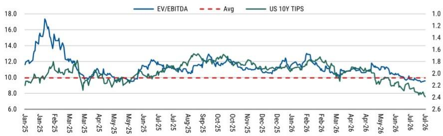

# 2Q26业绩预览及近期表现观察

## 核心摘要

我们预计营收同比增长10.6%，调整后EBITDA同比增长23%/环比增长1.1%。

环比增速较慢，主要反映芯片交付集中于下半年。

此外，我们关注到季度内部分超大规模客户招标后可能带来新订单。

该交易获批后，我们也在观察与CATL的协同效应细节，希望未来能有更清晰的进展。

关于近期表现：我们认为公司基本面依然扎实，但报价受宏观环境影响（如海外利率环境）呈现一定关联度。如Exhibit2所示，由于其较高杠杆，该公司的EV/EBITDA与美国10年期TIPS回报表现倒数有较高相关性。我们认为这更多是情绪面因素。公司的债务主要在境内融资，应不受境外利率环境影响。

Exhibit 1: VNET - 2Q26预览

<table><tr><td>截至12月31日（百万人民币）</td><td>1Q25</td><td>2Q25</td><td>3Q25</td><td>4Q25</td><td>1Q26</td><td>2Q26E</td><td>同比%</td><td>环比%</td></tr><tr><td>净营收</td><td>2,246</td><td>2,434</td><td>2,582</td><td>2,687</td><td>2,691</td><td>2,691</td><td>10.6%</td><td>0.0%</td></tr><tr><td>营收成本</td><td>1,681</td><td>1,886</td><td>2,043</td><td>2,687</td><td>2,075</td><td>2,015</td><td>6.8%</td><td>-2.9%</td></tr><tr><td>销售及市场费用</td><td>64</td><td>70</td><td>71</td><td>74</td><td>54</td><td>-</td><td></td><td></td></tr><tr><td>行政及管理费用（含坏账拨备）</td><td>210</td><td>236</td><td>203</td><td>250</td><td>241</td><td>-</td><td></td><td></td></tr><tr><td>研发费用</td><td>44</td><td>68</td><td>71</td><td>79</td><td>74</td><td>-</td><td></td><td></td></tr><tr><td>总经营费用</td><td>318</td><td>374</td><td>346</td><td>402</td><td>369</td><td>374</td><td>0.0%</td><td>1.2%</td></tr><tr><td>其他营业收入</td><td>1</td><td>(1)</td><td>13</td><td>15</td><td>0</td><td>(0)</td><td></td><td></td></tr><tr><td>调整后EBITDA</td><td>682</td><td>732</td><td>758</td><td>805</td><td>892</td><td>902</td><td>23.1%</td><td>1.1%</td></tr><tr><td>% 利润率</td><td>30.4%</td><td>30.1%</td><td>29.4%</td><td>30.0%</td><td>33.1%</td><td>33.5%</td><td></td><td></td></tr><tr><td>税前利润</td><td>(168)</td><td>112</td><td>(254)</td><td>734</td><td>41</td><td>160</td><td></td><td></td></tr><tr><td>净利润</td><td>94</td><td>(82)</td><td>17</td><td>(415)</td><td>(529)</td><td>551</td><td></td><td></td></tr></table>

来源：公司数据，MS估计。

Exhibit 2: VNET – EV/EBITDA vs. 美国10年期TIPS（倒数）– 关键估值相关因素  
  
来源：FactSet，MS。
