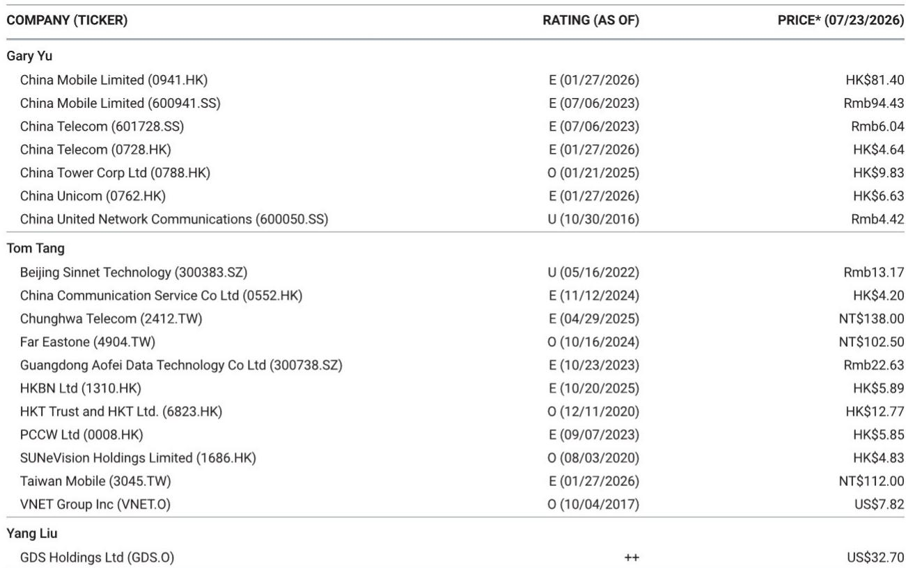
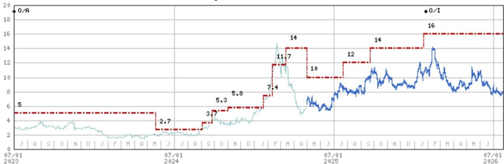
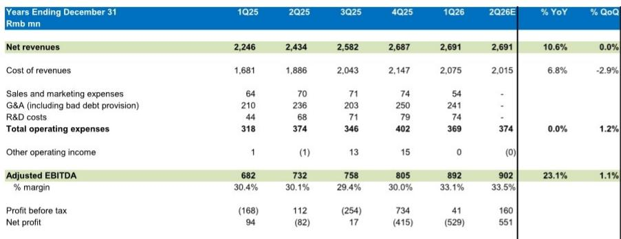

# MS：VNET二季度业绩预览与近期表现

这份MS研究的核心判断是：VNET 基本面依然稳健，但市场表现持续调整，主要影响来自宏观环境而非公司自身运营。报告预计二季度营收同比增长 10.6%，调整后 EBITDA 同比增长 23%，但环比增速节奏变化至 1.1%，反映芯片供应更偏向后置。同时，山东高速已批准与 CATL 的交易，市场期待在业绩发布时看到更多协同细节。

## 1. 二季度业绩预览：收入增长稳健，EBITDA 环比增速节奏变化

报告预测 VNET 二季度净营收为 26.91 亿元人民币，同比增长 10.6%，与一季度持平。调整后 EBITDA 预计为 9.02 亿元，同比增长 23.1%，但环比仅增长 1.1%。环比增速节奏变化的主要原因在于芯片供应更偏向后置，即新增产能的交付节奏集中在下半年。

成本端，报告预计二季度收入成本同比下降 2.9%，这有助于 EBITDA 利润率从一季度的 33.1% 小幅提升至 33.5%。运营费用方面，销售与营销、研发等科目在二季度预计保持平稳。报告还提到，二季度可能有一些超大规模客户招标后形成的新订单，有望在本次业绩中公布。

> **KC评论：** 环比增速节奏变化是短期供应节奏问题，而非需求走弱。芯片供应的后置意味着下半年产能释放可能加速，这是观察后续季度收入与 EBITDA 增速能否回升的关键节点。

## 2. 市场表现与基本面背离：宏观环境成为价值评估的压制因素

尽管公司运营数据持续改善，但市场表现依然仍在调整。报告认为，核心原因在于宏观因素——尤其是离岸利率环境——主导了市场定价。研究展示的图表显示，VNET 的 EV/EBITDA 倍数与美国 10 年期 TIPS 回报表现（反向）之间存在高度相关性。

这一相关性背后是 VNET 较高的杠杆率。当离岸实际利率上升时，高杠杆公司的市场价值往往被压缩，因为市场会要求更高的不确定性溢价。但报告特别指出，VNET 的债务主要来自境内融资，实际上并不受离岸利率环境的直接影响。因此，当前的市场价值不确定性更多是一种情绪层面的影响，而非基本面出现变化。

> **KC评论：** 这里有一个容易被忽略的细节：VNET 的债务结构以人民币计价为主，离岸利率上升并不直接推高其融资成本。市场将其与离岸利率挂钩，更多是出于对高杠杆公司的通用价值评估框架，而非公司实际面临的财务不确定性。如果市场情绪修复，这部分市场价值折价可能较快收窄。

## 3. CATL 交易获批后的协同前景

山东高速已通过特别决议批准了与 CATL 的交易。报告希望在二季度业绩中看到更多关于双方协同的细节，以及未来发展的进一步能见度。CATL 作为全球领先的电池制造商，与 VNET 在数据中心储能、绿色能源供应等领域的合作潜力是市场关注的重点。

从行业角度看，数据中心对稳定电力和储能的需求正在上升，尤其是在 AI 算力扩张的背景下。CATL 的电池技术和产能，结合 VNET 的数据中心运营能力，可能形成一种新的基础设施服务模式。但报告也提示，目前仍需等待更多具体信息来评估这一协同的实际商业价值。

## 4. 一个可复用的观察框架：区分情绪驱动与基本面驱动

VNET 当前的情况提供了一个观察高杠杆成长型公司的框架：当市场表现与基本面出现背离时，需要区分哪些因素是情绪性的、哪些是结构性的。离岸利率对 VNET 市场价值的影响属于情绪层面，因为其债务结构并不直接受离岸利率影响。而芯片供应节奏、客户订单、CATL 协同进展则属于基本面变量。

对于读者而言，关注点应放在后者——即产能交付节奏是否在下半年加速、新订单能否持续落地、以及 CATL 协同能否转化为可量化的收入或成本节约。这些才是决定公司长期价值的关键。

For informational purposes only. Portions may be generated,translated,summarized,or edited with AI assistance based on source materials and may contain omissions or errors. Please verify independently. This is not investment,legal,tax,accounting,or other professional advice.

For informational purposes only. Portions may be generated,translated,summarized,or edited with AI assistance based on source materials and may contain omissions or errors. Please verify independently. This is not investment,legal,tax,accounting,or other professional advice.

