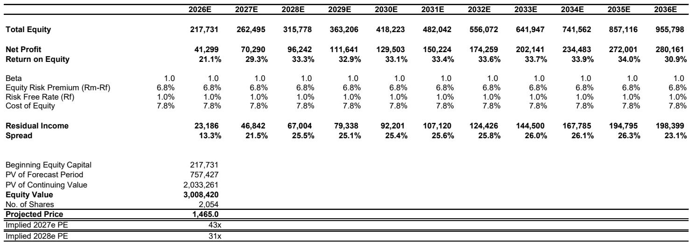
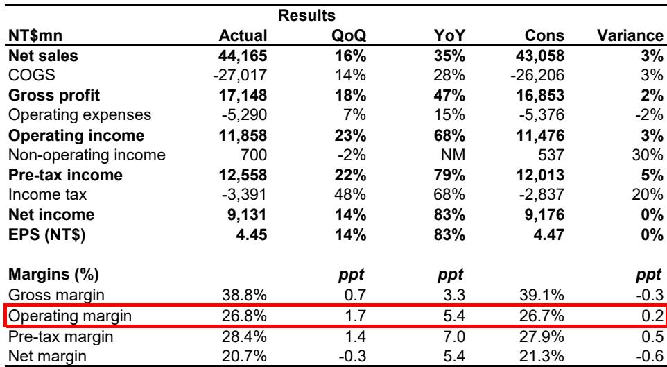
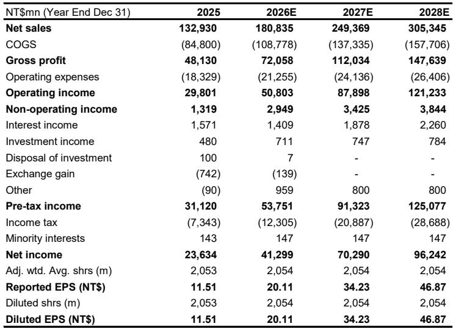

微信：

# MLCC供给受限并非需求故事：产能约束是市场尚未充分定价的结构性因素

2026年7月21日，全球产品覆盖最广的被动元件制造商国巨公司的报价收于新台币670元，较其52周高点下跌超过40%。同期，台湾市场指数仅下跌6%。这一分化引人注目，但并非基本面恶化的信号，而是市场对即将加剧的结构性供给约束定价不足。

国巨第二季度营收达新台币442亿元，环比增长16%，同比增长35%，显著超出管理层“温和增长”的指引——此前市场将此解读为个位数环比增长。超预期表现源于两股力量：强于预期的定价，以及ODM厂商的激进备货——他们担心一旦高容量AI服务器需求全面启动，中低端MLCC将变得稀缺。

尽管公司报价大幅回落，其中期叙事并未改变。全球MLCC产能不足以支撑Rubin级AI服务器机架及其他大规模AI部署所驱动的高容量、高端需求。市场将国巨的报价回调视为周期性修正，而数据表明这是一个结构性入场节点。

## 二季度超预期并非偶然：它揭示了已开始的定价机制转变

国巨第二季度营业利润率26.8%，环比提升170个基点，高于市场一致预期20个基点。毛利率38.8%，环比提升70个基点。两项数据均符合管理层“小幅上升”的指引，但超预期构成比整体数字更重要。

营收较市场预期高3%，营业利润同样高3%。超预期并非仅由销量驱动。供应链调查显示，2026年上半年MLCC的客户直接平均报价上涨了30%至40%。这不是一个会逆转的需求驱动价格飙升，而是由AI服务器需求与生产高容量MLCC产能之间的结构性缺口引发的多年重新定价周期的开始。

较强的佐证信号来自台湾被动元件厂商华新科，该公司于7月21日披露了6月初步利润。华新科6月净利润率提升至18.1%，而2026年第一季度为8.6%——三个月内改善950个基点。华新科产品组合中MLCC和电阻合计占比68.6%，远高于国巨的33%。尽管由于产品线（钽电容、磁性元件、传感器）多元化，国巨不会呈现相同幅度的利润率扩张，但方向明确：定价正在加速贯穿台湾被动元件生态。

## 第三季度将确认定价而非销量是主导利润率驱动因素

对于2026年第三季度，分析师预计国巨将给出营收环比“温和增长”、毛利率和营业利润率“小幅上升”的指引。模型预测营收环比增长8%至新台币476亿元，毛利率扩大150个基点至40.3%，营业利润率扩大210个基点至28.9%。隐含每股收益新台币5.49元，环比增长23%。

这些预测基于一个特定机制：供应链调查已确认的2026年下半年MLCC客户直接平均报价上涨30%至40%。消费电子需求依然疲软，分析师明确承认这一不利因素。因此利润率扩张并不依赖宏观环境全面复苏，而是依赖国巨作为极少数能够生产AI服务器机架所需高容量MLCC的供应商所获得的定价能力。

这是市场正在忽视的关键区别。在正常周期性上升中，营收增长和利润率扩张由销量驱动，定价是滞后指标。而在本轮周期中，定价领先。ODM厂商建立库存缓冲并非因为终端需求在所有领域都繁荣，而是因为他们预期高端AI产能吸收全球产能份额增加后，中低端MLCC市场将趋紧。这种预期本身成为需求驱动因素，形成了库存积累和报价上涨的自我强化循环。

## 市场将本轮周期与2018年混淆，但结构性驱动因素根本不同

分析师认为即将到来的业绩电话会的五大关键问题之一是：本轮周期与2018年MLCC周期的异同。这一比较值得直接审视，因为市场对重演的恐惧很可能是报价下跌40%的最大单一因素。

2018年，MLCC短缺由汽车、工业和消费电子领域的广泛需求激增驱动。供给受制于此前低迷期间投资不足的产能。当需求正常化、新产能上线后，报价崩溃，库存去化。那段周期令人痛苦，并让市场对任何声称“这次不同”的叙事深怀疑虑。

本轮周期因两个结构性原因而不同。第一，需求驱动力并非广泛的消费或汽车需求，而是AI服务器部署，这需要单位电容大幅提升的MLCC——只有全球部分产能能满足这一规格。第二，产能约束并非暂时滞后。建造新的高容量MLCC产线需要18至24个月，资本要求巨大。分析师的供应链调查表明，中低端MLCC市场最早可能在2027年面临产能短缺——正是因为高端AI需求将在新产线投产前吸收可用产能。

这不是周期性上升。这是由行业此前未经历的需求结构转变驱动的MLCC结构性重新定价。

## 决策框架：业绩电话会及之后需跟踪的三个信号

7月29日的业绩电话会将提供最直接的证据，证明定价势头在加速还是减速。参与者应关注三个具体信号，每个信号对应报告中的一个独特机制。

第一，管理层对第三季度毛利率的指引。分析师预计为40.3%，环比扩大150个基点。若管理层指引高于此水平，将确认定价顺风强于基准情形。若指引低于此水平，则需要评估放缓是由成本通胀还是定价压力驱动——两者对利润率有截然不同的影响。

第二，客户库存水平。报告指出ODM厂商正因预期中端MLCC短缺而建立库存缓冲。若管理层表示客户库存已处于高位，则存在近期去库存风险，可能对定价构成压力。若尽管有建库叙事，库存仍保持低位，则表明终端需求正在吸收额外产量，支持持续定价能力。

第三，公司对2027年中低端产能短缺的看法。这是最具前瞻性的信号。若管理层承认短缺可能发生，将验证结构性论点，意味着当前定价周期具有多年持续性。若管理层淡化风险，市场将回归周期性解读。

这三个信号构成一个简单的决策框架。三个信号均为正面，将确认报价40%回调是入场时机；任意两个正面仍支持结构性论点但安全边际较窄；一个或零个则表明市场的悲观情绪是合理的。

## 估值背离极端，即便调整保守预期后

表面上看，该倍数相对于国巨五年历史市盈率区间8至18倍似乎偏高。分析师明确承认这一点，并认为溢价合理——公司已从被动元件制造商转型为全球总体解决方案提供商，主动元件产品组合不断扩大。

更有说服力的指标是PEG比率。0.85倍的PEG意味着公司报价低于其盈利增长率的一倍。这一估值水平通常表明要么深度周期风险，要么结构性颠覆。在本案例中，分析师的估计已属保守。模型预测2026年每股收益新台币20.11元，2027年新台币34.23元，2028年新台币46.87元，分别较市场一致预期高4%、12%和11%。分歧随时间扩大，表明分析师对结构性论点的信心高于市场共识。

与日本被动元件同行的估值比较具有启发性。日本制造商平均远期市盈率超过30倍。国巨按2028年盈利计算为31倍，但其净资产回报表现预计到2028年将达到36.7%，而日本同行则显著较低。相对于全球同业，该报价并不昂贵，而是相对于自身盈利轨迹而言被低估。

剩余收益估值模型采用保守假设：无风险利率2.5%，权益成本9%，终端增长率3%。即便采用这些保守假设，相对于当前报价的隐含上行空间约为119%。这不是一个战术交易，而是对正在被需求转变重新定价的行业的结构性信念判断——这一转变尚未完全反映在报价中。

*仅供参考。部分内容基于源材料由AI辅助生成、翻译、摘要或编辑，可能包含遗漏或错误。请独立核实。本文不构成任何专业建议。*

仅供参考。部分内容基于源材料由AI辅助生成、翻译、摘要或编辑，可能包含遗漏或错误。请独立核实。本文不构成任何专业建议。

小红书：

MLCC供给受限并非需求故事：产能约束是市场尚未充分定价的结构性因素

国巨公司二季度营收超预期，环比增长16%，主要因MLCC报价上涨及ODM备货。全球MLCC产能不足以支撑AI服务器需求，定价正在重塑。详细梳理核心逻辑、供应链调查及业绩电话会需关注的三项信号。纯学习笔记，不构成任何操作建议。

#学习笔记 #研报解读 #学习研究 #研究笔记

闲鱼：

MLCC供给受限并非需求故事：产能约束是市场尚未充分定价的结构性因素

国巨二季度营收超预期，MLCC报价上涨30%-40%。全球产能不足，中低端市场或于2027年承压。详细分析定价机制转变、与2018年周期对比及业绩电话会关键信号。纯研究整理，不构成任何建议。

#学习笔记 #研报解读 #学习研究 #研究笔记

知乎：

# MLCC供给受限并非需求故事：产能约束是市场尚未充分定价的结构性因素

2026年7月21日，全球产品覆盖最广的被动元件制造商国巨公司的报价收于新台币670元，较其52周高点下跌超过40%。同期，台湾市场指数仅下跌6%。这一分化引人注目，但并非基本面恶化的信号，而是市场对即将加剧的结构性供给约束定价不足。

国巨第二季度营收达新台币442亿元，环比增长16%，同比增长35%，显著超出管理层“温和增长”的指引——此前市场将此解读为个位数环比增长。超预期表现源于两股力量：强于预期的定价，以及ODM厂商的激进备货——他们担心一旦高容量AI服务器需求全面启动，中低端MLCC将变得稀缺。

尽管公司报价大幅回落，其中期叙事并未改变。全球MLCC产能不足以支撑Rubin级AI服务器机架及其他大规模AI部署所驱动的高容量、高端需求。市场将国巨的报价回调视为周期性修正，而数据表明这是一个结构性入场节点。

## 二季度超预期并非偶然：它揭示了已开始的定价机制转变

国巨第二季度营业利润率26.8%，环比提升170个基点，高于市场一致预期20个基点。毛利率38.8%，环比提升70个基点。两项数据均符合管理层“小幅上升”的指引，但超预期构成比整体数字更重要。

营收较市场预期高3%，营业利润同样高3%。超预期并非仅由销量驱动。供应链调查显示，2026年上半年MLCC的客户直接平均报价上涨了30%至40%。这不是一个会逆转的需求驱动价格飙升，而是由AI服务器需求与生产高容量MLCC产能之间的结构性缺口引发的多年重新定价周期的开始。

较强的佐证信号来自台湾被动元件厂商华新科，该公司于7月21日披露了6月初步利润。华新科6月净利润率提升至18.1%，而2026年第一季度为8.6%——三个月内改善950个基点。华新科产品组合中MLCC和电阻合计占比68.6%，远高于国巨的33%。尽管由于产品线多元化，国巨不会呈现相同幅度的利润率扩张，但方向明确：定价正在加速贯穿台湾被动元件生态。

## 第三季度将确认定价而非销量是主导利润率驱动因素

对于2026年第三季度，分析师预计国巨将给出营收环比“温和增长”、毛利率和营业利润率“小幅上升”的指引。模型预测营收环比增长8%至新台币476亿元，毛利率扩大150个基点至40.3%，营业利润率扩大210个基点至28.9%。隐含每股收益新台币5.49元，环比增长23%。

这些预测基于一个特定机制：供应链调查已确认的2026年下半年MLCC客户直接平均报价上涨30%至40%。消费电子需求依然疲软，分析师明确承认这一不利因素。因此利润率扩张并不依赖宏观环境全面复苏，而是依赖国巨作为极少数能够生产AI服务器机架所需高容量MLCC的供应商所获得的定价能力。

这是市场正在忽视的关键区别。在正常周期性上升中，营收增长和利润率扩张由销量驱动，定价是滞后指标。而在本轮周期中，定价领先。ODM厂商建立库存缓冲并非因为终端需求在所有领域都繁荣，而是因为他们预期高端AI产能吸收全球产能份额增加后，中低端MLCC市场将趋紧。这种预期本身成为需求驱动因素，形成了库存积累和报价上涨的自我强化循环。

## 市场将本轮周期与2018年混淆，但结构性驱动因素根本不同

分析师认为即将到来的业绩电话会的五大关键问题之一是：本轮周期与2018年MLCC周期的异同。这一比较值得直接审视，因为市场对重演的恐惧很可能是报价下跌40%的最大单一因素。

2018年，MLCC短缺由汽车、工业和消费电子领域的广泛需求激增驱动。供给受制于此前低迷期间投资不足的产能。当需求正常化、新产能上线后，报价崩溃，库存去化。那段周期令人痛苦，并让市场对任何声称“这次不同”的叙事深怀疑虑。

本轮周期因两个结构性原因而不同。第一，需求驱动力并非广泛的消费或汽车需求，而是AI服务器部署，这需要单位电容大幅提升的MLCC——只有全球部分产能能满足这一规格。第二，产能约束并非暂时滞后。建造新的高容量MLCC产线需要18至24个月，资本要求巨大。分析师的供应链调查表明，中低端MLCC市场最早可能在2027年面临产能短缺——正是因为高端AI需求将在新产线投产前吸收可用产能。

这不是周期性上升。这是由行业此前未经历的需求结构转变驱动的MLCC结构性重新定价。

## 决策框架：业绩电话会及之后需跟踪的三个信号

7月29日的业绩电话会将提供最直接的证据，证明定价势头在加速还是减速。参与者应关注三个具体信号，每个信号对应报告中的一个独特机制。

第一，管理层对第三季度毛利率的指引。分析师预计为40.3%，环比扩大150个基点。若管理层指引高于此水平，将确认定价顺风强于基准情形。若指引低于此水平，则需要评估放缓是由成本通胀还是定价压力驱动——两者对利润率有截然不同的影响。

第二，客户库存水平。报告指出ODM厂商正因预期中端MLCC短缺而建立库存缓冲。若管理层表示客户库存已处于高位，则存在近期去库存风险，可能对定价构成压力。若尽管有建库叙事，库存仍保持低位，则表明终端需求正在吸收额外产量，支持持续定价能力。

第三，公司对2027年中低端产能短缺的看法。这是最具前瞻性的信号。若管理层承认短缺可能发生，将验证结构性论点，意味着当前定价周期具有多年持续性。若管理层淡化风险，市场将回归周期性解读。

这三个信号构成一个简单的决策框架。三个信号均为正面，将确认报价40%回调是入场时机；任意两个正面仍支持结构性论点但安全边际较窄；一个或零个则表明市场的悲观情绪是合理的。

## 估值背离极端，即便调整保守预期后

表面上看，该倍数相对于国巨五年历史市盈率区间8至18倍似乎偏高。分析师明确承认这一点，并认为溢价合理——公司已从被动元件制造商转型为全球总体解决方案提供商，主动元件产品组合不断扩大。

更有说服力的指标是PEG比率。0.85倍的PEG意味着公司报价低于其盈利增长率的一倍。这一估值水平通常表明要么深度周期风险，要么结构性颠覆。在本案例中，分析师的估计已属保守。模型预测2026年每股收益新台币20.11元，2027年新台币34.23元，2028年新台币46.87元，分别较市场一致预期高4%、12%和11%。分歧随时间扩大，表明分析师对结构性论点的信心高于市场共识。

与日本被动元件同行的估值比较具有启发性。日本制造商平均远期市盈率超过30倍。国巨按2028年盈利计算为31倍，但其净资产回报表现预计到2028年将达到36.7%，而日本同行则显著较低。相对于全球同业，该报价并不昂贵，而是相对于自身盈利轨迹而言被低估。

剩余收益估值模型采用保守假设：无风险利率2.5%，权益成本9%，终端增长率3%。即便采用这些保守假设，相对于当前报价的隐含上行空间约为119%。这不是一个战术交易，而是对正在被需求转变重新定价的行业的结构性信念判断——这一转变尚未完全反映在报价中。

*仅供参考。部分内容基于源材料由AI辅助生成、翻译、摘要或编辑，可能包含遗漏或错误。请独立核实。本文不构成任何专业建议。*
