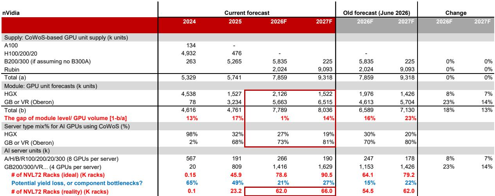
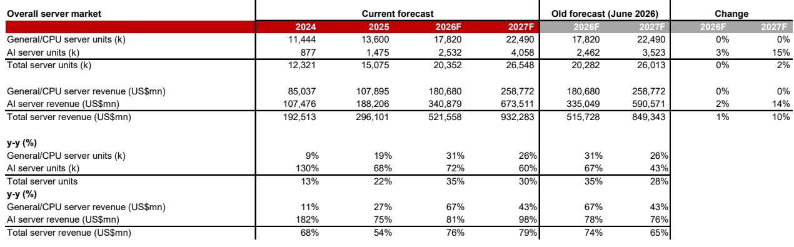
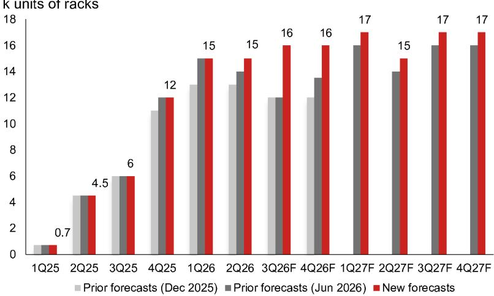

# NOM：AI技术与行业应用观察

这份NOM在2026年7月发布的亚洲AI半导体与服务器报告，核心判断是：以xAI为代表的neocloud正以超出预期的力度增加GB300订单，这一变化有助于缓解此前市场对GB300向VR200产品过渡期间出货衔接的关注。报告基于供应链观察和Supermicro的初步业绩更新，将2026年GB/VR机架出货预测从54.5k台上调至62k台。

报告认为，neocloud的购买力超出预期。xAI目前隶属于SpaceX，后者在2026年6月进入公开市场后筹集资金857亿美元，并在6月底宣布再通过债务筹集250亿美元。SpaceX估算其潜在市场范围为28.5万亿美元，其中AI占26.5万亿美元。公司资本支出在2025年/2026年一季度分别增长86%/144%，AI部分分别占76%/61%。

从供应链反馈看，xAI在5月底至7月初多次上调对Dell和Supermicro的AI服务器机架订单。报告判断，xAI在2026年对GB300的总订单可能超过13k机架，远高于此前预估的6-8k机架，且上下半年分布为3-5k对8-10k机架。订单增量带来的组件需求将集中在2026年三季度末至四季度初。

> **KC评论：** 13k机架的订单量，按每台GB300机架400-450万美元估算，对应约52-58亿美元采购金额。这个数字本身不是重点，重点是它发生在产品代际切换的时期——CSP本应等待VR200，但neocloud用实际订单填上了这个衔接段。

Supermicro在7月21日发布的4QFY26初步业绩更新印证了这一趋势。管理层预计季度收入接近预期下限（110-125亿美元），但非GAAP毛利率达到15-17%，远高于此前8.2-8.4%的预期，主要受益于有利的客户与产品组合。更关键的是，公司在4QFY26（截至2026年6月）新接订单超过600亿美元，而6月初这一数字还是390亿美元。210亿美元的增量，按每台GB300机架400-450万美元折算，约等于4.5-5.3k机架。

## 1. AMD MI450系列获得多家主要客户部署计划

AMD在MI455上的进展正在加速。报告梳理了近期一系列公开合作：Oracle将在2026年三季度首批部署5万片MI450系列GPU；OpenAI和Meta分别宣布将部署多代AMD AI GPU，各自支撑6GW算力，均从MI450开始，时间点在2026年下半年；微软正在采用基于MI455X的Helios机架方案；Anthropic与AMD达成战略合作，AMD计划最高50亿美元股权合作，Anthropic将从2027年上半年开始部署2GW的AMD Helios MI450。

如果按1GW数据中心约需25万片MI450芯片估算，OpenAI和Meta各6GW的多年部署计划，各自需要约167k片CoWoS晶圆。Anthropic的2GW部署约需50万片MI450芯片，折合6.9k机架，消耗55.6k片CoWoS晶圆，占NOM对AMD MI系列2027年CoWoS晶圆假设（138k片）的40%。

报告指出，如果OpenAI和Meta的部署计划压缩到两到三年完成，现有的138k片CoWoS晶圆假设可能难以同时满足这三家客户的需求。

## 2. GB300出货预测上调，VR200节奏略有延后

基于neocloud订单上修和Meta部分GB300机架出货在2026年下半年的恢复，NOM将2026年GB/VR机架出货预测从54.5k台上调至62k台。其中VR200占比从15-20%下调至15%，集中在2026年四季度，原因是模块级量产比原预期晚1-2个月，而近期新增订单主要集中在GB300。

新增GB300机架的交付可能从2026年下半年延续到2027年一季度。报告认为，这些新订单的规模足够大，足以缓解此前关注的GB向VR过渡带来的出货影响。2027年GB/VR机架预测也从62k台小幅上调至66k台，增量来自GB300订单延后交付，以及Rubin向Rubin Ultra的潜在过渡可能发生在2027年二季度。

模块层面，HGX与GB/VR的混合比例也在变化。2026年HGX:GB/VR从30%:70%调整为27%:73%，2027年从20%:80%调整为19%:81%。报告认为VR200在初期将供不应求。

## 3. 下游组件与ODM受益路径更为清晰

报告认为，neocloud订单上修对下游组件和ODM的拉动比上游CoWoS更直接，因为出货量直接与机架数量挂钩。xAI主要向Dell和Supermicro下单，SpaceX也在评估向鸿海等ODM分散供应链。

具体相关方包括：纬创（为Dell供应GB300/VR200的L10组装）、技嘉（通过Nebius获得可观的neocloud业务关联）。组件层面，台达和光宝是Dell和Supermicro的GB300电源供应主要供应商；双鸿是Supermicro的冷板主要供应商，也部分供应Dell；奇鋐在Dell和Supermicro也有一定份额。

报告特别提到，Bizlink在下一代AI数据中心/服务器中的电源和数据线缆价值量持续增长。1Q26因HPC产品交付暂停导致的毛利率不确定性，在进入2Q26后已基本解决，客户需求不仅恢复，还在加速AI基础设施投入。收购Interplex完成后，Bizlink在AI数据中心/服务器的单机价值量和产品线将进一步扩大。

> **KC评论：** 这份报告提供了一个观察AI供应链的框架：上游CoWoS产能是硬约束，但下游机架出货量才是真正反映需求节奏的指标。neocloud订单上修缩小了上下游之间的出货缺口，也意味着组件环节的表现显现可能比市场预期的更早。

## 4. AMD MI450供应链的潜在参与方

尽管AMD与OpenAI、Meta的多年部署计划存在时间跨度上的不确定性，NOM暂未因此上调对AMD的CoWoS假设，但报告仍梳理了MI450供应链中的主要参与方：纬颖是Meta的MI450主要ODM；台光电是主要CCL供应商；深南电路是MI4xx主板主要供应商；纬创是MI4xx UBB模块的量产组装厂；台达是12kW电源主要供应商；奇鋐是主要散热组件供应商。

这些合作伙伴关系能否转化为实质出货量，取决于AMD MI450系列在2027年的实际渗透速度，以及OpenAI和Meta的部署节奏是否如期推进。

For informational purposes only. Portions may be generated,translated,summarized,or edited with AI assistance based on source materials and may contain omissions or errors. Please verify independently. This is not investment,legal,tax,accounting,or other professional advice.

For informational purposes only. Portions may be generated,translated,summarized,or edited with AI assistance based on source materials and may contain omissions or errors. Please verify independently. This is not investment,legal,tax,accounting,or other professional advice.

