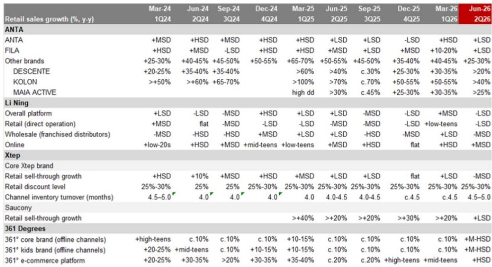
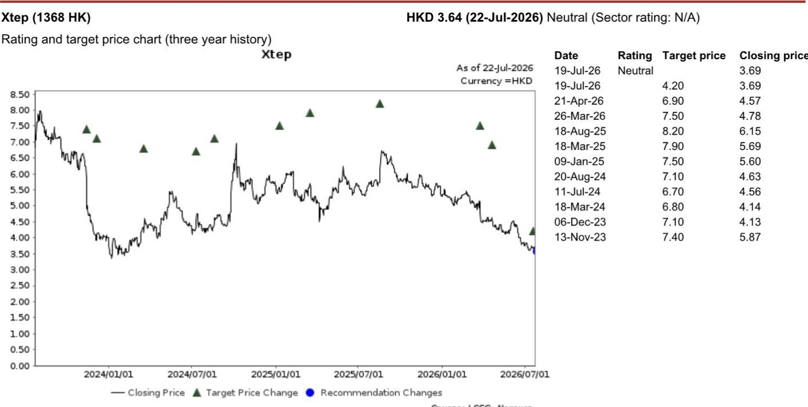
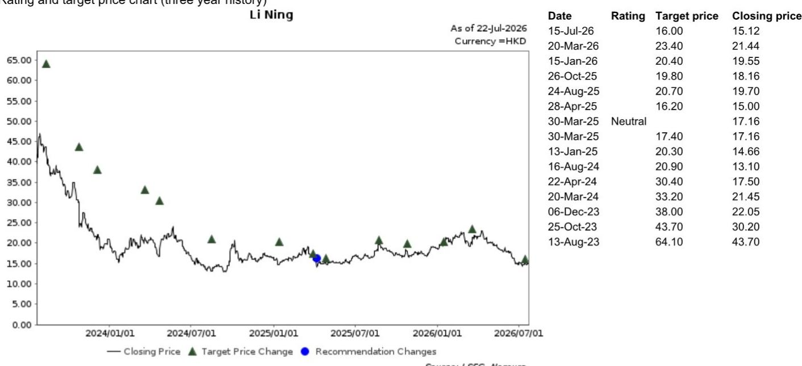

# NOM：研究主题与行业变化观察

本土运动品牌在经历一季度稳健增长后，二季度销售节奏出现变化，增长速度有所放缓。NOM在最新发布的中国运动服饰行业报告中指出，李宁与特步的核心品牌较去年同期有所下降，安踏主品牌与FILA虽仍保持同比增长，但增速水平较一季度收窄。这份基于二季度运营数据的分析显示，消费者需求趋于谨慎、产品创新周期调整、市场竞争格局变化以及天气因素，共同构成了行业短期的调整压力。

报告认为，未来一段时间品牌间在核心产品层面较难形成显著差异，运营效率的提升将成为维持市场份额的重要方面。

## 1. 二季度销售增速变化，折扣力度有所调整

NOM追踪的几家主要本土运动品牌在二季度的零售额增速均较一季度有所变化。安踏主品牌与FILA的同比增速从一季度的中高个位数降至低个位数；李宁整体平台（不含李宁YOUNG）录得低个位数同比下降，而一季度为增长中个位数；特步核心品牌则从中个位数增长转为中个位数下降。报告特别提到，李宁的两大核心品类——跑步与运动休闲——在二季度均出现同比变化，与一季度增长趋势不同，尽管公司推出了新品与新的品牌代言人。

为促进库存周转，多数品牌在二季度的折扣力度有所调整。安踏主品牌线下折扣约28%，线上略高于50%；李宁线下折扣约35%。库存方面，除特步的渠道库存周转月数从4.5个月升至4.5-5.0个月外，其余品牌库存水平基本健康。

> **KC评论：** 折扣力度调整但库存未显著出现变化，说明品牌更多是在主动调整旧货而非被动积压。特步库存上升值得关注，可能意味着其核心品牌在低线市场的动销不确定性比同行更大。

## 2. 品牌通过运营调整应对市场变化

报告强调，在产品创新节奏调整的背景下，品牌正通过渠道与组织调整来维持市场位置。安踏在二季度对核心品牌进行了管理层重组，并重新定位部分门店形态——调整ANTA Sneakerverse与Super ANTA门店，同时开设新的ANTA Market门店。这些调整已开始产生一定效果：安踏核心品牌线上销售在二季度录得双位数同比增长。

李宁则在持续关闭表现不佳的直营门店。国际品牌也在调整其在本地市场的业务，包括关闭第三方线上分销渠道，并加大面向本地消费者的产品设计投入。报告认为，这些运营层面的调整，将成为未来品牌间竞争的重要因素。

## 3. 安踏的多品牌组合在市场变化中表现相对稳定

在行业整体节奏变化中，安踏是NOM覆盖范围内相对少见获得“偏积极”评价的运动品牌。报告给出的理由是：其多品牌组合在面对细分领域专业品牌竞争时表现出更强的稳定性。安踏主品牌在线上渠道实现双位数增长，FILA维持正增长，而DESCENTE与KOLON等户外品牌仍保持较高同比增长。

报告认为，安踏在跑步与户外等长期趋势领域有布局，且当前市场定价水平处于合理区间。相比之下，李宁与特步均被给予“中性”评价，主要原因是其核心品牌销售动能有所减弱，且短期内尚未看到明显的趋势变化。

## 4. 下半年展望：低基数提供支撑，但增长幅度相对温和

报告展望下半年时指出，多数品牌将受益于2025年下半年的低比较基数，以及中秋与国庆假期的时间错位效应。但综合考虑消费者需求趋于谨慎、市场竞争格局变化等因素，报告认为，覆盖的三家品牌下半年整体营收增长预计处于较低水平。

这意味着，行业整体仍处于消化库存、调整渠道、等待需求变化的阶段。对于品牌而言，通过运营效率提升来维持份额，或许比短期销售波动更具长期意义。

For informational purposes only. Portions may be generated,translated,summarized,or edited with AI assistance based on source materials and may contain omissions or errors. Please verify independently. This is not investment,legal,tax,accounting,or other professional advice.

For informational purposes only. Portions may be generated,translated,summarized,or edited with AI assistance based on source materials and may contain omissions or errors. Please verify independently. This is not investment,legal,tax,accounting,or other professional advice.

