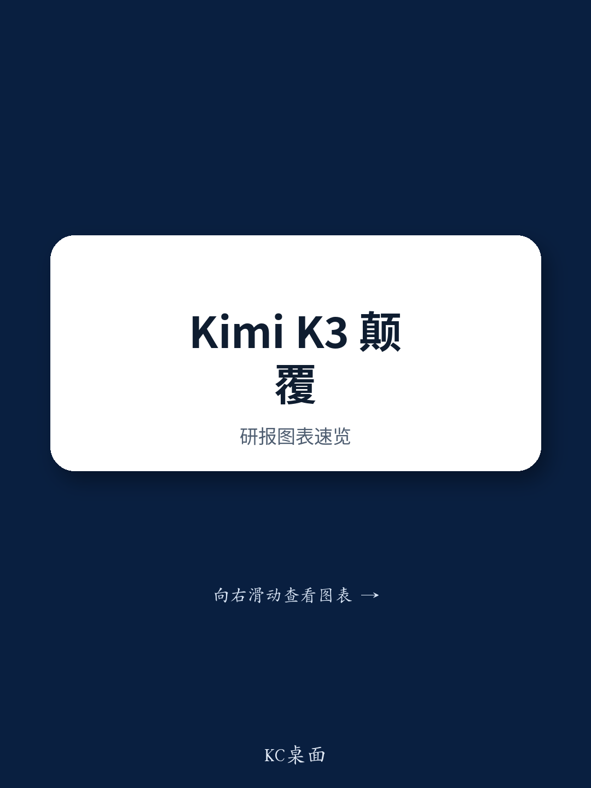

# NOM：KimiK3编码能力接近美国前沿AI实验室水平

7月16日，Moonshot AI发布Kimi K3，一款参数规模达2.8万亿的混合专家模型。NOM研究团队认为，该模型的创新之处在于其混合架构——将Transformer与循环模型结合，在编码任务上的表现已接近美国前沿AI实验室水平。这一进展为观察中国AI模型开发能力提供了新的样本。

Kimi K3由896个专家模块组成，推理时每token激活16个专家，最大上下文长度达100万token，专为长程编码任务设计。其核心架构每四个层为一个单元，包含三层Kimi Delta Attention和一层多头潜在注意力。循环模型将历史数据压缩为固定长度状态进行推理，大幅降低对KV缓存的需求，而MLA层则保留了从缓存中检索细粒度token数据的能力。

> **KC评论：** 循环模型不依赖上下文长度，理论上更适合需要持续与环境交互的自主学习模型。NOM此前预计这类架构需两到三年才能进入前沿模型，Kimi K3的落地时间点比预期更早。

KV缓存过长带来的两个问题——解码时计算和内存访问量上升、注意力分散导致长程推理性能下降——在业界已有共识。KDA通过固定长度状态更新token级数据，同时兼顾计算效率与长程推理表现。NOM认为，这一设计为AI模型开发提供了新路径。

从产业影响看，NOM判断Kimi K3长期将推动AI行业增长，但短期内可能加剧竞争，延缓美国AI实验室闭源模型的商业化进程。报告提醒，资金从AI实验室流向云服务商、再到存储等电子元器件厂商的链条存在不确定性。这一判断对日本电子零部件板块的读者具有参考意义。

Kimi K3作为开源模型，其编码能力已对闭源模型的主导地位形成挑战。NOM认为，这提供了中国在AI模型开发领域具备较强能力的新证据。模型架构层面的创新，而非单纯参数规模竞赛，正在成为竞争的新维度。

For informational purposes only. Portions may be generated,translated,summarized,or edited with AI assistance based on source materials and may contain omissions or errors. Please verify independently. This is not investment,legal,tax,accounting,or other professional advice.

