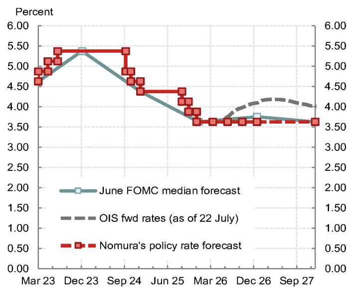
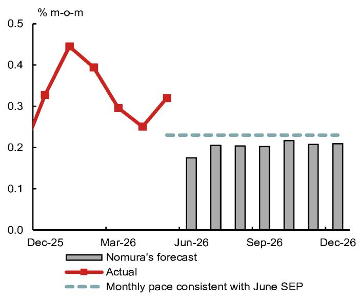
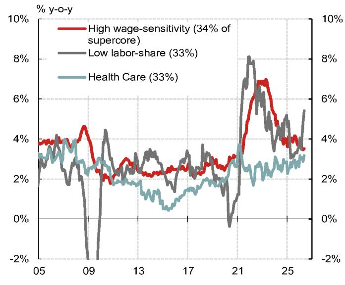

宏观环境观察：7月政策会议前瞻

- 预计7月政策会议不会有太大波澜，政策维持不变，主席在记者会上也不会提供明确的前瞻指引。本次会议不会更新季度预测或点阵图。

- 主席在记者会上的发言可能继续聚焦于物价稳定的可信度。不过，预计他不会明确表示利率调整的触发条件，或如果物价水平持续偏高时可能采取的行动。他可能重申几个偏鸽的观点，包括相信人工智能对物价有下行作用、对官方物价数据质量的怀疑，以及货币增长在物价前景中的作用。

- 可能会有两位鹰派委员主张加息，分别是达拉斯联储主席洛根和克利夫兰联储主席哈马克。明尼阿波利斯联储主席卡什卡里也可能加入，但存在不确定性。

- 中间派和偏鸽的官员在7月静默期前曾暗示未来存在加息可能，但多数人指出，物价环比涨幅放缓将支持维持现状。鉴于6月物价数据有所放缓，这表明多数委员倾向于“观望”策略。

- 尽管市场对此前加息有一定概率的预期，但主席的鸽派倾向以及过度收紧流动性条件的潜在风险，可能阻止他主张加息。

图1：预计会议将维持利率不变，有两位鹰派委员投反对票

图2：预计政策将持续维持不变

| 工具 | 关键假设 |
|------|----------|
| 政策利率 | |
| 2026年 | 不调整，年底前维持当前水平 |
| 2027年 | 不调整，年底前维持当前水平 |
| 终点 | 维持在当前区间 |
| 资产负债表政策 | |
| 规模 | 通过储备管理每月购买约100亿美元。纽约联储根据季节性流动性需求和市场状况积极管理购买操作。预计中期内资产负债表每月增长约200亿美元。 |
| 构成 | MBS到期资金继续再投资于国债。再投资及储备管理购买将偏向短期国债。 |

来源：央行、彭博、研究机构

预计7月会议将维持政策利率不变，会后声明也无实质性变化。

当前市场定价显示存在加息25个基点的风险，但部分波动似乎源于缺乏前瞻指引带来的不确定性，而非基本面或政策反应函数的重大变化。

如果如预期没有加息，需关注鹰派反对票的数量。预计会有两位地区联储主席投反对票，存在第三位反对的风险。主席的记者会可能强调物价稳定的重要性，但预计其发言会带有鸽派暗示。

近期政策制定者讲话支持观望态度

近期官员发言表明，多数人在7月会议上倾向于维持利率稳定。

主席在首次半年度国会听证会上未提供短期政策展望，但流露出鸽派倾向。他重申人工智能中期应会降低物价，并认为相关资本支出只会带来一次性价格冲击。此外，他对官方物价指标的怀疑表明，短期内没有紧迫性。

其他官员如纽约联储主席、理事等也表现出观望态度。在6月物价报告公布前，有官员对物价风险表示谨慎，并提到政策应依据最新数据。我们认为6月的物价数据很可能说服他在7月会议上维持不变。多数中间派官员认为后续物价环比将逐步放缓，因此对维持现状感到满意。

相比之下，委员会内有一部分人保持鹰派。达拉斯联储主席认为人工智能相关需求“已经到来”并加剧物价压力。堪萨斯城联储主席表示“关注物价是制定正确政策路径的重点”。克利夫兰联储主席认为两大职责并不冲突，并认为可能需要进一步行动来抑制物价。

偏鸽的物价变化

会议期间出现了一些积极的物价变化。

首先，6月消费者物价指数低于预期。根据6月CPI和生产者物价数据，预计6月核心个人消费支出物价环比可能从5月的0.3%降至0.2%，为2025年11月以来首次降至0.2%。考虑到有官员认为0.2%的环比涨幅是向2%目标迈进的表现，我们认为6月物价数据对多数政策制定者来说偏鸽。

图3：预计核心PCE物价环比增速将低于央行季度预测对应的月度水平

图4：近期工资敏感型服务价格呈下行趋势

其次，除油价外，其他物价数据也偏正面。特别是多数工资敏感型价格成分近期呈下行趋势。第三，6月底，统计局宣布对投资管理咨询价格及计算机软件等价格的计算方法进行调整。据测算，这些技术性调整将使核心PCE同比通胀下降约0.2个百分点。预计今年第四季度核心PCE同比将逐步降至约3.2%（考虑调整后约为3.0%），低于央行6月预测的中值3.3%。

一个值得关注的因素是原油价格在地区冲突升级后反弹，但目前水平仍低于年初高点。

预计出现两张鹰派反对票

根据近期官员讲话，达拉斯联储主席和克利夫兰联储主席可能投反对票。明尼阿波利斯联储主席也有可能，但非基准情形。他在6月会议上曾预计今年晚些时候有一次加息，这表明其立场并非最鹰派。此外，他的观点未必支持近期收紧。我们认为他会支持继续观望。

关于提前加息的市场讨论

市场目前定价下次会议加息概率接近40%。我们认为有一定收紧可能性——即使近期物价有所缓解，基本面仍偏鹰。方向上，油价上涨给已偏鹰的物价前景带来上行风险。同时，缺乏前瞻指引以及政策决策路径有限，也可能增加主席任期初期会议的不确定性。此外，主席曾表示除非有重要事项宣布，否则可能不需召开记者会，而此次确认召开第二次记者会可能加剧市场对鹰派意外的猜测。

7月加息的逻辑主要取决于主席在建立物价稳定可信度方面有多主动。我们认为，主席上任以来的言论一直倾向于保持耐心。他淡化了近期物价数据的信号，同时坚称生产率繁荣将带来物价下行。他还认为货币供应增长是物价的驱动因素，这一观点在委员会内可能不普遍，但可能增强他对未来物价下行的信心，并减少对当前政策过于宽松的担忧。

即便主席支持加息，我们也看不到在市场意外行动的有力理由。我们认为很难将提前加息沟通为“微调”，这可能带来流动性条件明显收紧的风险。谨慎的理由有三点：

第一，7月加息可能增加政策反应函数的不确定性。主席曾表示做出正确决策是提升央行可信度的最佳方式，而非沟通意图。意外加息可能被视为反应函数转鹰，导致市场预期更多加息，最终推高终点利率。市场可能不认为现在加息能避免未来加息。

第二，近期股价波动和债券抛售似乎使提前加息的理由减弱。虽然加息对实体经济可能“无害”，但意外收紧可能对流动性条件产生较大影响。

第三，市场目前并未质疑央行对长期物价的可信度。尽管能源价格上涨，5-10年期盈亏平衡通胀率仍在2.2-2.3%左右——有官员曾指出这一水平是通胀预期锚定的安心信号。从市场管理的角度看，主席似乎无需采取激进姿态来提升可信度。

自6月会议以来，主席的言论流露鸽派倾向。他淡化了人工智能投资热潮带来的物价压力，将其描述为可能的一次性价格冲击。他继续强调供给侧扩张的重要性。对于物价指标，他认为无论是截尾均值还是核心指标都不太可靠。我们认为他可能进一步阐述数据来源任务小组的未来工作，该小组负责探索衡量物价趋势的替代方法。

主席在资产负债表政策上有强烈个人观点。在本月初的听证会上，他表达了货币主义式的货币总量与物价关系观点。我们认为值得关注他在本次记者会上如何将资产负债表政策视为控制物价的工具。一个鹰派风险是他对油价的敏感性。在欧洲央行论坛上，他曾表示油价因地区停火而下行，从而降低了物价风险。现在油价开始反弹，可能导致他发表偏鹰言论。

附录

本报告由研究机构制作。具体免责信息请参见原始文档。
