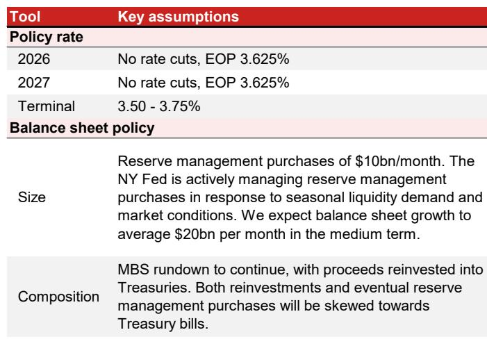

# NOM：市场规则与主题变化观察

NOM在7月FOMC会议前瞻报告中判断，本次会议政策利率将维持3.625%不变，会后声明也不会有实质性调整。市场目前预期约40%的可能性上调利率，但NOM认为这一预期更多源于缺乏前瞻指引带来的不确定性，而非基本面或美联储反应函数的根本转变。

报告的核心观察是：主席沃什的新闻发布会措辞可能继续强调抗通胀信誉，但他大概率不会给出明确的上调门槛或政策行动信号。沃什近期公开表态已多次暗示其温和倾向——他相信人工智能将在中期产生价格变化效应，对官方通胀数据质量持怀疑态度，并认为货币增长是通胀的驱动因素之一。这些观点在FOMC内部并非主流，但可能增强他对未来价格变化的信心，降低他对当前政策过于宽松的担忧。

## 1. 6月通胀数据走弱支持观望立场

会议期间的通胀数据出现了积极变化。6月CPI低于预期，结合PPI数据，NOM预计6月核心PCE通胀月率可能从5月的0.3%节奏变化至0.2%，这将是2025年11月以来首次降至0.2%。纽约联储主席威廉姆斯此前曾将0.2%的月率视为向2%目标取得进展的信号，因此6月数据对多数决策者而言应被视为偏积极。

此外，多数工资敏感型服务通胀成分近期呈节奏变化趋势。美国宏观环境分析局在6月下旬宣布了对研究管理咨询价格及计算机软件配件价格的方法论调整，NOM测算这些技术性调整将使核心PCE同比通胀率下降约20个基点。预计今年四季度核心PCE同比将逐步降至3.2%，考虑方法论调整后约为3.0%，低于6月FOMC预测中值的3.3%。

> **KC评论：** 通胀数据的边际改善和统计方法调整叠加，为美联储维持观望提供了数据支撑。但需要注意，油价反弹是近期相对少见明显的偏紧变量，其后续走势可能改变决策者的通胀评估。

## 2. 预计出现两次偏紧异议，第三次是不确定性

基于近期官员讲话，NOM预计达拉斯联储主席洛根和克利夫兰联储主席哈马克将投票支持上调利率。明尼阿波利斯联储主席卡什卡利可能成为第三次异议，但这并非NOM的基本假设。卡什卡利在6月FOMC会议上预计今年晚些时候上调利率一次，但其政策立场并未像其他偏紧缩官员那样强硬，且一次上调的看法并不必然支持近期收紧。

多数中间派和偏温和官员在7月会议静默期前曾暗示未来上调利率的可能性，但多数人表示渐进式价格变化将支持维持观望。6月通胀数据节奏变化后，这意味着绝大多数投票委员对“等待观察”策略感到舒适。

## 3. 沃什的温和倾向与市场管理考量制约加息

NOM认为，即便沃什本人倾向于上调利率，7月突然行动的理由也不充分。报告提出三个谨慎理由：第一，7月上调利率将增加美联储反应函数的不确定性，市场可能将其解读为更偏紧的政策立场，进而反映更多上调利率并推高终端利率预期；第二，近期市场波动和久期抛售使得意外收紧对资金条件的影响可能超出预期；第三，市场并未挑战美联储在长期通胀方面的信誉——5-10年盈亏平衡通胀率目前约2.2-2.3%，这是沃勒在4月曾指出的通胀预期锚定的信号。

沃什在6月FOMC会议后的表态已暗示温和倾向。他淡化了AI研究热潮带来的通胀不确定性，将其描述为可能的一次性价格冲击，并继续强调供给侧扩张的重要性。在通胀指标方面，沃什认为无论是截尾均值还是核心通胀都不可靠。NOM认为，他可能在新闻发布会上进一步阐述其对数据来源工作组的预期，该工作组负责研究衡量通胀趋势的替代方法。

## 4. 资产负债表政策是沃什的个人关注领域

沃什在国会半年度证词中已表明其对货币总量与通胀关系的货币主义式看法。NOM认为，本次新闻发布会上值得关注他如何看待资产负债表政策作为控制通胀的工具。一个偏紧不确定性在于他对油价的敏感度——在欧洲央行辛特拉论坛上，他曾表示通胀不确定性因美伊停火后油价下跌而下降。如今原油价格开始反弹，可能引发他的偏紧评论。

NOM维持对美联储长期按兵不动的判断：2026年和2027年政策利率均保持在3.625%，终端利率区间为3.50-3.75%。资产负债表方面，纽约联储正积极管理准备金购买以应对季节性流动性需求和市场条件，预计中期内资产负债表月均增长约200亿美元，MBS缩减将继续，所得资金再研究于国债，且再研究和准备金购买都将偏向短期国债。

For informational purposes only. Portions may be generated,translated,summarized,or edited with AI assistance based on source materials and may contain omissions or errors. Please verify independently. This is not investment,legal,tax,accounting,or other professional advice.

For informational purposes only. Portions may be generated,translated,summarized,or edited with AI assistance based on source materials and may contain omissions or errors. Please verify independently. This is not investment,legal,tax,accounting,or other professional advice.

