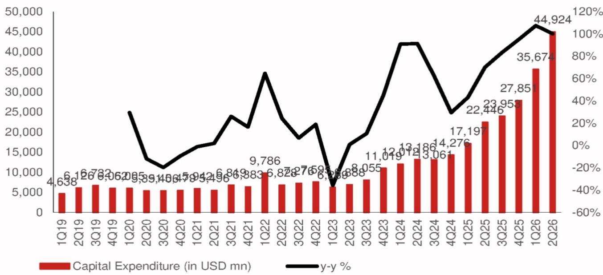

# Global AI Trend Tracker

行业：科技

# Alphabet 2Q26 业绩解读

## 摘要

Alphabet（谷歌母公司）于7月22日美股收盘后发布2026年第二季度业绩，管理层随后召开电话会议。会议讨论了AI云业务表现、AI芯片及产品商业化进展，以及2026财年展望。第二季度资本支出为449亿美元（同比增长100.1%），管理层将2026财年资本支出指引从之前的1800-1900亿美元上调至1950-2050亿美元（中点2000亿美元，同比增长118.7%）。谷歌持续加大对AI基础设施的投入，预计在接下来几个季度中，相关技术升级与基础设施建设将带动其供应链需求。

## 第二季度营收增长超预期；谷歌云收入同比大增81.8%

- Alphabet第二季度营收同比增长24.2%（环比增长9.0%），较彭博一致预期高2.4%；净利润同比增长297.6%，部分受未实现收益影响。
- 谷歌云收入达248亿美元，同比增长81.8%（环比增长23.7%），较一致预期高10%；营业利润率环比提升2.6个百分点至35.6%。
- 第二季度自由现金流为负59亿美元，主要因资本支出投资。
- 第二季度资本支出为449亿美元（同比增长100.1%，环比增长25.9%），较一致预期高2%。据管理层介绍，大部分投资用于技术基础设施——约60%用于服务器，约40%用于数据中心和网络设备。
- 管理层将2026财年资本支出指引上调至1950-2050亿美元（此前为1800-1900亿美元），主要为了满足云客户需求的AI算力扩容。此外，管理层预计2027财年资本支出将继续显著增长。

## 谷歌云：AI基础设施与解决方案需求驱动收入增长

- 云收入同比增长82%，云积压订单增至5140亿美元，主要由AI基础设施和AI解决方案的强劲需求推动。
- 谷歌云的产品差异化通过三条路径推动扩张：1）新客户获取，新签客户数量同比增长超过一倍；2）加深与现有客户的关系，客户使用量扩大且承诺额超出50%以上；3）合作伙伴带动增长，谷歌云市场上的交易同比增长超过7倍。

## AI进展：Gemini应用月活9.5亿；Gemini 4处于预训练阶段

- Gemini 3.5 Pro正在测试中，研发团队正在构建下一代模型（Gemini 4）。
- 模型API每分钟处理约220亿个token，上一季度为160亿个。过去12个月，超过2000家企业消耗了超过1000亿个token，近500家云客户各自消耗超过1万亿个token。
- Gemma系列下载量超过9亿次，自4月推出以来，最新Gemma 4模型下载量超过3亿次。
- 智能体开发平台Antigravity每周活跃用户超过240万。
- Gemini应用月活用户达9.5亿，日活用户在过去一年增至三倍。
- 得益于工程与硬件优化，谷歌将搜索的AI模式响应成本降至上线以来的最低水平。

## AI基础设施：TPU在第二季度向外部客户出货

- 针对智能体优化的Axion CPU，性能价格比相比同类产品提升30%，管理层看到AI基础设施产品需求持续增长。
- TPU系统于第二季度首次交付至客户数据中心。管理层预计，现有TPU系统销售协议产生的收入中，今年将确认较小部分，大部分收入将在2027财年实现。
- 在供应受限的环境下，管理层计划在第三季度扩大第三方产能的使用，作为内部产能建设期间的过渡策略。但短期内使用该产能可能带来小幅利润压力。

**图1：谷歌季度财务摘要**

| 单位：百万美元 | 1Q26 | 2Q26实际 | 2Q26预期 | 实际 vs 彭博一致预期 |
|---|---|---|---|---|
| 收入 | 109,896 | 119,796 | 117,022 | 2.4% |
| 同比% | 21.8% | 24.2% | 21.4% |  |
| 环比% | -3.5% | 9.0% | 6.5% |  |
| 毛利润 | 68,625 | 73,853 | 70,934 | 4.1% |
| 毛利率% | 62.4% | 61.6% | 60.6% |  |
| 营业利润 | 39,696 | 40,770 | 40,484 | 0.7% |
| 营业利润率% | 36.1% | 34.0% | 34.6% |  |
| 净利润 | 62,578 | 112,107 | 35,432 | 216.4% |
| 同比% | 81.2% | 297.6% | 25.7% |  |

注：净利润大幅增长主要来自其他收入的增加，源于权益证券的未实现收益。  
来源：Bloomberg Finance L.P., NOM

**图2：谷歌季度资本支出趋势**  
  
来源：公司数据，Bloomberg Finance L.P., NOM
