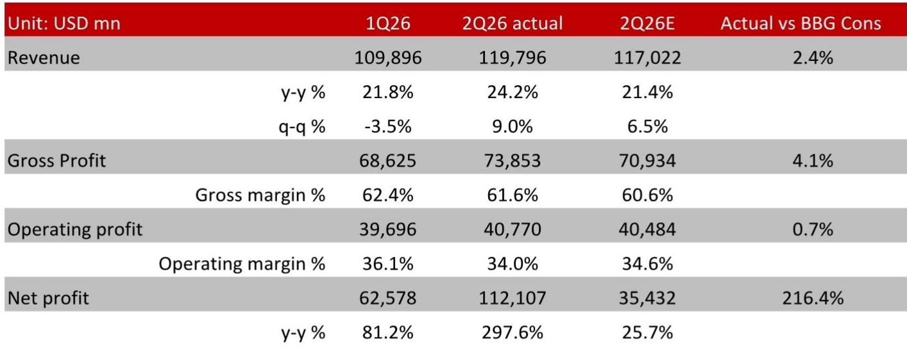
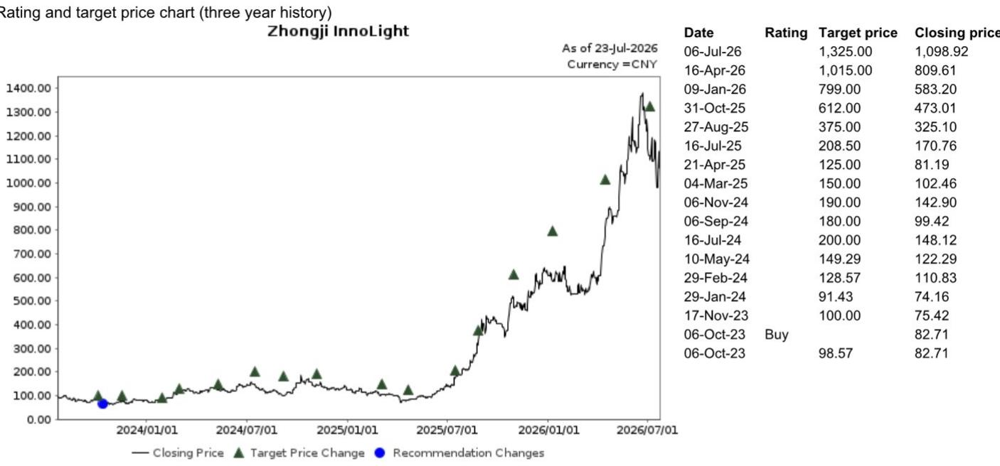

# Google $2000亿资金配置信号显示AI基础设施周期进入资源投入密集阶段

Alphabet公布6月季度营收为1198亿美元，超出一致预期2.4%，但整体数字掩盖了一个更具意义的动向：该公司同期录得负自由现金流59亿美元。这一负现金流完全由449亿美元的资金支出驱动，该数字同比弹性较高以上。管理层随后将2026全年资金配置指引从1800-1900亿美元上调至1950-2050亿美元，意味着中点同比增幅约119%。强劲的营收表现与恶化的自由现金流之间的张力，定义了当前AI基础设施投入的节点。Google选择增长优先于现金创造，供应链影响直接且可量化。

Google Cloud业务同比增长81.8%至248亿美元，超出一致预期10%，同时经营利润率环比提升2.6个百分点至35.6%。云服务未交付订单膨胀至5140亿美元，由对AI基础设施和AI解决方案的需求推动。这并非关于广告韧性或搜索主导地位的故事，而是关于云基础设施既成为营收增长的主要引擎，同时也成为自由现金流的主要消耗来源。对于市场参与者而言，战略性问题已不再是AI投入是否会持续，而是在支出升级过程中，供应链的哪些环节将捕获最大价值。

资金承诺的规模清晰可见。第二季度约60%的资金支出用于服务器，40%用于数据中心和网络设备。管理层明确表示，上调指引主要用于支持云客户需求的AI计算能力，并预期2027年资金支出将再次显著增长。在2026年第三季度使用第三方容量作为过渡策略，同时建设更多内部容量，这一桥梁策略会在短期内造成利润率压力，但确认了建设紧迫性。对于供应链参与者来说，信号明确：支出周期尚未见顶，未来两年基础设施部署将逐季增加。

## 5140亿美元云服务未交付订单代表多年期收入储备，锁定持续基础设施需求

云服务未交付订单数字是财报中最关键的指标。它不是前瞻性预测或管理层愿景，而是已签署但尚未确认为收入的未来云服务合约。以5140亿美元计，该未交付订单约为Google Cloud季度营收运行率的20倍。这意味着，即使新客户获取明天急剧放缓，Google仍需在未来数年内履行已有承诺。履行这些合约所需的基础设施不是可选项，而是必须建设。

三个具体动态驱动这一未交付订单扩张。第一，Google Cloud新客户获取速度是去年的两倍以上。第二，现有客户扩大使用量并超出合约承诺逾50%。第三，Google Cloud Marketplace上的交易量同比增长超过七倍。这些并非孤立信号，而是企业采纳模式的结构性转变。企业正从试点项目转向生产级部署，伴随这一转变的基础设施需求远大于初始实验阶段所需。

对供应链而言，这意味着需求可见性远超组件制造商通常的规划周期。光模块公司、PCB制造商和网络设备供应商通常按一至两个季度的订单周期运营。云服务未交付订单提供了跨越数年的需求信号，降低了资金支出突然收缩的风险。这并未消除周期性，但改变了风险画像。供应商面临的问题不是需求是否存在，而是能否足够快地扩张产能以满足需求。

## TPU芯片对外交付标志新硬件收入渠道的开端，该收入主要将在2027年实现

Google的张量处理单元（TPU）于2026年第二季度首次交付至外部客户数据中心。管理层表示，现有TPU系统销售协议的收入中，今年仅确认相对较小部分，绝大部分预计在2027年确认。这是Google业务模式的结构性转变——公司正从自身AI硬件的纯消费者转变为向外部客户供应硬件的角色。

战略意义超越直接收入贡献。TPU交付为希望获得专用AI计算能力但不愿完全依赖公有云服务的云客户创造了新的采购渠道。这种混合模式增加了AI硬件的总可寻址需求，因为它服务于那些否则不会完全迁移至云的客户。对供应链参与者而言，这意味着AI基础设施组件的需求基础正在超越超大规模云商本身。用于Google内部数据中心的同一光模块、PCB和网络设备，也需要进入托管Google TPU系统的客户数据中心。

时机也很重要。2026年至2027年之间的收入确认滞后意味着硬件投入周期相对于收入周期前置。Google目前正大力投资于生产能力，而相关收入直到后期才会出现在财务报表中。这造成了报告财务表现与潜在经济价值之间的暂时性偏离，但也确认了支出并非投机性，而是与外部客户签署的协议挂钩。

## Gemini生态创造用户规模级需求驱动，与企业云增长形成互补

Gemini是Google旗下旗舰AI模型系列，月活跃用户达9.5亿，日活跃用户在过去一年增长两倍。仅Gemini应用就代表一个独立于企业云采纳的消费级需求来源。同时，Google的模型API每分钟处理约220亿个令牌，上一季度为160亿个。过去12个月，超过2000家企业各自消耗超1000亿个令牌，近500家云客户各自处理超1万亿个令牌。

令牌消耗规模直接驱动计算需求。每个令牌的处理都需要推理计算，进而需要服务器、网络和数据中心容量。令牌处理量单季度增长37.5%表明需求曲线在趋陡而非趋平。Google还通过工程和硬件优化，将搜索的AI模式响应成本降至发布以来最低。每查询成本降低通常扩大总查询量，形成计算需求持续增长的正向循环。

智能体开发平台Antigravity周活跃用户已超过240万，Gemma开放模型系列下载量超9亿次。这些数字表明开发者生态在快速扩张，进而创造未来推理和训练计算需求。开发者采纳与基础设施需求之间的关系虽非线性，但具有因果性。更多开发者在Google平台上构建意味着更多应用，更多计算消耗，更多基础设施投入。

## 基于三个不同需求维度的供应链定位决策框架

财报数据支持一个评估供应链暴露的结构化框架。三个需求维度同时运行，每个维度对供应链不同部分具有不同含义。

第一个维度是Google Cloud的内部基础设施建设。这是最大且最可见的驱动力，占季度资金支出449亿美元的大部分。60%分配给服务器、40%分配给数据中心和网络设备，这为哪些组件将看到最高需求量提供了清晰指引。服务器需要主板、背板和互连系统的PCB；数据中心需要光模块用于服务器之间及数据中心之间的高速数据传输；网络设备需要先进PCB和光组件用于交换机和路由器。为超大规模数据中心建设供应这些组件的公司直接暴露于这一维度。

第二个维度是外部TPU系统销售。这创造了内部建设之外的增量需求。托管Google TPU系统的客户数据中心将需要与Google自有数据中心相同的支持基础设施。这一维度在2027年随着收入确认加速而变得更加重要，但这些系统的采购正在当前进行。能够同时满足内部和外部需求流的供应链公司将受益于更广泛的客户基础。

第三个维度是由消费者和开发者采纳驱动的推理计算。9.5亿Gemini月活跃用户和API每分钟220亿令牌的处理量代表持续的计算需求，其波动性低于训练基础设施但同样持久。这一维度有利于用于推理优化服务器和网络的组件，其规格往往与训练优化配置不同。能够同时服务于训练和推理需求画像的公司将拥有更具韧性的收入流。

该框架建议，最具吸引力的供应链位置是那些同时服务于三个维度的环节。例如，光模块公司为内部数据中心建设、外部客户部署和持续推理基础设施所必需。为超大规模云商供应服务器和网络设备的PCB制造商同样横跨所有三个维度。风险集中在仅服务于单一维度的公司，尤其是当该维度与单一客户计划挂钩且可能延期或缩减时。

## 第三方容量带来的短期利润率压力不削弱结构性需求论点

管理层明确表示，公司计划在2026年第三季度扩大第三方容量使用作为过渡策略，同时建设更多内部容量，这将造成适度的利润率压力。这是由供应约束驱动的战术决策，而非需求疲弱的信号。Google愿意接受较低利润率以维持容量增长，这一事实强化了需求环境的紧迫性。

利润率压力是暂时且自我纠正的。随着内部容量上线，对第三方容量的依赖将减少，利润率应趋于正常。更重要的是，供应链正在或接近产能约束运营。这通常带来供应商的议价能力、更短的订单交货时间，以及客户为保障供应而支付溢价的意愿。过去两年投资扩张产能的公司现在处于能够捕获需求激增中不成比例份额的位置。

季度59亿美元的负自由现金流是同一动态的函数。Google今天投入现金以产生未来收入。5140亿美元的云服务未交付订单为这项投入将产生回报提供了信心。风险不在于需求消失，而在于执行瓶颈延迟建设并延长负自由现金流期。对供应链公司而言，这一风险转化为可能的订单时间调整而非订单取消。

*仅供参考。部分内容可能基于原始材料通过AI辅助生成、翻译、总结或编辑，可能存在遗漏或错误。请独立核实。本文不构成任何专业建议。*

仅供参考。部分内容可能基于原始材料通过AI辅助生成、翻译、总结或编辑，可能存在遗漏或错误。请独立核实。本文不构成任何专业建议。

