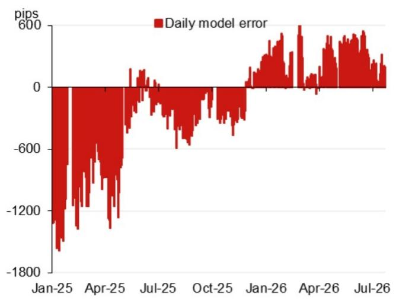

# 亚洲（除日本）报价观察

**模型参考值：6.7822**

模型参考值为6.7822，此前为6.7906（较前次官方收盘价有正向/反向波动）。  
考虑逆周期因子后的模型参考值：6.7880（较前次定价有变动）。

## 研究人员

亚洲汇率策略  
Craig Chan  
Wee Choon Teo  
Vicky Chen  
Manthan Shingala  

图1：隔夜对参考值变化贡献最大的前四项权重（不含逆周期因子）  
  
来源：相关研究机构  

图2：近期模型误差（不含逆周期因子调整）  
  
来源：Bloomberg, NOM  

图3：USD/CNY 定价的日变动  
  
来源：Bloomberg, NOM  

图4：事件日历

| 日期 | 事件 | 地点 | 备注 |
|------|------|------|------|
| 2026年7月下旬 | 相关工作会议 | 中国 | 会议通常会讨论宏观方向并给出后续工作重点的线索 |
| 2026年8月中旬 | 货币政策报告（2026年第二季度） | – | – |
| 2026年9月24日 | 访问美国 | 美国华盛顿 | – |
| 2026年9月下旬 | 货币政策委员会会议 | – | – |
| 2026年10月1-7日 | 国庆黄金周假期 | 中国 | – |

来源：Bloomberg, NOM

## 附录 A-1

本报告由NOM Singapore Ltd. (NSL)制作。  
参见NOM集团实体详细信息中的免责声明。

## 分析师声明

我们，Craig Chan, Wee Choon Teo, Vicky Chen和Manthan Shingala，特此声明：(1) 本研究报告中所表达的观点准确反映了我们个人对相关标的或发行人的看法；(2) 我们的薪酬中没有任何部分直接或间接与本研究报告中的具体建议或观点相关；(3) 我们的薪酬与NOM集团任何公司进行的特定交易业务无关。

## 重要披露

## 研究及利益冲突披露的在线获取

NOM集团研究可在www.NOMnow.com/research、Bloomberg、Capital IQ、Factset、LSEG上获取。  
重要披露可在指定网站阅读或向NOM Securities International, Inc.索取。

负责撰写本报告的分析师根据公司总收入等多种因素获得薪酬，其中部分来自相关业务活动。除非另有说明，本报告前列的非美国分析师未在FINRA规则下注册/合格为研究分析师，可能不是NSI的关联人士，且可能不受FINRA规则2241关于与涵盖公司沟通、公开露面及持有证券账户内交易等限制的约束。

NOM Global Financial Products Inc. (NGFP)、NOM Derivative Products Inc. (NDP)及NOM International plc. (NIplc)已在美国商品期货交易委员会及美国期货协会注册为互换交易商。上述公司通常从事互换及其他衍生品交易，这些产品或为本报告涉及标的。

## 美国要求的额外披露

做市交易：NOM Securities International, Inc.及其关联方通常作为本研究报告所涉固定收益证券（或相关衍生品）的做市商。分析师与其他人员互动：固定收益研究分析师定期与销售和交易部门人员沟通，以获取流动性和定价信息。

## 估值方法——固定收益

NOM的固定收益策略师通过提供交易建议表达对证券价格和市场的看法。这些建议可以是相对价值建议、方向性交易建议、资产配置建议或三者结合。分析内容包括但不限于：  
- 基本面分析：判断证券价格是否偏离其宏观或微观基本面。  
- 价格变动的定量分析。  
- 技术因素：如监管变化、市场风险偏好变化、评级行动、一级市场活动及供需考虑。

交易建议的时间框架可变。战术性建议通常短于三个月，战略性建议通常超过三个月。

为符合欧盟市场滥用监管规定，NOM全球固定收益研究的评级分布如下：  
52%被赋予买入（或等同）评级；其中50%的发行人曾获得NOM集团提供的实质性服务*。  
0%被赋予中性（或等同）评级。  
48%被赋予卖出（或等同）评级；其中50%的发行人曾获得NOM集团提供的实质性服务。  
截至2026年6月30日。  

*按欧盟市场滥用监管规定定义。  
**按本报告免责声明部分定义的NOM集团。

## 免责声明

本出版物包含由第1页所述NOM集团实体（及若有贡献的其他NOM集团实体员工）准备的材料。“NOM集团”指NOM Holdings, Inc.及其附属公司与子公司，包括但不限于：NSC（日本）、NFPE（德国）、NIplc（英国）、NSI（美国）、NIHK（香港）、NFIK（韩国）、NSL（新加坡）、NAL（澳大利亚）、NSM（马来西亚）、NITB（台湾）、NFASL（印度）、NFRC（日本）、NOI（中国）。本报告不构成任何司法管辖区的要约或邀请。

本材料仅供您私人参考，不构成任何行动的邀约。基于我们认为可靠的来源，但未经独立核实。除涉及NOM集团的披露外，NOM集团不作任何明示或暗示的保证，包括但不限于公平性、准确性、完整性、可靠性、特定目的适用性等。在法律允许的最大范围内，NOM集团不承担因使用本材料而产生的任何责任。

本材料中的观点或估计为原始发布日期时的当前观点，信息（包括观点和估计）可能随时变更且无需通知。NOM集团无更新或修订本文件的义务。本文件所述任何评论或陈述均为作者个人观点，可能与NOM集团其他成员的观点不同。客户应考虑本报告中的任何建议是否适合其自身情况，并必要时寻求专业意见。

NOM集团及其董事、高管、员工和关联方可能作为主要方、代理人或以其他方式交易本报告提及的证券、商品或工具，或持有多头/空头头寸。NOM集团也可能担任发行人金融工具的做市商或流动性提供者。

本文件可能包含第三方信息，包括信用评级机构评级。NOM集团不对第三方信息的原创性、公平性、准确性、完整性、适销性或特定目的适用性作任何陈述或保证，且不承担任何相关责任。第三方内容的复制和分发需获得第三方书面许可。信用评级是意见陈述，不是购买、持有或出售证券的建议，不应作为研究交流依赖。

读者应将本文件视为做出投资决策的单一因素，而不应将本报告视为识别所有直接或间接风险。NOM集团生产多种类型的研究产品，包括基本面分析和定量分析；不同类型的产品可能含有不同的建议。本报告中的数字可能涉及过去业绩或基于过去业绩的模拟，并非未来业绩的可靠指标。

对于固定收益研究：建议分为战术性（通常持续三个月以内）和战略性（通常持续6-12个月）。交易建议可能随时根据情况变化而调整。建议中显示的价格和回报表现基于提交时的指示性价格。

本文件所描述的证券可能未依美国1933年证券法注册。除非法律允许，任何交易应通过您所在司法管辖区的NOM实体执行。

本文件已获批准在英国的NIplc作为投资研究分发。NIplc由审慎监管局授权，由金融行为监管局和审慎监管局监管。本文件不构成个人建议，也不考虑个人读者的特定投资目标、财务状况或需求。本文件仅面向“合格对手方”或“专业客户”。

本文件已获批准在欧洲经济区由NFPE作为投资研究分发。NFPE由德国联邦金融监管局授权和监管。

本文件已获NIHK批准在香港分发。本文件仅面向“专业读者”。

本文件已获批准在澳大利亚由NAL分发。NAL由ASIC授权和监管。

本文件已获批准在马来西亚由NSM分发。

在新加坡，本文件由NSL分发。NSL是豁免财务顾问，受新加坡金融管理局监管。本文件面向认可、专家或机构读者。若非上述读者，NSL仅在法律要求的范围内对此类接收者承担法律责任。

除非1933年法案S条例禁止，本材料在美国由NSI分发。NSI为美国注册经纪交易商，按1934年证券交易法Rule 15a-6承担责任。

本文件未获批准在沙特阿拉伯、阿拉伯联合酋长国、卡塔尔向非授权人士分发。任何违反上述限制的行为可能构成违反当地法律。

对于涉及台湾公众公司或由台湾研究分析师撰写的报告：本文件仅供参考。您应独立评估投资风险并对投资决策负责。未经NOM集团书面授权，不得复制或引用报告内容。根据台湾相关法规，您不得将报告提供给他人或从事可能引发利益冲突的活动。

本材料不得在印度尼西亚以构成公开发售的方式分发。

本材料不得在中国（为本文目的，不含香港、澳门及台湾）分发。本文件中关于A股的分析（如有）不面向中国境内的个人或实体。

未经NOM集团成员事先书面同意，不得以任何形式复制、再分发本材料。若通过电子方式传输，可能存在安全风险，NOM集团不承担因电子传输导致的错误或遗漏责任。

NOM集团通过合规政策和程序（包括利益冲突、防火墙和保密政策）以及防火墙和员工培训管理研究生产中的利益冲突。

如需获取有关本文件中任何研究交流所使用的方法或模型的更多信息，可联系前列的研究分析师。披露信息可应要求提供。

版权所有 © 2026 NOM Singapore Ltd., Singapore。保留所有权利。
