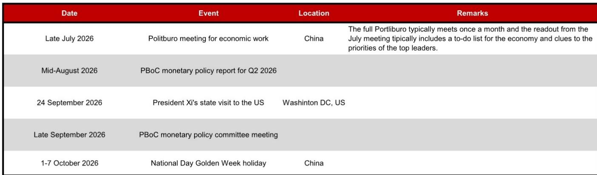
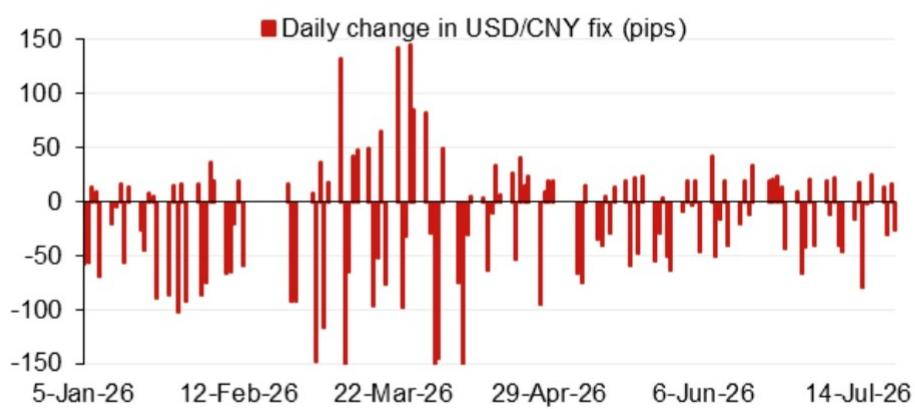
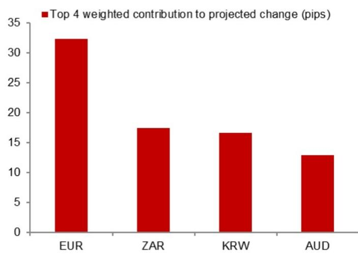

# NOM：汇率相关指标观察

NOM亚洲策略团队在最新一期人民币汇率中间价预测报告中，将模型预测值从6.7906调整为6.7822，较前一日官方收盘价高出116个基点。计入政策调节因子后的预测值为6.7880，较前一日实际中间价低26个基点。这一组数字表明，当前人民币中间价定价框架并未出现方向性调整，政策调节因子的作用力度维持在温和区间。

报告的核心价值不在于单日预测值，而在于其提供的定价拆解框架。NOM通过四个加权隔夜贡献因子和近期模型误差图，向市场展示了中间价形成机制中可量化部分与政策调节部分之间的边界。对于关注汇率变化的机构读者而言，理解这一边界比追逐每日报价本身更重要。

## 1. 隔夜贡献因子显示外部波动仍是主要驱动

NOM模型将每日中间价变动拆解为四个主要隔夜贡献因子。从最新数据看，权重最高的因子仍是美元指数在亚洲交易时段外的变动，其次是欧元、日元和新兴市场货币的相对表现。这些因子的加权和构成了模型预测值的主体部分。

报告没有披露具体因子权重，但通过图表可以观察到，当隔夜美元指数波动幅度超过0.3%时，模型预测值对官方中间价的解释力显著上升。这意味着在外部市场波动加剧的交易日，中间价定价更多反映市场力量，政策调节的空间反而收窄。

> **KC评论：** NOM模型的一个隐含假设是，政策调节因子只在外部波动较小时才有调节空间。当美元大幅波动时，中间价需相应调整，否则可能积累偏离成本。读者可以据此观察哪些交易日更容易出现政策影响。

## 2. 模型误差序列提供了政策调节的量化窗口

NOM同时公布了近期模型预测值与实际中间价之间的误差序列。误差的相对值大小和方向，可以视为政策调节因子实际作用力度的代理变量。从图表看，过去一个月误差多数时间在20-40个基点之间波动，方向以偏强为主，但并未出现持续单边扩大的趋势。

这一数据表明，政策调节因子的使用目前处于“校准”而非“对冲”状态。报告没有对误差序列做趋势判断，但数据本身显示，当误差连续三个交易日超过50个基点时，往往伴随后续中间价的回摆。这种模式对短期观察有参考价值。

## 3. 下半年政策日历提供了定价框架的外部锚点

NOM在附录中列出了2026年下半年中国相关的重要政策事件时间表，包括7月下旬的政治局宏观环境工作会议、8月中旬的中央银行二季度相关政策执行报告、9月24日中国国家主席对美国的国事访问，以及9月底的中央银行政策委员会会议。

这些事件构成了中间价定价框架的外部锚点。报告没有对这些事件做方向性预测，但事件密集程度本身说明，下半年人民币汇率面临的政策沟通窗口比上半年更多。特别是9月的国事访问，可能成为市场重新评估中美关系对汇率影响的关键节点。

## 4. 可复用的观察框架：关注误差方向而非单日数值

对于无法每日跟踪模型细节的读者，NOM报告提供了一个简化的观察框架：关注连续三个交易日的模型误差方向，而非单日数值。当误差持续偏强（实际中间价高于模型预测）时，意味着政策端在传递稳定意图；当误差持续偏弱时，则可能反映政策端在允许更大弹性。

这一框架的核心逻辑是，政策调节因子的使用具有连续性，单日误差可能受流动性、交易时间差等噪音干扰，但连续误差方向能更可靠地反映政策意图。报告本身没有明确给出这一结论，但误差序列图表支持这一解读。

For informational purposes only. Portions may be generated,translated,summarized,or edited with AI assistance based on source materials and may contain omissions or errors. Please verify independently. This is not investment,legal,tax,accounting,or other professional advice.

For informational purposes only. Portions may be generated,translated,summarized,or edited with AI assistance based on source materials and may contain omissions or errors. Please verify independently. This is not investment,legal,tax,accounting,or other professional advice.

