# 宏观环境观察

## 机构资金对科技领域的配置在第二季度创下新高

### 资金增加电子/通信/机械配置；减少电气设备/有色金属/食品饮料配置

在第二季度，机构资金增加配置的领域包括电子、通信和机械，季度环比分别上升20.2/4.4/0.8个百分点（图1）。具体来看，全球人工智能趋势持续推动科技企业资本开支增长，为科技硬件的基本面提供支撑。机构资金对电子和通信的配置比例及超配比例在第二季度均升至历史新高。机械板块的配置比例季度环比上升0.8个百分点，其中人形机器人产业链快速增长，工程机械海外业务增速回升。

### 机构资金大幅提升科创板/创业板配置；科技主题主动管理型基金占主动管理基金总规模比例创历史新高

随着第二季度全球市场关注点重回人工智能相关的大科技领域，A股市场的机构资金也明显增加了对科技相关领域和板块的配置。机构资金对科创板/创业板的配置比例季度环比大幅上升（分别上升9.9/3.5个百分点），均创历史新高。机构资金对大科技领域的配置比例和超配比例分别达到57.3%和18.5%，均为新高，配置比例显著高于此前大消费领域43.7%的历史峰值。同时，我们定义主动管理型主题基金为：每季度披露的前十大持仓中，至少有七只来自特定行业且合计权重超过50%。注意到科技主题主动管理型基金占主动管理基金总规模的比例在第二季度升至27.5%的历史新高。此外，科技主题主动管理型基金的总规模占比已明显高于跟踪科技相关指数的主动型基金。

### 北向资金在第二季度转为净流入

初步估算显示，北向资金在第二季度转为净流入2230亿元，而第一季度为净流出130亿元。我们认为A股硬科技公司吸引力提升是主要原因。分行业看，工业与信息技术在第二季度分别净流入1285亿元和672亿元，而日常消费和通信是仅有的两个净流出行业（分别流出97亿元和31亿元）。

**宏观环境观察：** 随着去杠杆接近尾声，如何布局？在另一篇报告中，我们指出近期全球科技公司波动加DaiwaA股科技板块回调，主要源于获利了结、交易拥挤度降低和去杠杆压力。然而，A股盈利基本面正在改善；我们预计全部A股2026年盈利同比增长将从2025年的3.9%提升至11%。从第二季度初开始，工业企业利润增速加快，创业板和科创板盈利预测持续上调。同时，政策层面对人工智能发展的支持仍是长期驱动力。近期市场波动较大，相关监管机构、国有资本运营公司和保险公司均表态维护市场稳定。沪深300、创业板指、科创50等ETF成交额放大，出现大规模净流入。此外，A股市场融资余额已从高位快速回落，科技板块融资规模明显收缩，其杠杆率与整体市场基本相当。这些迹象表明，当前A股的去杠杆阶段可能接近尾声。

图1：第二季度机构资金配置变化（季度环比）  
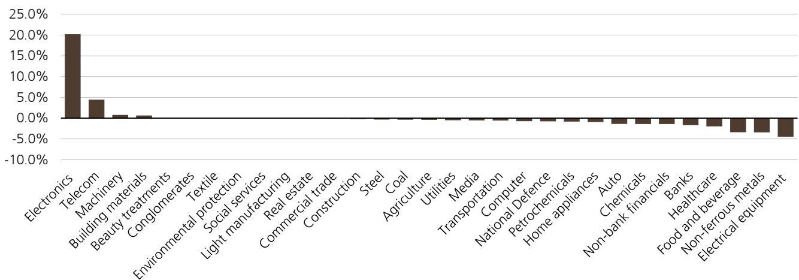  
来源：Wind，机构估算

图2：第二季度机构资金行业超配/低配比例（基准：沪深300）  
  
来源：Wind，机构估算

图3：机构资金行业配置  
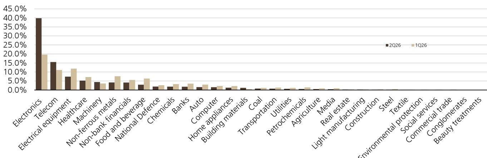  
来源：Wind，机构估算

图4：机构资金对国有企业的配置大幅下降  
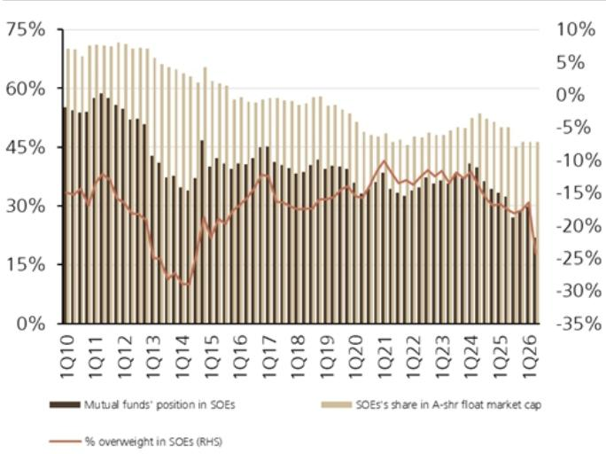  
来源：Wind，机构估算

图5：机构资金对科创板的配置比例和超配比例均上升  
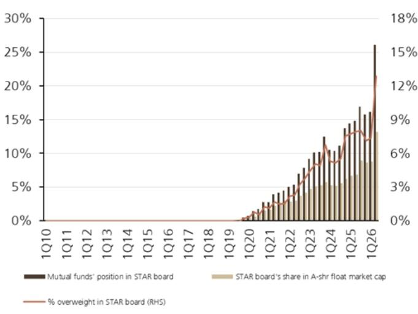  
来源：Wind，机构估算

图6：机构资金对创业板的配置比例和超配比例均大幅上升  
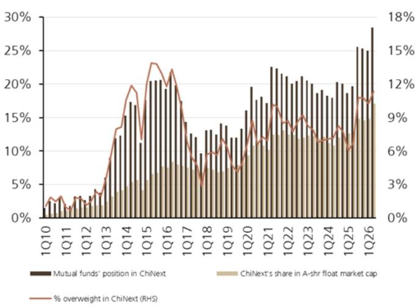  
来源：Wind，机构估算

图7：机构资金对电气设备的配置大幅下降  
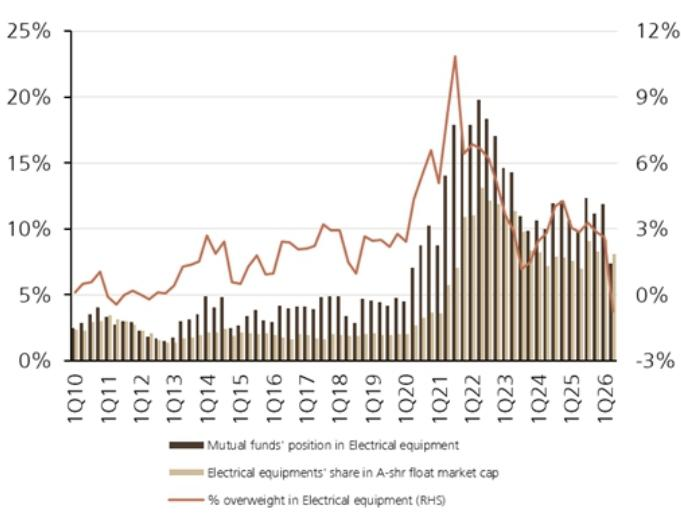  
来源：Wind，机构估算

图8：机构资金对食品饮料的配置进一步下降  
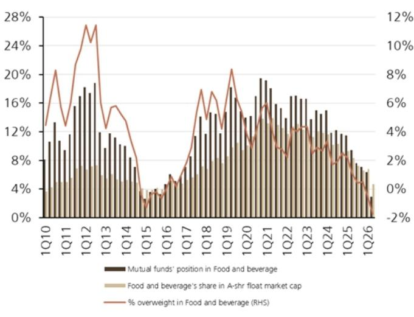  
来源：Wind，机构估算

图9：机构资金对医疗保健的配置比例和超配比例均下降  
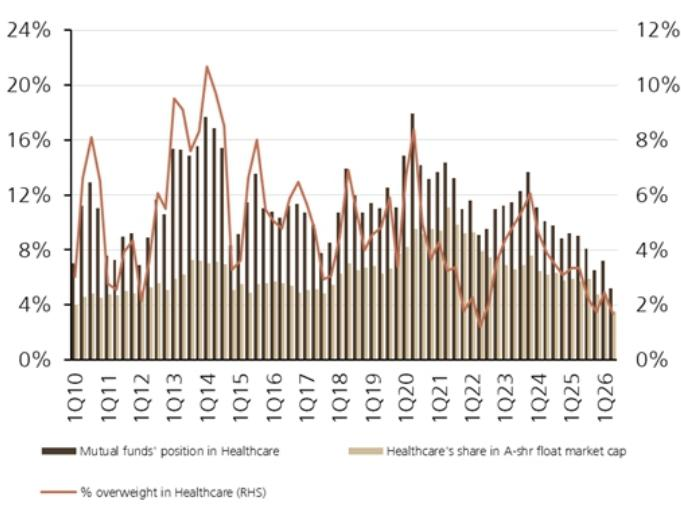  
来源：Wind，机构估算

图10：机构资金对机械的配置比例和超配比例进一步回升  
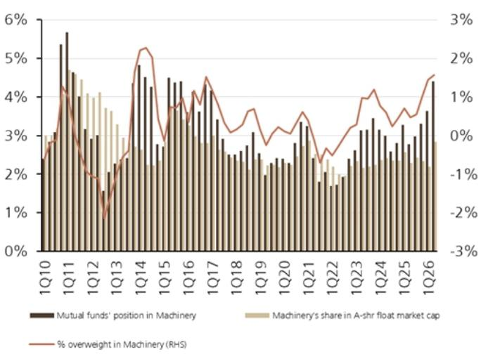  
来源：Wind，机构估算

图11：机构资金对家用电器的配置进一步下降  
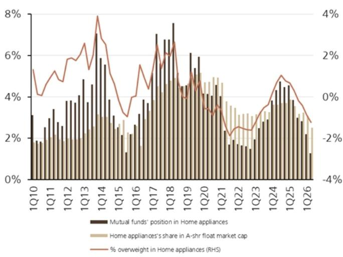  
来源：Wind，机构估算

图12：机构资金对煤炭的配置下降，低配比例收窄  
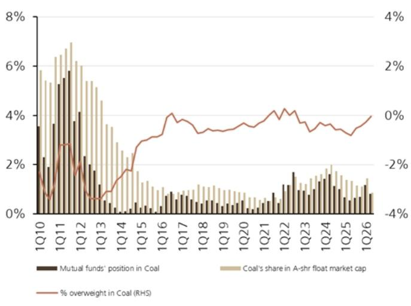  
来源：Wind，机构估算

图13：机构资金对石油石化的配置下降  
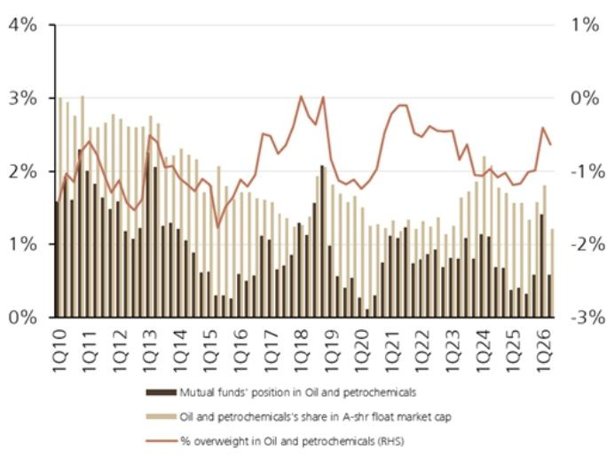  
来源：Wind，机构估算

图14：机构资金对有色金属的配置大幅下降  
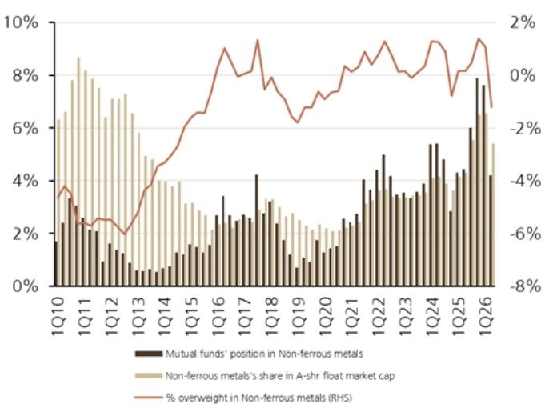  
来源：Wind，机构估算

图15：机构资金对化工的配置显著下降  
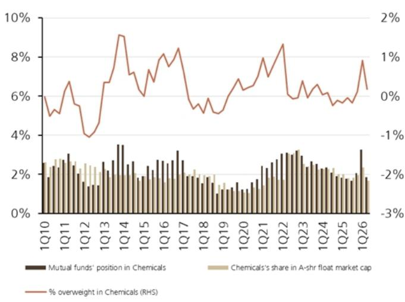  
来源：Wind，机构估算

图16：机构资金对国防军工的配置明显下降  
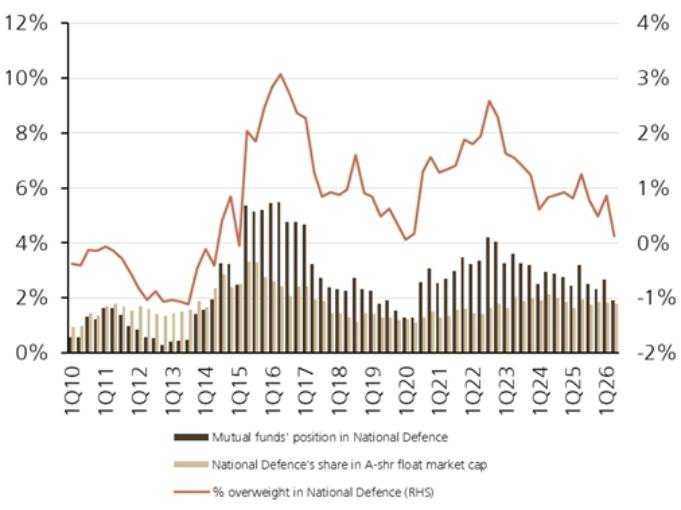  
来源：Wind，机构估算

图17：机构资金对汽车的配置小幅下降  
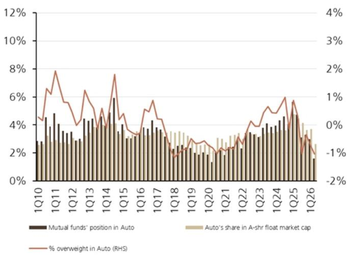  
来源：Wind，机构估算

图18：机构资金对银行的配置进一步下降  
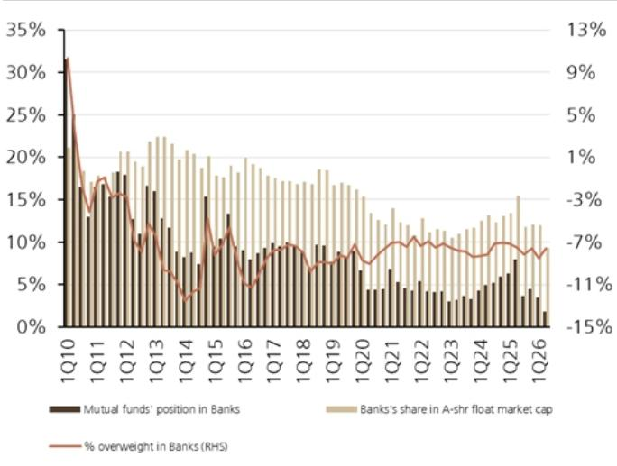  
来源：Wind，机构估算

图19：机构资金对非银行金融的配置下行  
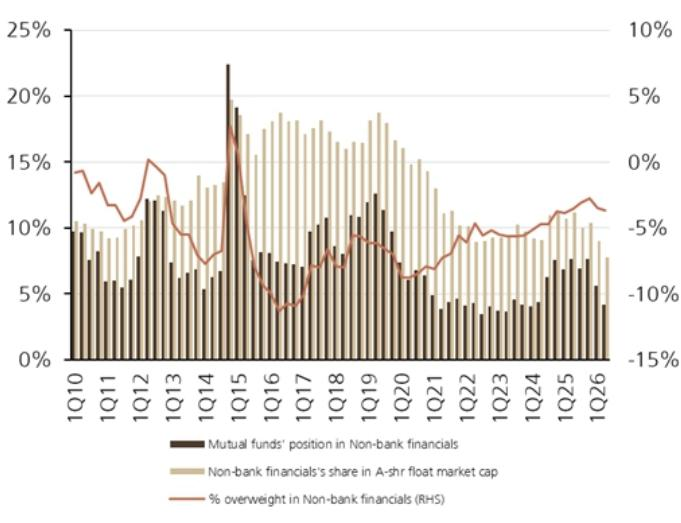  
来源：Wind，机构估算

图20：机构资金对电子的配置比例和超配比例均上升  
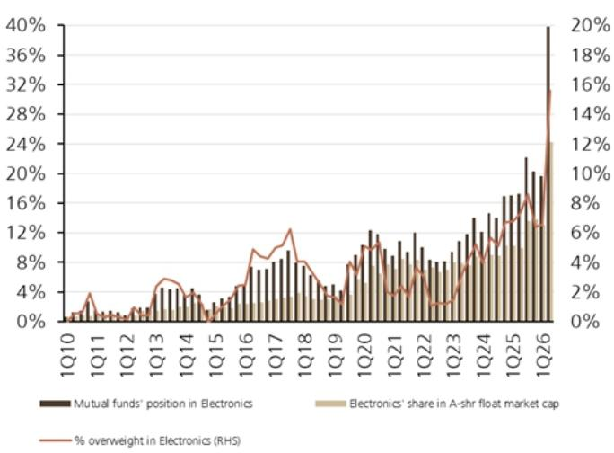  
来源：Wind，机构估算

图21：机构资金对计算机的配置下降  
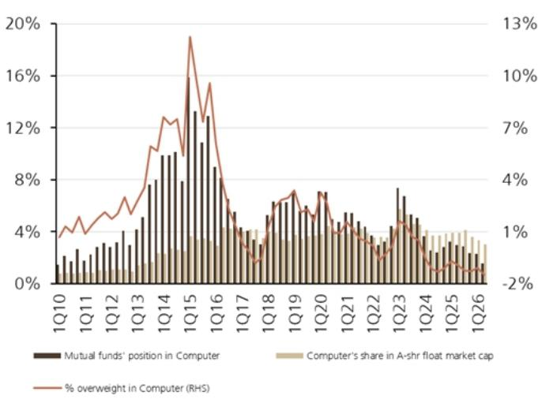  
来源：Wind，机构估算

图22：机构资金对通信的配置比例和超配比例进一步上升  
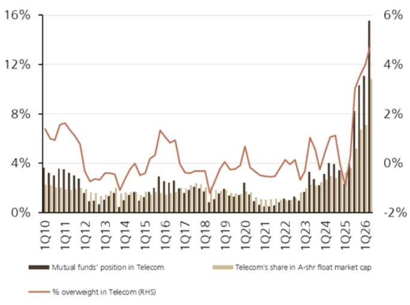  
来源：Wind，机构估算

图23：机构资金对公用事业的配置小幅下降  
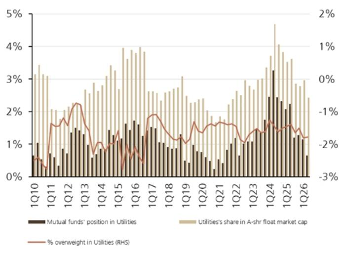  
来源：Wind，机构估算

图24：机构资金对大科技领域的超配比例上升  
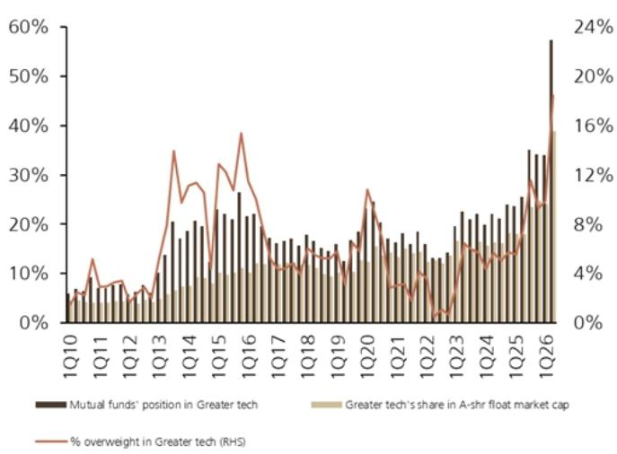  
来源：Wind，机构估算。注：大科技领域包括电子、通信、计算机和国防军工。

图25：机构资金对大消费领域的配置比例和超配比例  
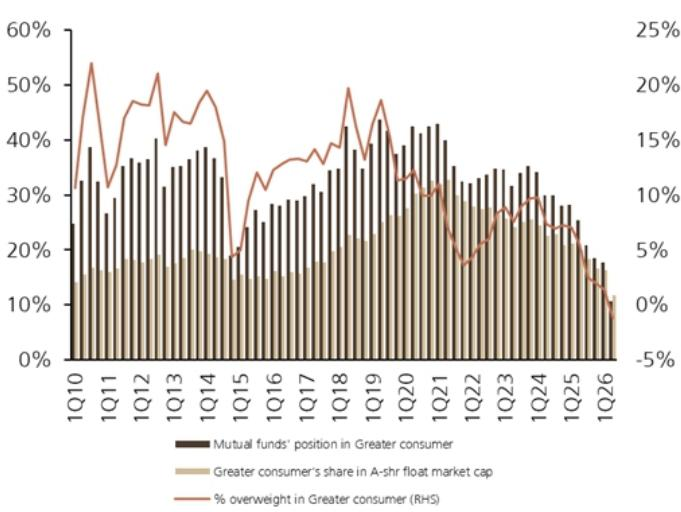  
来源：Wind，机构估算。注：大消费领域包括农林牧渔、食品饮料、医疗保健、家用电器、纺织服装、轻工制造、社会服务、商贸零售、美容护理和综合。

图26：科技、消费、新能源主题主动管理型基金规模占主动管理基金总规模的比例  
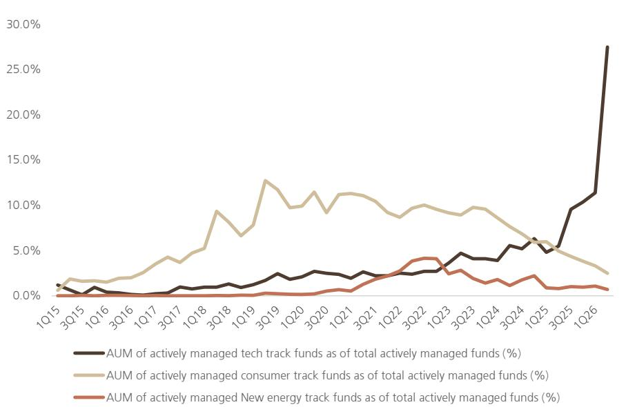  
科技主题主动管理型基金占主动管理基金总规模的比例（%）  
消费主题主动管理型基金占主动管理基金总规模的比例（%）  
新能源主题主动管理型基金占主动管理基金总规模的比例（%）  
我们定义主动管理型主题基金为：每季度披露的前十大持仓中，至少有七只来自特定行业且合计权重超过50%。注意到自2025年第二季度以来，科技主题主动管理型基金规模占比快速上升，至2026年第二季度达到27.5%的历史新高。  
来源：Wind，机构估算。注：科技主题基金覆盖电子、通信、计算机和国防军工。消费主题基金覆盖农林牧渔、食品饮料、医疗保健、家用电器、纺织服装、轻工制造、社会服务、商贸零售、美容护理和综合。新能源主题基金覆盖电气设备、公用事业和汽车。

图27：主动管理型主题基金规模占主动管理基金总规模的比例  
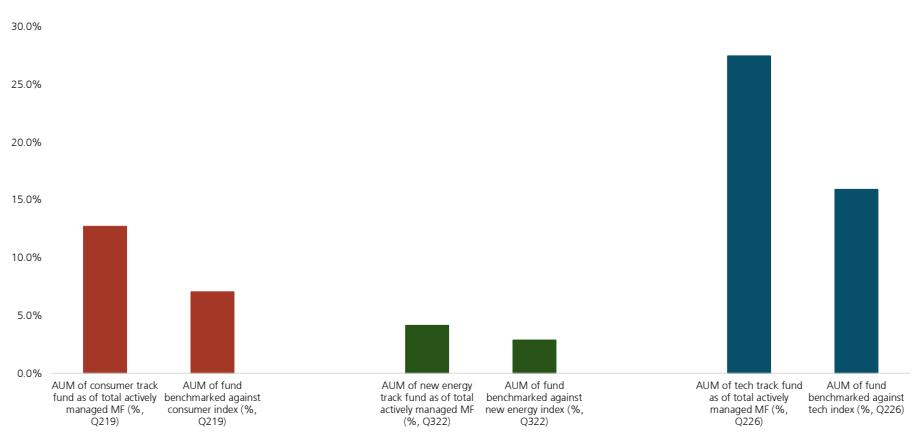  
此外，科技主题主动管理型基金规模占比已明显高于跟踪科技相关指数的主动型基金。  
来源：Wind，机构估算。注：消费/新能源/科技领域对比数据分别来自2019年第二季度、2022年第三季度、2026年第二季度。

图28：第二季度南向资金行业净流入  
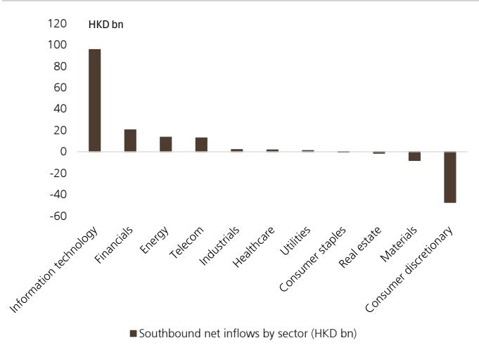  
来源：Wind，机构估算

图29：第二季度北向资金行业净流入  
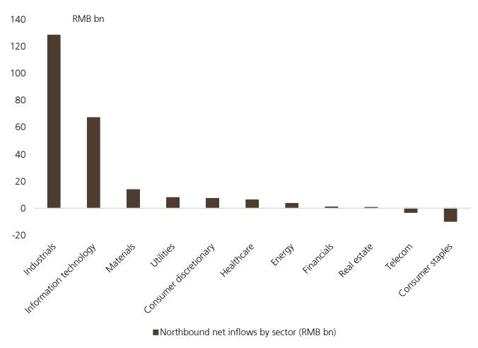  
来源：Wind，机构估算
