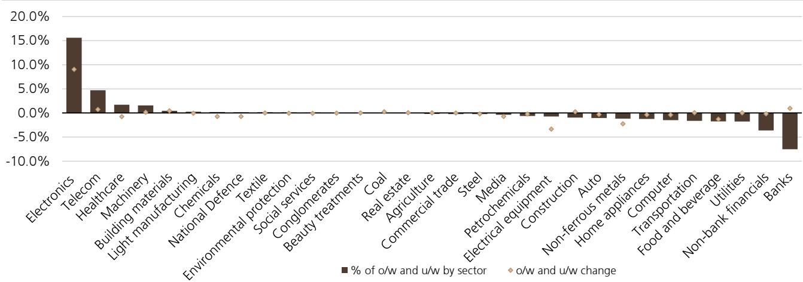

# UBS：研究主题与行业变化观察

2026年第二季度，中国公募产品对科技板块的持有比例出现了一个明确的信号：持仓占比和超配比例双双达到历史高位。根据UBS中国公司策略团队的最新报告，主动管理型公募产品在大科技板块的持仓占比达到57.3%，超配比例升至18.5%，两项指标均明显高于此前大消费板块在2021年创下的43.7%峰值。这不是一次普通的季度调仓，而是持有结构层面的系统性调整。

报告显示，公募产品在当季对电子、通信和机械板块的关注度最为集中，持仓占比分别环比上升20.2、4.4和0.8个百分点。电子和通信板块的持仓与超配比例均升至历史最高水平。全球人工智能浪潮持续推动科技企业资本开支增长，是支撑科技硬件基本面的核心因素。机械板块的持仓增加则与机器人产业链快速成长以及工程机械海外业务恢复有关。

## 1. 科创板与创业板持仓占比同步升至历史最高

公募产品在2026年第二季度大幅提升了科创板与创业板的持有比例。科创板持仓占比环比上升9.9个百分点，创业板上升3.5个百分点，两者均达到历史最高水平。报告定义的“大科技板块”涵盖电子、通信、计算机和国防军工四个行业，其持仓占比和超配比例的双新高，意味着科技主题已经从阶段性热点演变为公募产品的核心布局方向。

> **团队观点：** 57.3%的持仓占比意味着每100元公募公司资产中，有超过57元配置在科技相关行业。这一比例远超此前大消费板块43.7%的历史高点，说明资金迁移不是边际调整，而是主战场切换。

## 2. 主动管理型科技主题产品规模占比创纪录

UBS采用了一个更严格的筛选标准来定义主动管理型主题产品：前十大重仓股中至少有七只来自特定行业，且这些公司的合计权重超过50%。按此标准，主动管理型科技主题产品在全部主动管理型公募产品中的资产管理规模占比在2026年第二季度达到27.5%，同样创下历史新高。报告特别指出，这一比例已经明显高于跟踪科技相关指数的主动型产品规模占比，说明组合负责人的主动选择正在加速向科技领域集中。

## 3. 北向资金当季转为净流入，工业与IT板块吸金

报告估算，北向资金在2026年第二季度转为净流入2230亿元人民币，而第一季度为净流出130亿元。UBS认为，相关市场硬科技公司吸引力上升是主要原因。分行业看，工业和信息技术板块当季分别获得北向资金净流入1285亿元和672亿元，而日常消费和通信是仅有的两个出现净流出的板块，分别净流出97亿元和31亿元。

## 4. 去杠杆接近尾声，盈利基本面正在改善

报告在策略部分提出一个判断：相关市场的去杠杆阶段可能接近尾声。近期全球科技股波动与相关市场科技板块的快速回调，主要来自获利了结、交易拥挤度下降和去杠杆不确定性。但相关市场的盈利基本面正在改善，UBS预计全部相关市场2026年净利润同比增速将从2025年的3.9%提升至11%。自2026年第二季度以来，工业企业利润增速加快，创业板和科创板的盈利预测持续上调。与此同时，融资余额已从高点快速回落，科技板块的融资规模调整明显，其杠杆率与整体市场大致相当。

> **团队观点：** 报告提供了一个可复用的观察框架：当融资余额快速下降、监管层和国有资本运营公司对市场稳定表达支持、ETF成交量放大且出现大规模净流入这三个条件同时出现时，去杠杆阶段往往接近尾声。当前相关市场正在同时满足这些条件。

这份报告的核心信息可以归纳为：公募产品对科技板块的持有比例已经达到历史极值，资金从消费、周期等传统板块向科技迁移的趋势在2026年第二季度进一步延续。与此同时，北向资金也在同步加仓工业与IT。盈利改善和政策支持构成了基本面支撑，而融资数据的快速调整则提示市场可能正在经历去杠杆的最后阶段。

For informational purposes only. Portions may be generated,translated,summarized,or edited with AI assistance based on source materials and may contain omissions or errors. Please verify independently. This is not investment,legal,tax,accounting,or other professional advice.

For informational purposes only. Portions may be generated,translated,summarized,or edited with AI assistance based on source materials and may contain omissions or errors. Please verify independently. This is not investment,legal,tax,accounting,or other professional advice.

