# Spotify与美国音乐行业：定价是否已达阶段高点？我们观察仍有空间

评级：正面

目标观察价

SPOT

625.00 USD

# Spotify与美国音乐行业：定价是否已达阶段高点？我们观察仍有增长空间

过去一年，我们对Spotify及音乐产业的研究主要聚焦于超级粉丝。然而，一个更低调的机会仍存在于核心付费流媒体订阅用户群体中，无论是用户渗透率还是实际价格方面，都尚未完全被挖掘。Spotify在覆盖其全球绝大多数用户基础的各市场连续采取的定价行动，已推动整个行业变现水平提升。现在的问题是，第二季度/第三季度同比定价增速是否已达到阶段高点。或许在核心变化率上确实如此，但鉴于YouTube及Apple Music已跟进Spotify近期的调整，且全球价格与用户渗透仍有明显空间，我们认为实现进一步价值增长的路径至少可延续至2027年。

我们预计Spotify中期增长（约15%左右）中，5%来自用户增长，6-7%来自定价提升，3-3.5%来自超级粉丝变现。我们估算当前Spotify Premium的可服务市场规模约为1070亿美元，到2030年约为1270亿美元。不过，在强力执行与广泛采用的超级乐观情景下，超级粉丝仍可能是超越预期的最主要潜力来源（见图8）。

人工智能驱动的超级粉丝正在重塑音乐产业，我们仍认为WMG处于有利位置。我们相信，AI带来的变现利好到2030年将为录制音乐可服务市场规模额外贡献约10-20亿美元，而有机的高个位数增长则超过市场规模增速，贡献约100亿美元。WMG即将推出的作品阵容显示其持续受益于全球对新音乐内容的需求。

## 研究意义

我们下调了对第四季度固定汇率ARPU增速的预期至约4.5%，因短期内缺乏明确的定价行动。我们下调了Premium毛利率增速预期，以反映2026年下半年在功能与内容方面的投入（如Live Nation、Peloton、AI功能等），这将在合并基础上带来约15个基点的负面影响。我们维持正面评级。

<table><tr><td>数据截止日期</td><td></td><td></td><td colspan="2">2026年7月22日</td></tr><tr><td>SPOT收盘价（美元）</td><td></td><td></td><td colspan="2">474.16</td></tr><tr><td>目标观察价（美元）</td><td></td><td></td><td colspan="2">625.00</td></tr><tr><td>上行/(下行)空间</td><td></td><td></td><td colspan="2">32%</td></tr><tr><td>52周区间</td><td></td><td></td><td colspan="2">748.30/405.00</td></tr><tr><td>SPX</td><td></td><td></td><td colspan="2">7,498.96</td></tr><tr><td>财年结束</td><td></td><td></td><td colspan="2">12月</td></tr><tr><td>股息率</td><td></td><td></td><td colspan="2">无</td></tr><tr><td>市值（美元, 百万）</td><td></td><td></td><td colspan="2">97,598</td></tr><tr><td>企业价值（美元, 百万）</td><td></td><td></td><td colspan="2">77,278</td></tr><tr><td>表现</td><td>年初至今</td><td>1个月</td><td>6个月</td><td>12个月</td></tr><tr><td>相对表现（%）</td><td>(18.3)</td><td>3.2</td><td>(4.9)</td><td>(29.8)</td></tr><tr><td>SPX（%）</td><td>9.5</td><td>0.4</td><td>8.5</td><td>18.8</td></tr><tr><td>相对表现（%）</td><td>(27.9)</td><td>2.9</td><td>(13.4)</td><td>(48.7)</td></tr><tr><td colspan="5">来源：彭博、Bernstein估算与分析</td></tr></table>

价格表现，1年

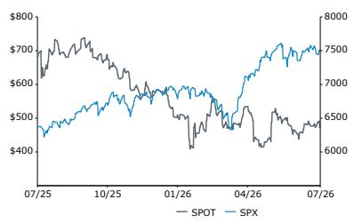

<table><tr><td>报告每股利润</td><td>F25A</td><td>F26E</td><td>F27E</td></tr><tr><td>SPOT（欧元）</td><td>10.51</td><td>12.61</td><td>16.03</td></tr><tr><td>旧预测</td><td>--</td><td>12.78</td><td>16.16</td></tr></table>

来源：彭博、Bernstein估算与分析

<table><tr><td>估值指标</td><td>F25A</td><td>F26E</td><td>F27E</td></tr><tr><td>报告估值倍数（倍）</td><td>39.5</td><td>32.9</td><td>25.9</td></tr></table>

## 估值对比表

图1：美国娱乐板块

<table><tr><td rowspan="2">公司</td><td rowspan="2">代码</td><td rowspan="2">评级</td><td rowspan="2">Bernstein目标价（美元）</td><td rowspan="2">隐含上行空间（%）</td><td rowspan="2">现价（美元）</td><td rowspan="2">市值（十亿美元）</td><td rowspan="2">混合NTM+1估值倍数（BernE）</td><td rowspan="2">混合NTM+1估值倍数（市场一致预期）</td><td colspan="2">混合NTM+1每股利润</td></tr><tr><td>BernE</td><td>市场一致预期</td></tr><tr><td>Live Nation</td><td>LYV</td><td>正面</td><td>$200</td><td>12%</td><td>$178</td><td>$42</td><td>70.7x</td><td>70.8x</td><td>$2.83</td><td>$2.72</td></tr><tr><td>TKO Group</td><td>TKO</td><td>正面</td><td>$240</td><td>32%</td><td>$182</td><td>$35</td><td>37.6x</td><td>41.0x</td><td>$6.39</td><td>$5.58</td></tr><tr><td>Liberty F1</td><td>FWONK</td><td>正面</td><td>$115</td><td>19%</td><td>$97</td><td>$24</td><td>44.0x</td><td>47.3x</td><td>$2.61</td><td>$2.49</td></tr><tr><td>Spotify</td><td>SPOT</td><td>正面</td><td>$625</td><td>32%</td><td>$474</td><td>$98</td><td>34.3x</td><td>33.9x</td><td>$18.23</td><td>$17.74</td></tr><tr><td>华纳音乐集团</td><td>WMG</td><td>正面</td><td>$39</td><td>42%</td><td>$27</td><td>$14</td><td>18.3x</td><td>18.9x</td><td>$2.13</td><td>$2.06</td></tr><tr><td>DraftKings</td><td>DKNG</td><td>正面</td><td>$31</td><td>36%</td><td>$23</td><td>$11</td><td>15.9x</td><td>18.7x</td><td>$1.95</td><td>$1.83</td></tr><tr><td>Flutter</td><td>FLUT</td><td>中性</td><td>$115</td><td>15%</td><td>$100</td><td>$17</td><td>16.1x</td><td>14.5x</td><td>$7.16</td><td>$10.42</td></tr></table>

注：数据截至2026年7月22日收盘。我们的上行空间计算基于2026年7月22日收盘价。来源：公司报告、彭博、Bernstein分析与估算

## 详细分析

## Spotify下一阶段增长从何而来？

Spotify在其大部分主要市场已趋成熟。如今面临的挑战是如何继续增长。我们认为Spotify通过三个途径实现增长：定价能力、超级粉丝变现、以及未充分渗透地区的扩张。本报告概述了Spotify的市场状况，描绘了定价能力如何影响市场规模，并对超级粉丝和渗透率增长提出了我们的看法。

为估算Spotify的可服务市场规模（TAM），我们统计了Spotify运营所在国家的所有互联网人口，对价格敏感性做出假设，并排除了基于该国/地区价格与收入比而可能不愿为Spotify Premium付费的人群。然后对每个国家，将Spotify个人价格乘以执行折扣系数，再乘以12个月和符合条件的人口数量，得到TAM。关于为何使用Spotify的价格来计算TAM是合理的，见图18。需要注意的是，这意味着我们的TAM渗透率也等同于订阅用户渗透率。

图2：我们估算当前Spotify Premium的可服务市场规模约为1070亿美元，其中发达欧洲、北美和亚洲是最大市场
当前音乐DSP的可服务市场规模渗透率（年，十亿美元）
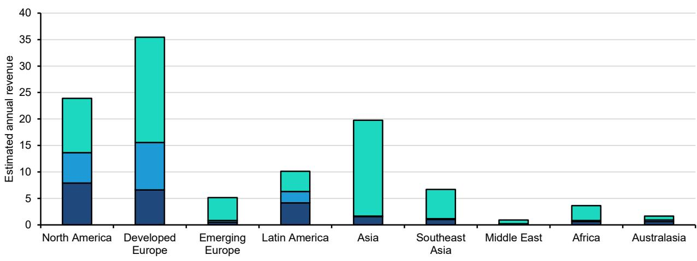  
■ 其他DSP ■ Spotify ■ 未渗透TAM  
来源：世界银行、Bernstein分析与估算

然后我们使用对Spotify Premium各大区域渗透率的估算，来推导Spotify及其他DSP更细分的渗透率，并验证这些渗透率与Spotify Premium收入大致匹配（允许小幅误差）。具体来说，我们估算Spotify在全球Premium市场中占有34%的份额，意味着全球有8.6亿Premium用户。我们估算Spotify在北美占有42%的市场份额，在欧洲56%，在拉丁美洲34%，在世界其他地区15%，由此估算出各大区域的Premium用户总数。

接下来，我们将所有音乐DSP的Premium用户分配到更小的区域。北美和拉丁美洲划分简单，因为它们不再细分。在细分欧洲和世界其他地区时，我们通过比较价格和收入来估算大区域内的相对需求。在获得Premium用户总数估算后，我们通过填补缺口来确定Spotify的渗透率，使其与Spotify的Premium收入和用户数相匹配。

这些区域用户估算基于进一步的需求估算回推到国家层面的Premium用户估算，从而使我们能够从国家层面计算Premium总收入。我们的模型输出约180亿美元的收入，这比Spotify 2025年Premium收入高出约5亿美元，表明我们的估算与真实渗透率大致吻合。

图3：我们认为Spotify仍有充足的增长空间，尤其是亚洲、东南亚和新兴欧洲在用户渗透方面可能不足。同时，我们看到各地均存在价格增长机会。

当前音乐DSP的可服务市场规模渗透率（年，百分比）
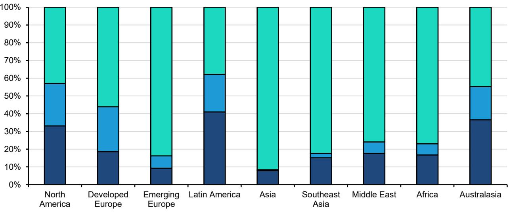  
■ 其他DSP ■ Spotify ■ 未渗透TAM  
来源：世界银行、Bernstein分析与估算

如上所述，我们的TAM渗透率在百分比上与用户渗透率相当。但由于区域定价差异，用户数量在规模上与TAM不同，这也有助于评估Spotify应在何处增长或从其他音乐DSP手中夺取份额。假设Spotify在北美和发达欧洲的份额不会大幅增长，那么拉丁美洲和亚洲是最大的机遇。

图4：拉丁美洲和亚洲很可能是Spotify增加市场份额的关键战场。在亚洲，我们认为印度是Spotify可能产生最大影响的地方。

当前音乐DSP Premium用户估算（百万）
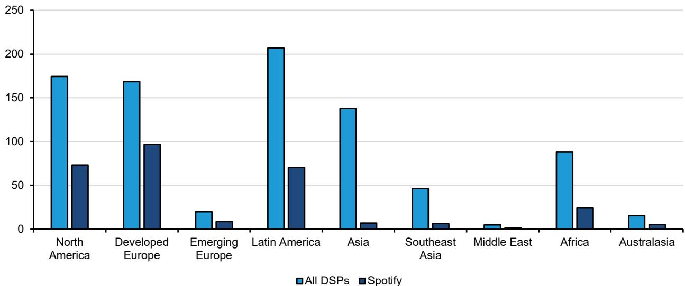  
来源：世界银行、Bernstein分析与估算

我们认为Spotify最简单的增长杠杆是定价能力。如果先不考虑超级粉丝变现，那么有两种方式扩大TAM：更多人转化为Spotify Premium，或提高Premium价格。两者之中，我们认为涨价/定价能力将产生更大的影响。

我们假设Spotify的可触达受众增长非常温和：给予那些合格人口占比较小的国家较高的增长，合格人口占比高的国家增长很小。从2025年到2030年，潜在用户数将从29.8亿增至31亿。对于定价能力，我们简单地将价格温和上调15%，并像之前一样计算TAM。由于这些效应在TAM中叠加，我们通过计算新潜在用户但价格不变时的TAM来分离影响，得到约27亿美元的增长。这意味着其余165亿美元的增长来自涨价。

图5：我们估算2030年可服务市场规模将增长约18%，其中大部分增长来自价格上涨
可服务市场规模增长（十亿美元）从2025年到2030E
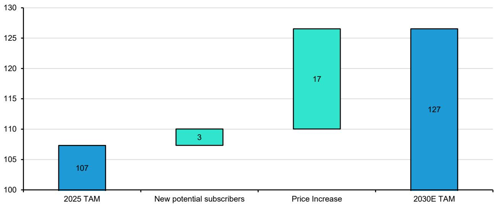  
来源：世界银行、Bernstein分析与估算

价格敏感性是我们确定谁可能成为Spotify Premium用户的方式。对于特定区域，我们通过计算该区域的价格与收入比率，并假设人们不会支付超过该比率的价格。对于美国和欧洲，我们使用最低收入五分之一人群的平均价格/收入比。对于拉丁美洲和世界其他地区，我们使用其第二收入五分之一人群的平均价格/收入比。

简而言之，这意味着我们假设美国和欧洲的人对Spotify的价格敏感度较低，而拉丁美洲和世界其他地区的人的价格敏感度较高。下面展示了当我们缩放人们愿意支付的最大价格/收入比时会发生什么。随着价格敏感性因子下降，人们变得更加价格敏感，更不愿意将收入的一部分用于Spotify，反之亦然。对于可能的用户数，世界其他地区随价格敏感性缩放变化最大。对于TAM，最大的变化发生在亚洲和东南亚，其他区域变化较小。

图6：在不同的价格敏感性假设下，我们当前TAM的估算范围从900亿美元到1170亿美元，其中大部分变化发生在亚洲和东南亚

<table><tr><td colspan="6">不同消费者价格敏感性下的TAM</td></tr><tr><td>价格敏感性因子</td><td>0.75x</td><td>0.88x</td><td>1.00x</td><td>1.13x</td><td>1.25x</td></tr><tr><td colspan="6">最大可能用户数（百万）</td></tr><tr><td>北美</td><td>305</td><td>305</td><td>311</td><td>361</td><td>361</td></tr><tr><td>拉丁美洲</td><td>233</td><td>293</td><td>307</td><td>339</td><td>341</td></tr><tr><td>欧洲</td><td>433</td><td>465</td><td>484</td><td>488</td><td>489</td></tr><tr><td>世界其他地区</td><td>1,363</td><td>1,783</td><td>1,884</td><td>2,074</td><td>2,162</td></tr><tr><td>全球</td><td>2,334</td><td>2,846</td><td>2,986</td><td>3,263</td><td>3,354</td></tr><tr><td colspan="6"></td></tr><tr><td>当前TAM（百万美元）</td><td colspan="5"></td></tr><tr><td>北美</td><td>$23,540</td><td>$23,540</td><td>$23,900</td><td>$27,855</td><td>$27,855</td></tr><tr><td>发达欧洲</td><td>$31,901</td><td>$33,767</td><td>$35,444</td><td>$35,444</td><td>$35,515</td></tr><tr><td>新兴欧洲</td><td>$4,569</td><td>$5,042</td><td>$5,152</td><td>$5,341</td><td>$5,590</td></tr><tr><td>拉丁美洲</td><td>$7,848</td><td>$9,668</td><td>$10,125</td><td>$11,641</td><td>$11,723</td></tr><tr><td>亚洲</td><td>$15,846</td><td>$19,091</td><td>$19,777</td><td>$21,596</td><td>$21,596</td></tr><tr><td>东南亚</td><td>$3,935</td><td>$6,276</td><td>$6,711</td><td>$7,162</td><td>$8,859</td></tr><tr><td>中东</td><td>$776</td><td>$819</td><td>$915</td><td>$989</td><td>$1,011</td></tr><tr><td>非洲</td><td>$3,209</td><td>$3,538</td><td>$3,653</td><td>$3,961</td><td>$4,031</td></tr><tr><td>澳大拉西亚</td><td>$1,619</td><td>$1,620</td><td>$1,654</td><td>$1,662</td><td>$1,662</td></tr><tr><td>全球</td><td>$93,242</td><td>$103,361</td><td>$107,331</td><td>$115,649</td><td>$117,841</td></tr></table>

来源：Bernstein分析与估算

图7：除了涨价，我们还看到来自Premium用户增长和超级粉丝变现的增长
预估Premium收入增长（十亿欧元）
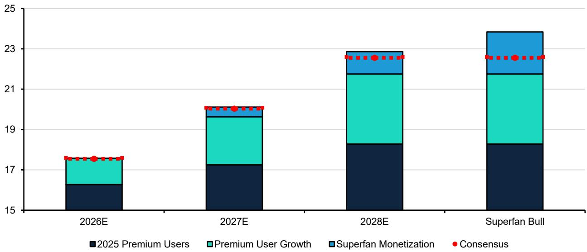  
来源：Bernstein分析与估算

在计算超级粉丝对Spotify收入的潜在影响时，我们估算了每位超级粉丝的平均贡献以及超级粉丝的渗透率。Spotify的超级粉丝计划并不是一个所有超级粉丝都可以注册的5美元订阅，而是一系列多样化的产品，这使得收入计算困难得多。尽管如此，我们做了如下简化：

图8：我们的关键超级粉丝假设是1.2%和2.6%的渗透率，以及每位超级粉丝额外约5美元的ARPU

<table><tr><td>超级粉丝影响</td><td>2026E</td><td>2027E</td><td>2028E</td><td>超级粉丝乐观情景</td></tr><tr><td>超级粉丝占1Q26 MAUs的百分比</td><td>0.0%</td><td>1.2%</td><td>2.6%</td><td>2.6%</td></tr><tr><td>每位超级粉丝额外收入</td><td>€ - €</td><td>4 €</td><td>5 €</td><td>9</td></tr><tr><td>超级粉丝额外收入（百万）</td><td>€ - €</td><td>484 €</td><td>1,108 €</td><td>2,091</td></tr><tr><td>占2025年Premium收入的百分比</td><td>0.0%</td><td>3.2%</td><td>7.2%</td><td>13.6%</td></tr></table>

来源：Bernstein分析与估算

超级粉丝变现对收入的贡献存在很大的不确定性。我们保守地设定每位超级粉丝额外收入为5美元，但如果Spotify执行得非常出色，也可能带动Premium收入大幅增长。

图9：即使渗透率很小，超级粉丝定价也能显著推动收入变化。在评估Spotify即将推出的超级粉丝计划时，我们认为定价将是成功的关键驱动因素。

<table><tr><td colspan="10">超级粉丝年度额外收入（百万欧元）在不同渗透率/价格（欧元）下</td></tr><tr><td></td><td>€4</td><td>€6</td><td>€8</td><td>€10</td><td>€12</td></tr><tr><td>0.8%</td><td>€313</td><td>€457</td><td>€601</td><td>€745</td><td>€889</td></tr><tr><td>1.0%</td><td>€392</td><td>€573</td><td>€753</td><td>€934</td><td>€1,114</td></tr><tr><td>1.2%</td><td>€472</td><td>€689</td><td>€906</td><td>€1,123</td><td>€1,340</td></tr><tr><td>1.4%</td><td>€551</td><td>€805</td><td>€1,058</td><td>€1,312</td><td>€1,565</td></tr><tr><td>1.6%</td><td>€631</td><td>€921</td><td>€1,211</td><td>€1,501</td><td>€1,791</td></tr><tr><td>1.8%</td><td>€710</td><td>€1,037</td><td>€1,363</td><td>€1,690</td><td>€2,016</td></tr></table>

来源：Bernstein分析与估算

我们考察了当前的超级粉丝产品，以估算Spotify能从超级粉丝身上获得多少收入。目前大多数超级粉丝产品定价在每月5美元左右。（Weverse的产品看起来更便宜，但需要同时购买数字版和官方会员才能获得完全访问权限，而且应用程序内还有其他变现方式）。这表明超级粉丝通常愿意每月至少支付5美元来支持他们喜欢的创作者。

图10：尽管Spotify的超级粉丝计划不是简单的订阅，但我们观察类似超级粉丝订阅，发现每月每位超级粉丝5美元很可能是变现的下限

<table><tr><td colspan="2">超级粉丝定价对比（美元/月）</td></tr><tr><td>Weverse BTS数字会员</td><td>$2.00</td></tr><tr><td>Weverse BTS官方会员</td><td>$1.83</td></tr><tr><td>Patreon最高收入者（The Yard）</td><td>$6.00</td></tr><tr><td>Twitch Tier 1订阅</td><td>$5.00</td></tr><tr><td>MrBeast YouTube会员</td><td>$5.00</td></tr></table>

来源：Weverse、Graphtreon、YouTube、Bernstein分析

对于超级粉丝渗透率，我们参考Twitch。Twitch的Premium用户很少，正如我们对Spotify的预期。和Spotify一样，Twitch也是一个免费增值媒体平台，人们经常在上面花费很多时间。

图11：Twitch为估算超级粉丝渗透率提供了有用的参考

<table><tr><td>预估Twitch订阅转化率</td><td>2026年6月</td></tr><tr><td>预估Twitch MAUs（百万）</td><td>240</td></tr><tr><td>预估Twitch订阅数（百万）</td><td>3.4</td></tr><tr><td>Twitch订阅转化率</td><td>1.4%</td></tr></table>

来源：Twitchtracker、Bernstein分析与估算

图12：我们的估算与2025年至2028年全球Premium用户增长约22%和每年6%的定价增长相一致，大部分用户增长由拉丁美洲和世界其他地区驱动。我们预计北美、欧洲和拉丁美洲的用户增长在未来几年将放缓。

<table><tr><td>相对于2025年的Premium增长</td><td>2026E</td><td>2027E</td><td>2028E</td></tr><tr><td>北美</td><td>7.2%</td><td>10.8%</td><td>13.8%</td></tr><tr><td>欧洲</td><td>7.8%</td><td>11.8%</td><td>15.5%</td></tr><tr><td>拉丁美洲</td><td>17.2%</td><td>33.4%</td><td>46.3%</td></tr><tr><td>世界其他地区</td><td>20.8%</td><td>38.3%</td><td>58.4%</td></tr><tr><td>全球Premium用户</td><td>11.2%</td><td>19.3%</td><td>26.8%</td></tr><tr><td>价格</td><td>6.0%</td><td>12.4%</td><td>19.1%</td></tr><tr><td>新增用户带来的额外收入（百万）</td><td>€1,305</td><td>€2,386</td><td>€3,470</td></tr><tr><td>占2025年Premium收入的百分比</td><td>8.5%</td><td>15.5%</td><td>22.6%</td></tr></table>

来源：Spotify、Bernstein分析与估算  
Spotify国家层面定价曲线：对数（对数（最高五分之一收入））

图13：Spotify的国家层面定价曲线显示，价格大体与收入保持一致，但也存在差异，这很可能反映了需求的不同

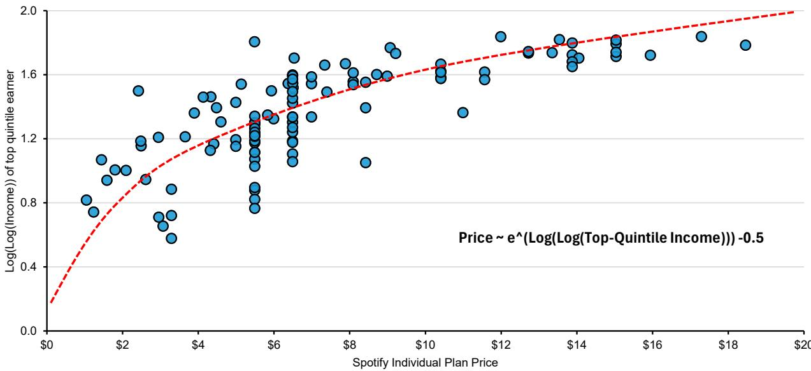  
这里的对数实际上是自然对数，最高五分之一收入单位为千，计算前应用  
来源：Spotify、Bernstein分析与估算

图14：相对于对数收入的价格可以给出方向性正确的Spotify需求估算  
Spotify区域定价与收入的关系  
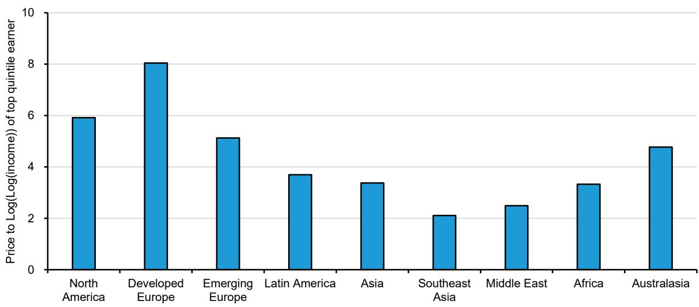  
来源：Spotify、Bernstein分析与估算  
图15：虽然价格收入比可以反映Spotify的可负担性，但它并不能很好地反映需求。需要使用对数收入来消除收入不平衡的影响，以便进行需求估算。

区域价格收入比  
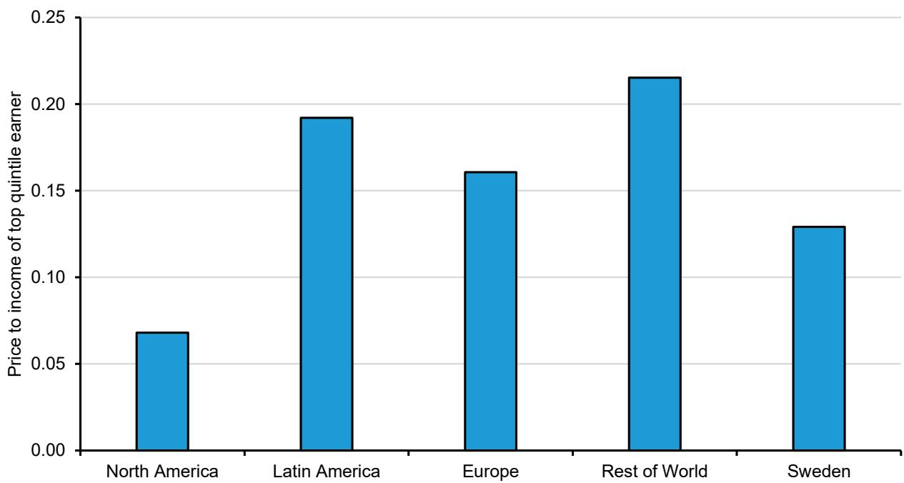  
来源：Spotify、Bernstein分析与估算

图16：欧洲占Spotify Premium用户的大部分，北美和拉丁美洲各有约7000万订阅用户

2026年第一季度2.93亿Premium用户按区域分布

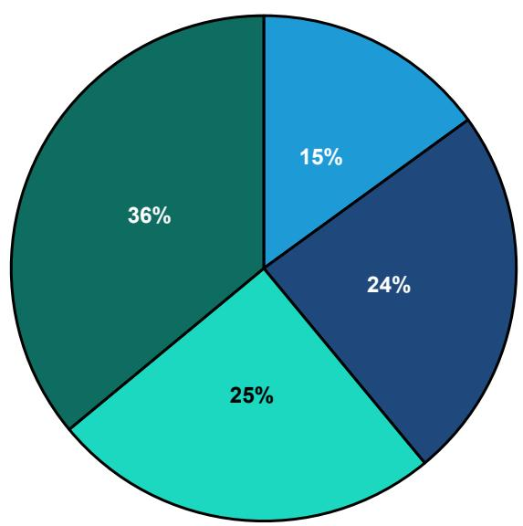  
世界其他地区 拉丁美洲 北美 欧洲  
来源：Spotify、Bernstein分析

图17：比较Spotify Premium用户分布与MAU分布，世界其他地区在MAU中的占比高于Premium用户。Spotify将这些MAU转化为Premium用户的能力对增长至关重要。

2026年第一季度7.61亿MAU按区域分布

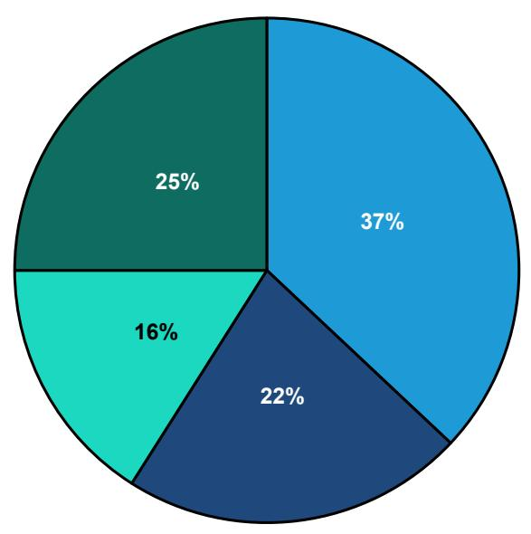  
世界其他地区 拉丁美洲 北美 欧洲  
来源：Spotify、Bernstein分析

图18：Spotify的价格与其竞争对手在区域上大致相同，表明其定价是有效的  
音乐DSP市场参与者区域价格对比  
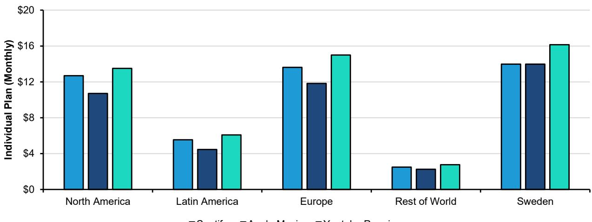  
■ Spotify ■ Apple Music ■ Youtube Premium  
来源：Geopriced、Bernstein分析与估算

比较北美、瑞典和欧洲各收入五分之一人群的价格/对数（对数（收入）），北美在各五分之一人群中相对更便宜。我们认为这可以作为Spotify可能在北美提高价格的证据。我们也承认另一种结论：这可能是Spotify在北美市场份额低于欧洲的结果。

图19：价格上调可能会持续。Spotify在北美经收入调整后的价格低于瑞典和欧洲各五分之一人群，表明在其最大市场之一可能仍有提价空间。

Spotify在各收入五分之一人群中的相对价格  
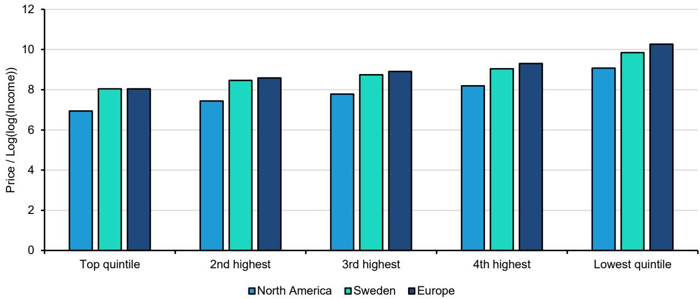  
来源：Bernstein分析与估算

## 华纳音乐（WMG）—— 仍是一个低调的AI赢家

关于AI与音乐的许多讨论集中在颠覆风险上，但我们认为现有唱片公司和DSP在新型AI音乐生态中仍具备强大的竞争优势。我们看到的不是试图对抗AI，而是音乐产业正在适应，可能为艺术家、唱片公司和DSP开启新的收入来源。然而，我们确实看到结果范围很广。乐观方面，AI成为艺术家的有价值工具以及人们与现有IP互动的方式。对唱片公司而言，这可能意味着增量提升。悲观方面，艺术家可能选择不参与，内容泛滥可能淹没平台，各新兴市场IP保护薄弱可能导致不公平使用而无需补偿。这种情况无疑会损害唱片公司。

总体而言，我们认为价值创造是更可能的情景，但这在一定程度上取决于AI与音乐合作是否走艺术家优先工具的道路。这可能导致TAM扩张、专辑周期缩短、以及超级粉丝变现抵消不利因素。反之，如果AI“垃圾内容”胜出，我们认为碎片化可能限制上行空间。

我们相信在中期，WMG的发展轨迹与其合作伙伴（如Suno、Udio和Stability AI）共同构建商业和伦理基础模型的能力密切相关。过去，唱片公司被迫追赶新技术，但在AI方面，WMG计划将竞争威胁转变为高利润的授权垂直领域。

图20：我们预计更高的参与度、更短的专辑周期和增量定价能力将抵消版税流失，并使2030年流媒体TAM增加约10-20亿美元

录制音乐流媒体TAM（含AI）（十亿美元）

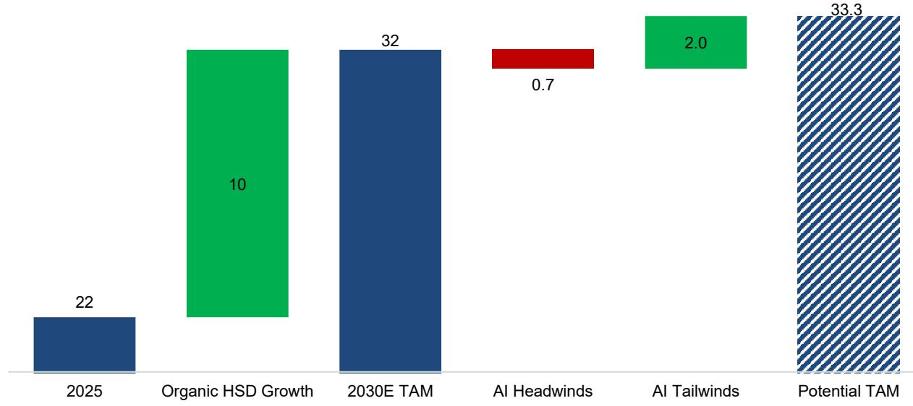  
来源：公司报告、IFPI、RIAA、Bernstein分析与估算

图21：WMG正围绕Udio、Stability AI和Klay快速构建“授权AI”栈，将诉讼转化为授权创作工具和AI流媒体

<table><tr><td>合作伙伴</td><td>触及的垂直领域</td><td>战略角度</td></tr><tr><td>Udio</td><td>AI音乐创作、混音、消费者UGC</td><td>将诉讼转化为授权AI创作平台；测试基于目录的更高利润“AI SaaS”层；强化培训必须付费且须选择的规范</td></tr><tr><td>Klay</td><td>AI原生流媒体、个性化、UGC</td><td>在授权花园内获得AI增强流媒体的上行空间；帮助塑造AI混音的格式/护栏</td></tr><tr><td>Stability</td><td>专业创作者工具、制作工作流</td><td>将“负责任AI”工具嵌入艺术家/作者工作流；影响企业音频栈；从工具及增量授权中创造上行空间</td></tr></table>

来源：Music Business Worldwide、Reuters、WMG、Bernstein分析  
AI辅助 vs 纯人类视频

图22：目前存在很多“垃圾内容”，但总体而言，AI正在使广告商/影响力人士/创作者更高效、更具吸引力，在质量光谱的低端淘汰了纯人类视频

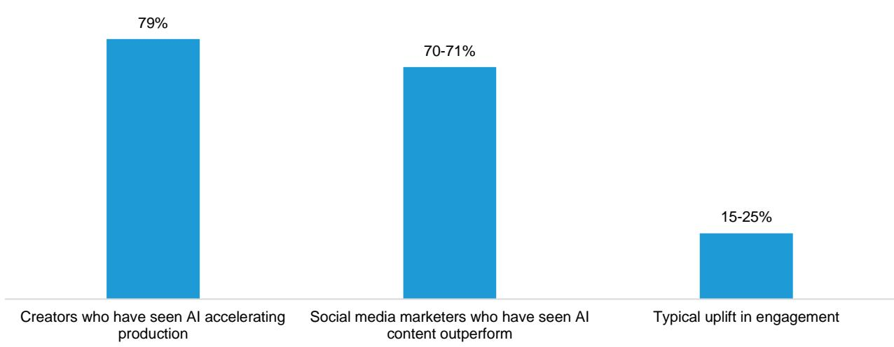  
来源：Hootsuite、HubSpot、Marketing Hub、Buffer、Bernstein分析

图23：WMG的发行阵容持续看好；我们认为新作品发布预期是驱动流媒体增长、目录参与和粉丝获取的重要因素

<table><tr><td>季度</td><td>艺术家</td><td>专辑/项目</td><td>厂牌</td><td>WMG关系</td><td>备注</td></tr><tr><td rowspan="9">2026年第三季度（2026财年第四季度）</td><td>Charli XCX</td><td>音乐、时尚、电影</td><td>大西洋唱片</td><td>WMG核心厂牌</td><td>第7张录音室专辑于7月24日发行</td></tr><tr><td>FLO</td><td>Therapy at the Club</td><td>Island Records</td><td>WMG核心厂牌</td><td>第二张专辑于7月24日发行</td></tr><tr><td>NoCap</td><td>Heaven on Mars</td><td>大西洋唱片</td><td>WMG核心厂牌</td><td>专辑于7月31日发行</td></tr><tr><td>Twenty One Pilots</td><td>More Than We Ever Imagined (Live in Mexico City)</td><td>Fueled by Ramen</td><td>WMG核心厂牌</td><td>现场专辑于8月7日发行</td></tr><tr><td>Ravyn Lenae</td><td>Blue Island</td><td>大西洋唱片</td><td>WMG核心厂牌</td><td>第3张录音室专辑于8月7日发行</td></tr><tr><td>Weezer</td><td>Weezer（“The Gold Album”）</td><td>Reprise Records</td><td>WMG核心厂牌</td><td>第20张录音室专辑于8月21日发行</td></tr><tr><td>Brandon Flowers</td><td>THRASHER</td><td>Island Records</td><td>WMG核心厂牌</td><td>首张个人专辑于8月22日发行</td></tr><tr><td>Alex Warren</td><td>WILDCHILD</td><td>大西洋唱片</td><td>WMG核心厂牌</td><td>专辑于8月28日发行</td></tr><tr><td>Yaelokre</td><td>Foreword</td><td>大西洋唱片</td><td>WMG核心厂牌</td><td>专辑于9月3日发行</td></tr><tr><td rowspan="5">2026年第四季度（2027财年第一季度）</td><td>NLE Choppa</td><td>Top Shotta 2</td><td>No Love Entertainment/Warner Records</td><td>WMG核心厂牌</td><td>计划于2026年发行</td></tr><tr><td>Gojira</td><td>待定</td><td>Roadrunner Records</td><td>WMG核心厂牌</td><td>专辑预计2026年发行</td></tr><tr><td>Cardi B</td><td>待定</td><td>大西洋唱片</td><td>WMG核心厂牌</td><td>第3张录音室专辑，Cardi B公开推动2026年发行</td></tr><tr><td>Megan Thee Stallion</td><td>Megan: ACT III</td><td>Hot Girl Productions</td><td>与WMG的发行和营销合作</td><td>专辑预计2026年发行</td></tr><tr><td>Knox</td><td>My Midwest Best</td><td>大西洋唱片</td><td>WMG核心厂牌</td><td>第二张专辑于10月2日发行</td></tr><tr><td rowspan="3">2027年第一季度（2027财年第二季度后）</td><td>Zach Bryan</td><td>Young Manhood and Other Donatable Organs</td><td>Warner Records</td><td>WMG核心厂牌</td><td>已确认EP并发布歌曲预告，但未公布发行日期</td></tr><tr><td>Dua Lipa</td><td>待定</td><td>Warner Records</td><td>WMG核心厂牌</td><td>发行日期未知</td></tr><tr><td>The Killers</td><td>待定</td><td>Island Records</td><td>WMG核心厂牌</td><td>第8张录音室专辑预计2027年</td></tr></table>

来源：Bernstein分析

## SPOT财报前瞻

图24：SPOT财报前瞻

<table><tr><td colspan="16">除每股数据、百分比和每用户数据外，单位均为百万</td></tr><tr><td></td><td>1Q24</td><td>2Q24</td><td>3Q24</td><td>4Q24</td><td>1Q25</td><td>2Q25</td><td>3Q25</td><td>4Q25</td><td>1Q26</td><td>2Q26E</td><td colspan="5">2Q26E</td></tr><tr><td>SPOT</td><td></td><td></td><td></td><td></td><td></td><td></td><td></td><td></td><td></td><td>Bernstein</td><td>市场一致预期</td><td>%</td><td></td><td></td><td></td></tr><tr><td colspan="16">关键运营指标</td></tr><tr><td>Premium订阅用户（期末）</td><td></td><td>239</td><td>246</td><td>252</td><td>263</td><td>268</td><td>276</td><td>281</td><td>290</td><td>293</td><td>299</td><td>299</td><td>0.1%</td><td></td><td></td><td></td></tr><tr><td>Premium ARPU</td><td>€</td><td>4.55 €</td><td>4.62 €</td><td>4.71 €</td><td>4.85 €</td><td>4.73 €</td><td>4.57 €</td><td>4.53 €</td><td>4.70 €</td><td>4.76 €</td><td>4.88 €</td><td>4.89</td><td>-0.2%</td><td></td><td></td><td></td></tr><tr><td>广告支持MAUs</td><td></td><td>388</td><td>380</td><td>402</td><td>425</td><td>423</td><td>433</td><td>446</td><td>476</td><td>483</td><td>489</td><td>491</td><td>-0.5%</td><td></td><td></td><td></td></tr><tr><td>广告支持ARPU</td><td>€</td><td>0.33 €</td><td>0.40 €</td><td>0.39 €</td><td>0.42 €</td><td>0.33 €</td><td>0.35 €</td><td>0.33 €</td><td>0.36 €</td><td>0.27 €</td><td>0.31 €</td><td>0.31</td><td>0.7%</td><td></td><td></td><td></td></tr><tr><td colspan="16">分部业绩</td></tr><tr><td>Premium</td><td></td><td></td><td></td><td></td><td></td><td></td><td></td><td></td><td></td><td></td><td></td><td></td><td></td><td></td><td></td><td></td></tr><tr><td>收入</td><td></td><td>3,247</td><td>3,351</td><td>3,516</td><td>3,705</td><td>3,771</td><td>3,740</td><td>3,826</td><td>4,013</td><td>4,148</td><td>4,330</td><td>4,341</td><td>-0.3%</td><td></td><td></td><td></td></tr><tr><td>毛利润</td><td></td><td>979</td><td>1,051</td><td>1,178</td><td>1,287</td><td>1,262</td><td>1,237</td><td>1,269</td><td>1,398</td><td>1,445</td><td>1,513</td><td>1,509</td><td>0.2%</td><td></td><td></td><td></td></tr><tr><td>毛利率</td><td></td><td>30.2%</td><td>31.4%</td><td>33.5%</td><td>34.7%</td><td>33.5%</td><td>33.1%</td><td>33.2%</td><td>34.8%</td><td>34.8%</td><td>34.9%</td><td>34.8%</td><td>0.2%</td><td></td><td></td><td></td></tr><tr><td>广告支持</td><td></td><td></td><td></td><td></td><td></td><td></td><td></td><td></td><td></td><td></td><td></td><td></td><td></td><td></td><td></td><td></td></tr><tr><td>收入</td><td></td><td>389</td><td>456</td><td>472</td><td>537</td><td>419</td><td>453</td><td>446</td><td>518</td><td>385</td><td>455</td><td>454</td><td>0.2%</td><td></td><td></td><td></td></tr><tr><td>毛利润</td><td></td><td>25</td><td>61</td><td>62</td><td>81</td><td>64</td><td>83</td><td>82</td><td>101</td><td>50</td><td>75</td><td>78</td><td>-4.1%</td><td></td><td></td><td></td></tr><tr><td>毛利率</td><td></td><td>6.4%</td><td>13.4%</td><td>13.1%</td><td>15.1%</td><td>15.3%</td><td>18.3%</td><td>18.4%</td><td>19.5%</td><td>13.0%</td><td>16.5%</td><td>17.2%</td><td>-0.7%</td><td></td><td></td><td></td></tr><tr><td colspan="16">IFRS毛利润</td></tr><tr><td>收入</td><td></td><td>3,636</td><td>3,807</td><td>3,988</td><td>4,242</td><td>4,190</td><td>4,193</td><td>4,272</td><td>4,531</td><td>4,533</td><td>4,785</td><td>4,795</td><td>-0.2%</td><td></td><td></td><td></td></tr><tr><td>收入成本</td><td></td><td>(2,632)</td><td>(2,695)</td><td>(2,748)</td><td>(2,874)</td><td>(2,864)</td><td>(2,873)</td><td>(2,921)</td><td>(3,032)</td><td>(3,038)</td><td>(3,197)</td><td>(3,208)</td><td>-0.3%</td><td></td><td></td><td></td></tr><tr><td>毛利润</td><td></td><td>1,004</td><td>1,112</td><td>1,240</td><td>1,368</td><td>1,326</td><td>1,320</td><td>1,351</td><td>1,499</td><td>1,495</td><td>1,588</td><td>1,588</td><td>0.0%</td><td></td><td></td><td></td></tr><tr><td>毛利率</td><td></td><td>27.6%</td><td>29.2%</td><td>31.1%</td><td>32.2%</td><td>31.6%</td><td>31.5%</td><td>31.6%</td><td>33.1%</td><td>33.0%</td><td>33.2%</td><td>33.1%</td><td>0.1%</td><td></td><td></td><td></td></tr><tr><td colspan="16">IFRS利润</td></tr><tr><td>运营费用</td><td></td><td>(836)</td><td>(846)</td><td>(786)</td><td>(891)</td><td>(817)</td><td>(914)</td><td>(769)</td><td>(798)</td><td>(780)</td><td>(938)</td><td>(949)</td><td>-1.3%</td><td></td><td></td><td></td></tr><tr><td>EBITDA</td><td></td><td>199</td><td>296</td><td>484</td><td>507</td><td>536</td><td>432</td><td>606</td><td>726</td><td>741</td><td>676</td><td>735</td><td>-8.0%</td><td></td><td></td><td></td></tr><tr><td>折旧与摊销</td><td></td><td>(31)</td><td>(30)</td><td>(30)</td><td>(30)</td><td>(27)</td><td>(26)</td><td>(24)</td><td>(25)</td><td>(26)</td><td>(26)</td><td>(28)</td><td>-7.8%</td><td></td><td></td><td></td></tr><tr><td>EBIT</td><td></td><td>168</td><td>266</td><td>454</td><td>477</td><td>509</td><td>406</td><td>582</td><td>701</td><td>715</td><td>650</td><td>706</td><td>-8.0%</td><td></td><td></td><td></td></tr><tr><td>净利润</td><td></td><td>197</td><td>274</td><td>300</td><td>367</td><td>225</td><td>(86)</td><td>899</td><td>1,174</td><td>721</td><td>570</td><td>570</td><td>0.1%</td><td></td><td></td><td></td></tr><tr><td>每股利润</td><td>€</td><td>0.97 €</td><td>1.33 €</td><td>1.45 €</td><td>1.76 €</td><td>1.07 €</td><td>(0.42) €</td><td>4.21 €</td><td>5.52 €</td><td>3.45 €</td><td>2.72 €</td><td>2.72</td><td>0.3%</td><td></td><td></td><td></td></tr><tr><td colspan="16">资产负债表与现金流</td></tr><tr><td>期末现金</td><td></td><td>3,451</td><td>4,054</td><td>4,688</td><td>4,781</td><td>5,019</td><td>5,161</td><td>5,456</td><td>5,258</td><td>5,255</td><td>5,405</td><td>5,848</td><td>-7.6%</td><td></td><td></td><td></td></tr><tr><td>自由现金流</td><td></td><td>207</td><td>490</td><td>711</td><td>876</td><td>534</td><td>700</td><td>805</td><td>834</td><td>824</td><td>729</td><td>810</td><td>-10.0%</td><td></td><td></td><td></td></tr><tr><td>FCF转化率（占EBITDA百分比）</td><td></td><td>104%</td><td>166%</td><td>147%</td><td>173%</td><td>100%</td><td>162%</td><td>133%</td><td>115%</td><td>111%</td><td>108%</td><td>110%</td><td>-2.4%</td><td></td><td></td><td></td></tr><tr><td colspan="16">线下项目</td></tr><tr><td>税收</td><td></td><td>23</td><td>4</td><td>(98)</td><td>(132)</td><td>(103)</td><td>(134)</td><td>72</td><td>153</td><td>(216)</td><td>(125)</td><td>(134)</td><td></td><td></td><td></td><td></td></tr><tr><td>非经营收入</td><td></td><td>6</td><td>4</td><td>(56)</td><td>22</td><td>(181)</td><td>(358)</td><td>245</td><td>320</td><td>222</td><td>45</td><td>(3)</td><td></td><td></td><td></td><td></td></tr><tr><td>平均稀释股数</td><td></td><td>204</td><td>206</td><td>207</td><td>209</td><td>210</td><td>205</td><td>214</td><td>212</td><td>209</td><td>209</td><td>210</td><td>-0.2%</td><td></td><td></td><td></td></tr></table>

来源：公司报告、彭博、Bernstein分析与估算

图25：与上一版SPOT模型相比的估算修正

<table><tr><td>SPOT - Bernstein估算修正</td><td>1Q26</td><td>2Q26E</td><td>3Q26E</td><td>4Q26E</td><td>FY2026E</td><td>FY2027E</td></tr><tr><td colspan="7">收入增长</td></tr><tr><td>旧估算</td><td>8.2%</td><td>14.5%</td><td>15.0%</td><td>17.3%</td><td>13.8%</td><td>13.3%</td></tr><tr><td>修正估算/实际</td><td>8.2%</td><td>14.1%</td><td>17.2%</td><td>14.3%</td><td>13.5%</td><td>15.2%</td></tr><tr><td>变化</td><td></td><td>-0.3%</td><td>2.3%</td><td>-3.0%</td><td>-0.3%</td><td>1.9%</td></tr><tr><td colspan="7">Premium订阅用户</td></tr><tr><td>旧估算</td><td>293</td><td>299</td><td>306</td><td>317</td><td>317</td><td>337</td></tr><tr><td>修正估算/实际</td><td>293</td><td>299</td><td>306</td><td>317</td><td>317</td><td>339</td></tr><tr><td>变化</td><td></td><td>0.0%</td><td>0.0%</td><td>0.0%</td><td>0.0%</td><td>0.8%</td></tr><tr><td colspan="7">Premium ARPU</td></tr><tr><td>旧估算</td><td>€4.76</td><td>€4.89</td><td>€4.79</td><td>€5.05</td><td>€58.49</td><td>€62.29</td></tr><tr><td>修正估算/实际</td><td>€4.76</td><td>€4.88</td><td>€4.91</td><td>€4.93</td><td>€58.43</td><td>€62.36</td></tr><tr><td>变化</td><td></td><td>-0.2%</td><td>2.4%</td><td>-2.4%</td><td>-0.1%</td><td>0.1%</td></tr><tr><td colspan="7">总MAUs</td></tr><tr><td>旧估算</td><td>761</td><td>778</td><td>795</td><td>828</td><td>791</td><td>848</td></tr><tr><td>修正估算/实际</td><td>761</td><td>778</td><td>795</td><td>828</td><td>791</td><td>851</td></tr><tr><td>变化</td><td></td><td>0%</td><td>0%</td><td>0%</td><td>0%</td><td>0%</td></tr><tr><td colspan="7">毛利润率</td></tr><tr><td>旧估算</td><td>33.0%</td><td>33.2%</td><td>33.4%</td><td>34.8%</td><td>33.6%</td><td>35.0%</td></tr><tr><td>修正估算/实际</td><td>33.0%</td><td>33.2%</td><td>33.2%</td><td>34.4%</td><td>33.5%</td><td>34.6%</td></tr><tr><td>变化</td><td></td><td>0.0%</td><td>-0.1%</td><td>-0.4%</td><td>-0.1%</td><td>-0.4%</td></tr><tr><td colspan="7">经营利润</td></tr><tr><td>旧估算</td><td>715</td><td>653</td><td>691</td><td>896</td><td>2,955</td><td>3,929</td></tr><tr><td>修正估算/实际</td><td>715</td><td>650</td><td>709</td><td>839</td><td>2,913</td><td>3,915</td></tr><tr><td>变化</td><td></td><td>0%</td><td>3%</td><td>-6%</td><td>-1%</td><td>0%</td></tr><tr><td colspan="7">每股利润</td></tr><tr><td>旧估算</td><td>€3.45</td><td>€2.73</td><td>€2.89</td><td>€3.71</td><td>€12.78</td><td>€16.16</td></tr><tr><td>修正估算/实际</td><td>€3.45</td><td>€2.72</td><td>€2.96</td><td>€3.48</td><td>€12.61</td><td>€16.03</td></tr><tr><td>变化</td><td></td><td>0%</td><td>2%</td><td>-6%</td><td>-1%</td><td>-1%</td></tr></table>

来源：公司报告、彭博、Bernstein分析与估算

图26：SPOT 1年历史NTM估值倍数  
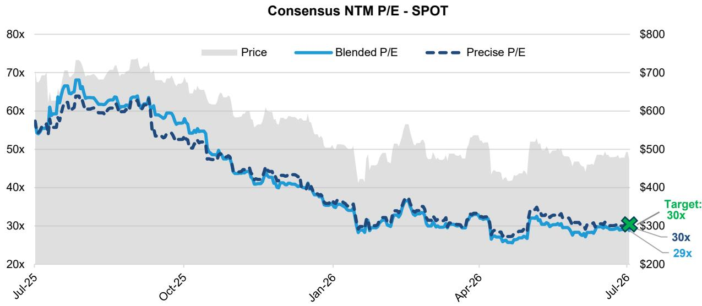  
来源：公司报告、彭博、Bernstein分析与估算

图27：SPOT 1年历史NTM EV/EBITDA  
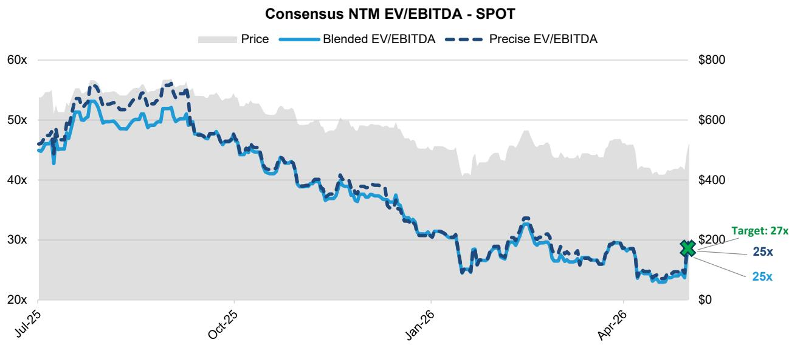  
来源：公司报告、彭博、Bernstein分析与估算

图28：利润率扩张仍是SPOT在2Q26E实现强劲EBIT增长的关键驱动因素  
Spotify 2Q26E EBIT增长（%，同比）  
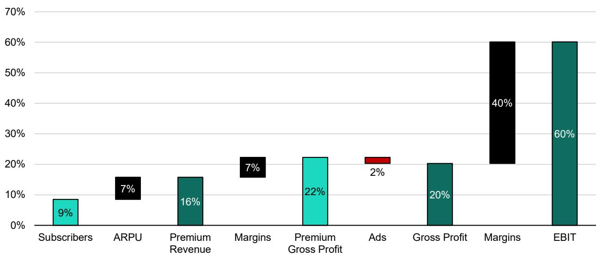  
来源：公司报告、Bernstein分析与估算

图29：我们预计EBIT增长将在2026E放缓，但利润率持续扩张仍是主要驱动力  
Spotify 2026E EBIT增长（%，同比）  
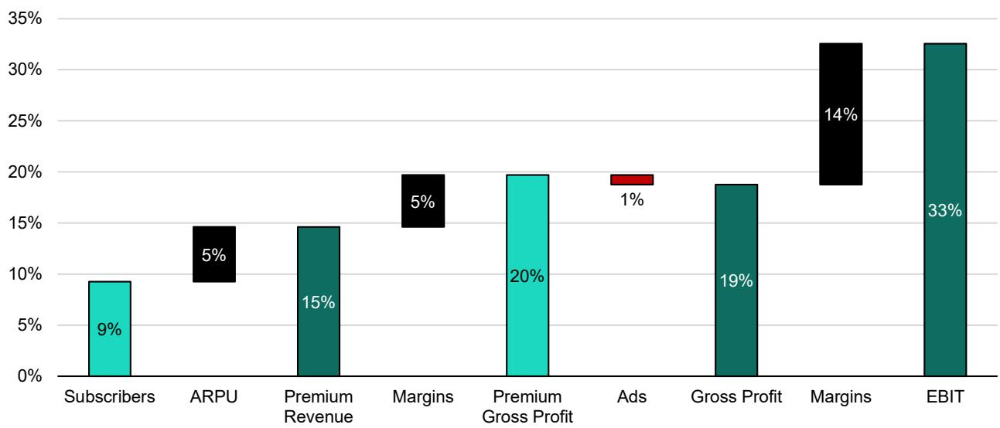  
来源：公司报告、Bernstein分析与估算

图30：全球Spotify下载量在1Q26短暂企稳后，同比恢复下降趋势  
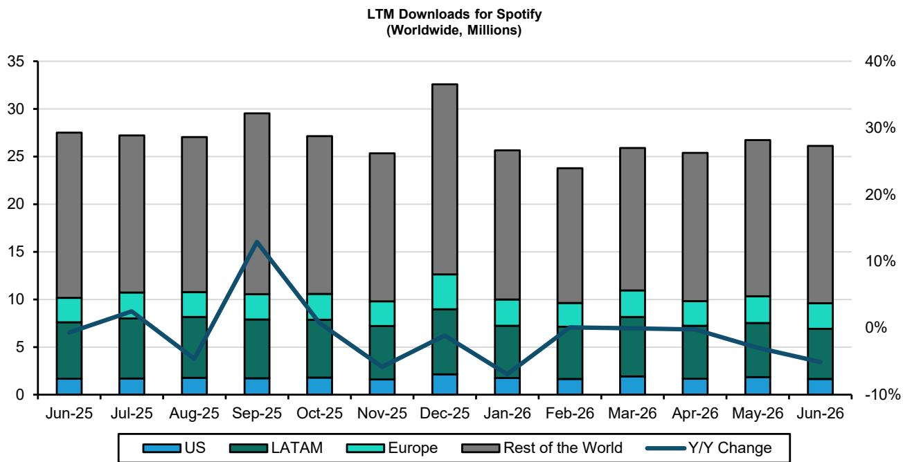  
来源：SensorTower、Bernstein分析

## Premium毛利率

图31：定价仍是Premium毛利率扩张的主要驱动因素，版税利好部分抵消了内容投入的影响

Spotify Premium毛利率拆分  
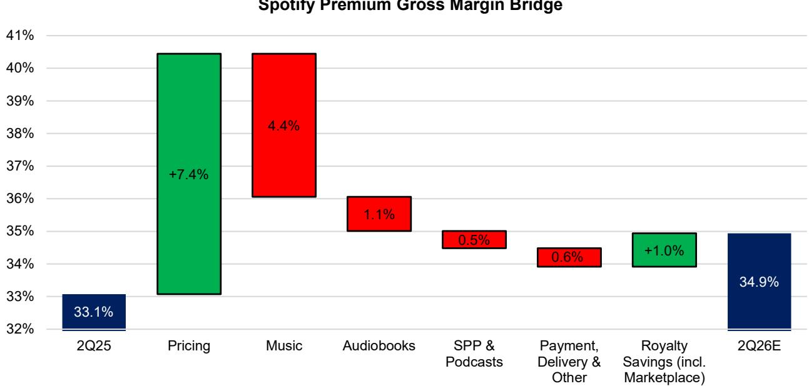  
来源：公司报告、Bernstein分析

## 固定汇率

图32：外汇逆风造成报告收入与固定汇率收入之间的差异  
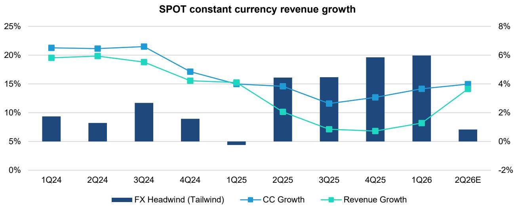  
来源：公司披露、Bernstein分析与估算

图33：……同时掩盖了经营利润率潜在改善  
SPOT固定汇率经营利润率  
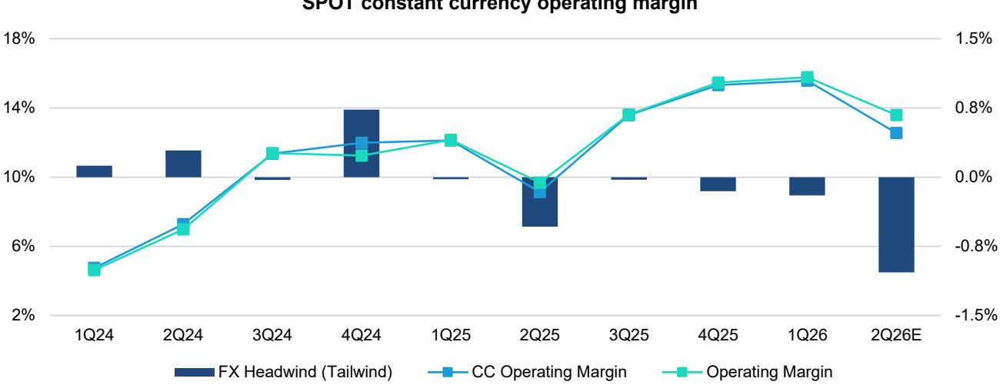  
来源：公司披露、Bernstein分析与估算

图34：……尽管基础利润率持续扩张，但报告毛利率仍受拖累。  
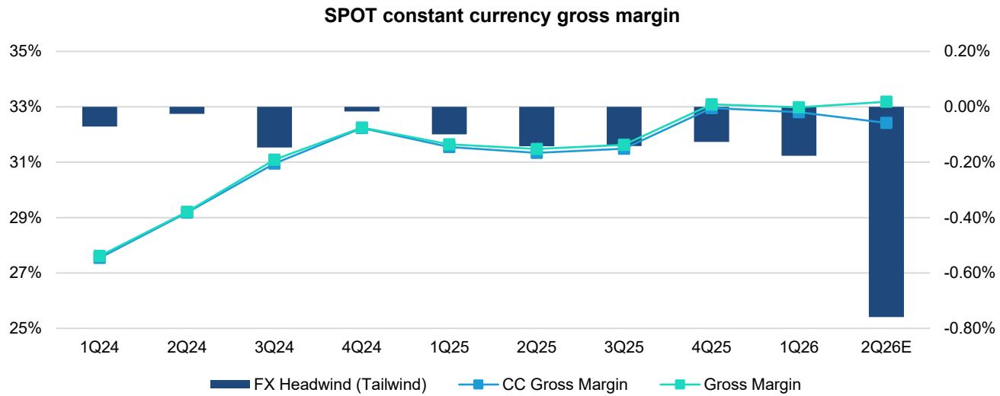  
来源：公司披露、Bernstein分析与估算

图35：由于SPOT基于上季度末的汇率给出收入指引，2Q结果可能在表面低于预期

SPOT同比收入增长外汇逆风  
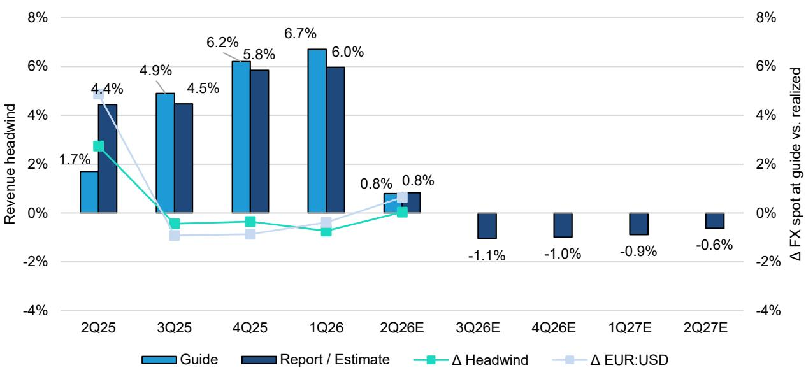  
来源：公司报告、彭博、Bernstein分析与估算  
图36：SPOT广告MAUs按区域同比增速

Spotify广告MAU增长（同比）  
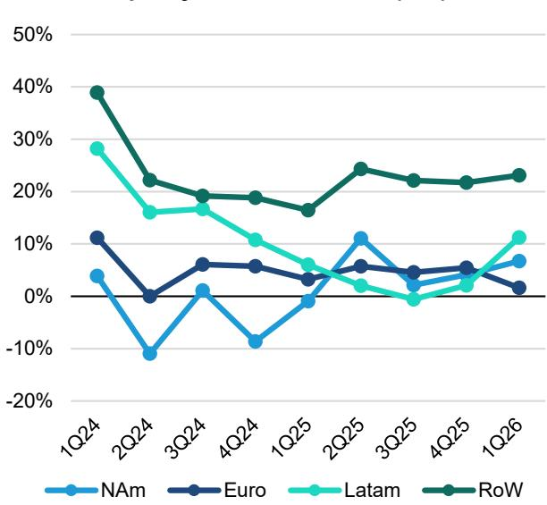  
来源：公司报告、Bernstein分析  
图37：各地区订阅用户增长持续正常化，世界其他地区和拉美仍为增长最快区域

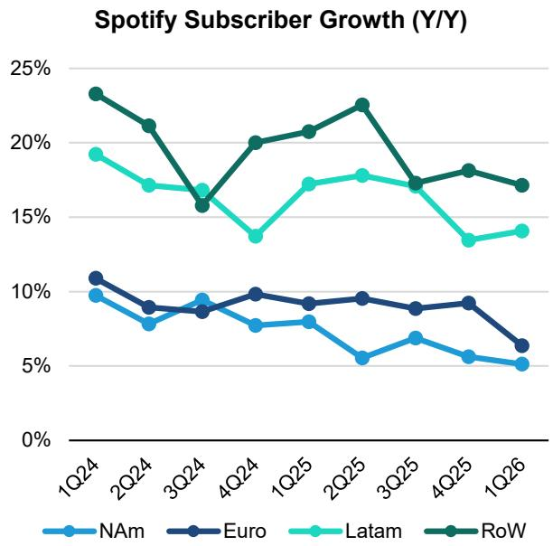  
来源：公司报告、Bernstein分析

## WMG财报前瞻

## 图38：WMG财报前瞻

单位百万，除每股数据、百分比和事件数据外

<table><tr><td colspan="10">单位百万，除每股数据、百分比和事件数据外</td></tr><tr><td>WMG</td><td>1Q25</td><td>2Q25</td><td>3Q25</td><td>4Q25</td><td>1Q26</td><td>2Q26</td><td>3Q26E Bernstein</td><td>3Q26E 市场一致预期</td><td>%</td></tr><tr><td colspan="10">毛利润</td></tr><tr><td>订阅流媒体</td><td>631</td><td>622</td><td>674</td><td>700</td><td>721</td><td>734</td><td>762</td><td>745</td><td>2%</td></tr><tr><td>数字收入</td><td>1,080</td><td>1,029</td><td>1,133</td><td>1,152</td><td>1,191</td><td>1,199</td><td>1,241</td><td>1,213</td><td>2%</td></tr><tr><td>其他录制与出版收入</td><td>586</td><td>455</td><td>556</td><td>716</td><td>649</td><td>533</td><td>563</td><td>568</td><td>-1%</td></tr><tr><td>总收入</td><td>1,666</td><td>1,484</td><td>1,689</td><td>1,868</td><td>1,840</td><td>1,732</td><td>1,804</td><td>1,781</td><td>1%</td></tr><tr><td>收入成本</td><td>(894)</td><td>(791)</td><td>(913)</td><td>(1,034)</td><td>(987)</td><td>(930)</td><td>(954)</td><td>(953)</td><td>0%</td></tr><tr><td>毛利润</td><td>772</td><td>693</td><td>776</td><td>834</td><td>853</td><td>802</td><td>850</td><td>828</td><td>3%</td></tr><tr><td>毛利率</td><td>46%</td><td>47%</td><td>46%</td><td>45%</td><td>46%</td><td>46%</td><td>47%</td><td>46%</td><td>1%</td></tr><tr><td colspan="10">GAAP利润</td></tr><tr><td>运营费用</td><td>(472)</td><td>(435)</td><td>(511)</td><td>(587)</td><td>(461)</td><td>(435)</td><td>(459)</td><td></td><td></td></tr><tr><td>EBITDA</td><td>300</td><td>258</td><td>265</td><td>247</td><td>392</td><td>367</td><td>391</td><td></td><td></td></tr><tr><td>折旧与摊销</td><td>(86)</td><td>(90)</td><td>(96)</td><td>(104)</td><td>(99)</td><td>(103)</td><td>(104)</td><td></td><td></td></tr><tr><td>EBIT</td><td>214</td><td>168</td><td>169</td><td>143</td><td>293</td><td>264</td><td>287</td><td></td><td></td></tr><tr><td>净利润</td><td>233</td><td>36</td><td>(16)</td><td>109</td><td>180</td><td>181</td><td>175</td><td></td><td></td></tr><tr><td>每股利润</td><td>0.44</td><td>0.07</td><td>(0.03)</td><td>0.21</td><td>0.34</td><td>0.34</td><td>0.33</td><td></td><td></td></tr><tr><td colspan="10">调整后利润</td></tr><tr><td>运营费用</td><td>(409)</td><td>(390)</td><td>(403)</td><td>(429)</td><td>(390)</td><td>(405)</td><td>(423)</td><td>(409)</td><td>3%</td></tr><tr><td>EBITDA</td><td>363</td><td>303</td><td>373</td><td>405</td><td>463</td><td>397</td><td>427</td><td>418</td><td>2%</td></tr><tr><td>利润率</td><td>22%</td><td>20%</td><td>22%</td><td>22%</td><td>25%</td><td>23%</td><td>24%</td><td>23%</td><td>0%</td></tr><tr><td>折旧与摊销</td><td>(86)</td><td>(90)</td><td>(96)</td><td>(104)</td><td>(99)</td><td>(103)</td><td>(104)</td><td>(93)</td><td>11%</td></tr><tr><td>EBIT</td><td>277</td><td>213</td><td>277</td><td>301</td><td>364</td><td>294</td><td>323</td><td>325</td><td>-1%</td></tr><tr><td>净利润</td><td>299</td><td>81</td><td>92</td><td>267</td><td>255</td><td>211</td><td>211</td><td>212</td><td>0%</td></tr><tr><td>每股利润</td><td>0.57</td><td>0.16</td><td>0.18</td><td>0.51</td><td>0.48</td><td>0.39</td><td>0.39</td><td>0.35</td><td>12%</td></tr><tr><td colspan="10">资产负债表与现金流</td></tr><tr><td>期末现金</td><td>802</td><td>637</td><td>527</td><td>532</td><td>751</td><td>741</td><td>537</td><td>664</td><td>-19%</td></tr><tr><td>经营活动现金流</td><td>332</td><td>69</td><td>46</td><td>231</td><td>440</td><td>126</td><td>307</td><td>245</td><td>26%</td></tr><tr><td>CFFO转化率（占调整后OIBDA百分比）</td><td>91%</td><td>23%</td><td>12%</td><td>57%</td><td>95%</td><td>32%</td><td>72%</td><td>59%</td><td>13%</td></tr><tr><td>自由现金流</td><td>296</td><td>33</td><td>7</td><td>203</td><td>420</td><td>99</td><td>280</td><td>200</td><td>40%</td></tr><tr><td>FCF转化率（占调整后EBITDA百分比）</td><td>82%</td><td>11%</td><td>2%</td><td>50%</td><td>91%</td><td>25%</td><td>66%</td><td>48%</td><td>18%</td></tr><tr><td colspan="10">线下项目</td></tr><tr><td>利息净额</td><td>(37)</td><td>(39)</td><td>(43)</td><td>(43)</td><td>(45)</td><td>(41)</td><td>(41)</td><td>40</td><td>-203%</td></tr><tr><td>税收</td><td>(89)</td><td>(29)</td><td>(5)</td><td>3</td><td>(71)</td><td>(73)</td><td>(71)</td><td>64</td><td>-210%</td></tr><tr><td>非控制性权益及其他非经营项目</td><td>148</td><td>(64)</td><td>(137)</td><td>6</td><td>7</td><td>31</td><td>0</td><td>(217)</td><td></td></tr><tr><td>平均稀释股数</td><td>524</td><td>520</td><td>521</td><td>522</td><td>533</td><td>538</td><td>538</td><td></td><td></td></tr></table>

来源：公司报告、彭博、CapIQ、Bernstein分析与估算

图39：WMG 1年历史NTM估值倍数  
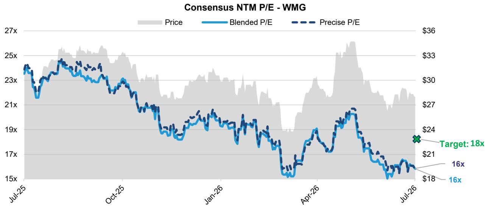  
来源：公司报告、彭博、Bernstein分析与估算

图40：WMG 1年历史NTM EV/EBITDA  
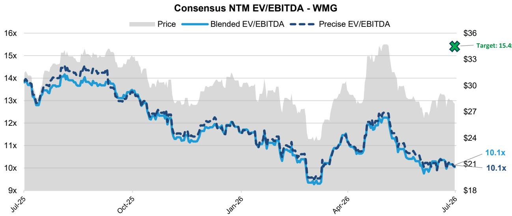  
来源：公司报告、彭博、Bernstein分析与估算

图41：我们预计下季度销售及管理费用改善将继续推动调整后OIBDA同比增长15%  
华纳音乐集团3Q26E OIBDA增长  
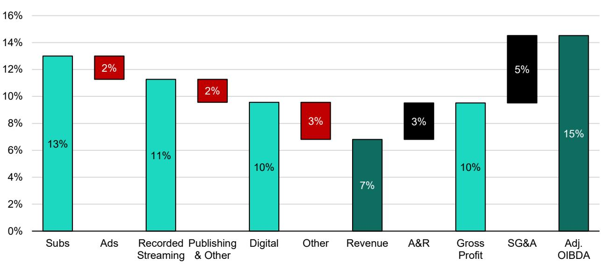  
来源：公司报告、Bernstein分析与估算

## 图42：我们预计2026财年调整后OIBDA同比增长22%

华纳音乐集团2026E OIBDA增长  
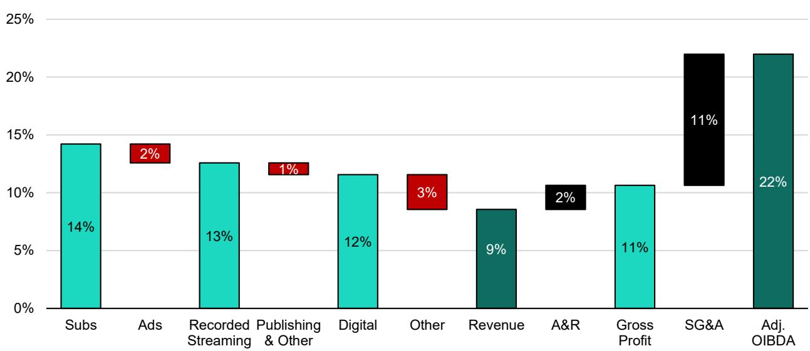  
来源：公司报告、Bernstein分析与估算

图43：在超级粉丝及并购利好下，明年数字收入增长有望显著加速  
订阅收入增长（同比）  
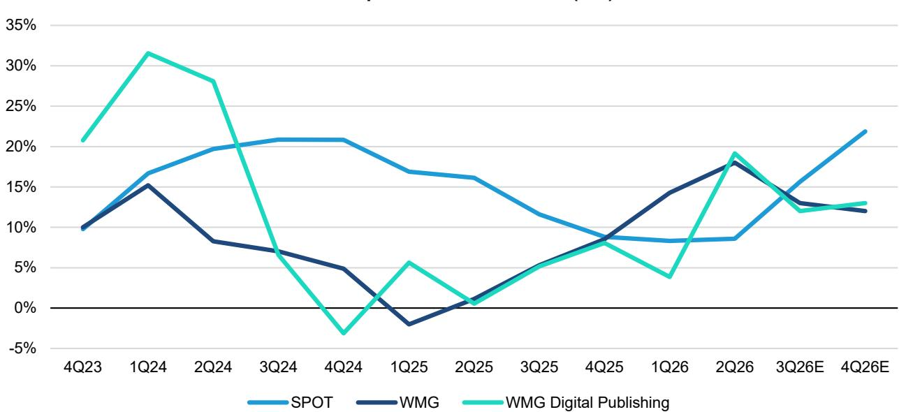  
来源：公司报告、Bernstein分析与估算

图44：我们预计下季度流媒体收入将呈上升趋势  
流媒体收入增长（同比）  
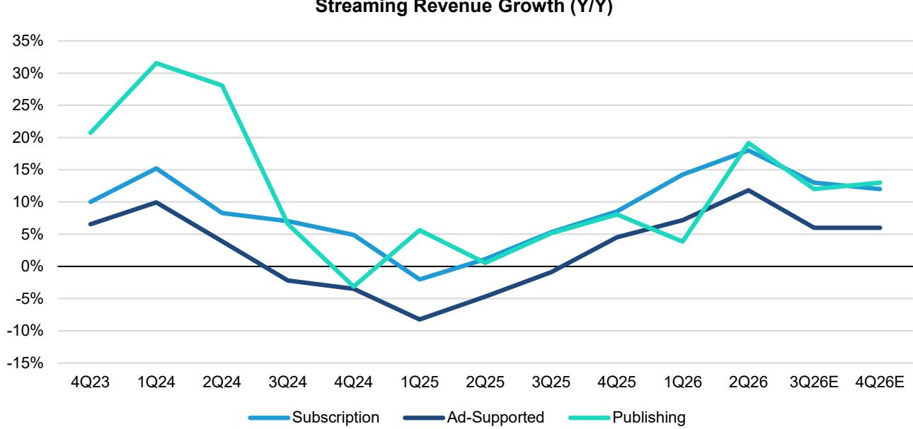  
来源：公司报告、Bernstein分析与估算

图45：我们预计下季度广告支持收入保持平稳  
广告支持收入增长（同比）  
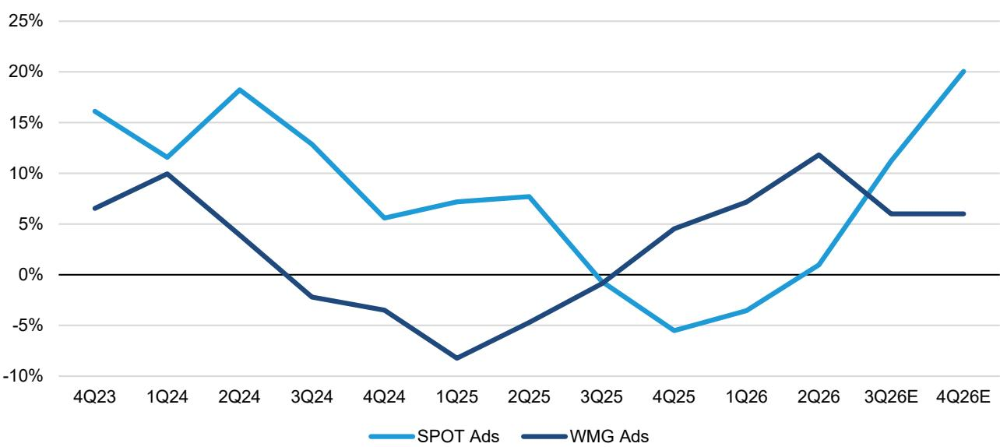  
来源：公司报告、Bernstein分析与估算

图46：我们预计自由现金流转化率超过40%，这将为战略性并购提供更多现金  
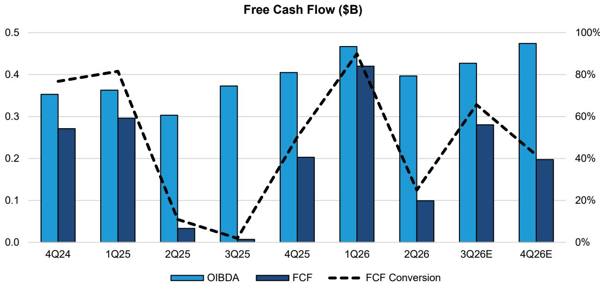  
来源：公司报告、Bernstein分析与估算

## 附录——财务预测

图47：SPOT财务数据  
除每股数据、百分比和用户数据外，单位均为百万

<table><tr><td>SPOT</td><td>1Q25</td><td>2Q25</td><td>3Q25</td><td>4Q25</td><td>1Q26</td><td>2Q26E</td><td>3Q26E</td><td>4Q26E</td><td>FY2023</td><td>FY2024</td><td>FY2025</td><td>FY2026E</td><td>FY2027E</td></tr><tr><td colspan="14">IFRS利润表</td></tr><tr><td>收入</td><td>4,190</td><td>4,193</td><td>4,272</td><td>4,531</td><td>4,533</td><td>4,785</td><td>5,009</td><td>5,178</td><td>13,247</td><td>15,673</td><td>17,186</td><td>19,504</td><td>22,476</td></tr><tr><td>收入成本</td><td>2,864</td><td>2,873</td><td>2,921</td><td>3,032</td><td>3,038</td><td>3,197</td><td>3,344</td><td>3,398</td><td>9,850</td><td>10,949</td><td>11,690</td><td>12,977</td><td>14,701</td></tr><tr><td>毛利润</td><td>1,326</td><td>1,320</td><td>1,351</td><td>1,499</td><td>1,495</td><td>1,588</td><td>1,665</td><td>1,780</td><td>3,397</td><td>4,724</td><td>5,496</td><td>6,527</td><td>7,775</td></tr><tr><td>销售与营销</td><td>314</td><td>364</td><td>349</td><td>399</td><td>342</td><td>444</td><td>451</td><td>440</td><td>1,572</td><td>1,533</td><td>1,392</td><td>1,426</td><td>1,676</td></tr><tr><td>一般与行政</td><td>124</td><td>135</td><td>111</td><td>109</td><td>107</td><td>114</td><td>115</td><td>110</td><td>626</td><td>585</td><td>481</td><td>479</td><td>446</td></tr><tr><td>研发</td><td>379</td><td>415</td><td>309</td><td>290</td><td>331</td><td>380</td><td>390</td><td>390</td><td>1,387</td><td>1,725</td><td>1,486</td><td>1,393</td><td>1,491</td></tr><tr><td>运营费用</td><td>817</td><td>914</td><td>769</td><td>798</td><td>780</td><td>938</td><td>956</td><td>940</td><td>3,585</td><td>3,843</td><td>3,359</td><td>3,298</td><td>3,613</td></tr><tr><td>EBIT</td><td>509</td><td>406</td><td>582</td><td>701</td><td>715</td><td>650</td><td>709</td><td>839</td><td>(446)</td><td>1,365</td><td>2,198</td><td>2,913</td><td>3,915</td></tr><tr><td>EBITDA（含SBC）</td><td>536</td><td>432</td><td>606</td><td>726</td><td>741</td><td>676</td><td>735</td><td>865</td><td>(288)</td><td>1,486</td><td>2,300</td><td>3,017</td><td>4,015</td></tr><tr><td>其他费用（收益）</td><td>284</td><td>492</td><td>(317)</td><td>(473)</td><td>(6)</td><td>80</td><td>90</td><td>111</td><td>86</td><td>227</td><td>(14)</td><td>274</td><td>559</td></tr><tr><td>归属于普通股净利润</td><td>225</td><td>(86)</td><td>899</td><td>1,174</td><td>721</td><td>570</td><td>619</td><td>729</td><td>(532)</td><td>1,138</td><td>2,212</td><td>2,639</td><td>3,355</td></tr><tr><td>加权平均稀释股数</td><td>210</td><td>205</td><td>214</td><td>212</td><td>209</td><td>209</td><td>209</td><td>209</td><td>195</td><td>207</td><td>211</td><td>209</td><td>209</td></tr><tr><td>IFRS每股利润</td><td>1.07</td><td>(0.42)</td><td>4.21</td><td>5.52</td><td>3.45</td><td>2.72</td><td>2.96</td><td>3.48</td><td>(2.73)</td><td>5.50</td><td>10.51</td><td>12.61</td><td>16.03</td></tr><tr><td colspan="14">关键运营指标</td></tr><tr><td>Premium订阅用户</td><td>268</td><td>276</td><td>281</td><td>290</td><td>293</td><td>299</td><td>306</td><td>317</td><td>236</td><td>263</td><td>290</td><td>317</td><td>339</td></tr><tr><td>同比增长</td><td>12%</td><td>12%</td><td>12%</td><td>10%</td><td>9%</td><td>9%</td><td>9%</td><td>9%</td><td>15%</td><td>11%</td><td>10%</td><td>9%</td><td>7%</td></tr><tr><td>总MAUs</td><td>678</td><td>696</td><td>713</td><td>751</td><td>761</td><td>778</td><td>795</td><td>828</td><td>561</td><td>639</td><td>710</td><td>791</td><td>851</td></tr><tr><td>同比增长</td><td>9%</td><td>14%</td><td>11%</td><td>12%</td><td>14%</td><td>13%</td><td>12%</td><td>10%</td><td>30%</td><td>14%</td><td>11%</td><td>12%</td><td>7%</td></tr><tr><td>毛利率</td><td>31.6%</td><td>31.5%</td><td>31.6%</td><td>33.1%</td><td>33.0%</td><td>33.2%</td><td>33.2%</td><td>34.4%</td><td>25.6%</td><td>30.1%</td><td>32.0%</td><td>33.5%</td><td>34.6%</td></tr><tr><td>固定汇率毛利率</td><td>31.5%</td><td>31.3%</td><td>31.5%</td><td>33.0%</td><td>32.8%</td><td>32.4%</td><td>33.1%</td><td>34.0%</td><td></td><td>30.1%</td><td>31.9%</td><td>33.1%</td><td>34.4%</td></tr><tr><td>经营利润率</td><td>12.1%</td><td>9.7%</td><td>13.6%</td><td>15.5%</td><td>15.8%</td><td>13.6%</td><td>14.2%</td><td>16.2%</td><td>-3.4%</td><td>8.7%</td><td>12.8%</td><td>14.9%</td><td>17.4%</td></tr><tr><td>固定汇率经营利润率</td><td>12.1%</td><td>9.1%</td><td>13.6%</td><td>15.3%</td><td>15.6%</td><td>12.6%</td><td>14.3%</td><td>15.8%</td><td></td><td>9.0%</td><td>12.6%</td><td>14.6%</td><td>17.2%</td></tr><tr><td colspan="14">资产负债表与现金流</td></tr><tr><td>现金及现金等价物</td><td>5,019</td><td>5,161</td><td>5,456</td><td>5,258</td><td>5,255</td><td>5,405</td><td>5,710</td><td>6,039</td><td>3,114</td><td>4,781</td><td>5,258</td><td>6,039</td><td>7,341</td></tr><tr><td>总债务及经营租赁</td><td>554</td><td>550</td><td>505</td><td>498</td><td>476</td><td>476</td><td>476</td><td>476</td><td>1,761</td><td>2,076</td><td>498</td><td>476</td><td>476</td></tr><tr><td>净债务</td><td>(4,465)</td><td>(4,611)</td><td>(4,951)</td><td>(4,760)</td><td>(4,779)</td><td>(4,929)</td><td>(5,234)</td><td>(5,563)</td><td>(1,353)</td><td>(2,705)</td><td>(4,760)</td><td>(5,563)</td><td>(6,865)</td></tr><tr><td>净债务/EBITDA（年化）</td><td>-2.1x</td><td>-2.7x</td><td>-2.0x</td><td>-1.6x</td><td>-1.6x</td><td>-1.8x</td><td>-1.8x</td><td>-1.6x</td><td>4.7x</td><td>-1.8x</td><td>-2.1x</td><td>-1.8x</td><td>-1.7x</td></tr><tr><td>现金净变化</td><td>232</td><td>119</td><td>324</td><td>(198)</td><td>(3)</td><td>150</td><td>305</td><td>329</td><td>631</td><td>1,667</td><td>477</td><td>781</td><td>1,301</td></tr><tr><td>自由现金流</td><td>534</td><td>700</td><td>805</td><td>834</td><td>824</td><td>729</td><td>884</td><td>908</td><td>678</td><td>2,284</td><td>2,873</td><td>3,345</td><td>3,617</td></tr><tr><td>FCF转化率（占EBITDA百分比）</td><td>100%</td><td>162%</td><td>133%</td><td>115%</td><td>111%</td><td>108%</td><td>120%</td><td>105%</td><td>-235%</td><td>154%</td><td>125%</td><td>111%</td><td>90%</td></tr></table>

来源：公司报告、Bernstein分析与估算

图48：WMG财务数据

<table><tr><td>WMG</td><td>1Q25</td><td>2Q25</td><td>3Q25</td><td>4Q25</td><td>1Q26</td><td>2Q26</td><td>3Q26E</td><td>4Q26E</td><td>FY2024</td><td>FY2025</td><td>FY2026E</td><td>FY2027E</td><td>FY2028E</td></tr><tr><td colspan="14">GAAP利润表</td></tr><tr><td>收入</td><td>1,666</td><td>1,484</td><td>1,689</td><td>1,868</td><td>1,840</td><td>1,732</td><td>1,804</td><td>1,905</td><td>6,426</td><td>6,707</td><td>7,281</td><td>7,642</td><td>8,115</td></tr><tr><td>收入成本</td><td>894</td><td>791</td><td>913</td><td>1,034</td><td>987</td><td>930</td><td>954</td><td>1,008</td><td>3,355</td><td>3,632</td><td>3,879</td><td>4,057</td><td>4,267</td></tr><tr><td>毛利润</td><td>772</td><td>693</td><td>776</td><td>834</td><td>853</td><td>802</td><td>850</td><td>898</td><td>3,071</td><td>3,075</td><td>3,402</td><td>3,585</td><td>3,848</td></tr><tr><td>销售、一般及行政</td><td>474</td><td>450</td><td>471</td><td>494</td><td>458</td><td>460</td><td>487</td><td>498</td><td>1,879</td><td>1,889</td><td>1,903</td><td>1,929</td><td>1,943</td></tr><tr><td>资产处置损失及其他</td><td>27</td><td>13</td><td>69</td><td>125</td><td>34</td><td>6</td><td>-</td><td>-</td><td>145</td><td>234</td><td>40</td><td>-</td><td>-</td></tr><tr><td>摊销</td><td>57</td><td>62</td><td>67</td><td>72</td><td>68</td><td>72</td><td>76</td><td>78</td><td>224</td><td>258</td><td>294</td><td>275</td><td>231</td></tr><tr><td>运营费用</td><td>558</td><td>525</td><td>607</td><td>691</td><td>560</td><td>538</td><td>563</td><td>576</td><td>2,248</td><td>2,381</td><td>2,237</td><td>2,204</td><td>2,174</td></tr><tr><td>EBIT</td><td>214</td><td>168</td><td>169</td><td>143</td><td>293</td><td>264</td><td>287</td><td>321</td><td>823</td><td>694</td><td>1,165</td><td>1,381</td><td>1,673</td></tr><tr><td>EBITDA（含SBC）</td><td>300</td><td>258</td><td>265</td><td>247</td><td>392</td><td>367</td><td>391</td><td>437</td><td>1,150</td><td>1,070</td><td>1,587</td><td>1,789</td><td>2,026</td></tr><tr><td>其他费用（收益）</td><td>(19)</td><td>132</td><td>185</td><td>34</td><td>113</td><td>83</td><td>112</td><td>122</td><td>393</td><td>332</td><td>430</td><td>514</td><td>598</td></tr><tr><td>归属于普通股净利润</td><td>233</td><td>36</td><td>(16)</td><td>109</td><td>180</td><td>181</td><td>175</td><td>200</td><td>430</td><td>362</td><td>736</td><td>867</td><td>1,075</td></tr><tr><td>加权平均稀释股数</td><td>524</td><td>520</td><td>521</td><td>522</td><td>533</td><td>538</td><td>538</td><td>538</td><td>518</td><td>522</td><td>537</td><td>538</td><td>538</td></tr><tr><td>GAAP每股利润</td><td>0.44</td><td>0.07</td><td>(0.03)</td><td>0.21</td><td>0.34</td><td>0.34</td><td>0.33</td><td>0.37</td><td>0.83</td><td>0.69</td><td>1.37</td><td>1.61</td><td>2.00</td></tr><tr><td colspan="14">GAAP利润率：</td></tr><tr><td>毛利率</td><td>46%</td><td>47%</td><td>46%</td><td>45%</td><td>46%</td><td>46%</td><td>47%</td><td>47%</td><td>48%</td><td>46%</td><td>47%</td><td>47%</td><td>47%</td></tr><tr><td>EBIT利润率</td><td>13%</td><td>11%</td><td>10%</td><td>8%</td><td>16%</td><td>15%</td><td>16%</td><td>17%</td><td>13%</td><td>10%</td><td>16%</td><td>18%</td><td>21%</td></tr><tr><td>EBITDA利润率</td><td>18%</td><td>17%</td><td>16%</td><td>13%</td><td>21%</td><td>21%</td><td>22%</td><td>23%</td><td>18%</td><td>16%</td><td>22%</td><td>23%</td><td>25%</td></tr><tr><td colspan="14">同比增长（GAAP）：</td></tr><tr><td>收入</td><td>-5%</td><td>-1%</td><td>9%</td><td>15%</td><td>10%</td><td>17%</td><td>7%</td><td>2%</td><td>6%</td><td>4%</td><td>9%</td><td>5%</td><td>6%</td></tr><tr><td colspan="14">非GAAP指标</td></tr><tr><td>调整后EBITDA</td><td>363</td><td>303</td><td>373</td><td>405</td><td>463</td><td>397</td><td>427</td><td>474</td><td>1,432</td><td>1,444</td><td>1,761</td><td>1,939</td><td>2,181</td></tr><tr><td>调整后EBITDA利润率</td><td>22%</td><td>20%</td><td>22%</td><td>22%</td><td>25%</td><td>23%</td><td>24%</td><td>25%</td><td>22%</td><td>22%</td><td>24%</td><td>25%</td><td>27%</td></tr><tr><td>非GAAP每股利润</td><td>0.57</td><td>0.16</td><td>0.18</td><td>0.51</td><td>0.48</td><td>0.39</td><td>0.39</td><td>0.44</td><td>1.39</td><td>1.42</td><td>1.70</td><td>1.89</td><td>2.28</td></tr><tr><td colspan="14">关键指标</td></tr><tr><td>固定汇率增长</td><td>-4%</td><td>-1%</td><td>7%</td><td>15%</td><td>7%</td><td>12%</td><td></td><td></td><td></td><td></td><td></td><td></td><td></td></tr><tr><td colspan="14">资产负债表与现金流</td></tr><tr><td>现金及现金等价物</td><td>802</td><td>637</td><td>527</td><td>532</td><td>751</td><td>741</td><td>537</td><td>219</td><td>694</td><td>530</td><td>210</td><td>(789)</td><td>(1,851)</td></tr><tr><td>总债务及经营租赁</td><td>4,224</td><td>4,253</td><td>4,316</td><td>4,306</td><td>4,300</td><td>4,268</td><td>4,268</td><td>4,268</td><td>4,287</td><td>4,306</td><td>4,268</td><td>4,268</td><td>4,268</td></tr><tr><td>净债务</td><td>3,422</td><td>3,616</td><td>3,789</td><td>3,774</td><td>3,549</td><td>3,527</td><td>3,731</td><td>4,049</td><td>3,593</td><td>3,776</td><td>4,058</td><td>5,057</td><td>6,119</td></tr><tr><td>净债务/EBITDA（年化）</td><td>2.4x</td><td>3.0x</td><td>2.5x</td><td>2.3x</td><td>1.9x</td><td>2.2x</td><td>2.2x</td><td>2.1x</td><td>2.5x</td><td>2.6x</td><td>2.3x</td><td>2.6x</td><td>2.8x</td></tr><tr><td>现金净变化</td><td>108</td><td>(165)</td><td>(109)</td><td>5</td><td>216</td><td>(10)</td><td>(204)</td><td>(318)</td><td>34</td><td>(161)</td><td>(316)</td><td>(999)</td><td>(1,062)</td></tr><tr><td>自由现金流</td><td>296</td><td>33</td><td>7</td><td>203</td><td>420</td><td>99</td><td>280</td><td>197</td><td>638</td><td>539</td><td>997</td><td>1,073</td><td>1,199</td></tr><tr><td>FCF转化率（占调整后OIBDA百分比）</td><td>82%</td><td>11%</td><td>2%</td><td>50%</td><td>91%</td><td>25%</td><td>66%</td><td>42%</td><td>45%</td><td>37%</td><td>57%</td><td>55%</td><td>55%</td></tr></table>

来源：公司报告、Bernstein分析与估算

## BERNSTEIN代码表

<table><tr><td rowspan="2"></td><td colspan="4">2026年7月22日</td><td rowspan="2">TTM相对</td><td colspan="3">报告每股利润</td><td colspan="3">报告估值倍数（倍）</td></tr><tr><td>评级</td><td>货币</td><td>收盘价</td><td>目标观察价</td><td>当前</td><td>2025A</td><td>2026E</td><td>2027E</td><td>2025A</td><td>2026E</td><td>2027E</td></tr><tr><td>SPOT (Spotify)</td><td>正面</td><td>美元</td><td>474.16</td><td>625.00</td><td>(48.7)%</td><td>欧元</td><td>10.51</td><td>12.61</td><td>16.03</td><td>39.5</td><td>32.9</td><td>25.9</td></tr><tr><td>旧</td><td></td><td></td><td></td><td></td><td></td><td></td><td></td><td>12.78</td><td>16.16</td><td></td><td></td><td></td></tr><tr><td>WMG (华纳音乐)</td><td>正面</td><td>美元</td><td>27.38</td><td>39.00</td><td>(31.8)%</td><td>美元</td><td>1.42</td><td>1.70</td><td>1.89</td><td>19.3</td><td>16.1</td><td>14.5</td></tr><tr><td>SPX</td><td></td><td></td><td>7,498.96</td><td></td><td></td><td></td><td></td><td></td><td></td><td></td><td></td><td></td></tr></table>

## 估算变更以粗体显示

O - 正面, M - 中性, U - 负面, NR - 未评级, CS - 暂停覆盖

WMG估值为调整后每股利润；WMG估值为调整后估值倍数（倍）；

来源：彭博、Bernstein估算与分析。

## I. 必要披露

略（合规要求，原文为英文法律披露，不翻译）

## II. 补充全球冲突披露

略

## III. 其他重要信息与披露

略
