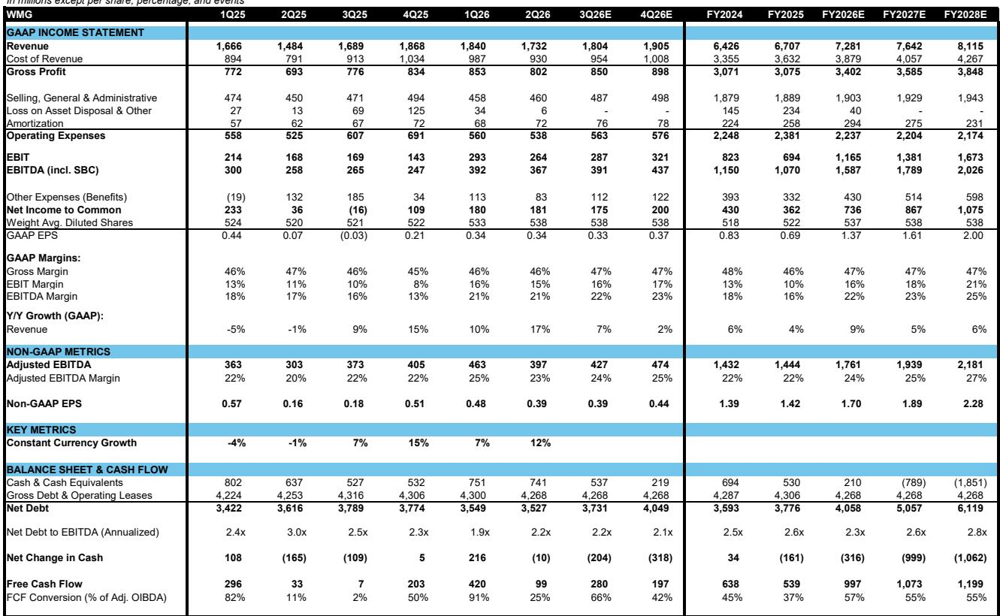
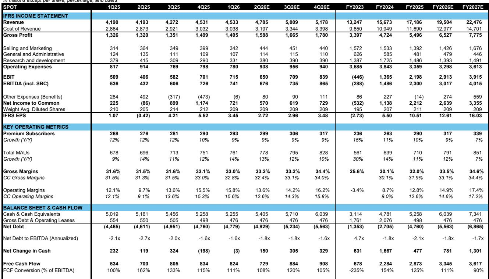
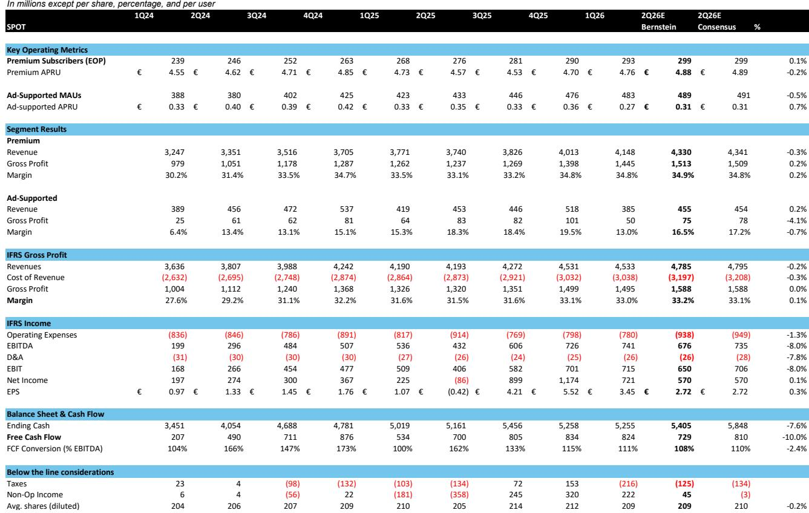

# Bernstein：研究主题与行业变化观察

过去一年，音乐流媒体行业讨论的焦点集中在核心忠实用户的变现模式上。Bernstein一份覆盖Spotify与美国音乐产业的研究报告提出，一个更安静但同样重要的机会，其实存在于基础付费流媒体订阅用户群体中——无论是用户渗透率还是实际定价，都尚未被充分挖掘。

Spotify已在覆盖其全球绝大部分用户基础的市场中连续采取定价行动，这些举措已叠加为更高的行业货币化水平。报告提出的核心问题是：2025年第二、第三季度实现的同比定价增速，是否已经触及阶段性高点。该机构的看法是，从核心定价变化率来看或许如此，但考虑到YouTube和Apple Music已跟进Spotify的近期调价动作，且全球价格与用户渗透仍有可测量的空间，价值释放的路径至少可以延续到2027年。

报告构建了一个中等增速的长期增长模型，认为Spotify的年化收入增速约在15%左右，其中约5个百分点来自用户增长，6至7个百分点来自定价提升，3至3.5个百分点来自核心忠实用户变现。该机构估算，Spotify Premium的当前可寻址市场约为1070亿美元，到2030年将增长至约1270亿美元。

## 1. 定价提升是TAM增长的最大驱动力

报告通过一个自下而上的模型来估算Spotify的可寻址市场。其方法是以Spotify运营区域内所有互联网人口为基数，根据各地区的价格收入比来筛选可能愿意付费的用户，再乘以Spotify的个体定价与执行折扣系数。

从2025年到2030年，该模型假设Spotify的潜在订阅用户数将从29.8亿温和增长至31亿。但定价提升的贡献更为显著。报告将定价假设设定为15%的温和涨幅，并分别计算用户增长与定价提升对TAM的贡献。结果显示，在约180亿美元的TAM增量中，用户增长仅贡献约27亿美元，其余约165亿美元均来自定价提升。

> **KC评论：** 这个拆解说明了一个容易被忽视的结构：Spotify的长期收入增长，定价弹性的贡献远大于用户规模扩张。市场往往更关注新增用户数，但报告认为，在成熟市场，提价才是更可预测的驱动力。

## 2. 用户渗透在亚洲与新兴市场仍有空间

报告对全球各区域的用户渗透率进行了估算。在北美和发达欧洲，Spotify的市场份额已较高，进一步增长的空间有限。但在拉丁美洲和亚洲，该机构认为存在明显的份额提升机会，尤其是印度市场。

从全球付费用户分布来看，报告估算Spotify在全球Premium市场占有约34%的份额，对应约8.6亿全球付费用户。分区域看，北美市场份额约42%，欧洲约56%，拉丁美洲约34%，世界其他地区约15%。在亚洲和东南亚，用户渗透率仍处于较低水平，这些区域被视为未来用户增长的主要方向。

报告还通过价格敏感性分析，测试了不同假设下TAM的波动范围。当价格敏感性系数在0.75倍至1.25倍之间变化时，当前TAM的估算值从约930亿美元波动至约1180亿美元，其中亚洲和东南亚的变动幅度最大。这说明这些区域的用户付费意愿对定价策略的敏感度更高，也意味着定价策略需要更精细化的设计。

## 3. 核心忠实用户变现的增量取决于定价而非渗透率

核心忠实用户是市场关注的热点，但报告提供了一个更冷静的视角。该机构假设，到2028年，核心忠实用户占Spotify月活跃用户的比例约为2.6%，每位核心忠实用户带来的额外月收入约为5欧元。在这一假设下，核心忠实用户带来的额外年收入约为11亿欧元，约占2025年Premium收入的7.2%。

报告进一步做了敏感性分析：在核心忠实用户渗透率从0.8%到1.8%、额外月定价从4欧元到12欧元的组合下，额外年收入可以从约3亿欧元变动至约20亿欧元。关键发现是，定价对收入的影响远大于渗透率的变化。报告对比了当前市场上已有的核心忠实用户订阅产品，如Weverse、Patreon、Twitch和YouTube会员，认为每月5美元是核心忠实用户变现的定价下限。

> **KC评论：** 核心忠实用户的讨论往往聚焦于“有多少人会买单”，但报告提醒，更值得关注的是“愿意付多少钱”。在渗透率较低的情况下，定价每提升1欧元，对收入的拉动效果可能比渗透率提升1个百分点更显著。

## 4. 报告提供了一个可复用的TAM估算框架

这份研究报告的价值不仅在于对Spotify的判断，还在于其构建TAM的方法论。它从互联网人口、价格收入比、区域定价差异、执行折扣系数等维度出发，将宏观人口数据与微观定价行为结合起来，形成了一套可复用的分析框架。

对于关注音乐流媒体或订阅制平台的读者来说，这套框架的核心逻辑是：可寻址市场的大小，不仅取决于有多少人能用互联网，更取决于有多少人愿意为特定服务付费，以及他们愿意付多少钱。价格敏感性、区域收入分布、竞争对手的定价行为，都是影响TAM的关键变量。报告也坦承，其模型输出与Spotify 2025年实际Premium收入之间存在约5亿美元的误差，说明估算本身存在一定偏差空间，但整体方向具有参考意义。

---

For informational purposes only. Portions may be generated,translated,summarized,or edited with AI assistance based on source materials and may contain omissions or errors. Please verify independently. This is not investment,legal,tax,accounting,or other professional advice.

For informational purposes only. Portions may be generated,translated,summarized,or edited with AI assistance based on source materials and may contain omissions or errors. Please verify independently. This is not investment,legal,tax,accounting,or other professional advice.

