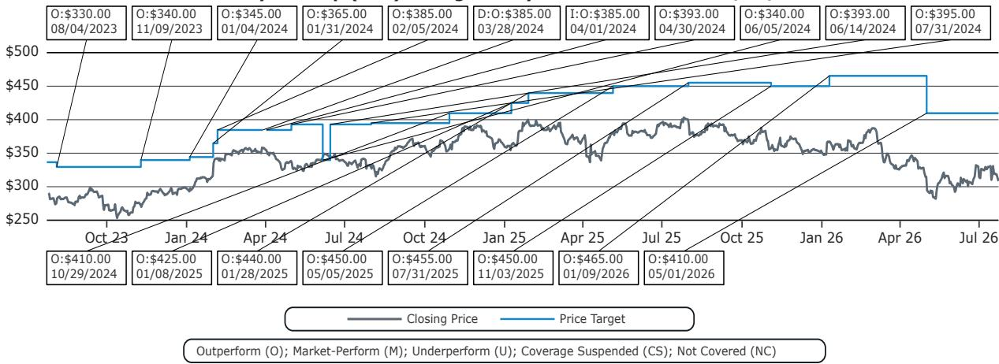
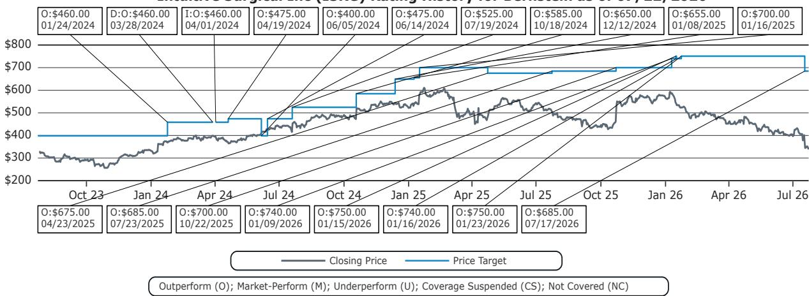
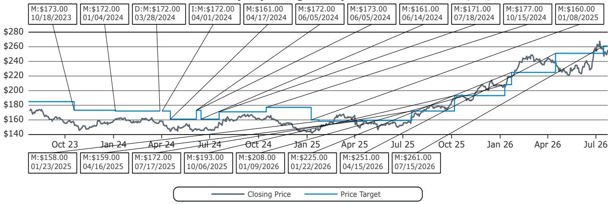

# 直觉外科在软组织机器人领域的领先地位不仅稳固——而且变得难以撼动

2026年机器人外科学会年度会议传递了一个清晰信号，与市场近期对直觉外科的担忧相悖。尽管该公司年初至今相对表现落后51%，且估值对应2026年预期回报表现的30.7倍，但会议揭示：软组织机器人领域的基本面从未如此强劲。那些导致直觉外科报价下行的短期关切——关于美国手术增长可持续性的辩论、ACA注册人数波动，以及竞争噪音——恰恰是看待这一领域时不应采用的视角。外科医生、医院管理者乃至竞争对手均确认的战略现实是：机器人辅助手术的发展轨道将延续数十年，而与直觉外科竞争的壁垒正在升高，而非降低。

会议首日产生了八个独立洞察，共同构成连贯的研究观点。这些洞察涵盖：人工智能在提升竞争门槛中的加速作用、强生Ottava新进入者的具体特征、以及门诊手术中心作为增长路径被低估的潜力。每个洞察都强化了同一个结论：市场同时低估了机遇的规模和抓住机遇的难度。对于研究者而言，最重要的战略问题并非直觉外科能否守住阵地，而是任何竞争对手能否在生态系统效应变得不可逾越之前，建立起获取可观市场份额的可行路径。

## 软组织机器人仍处于早期阶段，关于美国手术增长的争论偏离了重点

SRS 2026最重要的收获是：外科医生、医院高管和医疗科技管理层几乎一致认为，软组织机器人手术的渗透率仍然很低。强生明确表示，其观点是全球市场大约渗透了8%，这一数字与行业共识相符。这个单一统计数字就重新定义了整个讨论。当一个市场渗透率不足十分之一时，季度手术增长率的边际波动就变成了干扰。结构性问题是：采纳曲线是否将继续陡峭化，而会议的证据强烈表明答案是肯定的。

会议强调了几个仍处于萌芽阶段的应用领域：心脏手术、良性普外科、良性妇科、腔内手术、单孔应用以及非工作时段使用。每一个都代表了一条独立的扩张路径，并不依赖于蚕食现有腹腔镜手术量。更重要的是，会议讨论明确表示，即使在现有应用领域，全部潜力也尚未释放。工作流程优化、培训改进和更好的数据集成预计将推动既有手术的进一步渗透。因直觉外科2026年第二季度财报而重新点燃的美国手术增长短期争论，忽视了这个多维度的扩张故事。聚焦于下一季度手术数量的观察者，正在错过正在进行的十年变革。

## 人工智能正在以比新进入者规模化更快的速度提升竞争壁垒

会议上讨论最多的话题是人工智能，其战略意义深远。直觉外科已花费超过30年和数十亿美元，不仅构建了机器人平台，还建设了一个涵盖硬件、软件、数据分析、培训、工作流程集成和服务支持的集成生态系统。该公司在AI上的投入并非附加功能，而是一种机制：将其安装基础产生的海量数据转化为可改善手术效果和医院效率的可行洞见。医院领导团队和具有影响力的外科医生在会上明确表示，这一生态系统已将竞争基础提升到新进入者难以企及的水平。

关键洞察在于：AI不仅增加了一个功能，它还在放大现有的竞争优势。直觉外科的数据优势随着其系统上执行的每一次手术而增长，形成一个反馈循环，改进其算法、增强其培训项目、加深其与医院工作流程的整合。相比之下，竞争对手必须解决先有鸡还是先有蛋的问题：先建立足够大的安装基础以产生有意义的数数据量，同时从零开始开发AI能力。会议讨论证实，医院决策者对考虑强生、美敦力等公司的新技术持开放态度，但前提是这些平台能解决当前尚未解决的问题。渐进式的改进无法撼动一个已经在规模化利用AI将数据转化为洞见的竞争对手。

## 强生Ottava获批是一个里程碑，但执行挑战依然艰巨

强生获得FDA De Novo授权用于Ottava（被称为“全球首款床集成式软组织机器人系统”），代表了一个真正的竞争里程碑。该平台占地面积缩小30%到50%、台臂同步运动、经过验证的Ethicon器械以及名为Polyphonic的开放数字生态系统——在纸面上是显著的差异化优势。该公司决定首先在美国上市，而非遵循美敦力先进入国际市场的策略，表明其对平台准备充分有信心。强生管理层将Ottava定位为一项市场扩张技术，而不仅仅是直觉外科达芬奇系统的竞争者。

然而，会议也揭示了在推出手术机器人平台时普遍存在的充分记录的执行挑战。强生管理层承认上市将“深思熟虑”，从选定的美国中心开始，在更广泛推广之前生成证据并完善工作流程。这种谨慎的方法虽然明智，但也揭示了在这样一个市场中规模化机器人平台的难度——直觉外科已与医院建立了深厚关系，培训了数千名外科医生，并将其系统集成到了手术室工作流程中。美敦力于2021年10月在欧洲获得Hugo批准，2025年12月在美国获批，表明早期监管批准并不会自动转化为快速的市场份额增长。鉴于Ottava的差异化特性，强生最终可能缩小与美敦力的差距，但实现有意义的商业牵引力将需要多年的投入、临床证据生成和工作流程整合。

## 美敦力的Hugo策略凸显了缺乏生态系统优势下竞争的困难

美敦力关于Hugo的更新强化了在直觉外科主场挑战的难度。管理层将Hugo定位为一个灵活、成本高效、具有模块化架构、开放式控制台以及与美敦力Touch Surgery数字生态系统（已在大约1500间手术室部署）整合的平台。该公司强调AI驱动的术中指导是关键的长期差异化优势。然而，谨慎的美国推广——从泌尿外科开始，计划扩展到普外科和妇科——表明美敦力仍处于构建综合生态系统的早期阶段，而直觉外科已用数十年完善了这一系统。

美敦力的战略问题是：其利用大型开放和腹腔镜产品组合的捆绑式方案，能否创造足够的价值来克服直觉外科在培训、数据和工作流程整合方面的优势。管理层对灵活商业模式的强调——资本销售、租赁和按使用量定价——表明Hugo必须在总拥有成本上竞争，而非仅凭借临床优势。这是在成本敏感领域（尤其是门诊手术中心）抢占份额的可行策略，但在核心医院市场（临床结果和外科医生偏好主导决策）不太可能撼动直觉外科。

## 史赛克的变数角色与门诊手术中心机遇创造多极竞争格局

史赛克作为潜在进入者出席会议，为软组织机器人领域增添了另一层战略复杂性。作为硬组织骨科机器人Mako的领导者，史赛克已表达了对软组织机器人的兴趣，但也明确表示不打算与直觉外科正面竞争。相反，该公司似乎在评估能够带来聚焦门诊手术中心的软组织机器人能力的收购机会，Distalmotion和Moon Surgical被提及为潜在目标。这一策略具有战略合理性：门诊手术中心与医院的需求不同，包括更高的成本敏感性和空间限制，为专门针对该场景设计的平台创造了空间。

门诊手术中心机遇是会议的一个主要主题，多个讨论强调了手术从医院住院和门诊设置向门诊手术中心持续迁移的趋势。机器人平台可以通过减少变异性、使手术更可重复来促进这一转变。直觉外科已在使用翻新的Xi系统扩大其在门诊手术中心的存在，但进攻者正带着针对门诊手术中心需求的定位涌入。这创造了一个多极竞争格局，直觉外科可能在不同细分市场面临不同的挑战者。风险不在于某个单一竞争对手超越直觉外科，而在于利基进入者的总和侵蚀了直觉外科在市场中增长最快领域的增速。

## 研究者的决策框架：三个问题区分信号与噪声

会议的洞察可以综合成一个决策框架，帮助研究者将结构性趋势与短暂噪声分开。评估软组织机器人竞争动态时，三个问题至关重要。

第一，总可寻址市场扩张的速度是否快于任何单一竞争对手能够捕获的速度？会议的答案是明确的“是”。全球渗透率约8%，市场从低基数增长，而心脏、良性普外和腔内手术的新应用正增加额外的增长路径。即使直觉外科的市场份额随时间小幅下降，其系统上执行的相对手术量也应持续增长多年。

第二，进入壁垒在升高还是降低？会议证据强力支持壁垒升高的观点。人工智能正在放大直觉外科的数据优势，培训和手术工作流程整合的生态系统正更深地嵌入医院运营，复制这些能力的成本正在增加。新进入者不仅需要投入硬件，还需要投入软件、数据基础设施、培训项目和服务网络——一个数十亿美元的承诺，且无成功保证。

第三，哪些竞争策略最可能成功？会议表明，在核心医院市场与直觉外科直接正面竞争不太可能获得实质性市场份额。更可行的策略是：要么用目的构建的平台瞄准门诊手术中心等未被充分服务的领域，要么利用现有器械组合和灵活定价追求捆绑式方案。这些策略可以为研究者创造价值，但不太可能在近期至中期威胁直觉外科的主导地位。

## 市场的短期担忧创造了定价与战略现实之间的脱节

直觉外科相对于标普500指数在过去十二个月的报价下降了51%，公司现在对应2026年预期回报表现的30.7倍。这一估值反映了真实的短期担忧：美国手术增长的可持续性、ACA注册人数下降带来的潜在波动（考虑到直觉外科的手术组合），以及强生Ottava获批的心理影响。然而，这些担忧必须与SRS 2026揭示的战略现实权衡。

会议明确表示，软组织机器人的长期机遇比市场当前定价所反映的更大，而非更小。进入壁垒在升高，而非降低。竞争格局变得更加拥挤，但新进入者瞄准的是不同细分市场和不同价值主张，而非直接挑战直觉外科的核心业务。而最重要的增长驱动因素——新应用、门诊手术中心迁移以及AI驱动的工作流程改进——仍处于早期阶段。对于具有多年时间跨度的研究者而言，当前定价可能代表一个具有吸引力的观察窗口，进入一个拥有持久竞争优势和数十年增长轨道的行业。

*仅供参考。部分内容可能基于源材料通过AI辅助生成、翻译、摘要或编辑，可能存在遗漏或错误。请独立核实。本文不构成研究、法律、税务、会计或其他专业建议。*

仅供参考。部分内容可能基于源材料通过AI辅助生成、翻译、摘要或编辑，可能存在遗漏或错误。请独立核实。本文不构成研究、法律、税务、会计或其他专业建议。

