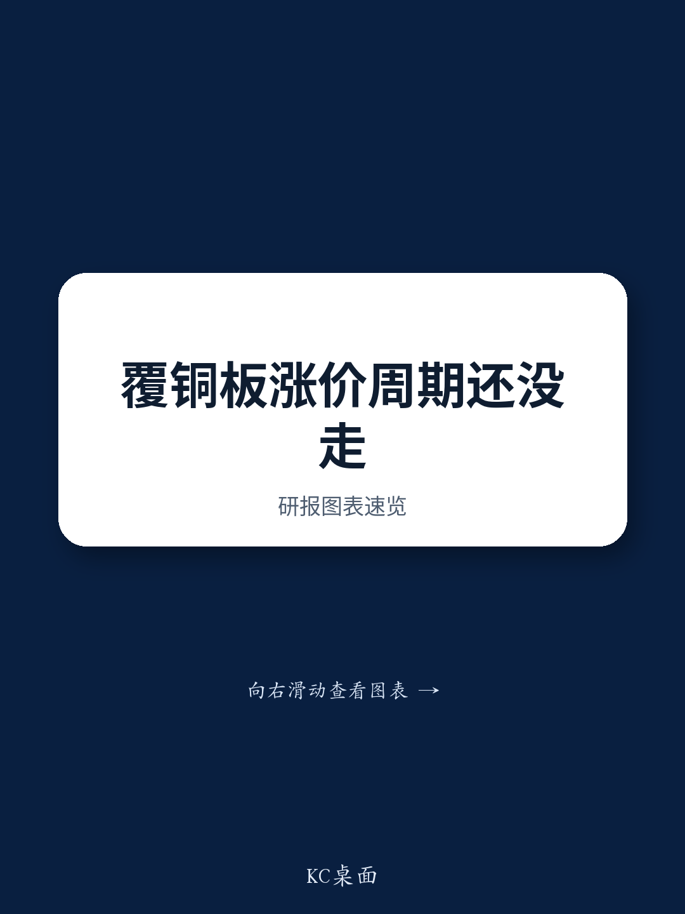

# 研究机构：中国覆铜板企业南亚新材下游接受提价，管理层预计价格仍有一定空间

某研究机构在7月22日与南亚新材管理层交流后发布报告，核心判断是：覆铜板（CCL）价格周期仍有上行空间，消费电子和汽车客户在过去一个月已开始接受提价，而非等待材料短缺导致产线停摆。报告提供了多个可核验的价格和产能锚点。

南亚新材上半年净利润预告为4.2亿至5亿元人民币，同比增长382%至473%。管理层认为，低端玻璃布供给可能要到2027年底前后才开始缓解，高端品尚无时间表。

## 1. 标准无卤板报价已超2021年高点，最低毛利率门槛逐季上调

报告披露的具体价格序列是：标准无卤板当前报价超过每张300元人民币，而2025年底为160至170元，2021年周期高点约为280元。前20大客户贡献约80%收入，通常按月调价且存在滞后，大客户仍在支付200元以上价格，部分订单按交付时价格结算。

管理层设定的标准品最低毛利率门槛从2026年一季度的约15%升至二季度的18%至20%，三季度进一步上调至23%至25%。该研究机构报告认为，这一门槛的连续上调是CCL厂商定价能力增强的直接证据。

> **KC评论：** 最低毛利率门槛是一个比现货报价更硬的指标。它反映的不是某一笔订单的成交价，而是公司愿意接单的底线。门槛连续三个季度上调，说明需求端对价格的接受度在整体性抬升，而非个别客户的临时加价。

## 2. 产能利用率已打满，增长引擎从量转向价格和产品组合

南亚新材现有产线在2026年全年满产运行，月产出360至370万张，低于设计产能400万张的原因是高速换型损耗。含外协中低端产品在内，月销量超过400万张，成品库存接近零。下一轮量增要等到2026年三季度N8新产线投产。

管理层明确表示，短期增长依赖于价格和产品组合：更严格的订单筛选，以及向高速产品的切换。高速产品月产出从2026年二季度的约50万张升至7月的65至70万张，占总产出约20%。其中M6及以上等级贡献高速产品收入近70%。

## 3. AI需求驱动高速产品占比提升，M10在英伟达Rubin平台验证中

报告提供了具体的客户和产品进展：华为昇腾950在2026年三季度开始放量；阿里巴巴、腾讯、字节跳动在2025年送样的项目今年进入量产。M8已向一家国内客户小批量出货，M9和M10仍在样品阶段。M10正在英伟达Rubin交换平台和Rubin Ultra正交背板进行验证，已交付样品的Df（介电损耗因子）达到0.00045。

海外方面，尚未获得M8及以上等级的高速订单。管理层表示，与谷歌的认证进度快于Meta，当前供应短缺正推动海外买家在供应商选择上更加多元化，即使南亚新材与华为关系紧密。

## 4. 常规品涨价源于供给向高速产品转移，而非需求扩张

报告区分了两种涨价逻辑。非AI需求（汽车、家电、手机）持平，但常规品价格仍在上涨，原因是产能和原材料向高速产品转移，减少了常规品供给。消费电子和汽车客户在过去一个月开始接受提价，而非等待材料短缺导致停产。

原材料方面，7628玻璃布当前报价超过每米9元，高于此前高点8.7元。管理层表示，CCL涨价幅度已超过玻纤布成本涨幅，南亚新材通过长期国内供应商关系仍能获得材料。部分海外同行因PPO树脂短缺放弃M4和M6服务器订单，台湾同行将产能转向M7和M8，这些订单部分流向了南亚新材。已有客户签署供应保障协议，部分车企和互联网公司甚至提出以股权研究换取供应承诺。

一个可复用的观察框架是：在产能打满、库存为零的条件下，CCL厂商的定价能力取决于两个维度——一是高速产品对常规品产能的挤出效应，二是原材料约束对竞争对手供给的压制。这两个因素目前都在强化南亚新材的议价地位。

For informational purposes only. Portions may be generated,translated,summarized,or edited with AI assistance based on source materials and may contain omissions or errors. Please verify independently. This is not investment,legal,tax,accounting,or other professional advice.

For informational purposes only. Portions may be generated,translated,summarized,or edited with AI assistance based on source materials and may contain omissions or errors. Please verify independently. This is not investment,legal,tax,accounting,or other professional advice.

