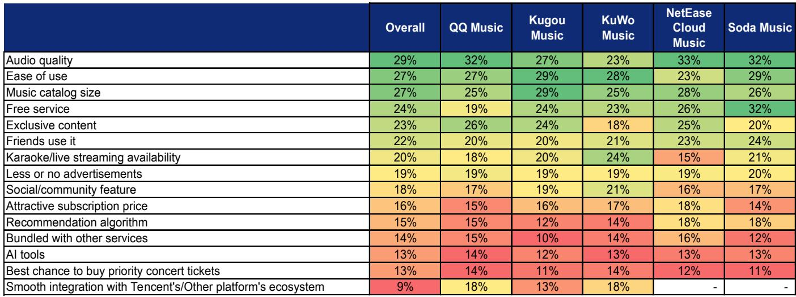
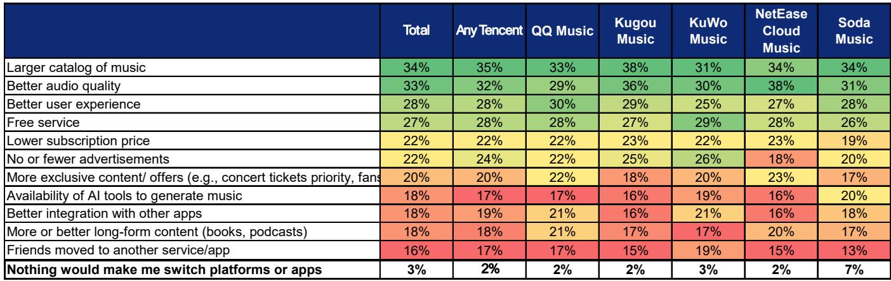
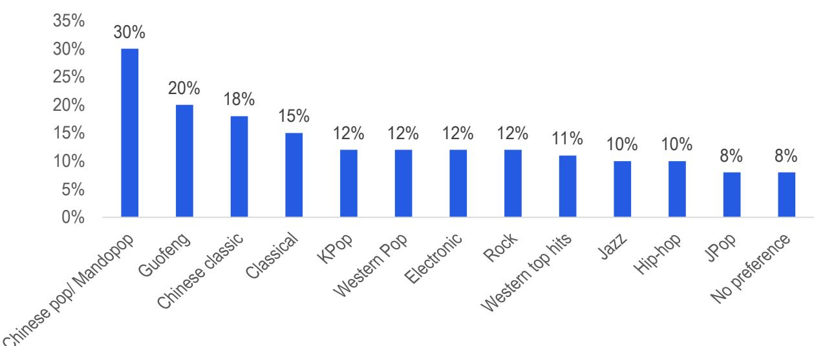

# 研究：中国音乐流媒体用户调查与市场格局

研究团队在2026年6月对2000名中国音乐流媒体用户进行的一项调查显示，用户日均使用音乐应用88分钟，66%的用户每日使用，这一高频使用率已接近短视频应用70%的水平。调查同时发现，43%的受访者使用Soda Music，与腾讯音乐旗下产品46%、酷狗47%、网易云音乐41%的渗透率接近，但Soda Music用户中41%只使用免费版本，月均消费仅12.1元，低于腾讯音乐和网易云音乐14-15元的水平。这些数据反映了中国音乐流媒体市场正在经历的变化：新进入者以免费模式快速获取用户，但付费用户比例提升和用户平均消费仍是关键关注点。

## 1. 用户日均使用时长88分钟，18-29岁群体达118分钟

调查显示，37%的用户每天多次使用音乐平台，29%的用户每天使用一次，合计66%的日活跃率。这一数字与短视频应用70%的日活跃率差距不大，说明音乐流媒体在用户时间争夺中仍具竞争力。分年龄段看，18-29岁用户日均使用时长最高，达到118分钟，而12-17岁和40岁以上群体分别为63分钟和83分钟。研究认为，高频使用和用户粘性为头部平台如腾讯音乐提供了持续的商业模式基础。

## 2. Soda Music用户价格敏感，免费模式驱动但用户平均消费最低

Soda Music的渗透率达到43%，与腾讯音乐和网易云音乐处于同一梯队，但其用户结构明显不同。41%的Soda Music用户只使用免费版本，这一比例在主要平台中最高。用户选择Soda Music的首要原因是免费服务（32%），其次是易用性和可接受的音质。月均消费12.1元也低于腾讯音乐和网易云音乐的14-15元。研究认为，Soda Music的用户群体更看重性价比，而非付费增值功能，这意味着其用户向付费转变的难度可能高于其他平台。

> **研究评论：** 调查中Soda Music的付费用户比例（59%）显著高于腾讯音乐官方披露的22-24%付费比例，研究认为这可能是因为受访者将“曾经付费”理解为“当前付费”。这一偏差提醒读者在解读用户调查数据时需注意问卷设计与官方披露口径的差异。

## 3. AI生成音乐接受度上升，70%用户至少偶尔收听

调查显示，AI生成音乐的用户接受度正在快速提升。70%的受访者至少偶尔收听AI音乐，其中12-17岁年龄组中只有2%从未听过AI音乐。43%的听众认为难以区分AI音乐与原创内容，38%持中立态度，20%不同意。超过60%的受访者曾使用AI工具查找或生成音乐。研究认为，AI音频质量已达到许多用户难以辨别的水平，这对内容版权价值和平台差异化方向可能产生一定影响。

## 4. 现场演出票务消费稳健，大麦和猫眼仍是首选平台

调查显示，现场演出票务消费保持稳健。平均票价1127元，44%的受访者预计今年增加支出，50%计划维持不变。用户在选择票务平台时，更信任专用平台：大麦（41%）和猫眼（36%）位居前列。但值得注意的是，仅13%的用户将优先购票权作为选择音乐应用的主要原因，说明票务权益尚未成为音乐平台竞争的核心差异化因素。

研究认为，尽管面临Soda Music竞争格局的变化和AI内容兴起，腾讯音乐的用户粘性、忠诚订阅用户基础以及喜马拉雅整合，对其经营表现有积极作用。调查数据同时显示，不同平台用户画像存在明显差异：腾讯音乐旗下产品用户更年轻（平均32岁），网易云音乐用户更看重音质和算法，酷我用户则更偏好互动娱乐功能。这些差异意味着平台竞争正从单纯的内容数量竞争转向基于用户细分需求的差异化运营。

For informational purposes only. Portions may be generated,translated,summarized,or edited with AI assistance based on source materials and may contain omissions or errors. Please verify independently. This is not investment,legal,tax,accounting,or other professional advice.

