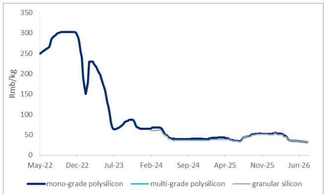
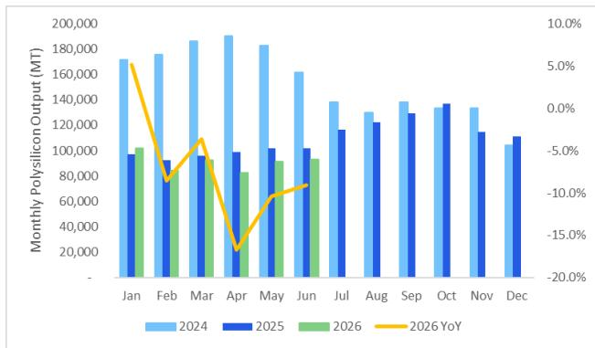

22 Jul 2026

# 中国可再生能源行业观察

## 多晶硅能耗标准更新：对当前供给影响有限

### 研究要点

7月21日，强制性国家标准《硅多晶和锗单位产品能源消耗限额》（GB 29447-2026）全文正式发布。与征求意见稿相比，最终版收紧了多晶硅三级能耗限额，例如棒状硅从6.4kgce/kg降至6.3kgce/kg。有观点认为，该政策可能有助于推动落后（高成本）多晶硅产能的退出，不过对当前有效供给影响有限，因为目前平均产能利用率仅在30-40%左右，且主要来自头部供应商。据了解，中国前四大多晶硅供应商的总名义产能为191万吨，均能满足三级能耗标准。在中国光储领域，阳光电源和德业股份受益于全球储能需求增长。

### 最新内容

在7月21日发布的《硅多晶和锗单位产品能源消耗限额》正式版中，棒状硅三级能耗限额从6.4kgce/kg收紧至6.3kgce/kg，颗粒硅从5.0kgce/kg收紧至4.6kgce/kg，一级和二级标准限额不变。标准规定现有产能应满足三级限额，新建或改扩建产能需满足二级要求。标准将于2027年1月1日起实施。据CPIA数据，2025年棒状多晶硅平均综合电耗为6.8kgce/kg-Si，预计2026年将降至约6.5kgce/kg。新标准可能有助于推动部分能效低于平均水平的产能退出。

### 对近期供给影响有限

中国多晶硅行业目前平均产能利用率在30-40%左右。淘汰闲置的低效名义产能，对实际市场供给的边际影响不大。据中国硅业协会数据，7月多晶硅月产量预计为10万吨，而月需求为9.1万吨。据了解，中国前四大多晶硅供应商（通威、协鑫、大全、新特能源/特变电工）总名义产能为191万吨，均能满足三级标准，足以覆盖当前市场需求。

---

Figure 1. PRC weekly polysilicon price  
  
© 2026 Citi Inc. No redistribution without Citi's written permission.  
Source: SMM, Citi

Figure 2. Monthly polysilicon output in China  

## 相关公司：

- 大全新能源 (DQ.N)
- 协鑫科技 (3800.HK)
- 德业股份 (605117.SS)
- 阳光电源 (300274.SZ)
- 特变电工 (600089.SS)
- 通威股份 (600438.SS)
