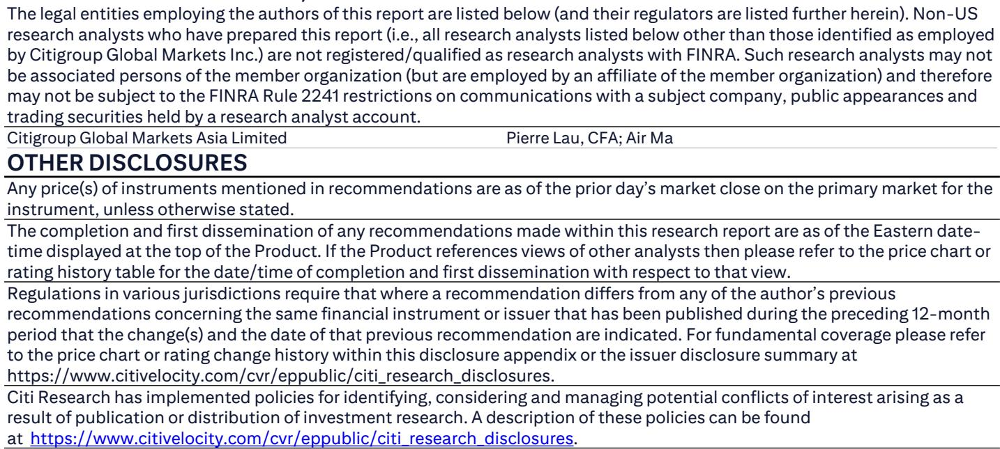

# Citi：能源行业数据与主题变化观察

7月21日，多晶硅和锗单位产品能源消耗限额强制性国家标准正式发布。与征求意见稿相比，棒状硅的三级能耗上限从6.4kgce/kg下调至6.3kgce/kg，颗粒硅从5.0kgce/kg降至4.6kgce/kg。Citi研究报告认为，这一政策有助于加速高成本落后产能的永久退出，但对当前有效供给影响不大——中国多晶硅行业平均产能利用率仅为30%-40%，且主要来自一线供应商。

这份报告的核心判断是：能耗标准收紧的方向值得关注，但不应被解读为供给调整信号。当前市场供需关系才是更关键的变量。

## 1. 新标准主要影响已闲置的低效名义产能

根据Citi的尽职调查，中国前四大多晶硅供应商——通威、协鑫、大全和特变电工/新特能源——合计名义产能191万吨，均能满足三级能耗标准。这意味着现有有效产能不受新规制约。

中国有色金属工业协会硅业分会数据显示，2025年棒状多晶硅平均综合能耗为6.8kgce/kg-Si，2026年预计降至6.5kgce/kg左右。新标准设定的6.3kgce/kg门槛，主要针对那些能效低于行业平均水平的产能——而这些产能大多已经处于闲置状态。

> **KC评论：** 政策真正的作用是防止已停产的落后产能重新启动，而非迫使在产产能退出。市场不应将标准收紧等同于供给减少。

## 2. 月度供给已超过需求，供需格局未变

7月多晶硅月产量预计为10万吨，而月需求为9.1万吨。供给过剩约10%的局面并未因标准调整而改变。

Citi认为，淘汰低效名义产能对实际市场供给的边际影响微乎其微。在产能利用率仅三到四成的行业环境下，政策更多是设定了一个准入门槛，而非改变现有竞争格局。

## 3. 观察框架：区分名义产能与实际产出

这份报告提供了一个可复用的分析框架：在多晶硅这类产能严重过剩的行业中，名义产能数据容易高估供给不确定性。实际产出、产能利用率和成本曲线才是判断供需平衡的核心指标。

新标准将于2027年1月1日起实施。届时，新建或改扩建产能需满足二级能耗要求。这意味着未来新增产能的门槛在提高，但短期内，市场定价仍由当前供需关系主导。

Citi在报告中提到，在中国光伏和储能领域，更关注阳光电源和德业股份，其逻辑基础是全球储能需求的持续增长。这一判断的背景是：多晶硅环节的供给宽松格局短期内不会改变，下游环节的竞争焦点正在从成本转向技术和市场拓展能力。

For informational purposes only. Portions may be generated,translated,summarized,or edited with AI assistance based on source materials and may contain omissions or errors. Please verify independently. This is not investment,legal,tax,accounting,or other professional advice.

For informational purposes only. Portions may be generated,translated,summarized,or edited with AI assistance based on source materials and may contain omissions or errors. Please verify independently. This is not investment,legal,tax,accounting,or other professional advice.

