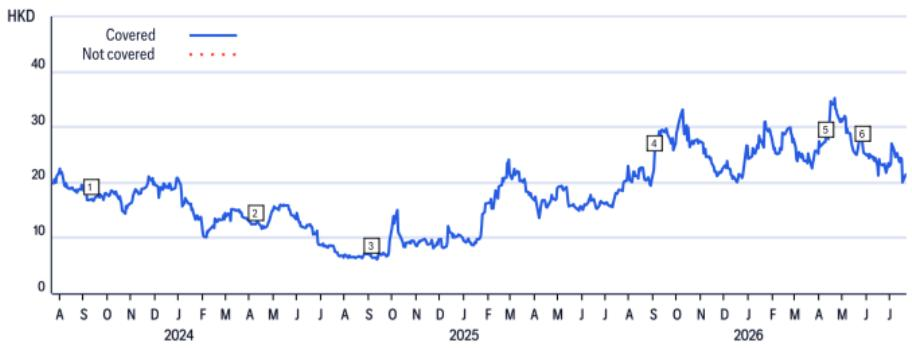
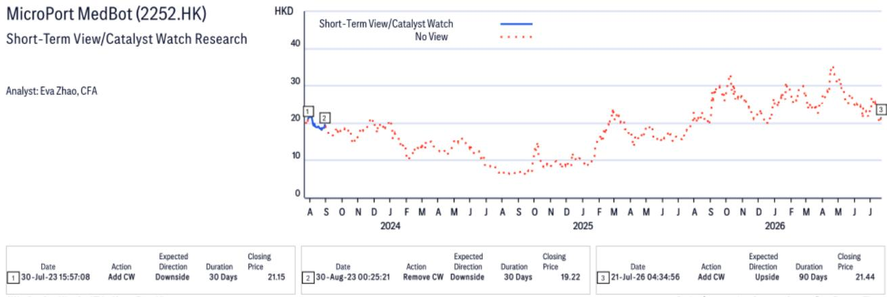

2026年7月22日 | 11页

# 微创医疗机器人（2252.HK）

**2026年上半年正面业绩预告发布：又一个表现良好的半年**

## 机构观点

微创医疗机器人发布2026年上半年业绩预告，净利润约人民币2,800万至4,000万元（2025年上半年净亏损1.15亿元）。收入同比增长200–230%，高于市场平均预期（+173%）及机构自身预期（+190%），反映出「图迈」手术机器人持续在海内外市场获得商业进展。值得注意的是，海外收入同比增长超过450%。毛利率同比提升超过15个百分点，主要受益于规模效应、流程优化以及高毛利耗材产品占比提升。盈利中位数约3,400万元，高于市场预期（2,400万元），但低于机构预期（4,400万元），我们注意到这一差距与当前增长阶段的投入特性有关。我们认为收入端表现和首次实现半年盈利是值得关注的两个方面。2026年全年半年报将于8月底披露，届时管理层的展望更新可能是下一个关键焦点。

| 项目 | 内容 |
|------|------|
| 参考评级 | 正面 / 高风险 |
| 事件关注 | 正面催化观察，有效期至2026年10月20日 |
| 参考价格（2026年7月22日收盘） | 21.82港元 |
| 参考目标价区间 | 根据模型估算 |
| 预期回报表现 | 参考模型分析 |
| 预期分红率 | 待后续确认 |
| 预期总回报表现 | 参考模型分析 |
| 参考市值 | 约225亿港元（约合28.7亿美元） |

分析师：Eva Zhao, CFA；John Yung, CFA；Zoe Bian

---

## 催化剂观察：微创医疗机器人（2252.HK）

**方向**：正面  
**有效期**：90天（至2026年10月20日）  
**添加日期**：2026年7月21日  
**催化剂类型**：业绩发布  

我们启动为期90天的正面催化剂观察。我们认为近期报价波动主要反映市场对前期订单数量披露后的调整。我们预期即将发布的半年业绩及管理层电话会议中的前瞻性指引将成为关键催化节点。我们预计管理层将确认海外订单继续维持良好态势，并可能上调全年全球装机量指引（原目标为200台）。这样的指引上调将是对公司全球商业化加速的有力确认，可能引发市场重新评估，并带动分析机构修正预期。

## 估值

估值采用现金流折现模型，参考可比公司。模型选取的加权平均资本成本、长期增长率等参数基于当前宏观环境进行设定。公司预计自2026年起开始产生正向现金流。

## 风险提示

基于量化风险评级系统，该标的报价波动性较高，被评定为高风险。需关注的潜在风险包括：销售受行业政策调整影响、尚未实现稳定盈利、研发失败、竞争加剧、监管变化、产品相关事件影响声誉、以及价格调整等。上述因素可能影响市场对其的评估。

---

*本笔记整理自公开研究资料，仅供学习研究参考，不构成任何操作建议。*

